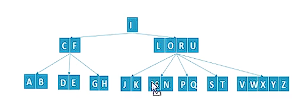
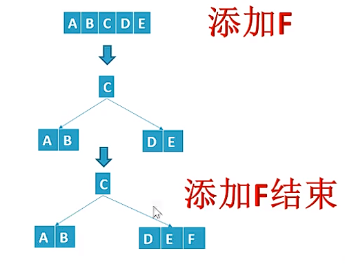
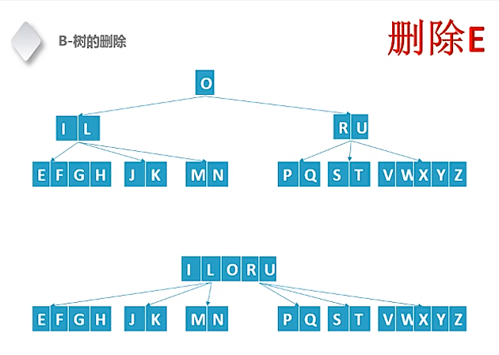
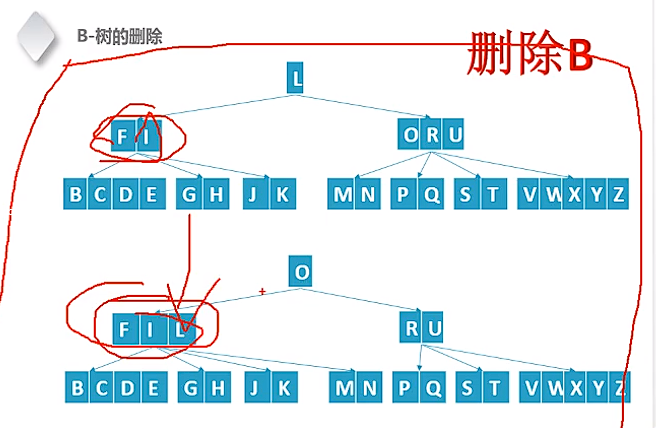

# B和B+树

  在查找数据时，如果使用二叉树进行查找，二叉树越深，查找的效率越慢。特别是如果持久化的数据是存储正在磁盘上，每一个节点的下一步查找都会造成磁盘的寻址，这会非常慢。为了满足对大量数据进行查找，并且兼顾速度和效率，就有了B树和B+树。B树和B+树都是增大了每一个内节点所拥有的子树，也就是多插树，来降低树的深度，减少对比和索引的次数。当前的各种数据库如MySql等，底层都是使用B+树实现快速查找。

- B树的定义为：

  1. 每一个节点至多有M棵子树 。(例如：M =  5)
  2. 根节点至少拥有两颗子树。
  3. 除了根节点，其余每一个分支节点至少拥有M/2颗子树（例如：5 / 2 = 2）。
  4. 所有的叶节点都是在同一层上。
  5. 有K棵子树的分支节点则存在K - 1个关键词，关键词按照递增顺序进行排序。（例如有5个子节点的，就有4个关键词）
  6. 关键词数量满足cell(M/2)-1 <= n <= M-1。（例如: M = 5, 关键词在[ 2 ， 4] 之间）

  



| B-Tree/BTree         | B+ Tree                            |
| -------------------- | ---------------------------------- |
| 所有的节点都存储数据 | 叶子节点存储数据，内节点址存储索引 |


- B 树的所有节点都存储数据，当数据量非常多时，就会造成部分数据会存储在硬盘上，也会导致查询速度下降。而B+树所有的内节点（有子节点的节点）都是索引，索引比较小，于是就可以把索引都放入内存，叶子节点存储的数据放入磁盘，提供查询速度。


B 树的定义如下：

```c
#define SUB_M 3
// 定义节点
typedef struct _btree_node 
{
    int *keys;  // int keys[2 * SUB_M - 1];
    struct _btree_node **childrens;  //struct _btree_node *childrens[2 * SUB_M];

    int num; // 已经使用key的数量
    int leaf; //是否叶子节点
}btree_node;
// 定义B树
typedef struct _btree {
    struct _btree_node *root;
}btree;
// 创建B 树的节点
btree_node *btree_create_node(int leaf) {
    btree_node *node = (btree_node*)calloc(1, sizeof(btree_node));
    if (node == NULL) {
        return NULL;
    }

    node->leaf = leaf;
    node->keys = calloc(2 * SUB_M - 1, sizeof(int));
    node->childrens = (btree_node**)calloc(2 * SUB_M, sizeof(btree_node*));
    node->num = 0;
    return node;
}

// 删除B 树的节点
void btree_destory_node(btree_node *node) {
    free(node->childrens);
    free(node->keys);
    free(node);
}
```

B 树的增加有两点原则：

1. 如果当前节点等于最大值2 * SUB_M - 1，则需要先分裂。
2. 添加的子节点都是在叶子节点上。



```c
// 分裂节点
void btree_split_child(btree *T, btree_node *x, int idx)
{
    btree_node *y = x->childrens[idx];
    btree_node *z = btree_create_node(y->leaf);

    z->num = SUB_M - 1;

    int i = 0;
    for (int i = 0; i < SUB_M - 1; i++) { // 拷贝分裂的右边两个节点
        z->keys[i] = y->keys[SUB_M + i];  
    }

    if(y->leaf == 0) { // 内节点，需要拷贝子树
        for (i = 0; i < SUB_M; i++) {
            z->childrens[i] = y->childrens[SUB_M + i];
        }
    }

    y->num = SUB_M;

    for (i = x->num; i >= idx + 1; i--) { // 空出需要插入分支的位置
        x->childrens[i+1] = x->childrens[i];
    }
    x->childrens[i+1] = z;

    for (i = x->num-1; i>=idx; i--) { // 空出key的位置
        x->keys[i+1] = x->keys[i];
    }

    x->keys[i] = y->keys[SUB_M];
    x->num += 1;
}
// 插入节点
void btree_insert(btree *T, int key) {
    btree_node *r = T->root;
    if (r->num == 2 * SUB_M - 1) {
        btree_node *node = btree_create_node(0);
        T->root = node;
        node->childrens[0] = r;
        btree_split_child(T, node, 0);
    }
}
```

-  删除B 树的节点时，需要先合并或者借位，然后才能删除。

    合并：

  

    借位：



```c
// 节点合并
void btree_merge(btree_node *T, btree_node *x, int idx) {
    btree_node *left = x->childrens[idx];
    btree_node *right = x->childrens[idx + 1];

    int x = 0;
    left->keys[left->num] = x->keys[idx];
    
    int i = 0;
    for (i = 0; i < right->num; i++) {
        left->keys[SUB_M + i] = right->keys[i];
    }
    if (!left->leaf) { //不是叶子节点，需要拷贝右节点的子树
        for (i = 0; i < SUB_M; i++) {
            left->childrens[SUB_M + i] = right->childrens[i];
        }
    }
    left->num += SUB_M;
    btree_destory_node(right);

    for (i = idx + 1; i < x->num; i++) {
        x->keys[i-1] = x->keys[i];
        x->childrens[i] = x->childrens[i+1];
    }
}

```

