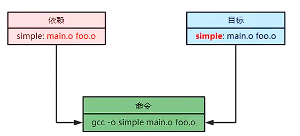

# C/C++编译构建makefile和CMake

> C/C++语言的编译参数太多，为了简化编译，把编译的命令写入Makefile中，只需要执行`make`就可以完成编译。
>
> Makefile编写也比较困难，对Makefile进行抽象，跨平台的编译CMake文件可以方便的生成Makefile文件。

## Makefile

​	Makefile的构成有三要素为目标、依赖、命令。



- 默认的make会执行Makefile 第一个目标。

  ```makefile
  test:
  	@echo "test"
  all:
  	@echo "all"
  	
  #直接执行make 打印:test，执行make all，打印：all
  ```

- Makefile编译程序的伪对象`.PHONY`，防止命令和文件冲突。

  ```makefile
  .PHONY main clean
  simple: main.o foo.o
  	gcc -o simple main.o foo.o
  main.o: main.c
  	gcc -o main.o -c main.c
  foo.o: foo.c
  	gcc -o foo.o -c foo.c
  clean:
  	rm simple main.o foo.o
  # 依赖是从左向右编译，先编译main.o， 在编译foo.o
  # 如果不加.PHONY伪对象，并且当前目录有clean文件时，执行make clean会报错。
  ```

- 变量赋值

  ```makefile
  .PHONY main clean
  CC = gcc
  RM = rm
  EXE = simple
  OBJS = main.o foo.o
  
  $(EXE): $(OBJS)
  	$(CC) -o $(EXE) $(OBJS)
  main.o: main.c
  	$(CC) -o main.o -c main.c
  foo.o: foo.c
  	$(CC) -o foo.o -c foo.c
  clean:
  	$(RM) simple main.o foo.o
  ```

- 自动变量

  - `$@` 用于表示规则中的目标。
  - `$^` 表示规则中的所有 先决条件
  - `$<` 表示规则中第一个

  ```makefile
  .PHONY main clean
  simple: main.o foo.o
  	gcc -o simple main.o foo.o
  	@echo "\$$@ = $@"
  	@echo "$$^ = $^"
  	@echo "$$< = $<"
  main.o: main.c
  	gcc -o main.o -c main.c
  foo.o: foo.c
  	gcc -o foo.o -c foo.c
  clean:
  	rm simple main.o foo.o
  	
  # $@ = simple
  # $^ = main.o foo.o
  # $< = main.o
  
  ```

- 自动变量函数

  - wildcard 是通配符函数`$(whildcard pattern)`
  - patsubst 是字符串替换函数`$(patsubst pattern, replacement, text)`

  ```makefile
  .PHONY main clean
  CC = gcc
  RM = rm
  EXE = simple
  # SRCS = main.c foo.c
  SRCS = $(wildcard *.c)
  #OBJS = main.o foo.o
  OBJS = $(patsubst %.c,%.o, %(SRCS))
  
  $(EXE): $(OBJS)
  	$(CC) -o $@ $^
  %.o: %.c
  	$(CC) -o $@ -c $^
  clean:
  	$(RM) simple main.o foo.o
  ```

  

## CMake

​	Makefile写起来也比较麻烦，CMake是基于Makefile做的二次开发。CMake跨平台的编译安装软件，可以使用简单的语句描述编译的流程。CMake的文件名为CMakeLists.txt。执行`cmake CMakeLists.txt的路径` 可以生成Makefile文件，然后使用Makefile进行编译构建。

```cmake
# 声明最小版本
cmake_minimum_required(VERSION 2.8)
# 项目名称
PROJECT(DEMO)
# 加入源代码到变量SRC
SET(SRC main.c)
# 打印变量
MESSAGE(STATUS "SRC is " ${SRC})
# 编译输出可执行文件
ADD_EXECUTABLE(demo ${SRC})
```

- ${PROJECT_BINARY_DIR} ，Cmake内置变量：当前编译的路径
- ${PORJECT_SOURCE_DIR} ，Cmake内置变量：当前源码路径
- ${PROJECT_CURRENT_SOURCE_DIR}，Cmake内置变量：当前CMkaeLists的路径

### 多目录编译

- INCLUDE_DIRECTORIES 找头文件。

  `INCLUDE_DIRECTORIES(${PROJECT_CURRENT_SOURCE_DIR}/dir1)`

- ADD_SUBDIRECTORY 增加编译的子目录。

  `ADD_SUBDIRECTORY (${PORJECT_SOURCE_DIR}/dir1)`

- ADD_LIBRARY 生成库文件（默认生成静态库）。

  `ADD_LIBRARY (test1 SHARED Demo.cpp)` 生成动态库

  `ADD_LIBRARY (test2 STATIC Demo.cpp)` 生成静态库

- AUX_SOURCE_DIRECTORY 加载所有的源码。

  `AUX_SOURCE_DIRECTORY(./  SRC_LIST)`

- ADD_COMPILE_OPTIONS  增加编译选项。

  `ADD_COMPILE_OPEIONS(-fPIC)`  动态库必备的编译选项

  `ADD_COMPILE_OPEIONS(-std=c++17)`  使能C++17

- ADD_DEFINITIONS  增加编译选项。

  ADD_DEFINITIONS(-DENABLE_SSL)  增加ENABLE_SSL编译宏选项

- LINK_DIRECTORIES 动态库、静态库的路径。

  `LINK_DIRECTORIES(${PORJECT_SOURCE_DIR}/lib)`

- ADD_EXECUTABLE  生成执行文件。

  `ADD_EXECUTABLE(demo ${SRC_LIST} )`

- TARGET_LINK_LIBRARLES 链接库到可执行文件上，优先动态库。

  `TARGET_LINK_LIBRARLES(demo test1 test2)`

- SET 设置变量。

  `SET(LIBRARY_OUTPUT_PATH /tmp/libs)` 设置so动态库输出的路径。

  `SET(EXECUTABLE_OUT_PATH /tmp/bin) ` 设置可执行文件输出路径。

  

### make install 安装

​	执行make install安装时，在Cmake中可以指定安装时需要打包的目标（TARGETS）、文件(FILES)、路径(DIRECTORY)、代码(CODE)和输出配置(EXPORT)。

​	CMake生成的Makefile默认安装路径是/usr/local/，如果安装到其他路径，需要指定`cmake -DCAMKE_INSTALL_PREFIX=/tmp/usr ..`

- 安装可执行文件到bin目录

  `INSTALL(TARGETS demo RUNTIME DESTINATION bin)`

- 安装头文件

  `INSTALL(DIRECTORY src/include DESTINATION ${INCLUDE_PATH_INCLUDE} FILES_MATCHING PATTERN "*.h")`

  `INSTALL(FILES *.h DESTINATION inluce)`

- 安装动态/静态库

  `INSTALL(TARGETS test1 ARCHIVE DESTINATION ${INSTALL_PATH_LIB})`

### Cmake 流程控制

- for循环

  ```cmake
  foreach(test_src ${TEST_SRC_LIST})
  	message(STATUS "sest src is" ${test_src})
  endforeach(test_src ${TEST_SRC_LIST})
  ```

- if 判断

  ```cmake
  if (ANDROID)
  	message(STATUS "ANDROID" )
  elseif(WIN32)
  	message(STATUS "WIN32" )
  else()
  	message(STATUS "other" )
  endif()
  ```

  


