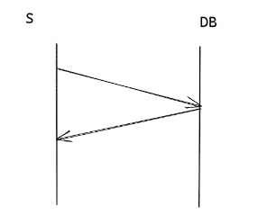
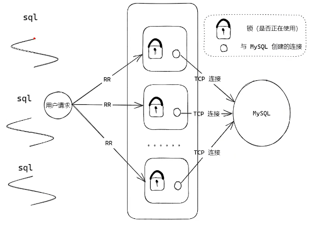
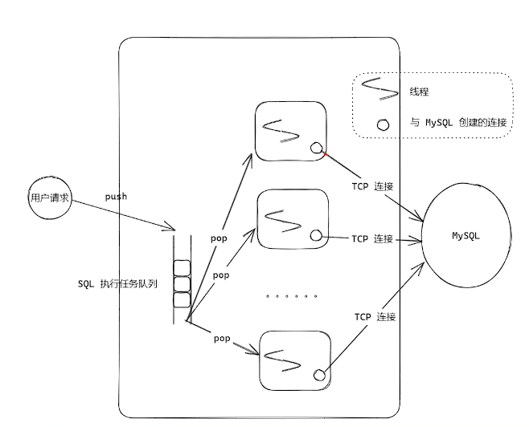

# 连接池

在项目开发的过程中，常常有许多的对象创建时间长，对象的创建需要大量的的资源，对象创建后就需要重复使用。池化技术就是解决该问题，减少资源对象的创建次数，提高程序的响应性能，在高并发的场景下，这种性能的提高会更加明显。

## 数据库连接池

数据库连接池通常在程序启动的时候就创建足够的数据库连接，并且将这些连接组成一个连接池，使用时动态的对连接池的连接进行申请、使用、释放。

为什么数据库需要使用连接池？

由于数据库（mysql、redis、mongoDB等）连接通常使用**TCP长连接**，如果不使用连接池，每次数据库都需要通过三次握手建立TCP连接->进行数据库用户认证->收发数据 -> SQL执行->四次挥手断开TCP连接，这个流程较长，为了**资源复用**和**更快的相应速度**，所以连接池常常用在数据库上，一次连接的建立和销毁，复用同一个连接多次执行SQL语句，并且统一的连接管理，避免数据库连接泄漏。

## MYSQL网络模型

数据库收发数据的方式是请求-回应模式，在mysql数据库中，数据库默认使用3306端口进行监听，主线程使用select监听listenfd，如果有连接建立，MYSQL会新开一个线程进行处理客户端的消息，默认在my.cof中配置最大可以创建151个线程。每一个线程都是执行读取数据，进行界定数据包后执行SQL的逻辑，最后返回数据给请求数据的客户端。所以使用MYSQL的连接池，就可以在MYSQL中进行多线程的SQL处理，提高数据库并发。

> MYSQL使用select 网络模型的主要原因是为了实现跨平台。

## 连接池维持连接

在没有业务的数据处理SQL时，数据库连接池如何维持连接？

由于数据库连接都是使用TCP协议连接，所有的数据都经过内核层，是否可以配置使用TCP的keeplive参数进行保持数据库连接？

TCP的keeplive仅仅保证了内核层的TCP连接不中断，无法保证mysql数据库的状态是正常的，也无法感知数据库是否阻塞、异常、挂死等，所以keeplive并不能保持数据库连接池的连接正常。

通常的做法是定时向数据库发送心跳维持连接，使用mysql_ping、mysql_pong即可以保持数据库的连接，还可以确认数据库里处理SQL语句的线程是活跃的。

## MYSQL协议

数据库的连接是通过TCP进行连接，传输的数据需要满足mysql协议，才能正确的被数据库识别和处理。实现mysql协议的就是mysql驱动。

MYSQL驱动可以从官网下载，从官网下载libmysqlclient.lib/.dll(windows)、libmysqlclient.a/.so(Linux)和头文件mysql.h，就可以使用使用mysql协议进行数据库的交互。

> Linux可以直接执行 `sudo apt install libmysqlclient-dev` 

但是官网下载的MYSQL驱动是基于阻塞IO实现的，在对fd进行IO操作时，例如read/write/accept/connect操作时是阻塞的，性能较差，如果需要提高性能使用非阻塞式的IO 处理，就需要自己实现MYSQL协议的编解码，例如开源的workflow、openresty就是实现非阻塞IO的MYSQL协议驱动。

## 同步连接池

同步连接等待数据库连接的放回时，向数据库下发SQL请求后，会阻塞一个执行体，例如当前的线程/协程，直到数据库返回后才可以继续执行后续的代码。

> 官方阻塞的库，如果需要实现异步连接池，就需要另起线程等待数据库的返回。

基本同步连接的数据库连接池就是同步连接池。

在使用同步连接池中需要当前线程从连接池**线程安全**的获取**可用的**（未被锁定的）连接，同步连接池连接的数量就是允许的最多几个线程/协程使用连接。如果超过该数量，只能不断轮询，直到连接池中的某一个连接处理完数据解锁后才能获取到使用。

​	同步连接池常常应用在服务端启动时，需要从数据库中获取数据，进行资源的初始化。

## 异步连接池

异步连接通常会使用另外启动一个线程等待或者异步事件等待（Reactor），不会阻塞当前是线程/协程，当前线程可以继续执行后续的代码，一段时间后当数据库的数据返回后，调用**传入的回调函数**进行处理结果。

使用异步连接组成的连接池就是异步连接池。

在使用异步连接池时，可以**任意数量的线程**向该连接池投递需要执行的SQL请求，由连接池依次从**队列**中取出任务进行执行。线程池连接的数量就是可以同时执行SQL语句的数量。

​	异步连接池常常用在服务器的业务完全启动后，进行业务的处理。

## 使用连接池的性能优化

1. 执行的SQL命令本质上是一个字符串（string），在C语言一般使用sprintf，C++使用ostream进行字符串的格式化，如果使用`fmt`库进行格式化字符串，会比默认的库函数提高30%的性能。
2. 使用预处理SQL语句代替裸SQL。直接执行字符串形式的裸SQL时，每一条SQL在数据库中每一次都需要进行词法句法分析等操作，造成不必要的性能浪费，如果使用预处理的SQL语句，即使多次执行，也只会进行一次词法句法分析，从而提高性能。

> MYSQL可以从官网下载 `sakila` 进行客户端测试。

## 数据库的事务

在多核CPU多个指令执行时，会出现缓存一致性的原子性问题，其他核心不能获取当前内存的中间结果，只能等待该内存的最终结果计算出来后才能访问。

数据库处理常常也面临相似的困难，多核在并发处理数据库的记录时，就需要**事务**来保证相同记录处理的原子性、持久性、隔离性、一致性。