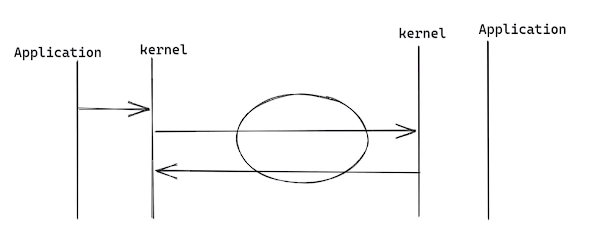

# DPDK介绍和获取网卡数据

## 网络协议栈

在应用层使用send/recv 进行发送和接收网络数据时，实际上仅仅是把应用层数据拷贝到内核层，具体什么时候才真正的发送数据，由内核决定。



在内核层，内核为了兼容不同的网卡，对网卡进行抽象，统一使用NIC驱动模块对网卡进行操作，然后网卡数据输入到协议栈，由协议栈解析数据。解析后的数据使用VFS虚拟文件系统提供的Posix API接口进行访问网络数据。应用层就可以像文件一样获取到网络的数据。


5层/7层网络协议栈的内核和应用层分布如下：


DPDK模块就是替代了内核的NIC模块，直接从网卡获取数据进行解析，以获取**更大的网络吞吐量**。


> RDMA： 数据同步的方案
>
> EBPF ：不影响进程的情况下，hook内核函数（accept），查看调用状态
>
> XDP ：基于BPF的网络的方案

## DPDK 运行环境搭建

1. DPDK下载源码后进行编译`/usertools/dpdk-setup.sh`

2. 设置DPDK 环境变量：

    ```shell
    export export RTE_SDK=/dpdk/dpdk-stable-19.08.2/ #  编译后的路径
    export RTE_TARGET=x86_64-native-linux-gcc # 目标平台
    ```

3. 执行dpdk的加载脚本`/usertools/dpdk-setup.sh` 从43到49都需要执行。

    

    > 43、44：向内核插入UIO和VFIO模块，向网卡获取数据
    >
    > 45：DPDK模块向内核的协议栈输出数据
    >
    > 46、47：建立巨页内存（2M），提高DPDK的网络吞吐量 `cat /etc/default/grub`
    >
    > 48：显示当前的网卡配置
    >
    > 49：绑定DPDK到指定的网卡上

    

4. 参考`/dpdk/dpdk-stable-19.08.2/examples/helloworld` 示例代码，可以使用该示例的Makefile文件，编辑该文件，修改为自己项目的名称和源代码。

    

5. 编写dpdk代码，编译`make`， 运行`./build/dpdkTest`

    ```c++
    #include <stdio.h>
    #include <unistd.h>
    #include <rte_eal.h>
    #include <rte_ethdev.h>
    int main(int argc, char *argv[]) {
    
    	if (rte_eal_init(argc, argv) < 0) {
    		rte_exit(EXIT_FAILURE, "Error with EAL init\n");
    	}
        return 0;
    }
    ```

    

> 如果运行中rte_eal_init 初始化失败，Cannot get hugepage information， 可能是由于内存太小，建议使用8G内存。

## DPDK网络数据获取（UDP）

udp的数据帧如下：


```c++
#include <stdio.h>
#include <unistd.h>
#include <rte_eal.h>
#include <rte_ethdev.h>

#include <arpa/inet.h>

#define NUM_MBUFS		2048
#define BURST_SIZE		128

// dpdk绑定的网卡id
int gDpdkPortId = 0;
// dpdk网卡接收配置，最大包长度RTE_ETHER_MAX_LEN（1518）字节，MTU 1500字节 + 16字节以太网头 + 2字节的校验值
static const struct rte_eth_conf port_conf_default = {
	.rxmode = {.max_rx_pkt_len = RTE_ETHER_MAX_LEN }
};


int main(int argc, char *argv[]) {
	// dpdk初始化
	if (rte_eal_init(argc, argv) < 0) {
		rte_exit(EXIT_FAILURE, "Error with EAL init\n");
	}
	// 获取dpdk绑定网卡的数量
	uint16_t nb_sys_ports = rte_eth_dev_count_avail();
	if (nb_sys_ports ==  0) {
		rte_exit(EXIT_FAILURE, "No Support eth found\n");
	}
	printf("nb_sys_ports: %d\n", nb_sys_ports);
	// 分配mbuf内存池，从网卡中获取数据包的内存，类似与内核的sk_buff。内核NIC从网卡获取到的数据转换为sk_buff直接交给协议栈进行数据解析，无内存拷贝。
	struct rte_mempool *mbuf_pool = rte_pktmbuf_pool_create("mbufpool", NUM_MBUFS, 0, 0, 
		RTE_MBUF_DEFAULT_BUF_SIZE, rte_socket_id());
	if (!mbuf_pool) {
		rte_exit(EXIT_FAILURE, "Could not create mbuf pool\n");
	}
	
// 获取绑定的0号网卡的信息
	struct rte_eth_dev_info dev_info;
	rte_eth_dev_info_get(gDpdkPortId, &dev_info);
// 设置该网卡的接收和发送队列数量
	const int num_rx_queues = 1;
	const int num_tx_queues = 0;
	struct rte_eth_conf port_conf = port_conf_default;
	if (rte_eth_dev_configure(gDpdkPortId, num_rx_queues, num_tx_queues, &port_conf) < 0) {
		rte_exit(EXIT_FAILURE, "Could not configure\n");
	}
// 启动读队列，指定rx队列的长度和内存池
	if (rte_eth_rx_queue_setup(gDpdkPortId, 0, 128, rte_eth_dev_socket_id(gDpdkPortId), 
		NULL, mbuf_pool) < 0) {
		rte_exit(EXIT_FAILURE, "Could not setup RX queue\n");
	}
// 启动网卡设备，开始读取数据
	if (rte_eth_dev_start(gDpdkPortId) < 0) {
		rte_exit(EXIT_FAILURE, "Could not start\n");
	}

	printf("dev start success\n");
	while (true) {
// 从网卡获取mbuf数据
		struct rte_mbuf *mbufs[BURST_SIZE];
		unsigned nb_recvd = rte_eth_rx_burst(gDpdkPortId, 0, mbufs, BURST_SIZE);
		if (nb_recvd > BURST_SIZE) {
			rte_exit(EXIT_FAILURE, "Error with rte_eth_rx_burst\n");
		}

/*获取到的网卡数据格式：|以太网头|ip头|传输协议头|用户数据|
+------------+---------------+-------------------+--------------+
|   ethhdr   |     iphdr     |   udphdr/tcphdr   |   payload    |  
+------------+---------------+-------------------+--------------+
*/
		unsigned i = 0;
		for (i = 0;i < nb_recvd;i ++) {
// 获取以太网头，判断是否为ip协议
			struct rte_ether_hdr *ehdr =  rte_pktmbuf_mtod(mbufs[i], struct rte_ether_hdr *);
			if (ehdr->ether_type != rte_cpu_to_be_16(RTE_ETHER_TYPE_IPV4)) {
				continue;
			}
// 获取IP 头，判断是否为UDP协议
			struct rte_ipv4_hdr *iphdr = rte_pktmbuf_mtod_offset(mbufs[i], struct rte_ipv4_hdr *, sizeof(struct rte_ether_hdr));
			if (iphdr->next_proto_id == IPPROTO_UDP) {
				
				struct rte_udp_hdr *udphdr = (struct rte_udp_hdr *)(iphdr+1);

				uint16_t length = udphdr->dgram_len;
// 打印UDP数据报文
				printf("length: %d, content: %s\n", length, (char *)(udphdr+1));
			}
		}
	}
	return 0;
}

```

在发送数据给dpdk 对应的网卡时，需要检测发送端是否有该网卡的ARP地址。ARP地址为局域网内IP地址到MAC地址的映射，使用`arp -a` 查看映射关系。如果没有映射，需要静态映射IP到dpdk绑定的网卡上。

1. 使用`netsh.exe i i show in` 找到与dpdk网卡进行通信的网卡的Idx


2. 增加静态ARP `netsh.exe -c i i add  neighbors 网卡Idx ip地址 mac地址`设置静态ARP

    