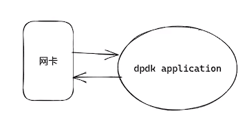
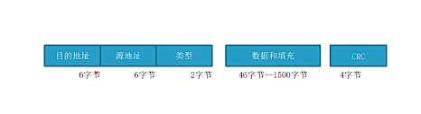
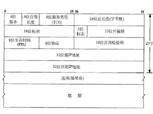
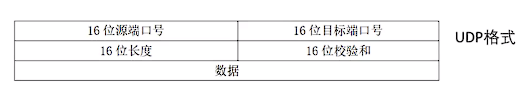

# DPDK 发送 UDP 数据

DPDK代替了内核中的NIC模块，直接与网卡进行交互。DPDK可以直接获取网卡中的原始数据，并且可以代替内核中的协议栈，打包数据成TCP、UDP的格式，直接通过网卡向外发送数据。



## DPDK 向外发送UDP数据的步骤

1. 设置DPDK读取数据RX和发送数据的TX

```c++
int gDpdkPortId = 0;
const int num_rx_queues = 1;
const int num_tx_queues = 1;
// 设置RX
struct rte_eth_conf port_conf = port_conf_default;
rte_eth_dev_configure(gDpdkPortId, num_rx_queues, num_tx_queues, &port_conf);
rte_eth_rx_queue_setup(gDpdkPortId, 0 , 1024, rte_eth_dev_socket_id(gDpdkPortId),NULL, mbuf_pool)
// 设置TX
struct rte_eth_txconf txq_conf = dev_info.default_txconf;
txq_conf.offloads = port_conf.rxmode.offloads;
rte_eth_tx_queue_setup(gDpdkPortId, 0 , 1024, rte_eth_dev_socket_id(gDpdkPortId), &txq_conf)
rte_eth_dev_start(gDpdkPortId)
```
2. 获取MAC地址、IP地址和端口

```c++
// 定义mac地址、ip地址和端口变量
uint8_t gSrcMac[RTE_ETHER_ADDR_LEN];
uint8_t gDstMac[RTE_ETHER_ADDR_LEN];

uint32_t gSrcIp;
uint32_t gDstIp;

uint16_t gSrcPort;
uint16_t gDstPort;

//获取mbuf
struct rte_mbuf *mbufs[BURST_SIZE];
unsigned nb_recvd = rte_eth_rx_burst(gDpdkPortId, 0, mbufs, BURST_SIZE);

unsigned i = 0;
for (i = 0;i < nb_recvd;i ++) {
    // 获取以太网头
	struct rte_ether_hdr *ehdr =  rte_pktmbuf_mtod(mbufs[i], struct rte_ether_hdr *);
	if (ehdr->ether_type != rte_cpu_to_be_16(RTE_ETHER_TYPE_IPV4)) {
			continue;
		}
    // 获取ip头
	struct rte_ipv4_hdr *iphdr = rte_pktmbuf_mtod_offset(mbufs[i], struct rte_ipv4_hdr *, sizeof(struct rte_ether_hdr));
    // 获取udp头
    if (iphdr->next_proto_id == IPPROTO_UDP) {
        struct rte_udp_hdr *udphdr = (struct rte_udp_hdr *)(iphdr+1);
        // 解析mac地址、ip地址和端口变量
        // 数据包的目的mac、目的ip和目的端口，为dpdk的源mac、源ip和源端口
        rte_memcpy(gSrcMac, ehdr->d_addr.addr_bytes, RTE_ETHER_ADDR_LEN);
        rte_memcpy(gDstMac, ehdr->s_addr.addr_bytes, RTE_ETHER_ADDR_LEN);
        
        rte_memcpy(&gSrcIp, &iphdr->dst_addr, sizeof(uint32_t));
        rte_memcpy(&gDstIp, &iphdr->src_addr, sizeof(uint32_t));
        
        rte_memcpy(&gSrcPort, &udphdr->dst_port, sizeof(uint16_t));
        rte_memcpy(&gDstPort, &udphdr->src_port, sizeof(uint16_t));
        
        // udp数据包的实际长度
        uint16_t length = ntohs(udphdr->dgram_len) - sizeof(struct rte_udp_hdr);
    }
}
```

3. 从内存池获取mbuf

```c++
// mbuf长度为数据长度+协议头长度
uint32_t  total_length = length + sizeof(struct rte_ether_hdr) + sizeof(struct rte_ipv4_hdr) + sizeof(struct rte_udp_hdr);

struct rte_mbuf *mbuf = rte_pktmbuf_alloc(mbuf_pool);
mbuf->pkt_len = total_length;
mbuf->data_len = total_length;
// 获取mbuf的数据地址
uint8_t *pktdata = rte_pktmbuf_mtod(mbuf, uint8_t*);
```

4. 拼接每一层的协议头（eth头、ip头、udp头）

    

```c++
struct rte_ether_hdr *eth = (struct rte_ether_hdr *)pktdata;
rte_memcpy(eth->s_addr.addr_bytes, gSrcMac, RTE_ETHER_ADDR_LEN);
rte_memcpy(eth->d_addr.addr_bytes, gDstMac, RTE_ETHER_ADDR_LEN);
eth->ether_type = htons(RTE_ETHER_TYPE_IPV4);
```



```c++
struct rte_ipv4_hdr *iphdr = (struct rte_ipv4_hdr *)(eth+1); 
iphdr->version_ihl = 0x45;
iphdr->type_of_service = 0;
iphdr->total_length = htons(total_length - sizeof(struct rte_ether_hdr));
iphdr->packet_id = 0;
iphdr->fragment_offset = 0;
iphdr->time_to_live = 64; // ttl = 64
iphdr->next_proto_id = IPPROTO_UDP;
iphdr->src_addr = gSrcIp;
iphdr->dst_addr = gDstIp;
// 计算校验值
iphdr->hdr_checksum = 0;
iphdr->hdr_checksum = rte_ipv4_cksum(ip);
```




```c++
struct rte_udp_hdr *udphdr =  (struct rte_udp_hdr *)(iphdr+1);
udphdr->src_port = gSrcPort;
udphdr->dst_port = gDstPort;
uint16_t udplen = total_length - sizeof(struct rte_ether_hdr) - sizeof(struct rte_ipv4_hdr);
// udp长度和拷贝数据
udphdr->dgram_len = htons(udplen);
rte_memcpy((uint8_t*)(udp+1), data, udplen);
udphdr->dgram_cksum = 0;
udphdr->dgram_cksum = rte_ipv4_udptcp_cksum(ip, udp);

// 打印地址，检查是否正确
struct in_addr addr;
addr.s_addr = gSrcIp;
printf(" --> src: %s:%d, ", inet_ntoa(addr), ntohs(gSrcPort));
addr.s_addr = gDstIp;
printf("dst: %s:%d\n", inet_ntoa(addr), ntohs(gDstPort));
```

5. 发送数据，释放内存

```c++
// mbuf是rte_pktmbuf_alloc申请出来的指针，发送时传入二级指针
rte_eth_tx_burst(gDpdkPortId, 0, &mbuf, 1);
rte_pktmbuf_free(mbuf);
rte_pktmbuf_free(mbufs[i]);
```

