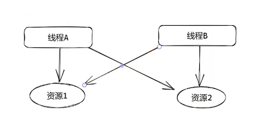
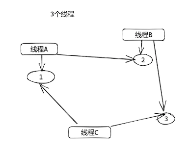
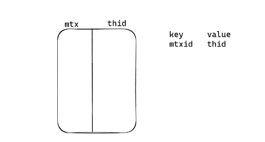
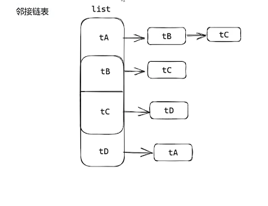

# 死锁检测

在软件开发过程中，多线程的环境上通常都需要加锁保护共享变量。当线程逻辑越来越复杂时，需要保护的资源有多个，并且有多个锁时，就容易发送死锁。

死锁后线程无法继续向下执行，无法正常处理业务逻辑，常常导致程序"卡住"的现象，就需要死锁检测机制帮助定位问题。

两个线程就有可能出现死锁，具体表现为线程A持有资源1，想要资源2，但是线程B持有资源2，也想要资源1，两个线程会一直互相等待，线程会一直阻塞无法向后执行。



三个及以上线程死锁时，例如3个A、B、C线程，线程A想占有线程B的资源；线程B想占有线程C的资源；线程C想占有线程A的资源：A->B，B->C，C->A，于是形成一个有向环，造成死锁。



死锁检测算法的核心逻辑就是检测锁的有向图是否构成环。

死锁检测算法的具体实现需要一个**关系表**。通过资源找到对应的线程，并且也需要知道该线程想占用哪一个资源。这就需要一个K-V表存储锁和线程的关系。



同时检测死锁时需要判断是否构成环，就需要把每一个锁的节点构建一个**有向图**，用来进行死锁的有向环检测。常用邻接链表进行构建图：



死锁需要构建**关系表**和**有向图**，在进行加锁和解锁的操作时，需要增加3个原语操作before_lock、after_lock和after_unlock，构建死锁检测的必备数据结构。

- before_lock。

    在加锁前查找该锁是否在关系表中，如果存在，则需要从关系表中找到线程ID，在有向图中新增一条边。

```c++
pthread_t tid;
if ((tid = SearchRelaTable(mtx)) == true) {
    addEdge(selfid, tid);
}
```

- after_lock。

    在关系表中新增一条关系，从有向图中删除一条边。

```c++
DelEdge(selfid, tid);
AddRelaTable(mtx, selfid)
```

- after_unlock。

    从关系表中删除关系。

```c++
DelRealTable(mtx, selfid)
```

构建好关系表和有向图后，检测死锁只需要新开一个线程，不断的轮询进行死锁的检测，发现有死锁就打印处理，定位到死锁。

## 死锁检测的实现

死锁检测的核心就是构建**关系表**和**有向图**，然后不断进行有向图检测。

```c++
#define _GNU_SOURCE
#include <dlfcn.h>
#include <stdio.h>
#include <stdlib.h>
#include <pthread.h>
#include <unistd.h>
#include <stdint.h>
// 定义图的邻接链表
static constexpr int32_t MAX_VERTEX = 100; // 图的最大链表节点数量
enum Type { PROCESS, RESOURCE }; 		// 节点的类型

// 图的节点属性
struct sourceType {
	uint64_t id;	//  节点id
	enum Type type;	//  节点类型
	uint64_t lockID; // 锁的ID
	int32_t degress;    //  节点的度，该节点有多少个连接
};
// 图的节点
struct vertex {
	struct sourceType s;
	struct vertex* next;
};
// 定义任务的图
struct taskGraph {
	// 图的节点和当前索引
	struct vertex vertexList[MAX_VERTEX];
	int32_t vertexIdx;
	// 锁和线程的关系表，记录锁和锁的当前索引
	struct sourceType lockList[MAX_VERTEX];
	int32_t lockIdx;
	pthread_mutex_t mutex;
};

struct taskGraph* tg = nullptr;


// 创建一个图的节点
struct vertex* CreateVertex(struct sourceType type) {
	struct vertex* tex = (struct vertex*)malloc(sizeof(struct vertex));
	tex->s = type;
	tex->next = nullptr;
	return tex;
}
// 查找图的节点
int32_t SearchVertex(struct sourceType type) {
	int32_t i = 0;
	for (i = 0; i < tg->vertexIdx; i++) {
		if (tg->vertexList[i].s.type == type.type && tg->vertexList[i].s.id == type.id) {
			return i;
		}
	}
	return -1;
}
// 增加一个图的节点
void AddVertex(struct sourceType type) {
	if (SearchVertex(type) == -1) {
		tg->vertexList[tg->vertexIdx].s = type;
		tg->vertexList[tg->vertexIdx].next = nullptr;
		tg->vertexIdx++;
	}
}

// 增加一条边，使用邻接链表
int32_t AddEdge(struct sourceType from, struct sourceType to) {
	AddVertex(from);
	AddVertex(to);
	struct vertex* v = &(tg->vertexList[SearchVertex(from)]);
	while (v->next != nullptr) {
		v = v->next;
	}
	v->next = CreateVertex(to);
}

// 判断两个节点是否已经相连
int32_t VerifyEdge(struct sourceType i, struct sourceType j) {
	if (tg->vertexIdx == 0) {
		return 0;
	}
	int32_t idx = SearchVertex(i);
	if (idx == -1) {
		return 0;
	}

	struct vertex* v = &(tg->vertexList[idx]);
	while (v != nullptr) {
		if (v->s.id == j.id) {
			return 1;
		}
		v = v->next;
	}
	return 0;
}

// 移除一条有向边
int32_t RemoveEdge(struct sourceType from, struct sourceType to) {
	int32_t idxi = SearchVertex(from);
	int32_t idxj = SearchVertex(to);
	if (idxi != -1 && idxj != -1) {
		struct vertex* v = &tg->vertexList[idxi];
		struct vertex* remove;	// 要移除的节点
		while (v->next != nullptr) {
			if (v->next->s.id == to.id) {
				remove = v->next;
				v->next = v->next->next;
				free(remove);
				break;
			}
			v = v->next;
		}
	}
}
// 死锁的路径和索引
int32_t DeadlockPath[MAX_VERTEX + 1];
int32_t k = 0;

int32_t visited[MAX_VERTEX]; // 记录访问过的节点
int32_t deadlock = 0;  // 是否死锁

// 有循环，打印死锁的环
void PrintDeadlock(void) {
	int32_t i = 0;
	printf("cycle : ");
	for (i = 0;i < k - 1;i++) {
		printf("%ld --> ", tg->vertexList[DeadlockPath[i]].s.id);

	}
	printf("%ld\n", tg->vertexList[DeadlockPath[i]].s.id);

}

// 深度优先遍历，查找环，然后打印
int32_t DFS(int32_t idx) {
	struct vertex* ver = &tg->vertexList[idx];
	if (visited[idx] == 1) {
		DeadlockPath[k++] = idx;
		PrintDeadlock();
		deadlock = 1;
		return 0;
	}
	visited[idx] = 1;
	DeadlockPath[k++] = idx;
	while (ver->next != nullptr) {
		DFS(SearchVertex(ver->next->s));
		k--;
		ver = ver->next;
	}
	return 1;

}
// 从idx节点出发，查找是否存在环
int32_t SearchForCycle(int32_t idx) {
	struct vertex* ver = &tg->vertexList[idx];
	visited[idx] = 1;
	k = 0;
	DeadlockPath[k++] = idx;
	// 循环检测idx节点所以的边
	while (ver->next != nullptr) {
		// 访问过的节点visited数组清0
		int32_t i = 0;
		for (i = 0;i < tg->vertexIdx;i++) {
			if (i == idx) {
				continue;
			}
			visited[i] = 0;
		}
		// 死锁路径初始化-1
		for (i = 1;i <= MAX_VERTEX;i++) {
			DeadlockPath[i] = -1;
		}
		k = 1;
		// 深度优先搜索有向环
		DFS(SearchVertex(ver->next->s));
		ver = ver->next;
	}
}

// 查找锁是否存在，返回锁索引
int32_t SearchLock(uint64_t lock) {
	int32_t i = 0;
	for (i = 0;i < tg->lockIdx;i++) {
		if (tg->lockList[i].lockID == lock) {
			return i;
		}
	}
	return -1;
}
// 找到一个空的位置放入新的锁
int32_t SearchEmptyLock(uint64_t lock) {
	int32_t i = 0;
	for (i = 0;i < tg->lockIdx;i++) {
		if (tg->lockList[i].lockID == 0) {
			return i;
		}
	}
	return tg->lockIdx;
}
// 加锁前
void LockBefore(uint64_t tid, uint64_t lockaddr) {
	int32_t idx = 0;
	for (idx = 0;idx < tg->lockIdx;idx++) {
		if (tg->lockList[idx].lockID == lockaddr) { // 查找锁已经存在
			// 增加两个节点
			struct sourceType from;
			from.id = tid;
			from.type = PROCESS;
			AddVertex(from);

			struct sourceType to;
			to.id = tg->lockList[idx].id;	// 获得锁的线程ID
			to.type = PROCESS;
			AddVertex(to);

			tg->lockList[idx].degress++; // 想获取锁的线程数量增加
			if (!VerifyEdge(from, to)) {	// 新增一条图的连接
				AddEdge(from, to);
			}
		}

	}
}
// 加锁后
void LockAfter(uint64_t tid, uint64_t lockaddr) {
	int32_t idx = 0;
	if (-1 == (idx = SearchLock(lockaddr))) {  // 锁的关系不存在，直接增加 
		int32_t eidx = SearchEmptyLock(lockaddr);
		tg->lockList[eidx].id = tid;
		tg->lockList[eidx].lockID = lockaddr;
		tg->lockIdx++;
	} else {		// 移除边
		struct sourceType from;
		from.id = tid;
		from.type = PROCESS;
		AddVertex(from);

		struct sourceType to;
		to.id = tg->lockList[idx].id;
		to.type = PROCESS;
		AddVertex(to);

		tg->lockList[idx].degress--;

		if (VerifyEdge(from, to)) {
			RemoveEdge(from, to);
		}
		// 记录获得锁的线程ID
		tg->lockList[idx].id = tid;
	}
}

// 解锁后
void UnlockAfter(uint64_t tid, uint64_t lockaddr) {
	int32_t idx = SearchLock(lockaddr);
	if (tg->lockList[idx].degress == 0) {
		tg->lockList[idx].id = 0;
		tg->lockList[idx].lockID = 0;
	}
}

// 检测死锁的函数
void CheckDeadLock(void) {
	int32_t i = 0;
	deadlock = 0;
	for (i = 0;i < tg->vertexIdx;i++) {
		if (deadlock == 1) {
			break;
		}
		SearchForCycle(i);
	}

	if (deadlock == 0) {
		printf("no deadlock\n");
	}
}

// 检测死锁的线程函数，每5秒检测一次
static void* thread_routine(void* args) {
	while (1) {
		sleep(5);
		CheckDeadLock();
	}
}

// 启动检测线程
void StartCheck(void) {
	tg = (struct taskGraph*)malloc(sizeof(struct taskGraph));
	tg->vertexIdx = 0;
	tg->lockIdx = 0;
	pthread_t tid;
	pthread_create(&tid, nullptr, thread_routine, nullptr);
}


// 定义hook 函数指针
typedef int32_t(*pthread_mutex_lock_t)(pthread_mutex_t* mutex);
pthread_mutex_lock_t pthread_mutex_lock_f = nullptr;

typedef int32_t(*pthread_mutex_unlock_t)(pthread_mutex_t* mutex);
pthread_mutex_unlock_t pthread_mutex_unlock_f = nullptr;


// hook的实现
int32_t pthread_mutex_lock(pthread_mutex_t* mutex) {

	pthread_t selfid = pthread_self();
	LockBefore((uint64_t)selfid, (uint64_t)mutex);
	pthread_mutex_lock_f(mutex);
	LockAfter((uint64_t)selfid, (uint64_t)mutex);
}

int32_t pthread_mutex_unlock(pthread_mutex_t* mutex) {
	pthread_mutex_unlock_f(mutex);
	pthread_t selfid = pthread_self();
	UnlockAfter((uint64_t)selfid, (uint64_t)mutex);

}

// 进行hook系统函数
void InitHook(void) {
	if (!pthread_mutex_lock_f) {
		pthread_mutex_lock_f = (pthread_mutex_lock_t)dlsym(RTLD_NEXT, "pthread_mutex_lock");
	}
	if (!pthread_mutex_unlock_f) {
		pthread_mutex_unlock_f = (pthread_mutex_unlock_t)dlsym(RTLD_NEXT, "pthread_mutex_unlock");
	}
}
// 构建死锁
pthread_mutex_t r1 = PTHREAD_MUTEX_INITIALIZER;
pthread_mutex_t r2 = PTHREAD_MUTEX_INITIALIZER;
pthread_mutex_t r3 = PTHREAD_MUTEX_INITIALIZER;
pthread_mutex_t r4 = PTHREAD_MUTEX_INITIALIZER;
pthread_mutex_t r5 = PTHREAD_MUTEX_INITIALIZER;

void* t1_cb(void* arg) {
	printf("t1: %u\n", pthread_self());
	pthread_mutex_lock(&r1);
	sleep(1);
	pthread_mutex_lock(&r2);

	pthread_mutex_unlock(&r2);
	pthread_mutex_unlock(&r1);
}

void* t2_cb(void* arg) {
	printf("t2: %u\n", pthread_self());
	pthread_mutex_lock(&r2);
	sleep(1);
	pthread_mutex_lock(&r3);

	pthread_mutex_unlock(&r3);
	pthread_mutex_unlock(&r2);
}

void* t3_cb(void* arg) {
	printf("t3: %u\n", pthread_self());
	pthread_mutex_lock(&r3);
	sleep(1);
	pthread_mutex_lock(&r4);

	pthread_mutex_unlock(&r4);
	pthread_mutex_unlock(&r3);
}

void* t4_cb(void* arg) {
	printf("t4: %u\n", pthread_self());
	pthread_mutex_lock(&r4);
	sleep(1);
	pthread_mutex_lock(&r5);

	pthread_mutex_unlock(&r5);
	pthread_mutex_unlock(&r4);
}

void* t5_cb(void* arg) {
	printf("t5: %ld\n", pthread_self());
	pthread_mutex_lock(&r1);
	sleep(1);
	pthread_mutex_lock(&r5);

	pthread_mutex_unlock(&r5);
	pthread_mutex_unlock(&r1);
}

int32_t main() {
	// hook系统函数，开启检测线程
	InitHook();
	StartCheck();
	// 构建死锁线程
	pthread_t t1, t2, t3, t4, t5;
	pthread_create(&t1, nullptr, t1_cb, nullptr);
	pthread_create(&t2, nullptr, t2_cb, nullptr);
	pthread_create(&t3, nullptr, t3_cb, nullptr);
	pthread_create(&t4, nullptr, t4_cb, nullptr);
	pthread_create(&t5, nullptr, t5_cb, nullptr);

	pthread_join(t1, nullptr);
	pthread_join(t2, nullptr);
	pthread_join(t3, nullptr);
	pthread_join(t4, nullptr);
	pthread_join(t5, nullptr);
	printf("complete\n");
	return 0;
}
```

