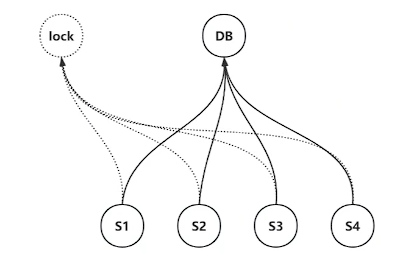

# 分布式锁

## 进程中的锁

在多线程的程序开发中，保护一个公共的资源时，常常会用到锁。常用的锁有如下几种：

- 互斥锁。多线程访问同一个临界区，只有一个线程可以进入，并且其他线程进入**阻塞状态**，当持有锁的线程释放锁时，选择阻塞队列中的线程进入**就绪态**。
- 自旋锁。多线程访问同一个临界区，只有一个线程可以进入，其他线程进行轮询，如果发生线程切换则进入**就绪状态**。
- 原子变量。有可见性和同步性，通过锁总线，多个指令必须不可打断的执行。
- 读写锁。用于读多写少的场景，如数据库的行锁，S共享锁为读锁，X为写锁。
- 条件变量。和互斥锁搭配使用，阻塞当前线程，直到满足条件时被另一个线程唤醒（可能存在虚假唤醒，需要使用while判断唤醒条件）。
- 信号量。使用sem_init 初始化一个信号量，P操作--sem_wait对信号量减一，V操作--sem_post对信号量增一。当信号量减为0时线程阻塞，增加大于0时线程唤醒。

> 信号量不仅仅可以用于多线程环境，还可以用作IPC多进程通信。常见的IPC多线程通信有pipe 父子进程通信、FIFO消息队列、信号量、消息队列、共享内存、socket、信号。

锁的本质是什么？锁的本质就是**资源**+**行为**。在单进程中，所有线程都会共享进程的资源，进程是资源的容器，线程是执行的单元，锁的**资源**就是所有线程都可以访问的进程资源，如静态区变量、堆上的变量。**行为**就是加锁和解锁，加锁就是锁的资源记录线程id，打上线程标记，打上标记的资源不能被其他线程访问，只有谁加的锁谁释放，解锁时去除资源的标记。

## 分布式锁

分布式锁是在分布式场景中实现的互斥类型的锁。分布式是指运行的节点可能在不同的机器或不同网段中，节点通信通过socket；互斥类型指同一时刻只允许一个执行体进入临界资源。

分布式锁解决的问题是在分布式场景中，同时只允许一个节点执行某类任务。

分布式锁的**资源**需要所有节点都可以访问，用来存储锁，可以使用数据库、zookeeper、etcd等；分布式锁的**行为**同样是加锁和解锁，但是区别在于使用网络交互，加锁和解锁的对象必须是同一个，由于网络可能是不可靠的，可能发生网络异常而无法解锁，所以锁的超时功能会由锁存储的节点来实现。

分布式锁的特性有如下几种：

- 互斥性。锁需要可以标记执行体的唯一标识，加锁时，锁打上标记；解锁时，锁取消标记。同时只允许一个持锁对象进入临界资源；其他待持锁对象要么等待，要么轮询检测是否能获取锁。
- 锁超时。分布式场景允许某一些节点发生异常、网络异常等，需要锁超时进行解锁。允许持锁对象持锁最长时间；如果持锁对象宕机，需要外力解除锁定，方便其他持锁对象获取锁；
- 可用性。分布式锁应该在合理的时间内，得到合理的回复。琐存储位置若宕机，可能引发整个系统不可用；应有备份存储位置和切换备份存储的机制，从而确保服务可用。比如在计算性资源时，可以开多个备份点；在存储型资源时，不仅需要多个备份点，还需要主从切换，当主节点宕机，从节点可以进行接管变成主节点。
- 容错性。若锁存储位置宕机，恰好锁丢失的话，是否能正确处理，例如确保其他节点的锁的资源与主节点保持一致性(半数以上)。可以使用raft一致性算法、redlock算法。

> 分布式锁的可用性 + 容错性，共同组成分布式锁的高可靠性。

分布式锁的类型有一下几种：

- 重入锁。重入锁允许同一个线程多次持有锁，是递归锁。
- 非重入锁。同一个线程也不可多次持有同一把锁，互斥锁。
- 公平锁。互斥锁是公平锁，因为互斥锁的其他线程会从运行态切换到阻塞态，进入内核的阻塞队列中，阻塞队列先进先出，当解锁时从阻塞队列转移到就绪队列，等待CPU调度。公平锁会按照先来后到的顺序进行排队调度。
- 非公平锁。自旋锁是非公平锁，因为自旋锁会一直轮询，即使发生线程切换时，直接进入就绪队列，并不保证顺序。

## 分布式锁的实现

分布式锁都是基于中间件来实现的。锁是一种资源，需要进行存储，在分布式场景中，通常存储在中间件中，例如可以使用redis、mysql、etcd等进行存储，需要保证锁的可用性，避免锁的失效。

互斥语义的实现，区分不同的执行体，为锁打上标记，加锁和解锁的对象必须是同一个，解锁时需要判断，当前持有锁的对象是否是执行体自己。加锁解锁行为需要基于使用的中间件的特性来实现。

锁的超时，加锁和解锁的行为是网络通信，是不可靠的，所以需要在资源存储的地方实现锁超时，具备解锁权限的进程称为"超进程"。

多个执行体如何获知持有锁对象释放锁行为？可以使用主动探寻或被动通知；主动探寻和被动通知进行广播是非公平锁，被动通知进行排队单独通知是公平锁（通常只通知取锁成功）。

按照同一个持锁对象是否允许多次加锁，可以实现为重入锁和非重入锁。



### MYSQL实现分布式锁

MYSQL是一种关系型数据库，存储的内容是一张张表。所以锁的存储是在表里，实现获取锁和释放锁，其实都是操作表里的字段。MYSQL实现分布式锁主要靠利用数据库的唯一键的唯一性约束来实现互斥性。唯一性约束可以使用unique key、primary key。同时也需要利用数据库innodb中的S锁和X锁互斥。

MYSQL想实现分布式锁时，数据库自身无法实现锁超时删除表数据，需要另外起一个“超进程”，并且数据库中有加锁时间戳，超线程定时检测锁是否超时，如果超时删除表记录释放锁。

MYSQL实现分布式锁是无法实现公平锁，需要每一个想获取锁的执行体使用定时器去主动探寻是否可以加锁。如果实现递归锁，需要表结构中增加count字段。

MYSQL实现分布式锁的表结构如下：

```sql
DROP TABLE IF EXISTS `dislock`;
CREATE TABLE `dislock` (
  `id` int(11) unsigned NOT NULL AUTO_INCREMENT 
COMMENT '主键',
  `lock_type` varchar(64) NOT NULL COMMENT '锁类
型',
  `owner_id` varchar(255) NOT NULL COMMENT '持锁对
象',
  `update_time` timestamp NOT NULL DEFAULT 
CURRENT_TIMESTAMP ON UPDATE CURRENT_TIMESTAMP,
  PRIMARY KEY (`id`),
  UNIQUE KEY `idx_lock_type` (`lock_type`)
) ENGINE=InnoDB AUTO_INCREMENT=1 DEFAULT 
CHARSET=utf8 COMMENT='分布式锁表';
```

#### 加锁方式

```sql
INSERT INTO dislock (`lock_type`, `owner_id`) VALUES ('actLock', 'yangshuangxin');
```

#### 解锁方式

```shell
DELETE FROM dislock WHERE `lock_type` = 'actLock'  AND `owner_id` = 'yangshuangxin';
```

#### 超进程进行超时解锁

```sql
delete from dislock where `lock_type` = 'actLock';
```

#### MYSQL分布式锁总结

1. MYSQL是计算和存储一体的，可用性依赖数据库；若数据库是单点，挂掉将导致业务系统不可用，mysql无法实现高可用性。
2. 锁超时还需额外进程实现锁失效的问题；解锁失败，其他线程将无法获得锁。
3. 锁的是否无法通知，只能每一个执行体主动探寻解决，效率不高。
4. 数据安全性高，存入数据库中不后不易丢失。
5. 简单容易实现，就地取材，不需要额外的中间件。

> mysql数据库是存储和计算一体的，计算部分 sql词法句法分析，sql语句过滤，制定执行计划；存储引擎innodb、myisam、memory等执行计划，通过B+树的缓存管理磁盘文件，计算存储一体无法进行备份、切换的高可用性。

### REDIS 实现分布式锁

Redis是一种内存数据库，通常存储的是K-V键值对，也可以存储其他数据结构的。锁存储使用set语义，为了保证原子性，锁的释放需要使用lua脚本进行操作。锁的互斥使用nx语义，锁的超时可以使用ex或px语义，并且可以通过广播的方式sub、pub进行通知执行体锁被释放。如果实现递归锁可以使用hset语义。

当执行体尝试获取锁时，获取锁成功后操作临界资源，操作结束尝试释放锁；获取锁失败，则订阅解锁信息。

当执行体尝试释放锁时，释放锁成功后广播解锁信息，释放锁失败（说明此时持有锁对象不是自己），获得锁失效时间。

#### redis加锁

```lua
--[[
    KEYS[1]         lock_name
    KEYS[2]         lock_channel_name
    ARGV[1]         lock_time (ms)
    ARGV[2]         uuid
]]
-- 获取锁成功后操作临界资源
if redis.call('exists', KEYS[1]) == 0 then
    redis.call('hset', KEYS[1], ARGV[2], 1)
    redis.call('pexpire', KEYS[1], ARGV[1])
    return
end

redis.call("subscribe", KEYS[2])
return redis.call('pttl', KEYS[1])
```

#### ridis 解锁

```lua
--[[
     KEYS[1]         lock_name
 	 KEYS[2]          uuid
]]
-- 当执行体尝试释放锁时，释放锁成功后广播解锁信息
local uuid = redis.call("get", KEYS[1])
if uuid == KEYS[2] then
    redis.call("del", KEYS[1])
end

--[[
    KEYS[1]         lock_name
    KEYS[2]         lock_channel_name
    ARGV[1]         0 sign of unlock
    ARGV[2]         lock_expire_time
    ARGV[3]         uuid
]]
if redis.call('exists', KEYS[1]) == 0 then
    redis.call('publish', KEYS[2], ARGV[1])
    return 1
end
```

#### Redis锁总结

1. 可用性依赖 redis 的可用性，容错性很差，redis 采用的异步复制，数据可能丢失，但是是效率最高的一种分布式锁。
2. 可以使用官方提供的分布式Redis锁-- 红锁，非常安全。

> red-lock是redis官方提供的分布式锁算法，使用奇数个Redis节点，例如使用5个，加锁时尝试向这5个节点加锁，只要3个节点加锁成功返回，说明加锁成功；解锁时尝试向5个节点进行解锁，只有3个节点解锁成功返回，说明解锁成功。
