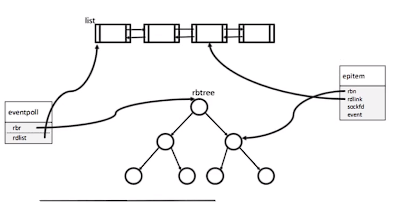
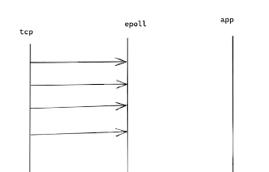

# Epoll 的原理

Epoll 是网络IO多路复用中，相比select、poll，其性能最好的。其内部实现是什么样的？epoll的数据结构如何选择？在TCP连接中的网络IO的可读可写如何判断？epoll如何做到线程安全？epoll的水平触发和边沿触发如何实现？研究epoll的实现原理可以解答这些问题。

## Epoll数据结构

​	epoll主要的功能就是对网络IO的fd句柄进行监控，把fd增加到epoll的监控集合内，如果epoll发现有网络fd可读或者可写，把fd增加到就绪队列中，放回给应用层。所以epoll的数据结构需要具备两个功能：1. 把监控fd增加、修改、删除进epoll的集合中，所有fd的数据机构整集；2. epoll发现fd可读可写时，存放就绪fd的数据结构。

​	第一个需要监控的fd的整集，是需要强查找的数据结构，链表list由于时间复杂度O(n)，不能满足强查找；数组进行增加、删除时不方便（epoll早期的版本epoll_creat的参数就为固定的可以监控fd的数量，后续版本只需要传入的值大于0即可，与可监控的fd数量无关）；哈希表可以强查找O(1)，并且方便增加删除，但是由于epoll所监控的fd的数量是不确定的，hash表空间占用较大，并且内存增加是指数增加，所以不行；B树和B+树为了降低层数，每一个节点都有多个key，查找数据也相对较慢，一般只用在磁盘结构上；所以最后选择红黑树进行对所有的fd进行管理和强查找，其复杂度为O（logN），并且内存的增加是线性的，是最符合Epoll管理fd的数据结构。

​	第二个使用使用链表，在红黑树中增加一个链表的指针，每一个epoll的节点，既可以是红黑树的节点，也可以是就绪链表的的节点。




```c++
// epoll的数据段
typedef union epoll_data {
	void *ptr;
	int fd;
	uint32_t u32;
	uint64_t u64;
} epoll_data_t;
// epoll的事件
struct epoll_event {
	uint32_t events;
	epoll_data_t data;
};
// epoll的节点
struct epitem {
	RB_ENTRY(epitem) rbn;	// 红黑树节点，存放fd的总集
	LIST_ENTRY(epitem) rdlink;// 链表节点
	int rdy; //exist in list 
	
	int sockfd;		//监控的fd
	struct epoll_event event; 
};
```

## Epoll网络IO判断

当网卡收到TCP的数据时，如何通知epoll收到数据？在早期的版本为信号量通知epoll，但是现在的版本都是使用epoll提供的回调函数，当有事件发生使得IO的状态发生变化，就调用回调函数通知epoll，epoll就把节点放入就绪队列中，返回给应用层。

> 对于TCP而言，有四种事件可以使IO变就绪：
>
> 1. TCP三次握手完成 -- 读事件
> 2. 当recvbuffer收到数据时 -- 读事件
> 3. 当sendbuffer有空间时 -- 读事件
> 4. 当收到fin包时 -- 读事件

 

```c++
int epoll_event_callback(struct eventpoll *ep, int sockid, uint32_t event) {

	struct epitem tmp;
	tmp.sockfd = sockid;
    // 红黑树查找是否存在fd
	struct epitem *epi = RB_FIND(_epoll_rb_socket, &ep->rbr, &tmp);
	if (!epi) {
		printf("rbtree not exist\n");
		return -1;
	}
    // 设置事件
	if (epi->rdy) {
		epi->event.events |= event;
		return 1;
	} 

	printf("epoll_event_callback --> %d\n", epi->sockfd);
	pthread_spin_lock(&ep->lock);
	epi->rdy = 1;
    // 加入就绪队列
	LIST_INSERT_HEAD(&ep->rdlist, epi, rdlink);
	ep->rdnum ++;
	pthread_spin_unlock(&ep->lock);
	// 条件变量通知有就绪节点
	pthread_mutex_lock(&ep->cdmtx);
	pthread_cond_signal(&ep->cond);
	pthread_mutex_unlock(&ep->cdmtx);

	return 0;
}
```

## Epoll的线程安全

Epoll需要多线程进行操作的数据结构是存放所有fd的总集红黑树、表示就绪的队列list，这两个操作时需要加锁。

1. 由于操作红黑树比较复杂，需要把节点插入到叶子节点，然后一层一层的调整（左旋和右旋），所以红黑树的锁选择互斥量（pthread_mutex_t ）进行加锁；
2. 而修改队列list时，只需要修改指针的值，比较容易且快速，所以选择自旋锁（pthread_spinlock_t ）；
3. 当有节点加入就绪链表时，需要进行通知阻塞的epoll_wait函数进行返回给应用层进行数据的处理，所以需要使用条件变量（pthread_cond_t ）。

```c++
struct eventpoll {
	int fd;
	// 红黑树的根节点
	ep_rb_tree rbr;
	int rbcnt;
	// 链表的头节点
	LIST_HEAD( ,epitem) rdlist;
    // 可读的数量、等待的时间
	int rdnum;
	int waiting;
    
	pthread_mutex_t mtx; //rbtree update
	pthread_spinlock_t lock; //rdlist update
	pthread_cond_t cond; //block for event
	pthread_mutex_t cdmtx; //mutex for cond
	
};
```

## Epoll水平触发和边沿触发

由于TCP使用回调函数通知Epoll，所以水平触发和边沿触发，仅仅只是调用Epoll回调函数的一种策略。

- 水平触发：当接收缓冲区recvbuffer有数据时，就一直调用Epoll的回调函数。
- 边沿触发：当收到数据时，就只调用一次回调函数，不判断接收缓冲区的数据是否被取走进行处理。
