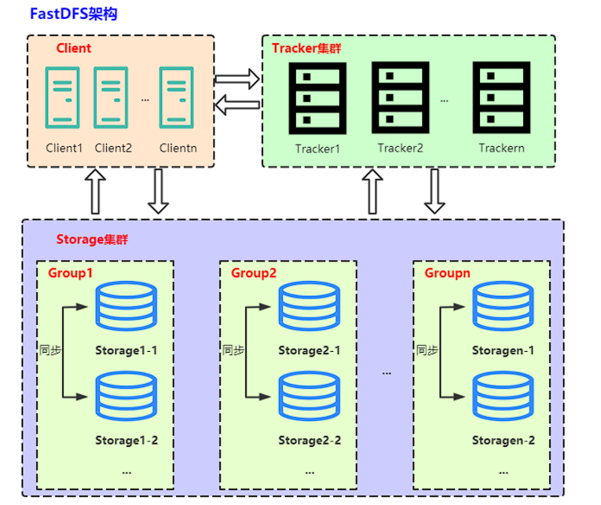
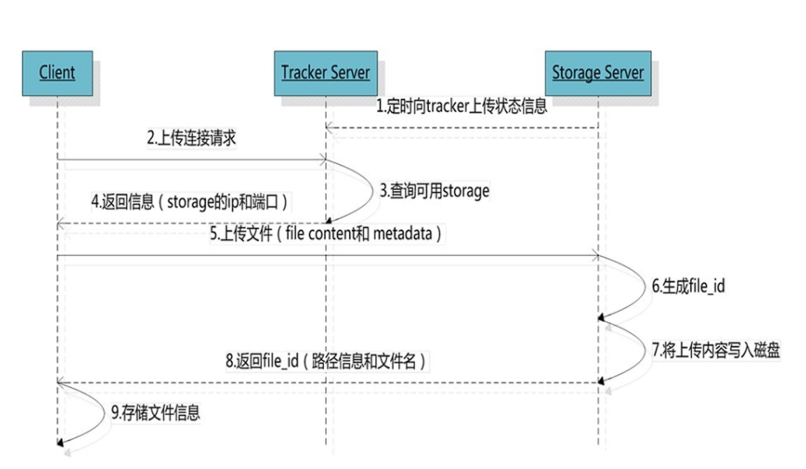
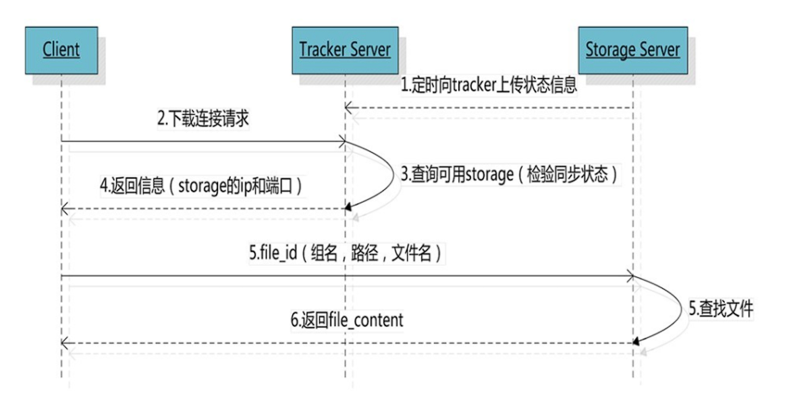

# FastDFS分布式存储的架构和搭建

## FastDFS的整体架构

FastDFS是由国人余庆所开发，其主要的功能包括：文件存储，同步和访问，**设计基于高可用和负载均衡**。FastDFS非常适用于基于文件服务的站点。其项目地址为：

```shell
https://github.com/happyfish100
```

FastDFS由**跟踪服务器（tracker server）**、**存储服务器（storage server）**和**客户端（client）**三个部分组成，主要解决海量数据存储问题，特别适合以中小文件（建议范围：4KB < file_size < 500MB）为载体的在线服务，例如图片分享和视频分享网站。



### Tracker server

Tracker是FastDFS的协调者，负责管理所有的storage server和group，每个storage在启动后会连接Tracker，告知自己所属的group等信息，并保持周期性的心跳，tracker根据storage的心跳信息，建立group==>[storage server list]的映射表。

Tracker需要管理的元信息很少，会全部存储在内存中。另外tracker上的元信息都是由storage汇报的信息生成的，本身不需要持久化任何数据，这样使得tracker非常容易扩展，直接增加tracker机器即可扩展为tracker cluster来服务。

扩展成集群后，cluster里每个tracker之间是完全对等的，所有的tracker都接受stroage的心跳信息，生成元数据信息来提供读写服务。

### Storage server

Storage server（后简称storage）以组（卷，group或volume）为单位组织，一个group内包含多台storage机器，数据互为备份，存储空间以group内容量最小的storage为准，所以建议group内的多个storage尽量配置相同，以免造成存储空间的浪费。

以group为单位组织存储能方便的进行应用隔离、负载均衡、副本数定制（group内storage server数量即为该group的副本数）。比如将不同应用数据存到不同的group就能隔离应用数据，同时还可根据应用的访问特性来将应用分配到不同的group来做负载均衡。缺点是group的容量受单机存储容量的限制，同时当group内有机器坏掉时，数据恢复只能依赖group内的其他机器，使得恢复时间会很长。

group内每个storage的存储依赖于本地文件系统，storage可配置多个数据存储目录，比如有10块磁盘，分别挂载在/data/disk1 -- /data/disk10，则可将这10个目录都配置为storage的数据存储目录。

storage接受到写文件请求时，会根据配置好的规则，选择其中一个存储目录来存储文件。为了避免单个目录下的文件数太多，在storage第一次启动时，会在每个数据存储目录里创建2级子目录，**每级256个**，总共65536个文件，新写的文件会**以hash的方式被路由到其中某个子目录下**，然后将文件数据直接作为一个本地文件存储到该目录中。

### Client

FastDFS向使用者提供基本文件访问接口，比如monitor、**upload、download**、append、**delete**等，以客户端库的方式提供给用户使用。

## FastDFS的功能逻辑架构

### 文件上传 upload file



文件下载流程为：

1. **选择tracker server**。当集群中不止一个tracker server时，由于tracker之间是完全对等的关系，客户端在upload文件时可以任意选择一个trakcer。
2. **选择存储的group**。当tracker接收到upload file的请求时，会为该文件分配一个可以存储该文件的group，支持如下选择group的规则：1. Round robin，所有的group间轮询。2. Specified group，指定某一个确定的group。3. Load balance，选择最大剩余空 间的组上传文件。
3. **选择storage server**。当选定group后，tracker会在group内选择一个storage server给客户端，支持如下选择storage的规则：1. Round robin，在group内的所有storage间轮询。2. First server ordered by ip，按ip排序。3. First server ordered by priority，按优先级排序（优先级在storage上配置）。
4. **选择storage path**。当分配好storage server后，客户端将向storage发送写文件请求，storage将会为文件分配一个数据存储目录，支持如下规则：1. Round robin，多个存储目录间轮询 。2. 剩余存储空间最多的优先。
5. **生成Fileid**。**选定存储目录之后**，storage会为文件生一个Fileid，由：storage server ip、文件创建时间、文件大小、文件crc32和一个随机数拼接而成，然后将这个二进制串进行base64编码，转换为可打印的字符串。
6. **选择两级目录**。当选定存储目录之后，storage会为文件分配一个fileid，每个存储目录下有两级256*256的子目录，storage会按文件fileid进行两次hash，路由到其中一个子目录，然后将文件以fileid为文件名存储到该子目录下。
7. **生成文件名**。当文件存储到某个子目录后，即认为该文件存储成功，接下来会为该文件生成一个文件名，文件名由：group、存储目录、两级子目录、fileid、文件后缀名（由客户端指定，主要用于区分文件类型）拼接而成。


文件名规格如下：

- storage_id（ip的数值型）源storage server ID或IP地址
- timestamp（文件创建时间戳）
- file_size（若原始值为32位则前面加入一个随机值填充，最终为64位）
- crc32（文件内容的检验码）

```shell
eBuDxWCb2qmAQ89yAAAAKeR1iIo162
| 4bytes | 4bytes    | 8bytes    |4bytes | 2bytes |
| ip     | timestamp | file_size |crc32  | 校验值 |
```

### 文件下载download file

客户端upload file成功后，会拿到一个storage生成的文件名，接下来客户端根据这个文件名即可访问到该文件。



跟upload file一样，在download file时客户端可以选择任意tracker server。Client发送download请求给某个tracker，必须带上文件名信息，tracker从文件名中解析出文件的group、大小、创建时间等信息，然后为该请求选择一个storage用来服务读请求。

由于group内的文件同步时在后台异步进行的，所以有可能出现在读到时候，文件还没有同步到某些storage server上，为了尽量避免访问到这样的storage，tracker按照如下规则选择group内可读的storage：

1. 查找该文件上传到的源头storage 。 源头storage只要存活着，肯定包含这个文件，源头的地址被编码在文件名中。 
2. 如果文件创建时间戳等于storage被同步到的时间戳 且(当前时间 - 文件创建时间戳)  大于 文件同步最大时间（如5分钟) 。文件创建后，认为经过最大同步时间后，肯定已经同步到其他storage了。 
3. 如果文件创建时间戳 < storage被同步到的时间戳。 同步时间戳之前的文件确定已经同步了。 
4. 如果(当前时间-文件创建时间戳) > 同步延迟阀值（如一天）。经过同步延迟阈值时间，认为文件肯定已经同步了。

> FastDFS自带的http服务已经弃用，需要通过nginx + fastdfs-nginx-module的方式去实现下载。数据同步同一组内storage server之间是对等的，文件上传、下载、删除等操作可以在任意一台storage server上进行； 文件同步只在同组内的storage server之间进行，采用push方式，即源服务器同步给目标服务器。

### 文件系统对比

| 对比说明/文件系统 | TFS                  | FastDFS                | MogileFS | MooseFS              | GlusterFS                               | Ceph                     |
| ----------------- | -------------------- | ---------------------- | -------- | -------------------- | --------------------------------------- | ------------------------ |
| 开发语言          | C++                  | C                      | Perl     | C                    | C                                       | C++                      |
| 开源协议          | GPL V2               | GPL V3                 | GPL      | GPL V3               | GPL V3                                  | LGPL                     |
| 数据存储方式      | 块                   | 文件/Trunk             | 文件     | 块                   | 文件/块                                 | 对象/文件/块             |
| 集群节点通信协议  | 私有协议（TCP）      | 私有协议（TCP）        | HTTP     | 私有协议（TCP）      | 私有协议（TCP）/ RDAM(远程直接访问内存) | 私有协议（TCP）          |
| 专用元数据存储点  | 占用NS               | 无                     | 占用DB   | 占用MFS              | 无                                      | 占用MDS                  |
| 在线扩容          | 支持                 | 支持                   | 支持     | 支持                 | 支持                                    | 支持                     |
| 冗余备份          | 支持                 | 支持                   | -        | 支持                 | 支持                                    | 支持                     |
| 单点故障          | 存在                 | 不存在                 | 存在     | 存在                 | 不存在                                  | 存在                     |
| 跨集群同步        | 支持                 | 部分支持               | -        | -                    | 支持                                    | 不适用                   |
| 易用性            | 安装复杂，官方文档少 | 安装简单，社区相对活跃 | -        | 安装简单，官方文档多 | 安装简单，官方文档专业化                | 安装简单，官方文档专业化 |
| 适用场景          | 跨集群的小文件       | 单集群的中小文件       | -        | 单集群的大中文件     | 跨集群云存储                            | 单集群的大中小文件       |

## FastDFS的环境搭建

### 安装相关的开源库

```shell
## 安装编译器
sudo apt-get install gcc g++ build-essential libtool -y
## 安装PCRE库
wget https://sourceforge.net/projects/pcre/files/pcre/8.44/pcre-8.44.tar.gz
tar -zxvf pcre-8.44.tar.gz
cd pcre-8.44/
./configure
make -j && make install
## 安装zlib库
wget https://nchc.dl.sourceforge.net/project/libpng/zlib/1.2.11/zlib-1.2.11.tar.gz
tar -zxvf zlib-1.2.11.tar.gz
cd zlib-1.2.11/
./configure
make -j && make install
## 安装OpenSSL开发库
wget https://www.openssl.org/source/openssl-1.1.1g.tar.gz
tar -zxvf openssl-1.1.1g.tar.gz
cd openssl-1.1.1g/
./config
make -j && make install
## 安装Nginx（需要配置安装模块）
wget http://nginx.org/download/nginx-1.16.1.tar.gz
tar -zxvf nginx-1.16.1.tar.gz
cd nginx-1.16.1/
./configure --prefix=/usr/local/nginx --with-http_stub_status_module --with-http_ssl_module --with-http_realip_module --with-http_v2_module --with-openssl=../openssl-1.1.1g
make -j && make install
```

### 启动Nginx

```shell
## 默认情况下，Nginx被安装在目录/usr/local/nginx中，其中，其中Nginx的配置文件存放于conf/nginx.conf，bin文件是位于sbin目录下的nginx文件。
cd usr/local/nginx 
ls
conf  html  logs  sbin
## 默认方式启动Nginx服务器,这时，会自动读取配置文件：/usr/local/nginx/conf/nginx.conf
/usr/local/nginx/sbin/nginx
ps -ef | grep nginx
root      47583      1  0 20:15 ?        00:00:00 nginx: master process /usr/local/nginx/sbin/nginx
nobody    47584  47583  0 20:15 ?        00:00:00 nginx: worker process
```

打开浏览器访问此机器的IP，如果浏览器出现 Welcome to nginx! 则表示 Nginx 已经安装并运行成功：


```shell
## 指定配置文件启动服务器
/usr/local/nginx/sbin/nginx -c /usr/local/nginx/conf/nginx.conf
## 测试配置信息
/usr/local/nginx/sbin/nginx -t
nginx: the configuration file /usr/local/nginx/conf/nginx.conf syntax is ok
nginx: configuration file /usr/local/nginx/conf/nginx.conf test is successful
```

### 安装配置FastDFS

```shell
## 安装FastDFS前，需要先安装libfastcommon
git clone https://gitee.com/fastdfs100/libfastcommon.git
cd libfastcommon
git checkout V1.0.50
./make.sh
./make.sh install

## 安装 FastDFS
git clone https://gitee.com/fastdfs100/fastdfs.git
cd fastdfs
git checkout V6.07
./make.sh 
./make.sh install
```

#### 配置 Tracker

```shell
# 创建 Tracker 的存储日志和数据的根目录
mkdir -p /home/fastdfs/tracker
cd /etc/fdfs
cp tracker.conf.sample tracker.conf
# 配置 tracker.conf
vim tracker.conf
# 一般tracker.conf 只是修改一下 Tracker 存储日志和数据的路径，主要修改base_path路径
# 启用配置文件（默认为 false，表示启用配置文件）
disabled=false
# Tracker 服务端口（默认为 22122）
port=22122
# 存储日志和数据的根目录
base_path=/home/fastdfs/tracker
```

#### 配置 Storage

```shell
# 创建 Storage 的存储日志和数据的根目录
mkdir -p /home/fastdfs/storage
cd /etc/fdfs
cp storage.conf.sample storage.conf
# 配置 storage.conf
vim storage.conf
# 启用配置文件（默认为 false，表示启用配置文件）
disabled=false
# Storage 服务端口（默认为 23000）
port=23000
# 数据和日志文件存储根目录
base_path=/home/fastdfs/storage
# 存储路径，访问时路径为 M00
# store_path0 M00 
# store_path1 则为 M01，以此递增到 M99（如果配置了多个存储目录的话，这里只指定 1 个）
store_path0=/home/fastdfs/storage
# Tracker 服务器 IP 地址和端口，单机搭建时也不要写 127.0.0.1
# tracker_server 可以多次出现，如果有多个，则配置多个
tracker_server=172.26.109.152:22122
# 设置 HTTP 访问文件的端口。这个配置已经不用配置了，配置了也没什么用
# 这也是为何 Storage 服务器需要 Nginx 来提供 HTTP 访问的原因
http.server_port=8888
```

### 启动 Tracker 和 Storage 服务和测试文件存储

#### 启动 Tracker 和 Storage 服务

```shell
# 启动 Tracker 服务
# 其它操作则把 start 改为 stop、restart、reload、status 即可。Storage 服务相同
/etc/init.d/fdfs_trackerd start
# 启动 Storage 服务
/etc/init.d/fdfs_storaged start
# 查看端口
lsof -i:22122
COMMAND     PID USER   FD   TYPE  DEVICE SIZE/OFF NODE NAME
fdfs_trac 26191 root    5u  IPv4 5570489      0t0  TCP *:22122 (LISTEN)

lsof -i:23000
COMMAND     PID USER   FD   TYPE  DEVICE SIZE/OFF NODE NAME
fdfs_stor 26338 root    5u  IPv4 5574248      0t0  TCP *:23000 (LISTEN)

# 可以通过 fdfs_monitor 查看集群的情况
# 查看 Storage 是否已经注册到 Tracker 服务器中
# 当查看到 ip_addr = 172.26.109.152: (localhost.localdomain)  ACTIVE
# ACTIVE 表示成功
/usr/bin/fdfs_monitor /etc/fdfs/storage.conf
```

> 可以去查看/etc/init.d/fdfs_trackerd文件， fdfs_trackerd的实际执行程序为：/usr/bin/fdfs_trackerd，配置文件为：/etc/fdfs/tracker.conf。可以单台机器通过修改端口的方式去启动多个tracker、storage。

```shell
# 查看日志的方式
tail -f /home/fastdfs/tracker/logs/trackerd.log  # tracker
tail -f /home/fastdfs/storage/logs/storaged.log  # storage
## tracker启停命令
/etc/init.d/fdfs_trackerd start # 启动
/etc/init.d/fdfs_trackerd stop # 停止
/etc/init.d/fdfs_trackerd restart # 重启 
## storage的启停命令
/etc/init.d/fdfs_storaged start # 启动
/etc/init.d/fdfs_storaged stop # 停止
/etc/init.d/fdfs_storaged restart # 重启 
```

#### 测试文件存储

```shell
# 修改 client 客户端配置文件
mkdir -p /home/fastdfs/client
cp /etc/fdfs/client.conf.sample /etc/fdfs/client.conf
vim /etc/fdfs/client.conf
# 存储日志文件的基本路径
base_path=/home/fastdfs/client
# Tracker 服务器 IP 地址与端口号
tracker_server=172.26.109.152:22122

# 使用格式进行文件上传： /usr/bin/fdfs_upload_file 配置文件 要上传的文件 
/usr/bin/fdfs_upload_file /etc/fdfs/client.conf ./test.txt
# 当返回文件 ID 号，如 group1/M00/00/00/ctepQmIWJTCAcldiAAAHuj79dAY04.txt 则表示上传成功
# 如果错误可以查看日志进行排查
tail -f /home/fastdfs/storage/logs/storaged.log

#下载文件
fdfs_download_file /etc/fdfs/client.conf group1/M00/00/00/ctepQmIWJTCAcldiAAAHuj79dAY04.txt

# 删除文件
fdfs_delete_file /etc/fdfs/client.conf group1/M00/00/00/ctepQmIWJTCAcldiAAAHuj79dAY04.txt
```

可以在Tracker 和 Storage 的集群安装Nginx，目的如下:

- **Storage 安装 Nginx，为了提供 http 的访问和下载服务**，同时解决 group 中 Storage 服务器的同步延迟问题
- Tracker 安装 Nginx，主要是为了提供 http 访问的反向代理、负载均衡以及缓存服务

## 安装Nginx 的插件模块

FastDFS的 HTTP 访问已经不能使用了，需要配合Nginx的插件来提供文件的上传下载服务。

- **fastdfs-nginx-module**插件用于下载文件
- **nginx-upload-module**插件用于上传文件

安装Nginx 的模块包需要重新编译Nginx，可以把**原有的nginx** 进行备份。

```shell
# 下载fastdfs-nginx-module
git clone https://github.com/happyfish100/fastdfs-nginx-module.git
cd fastdfs-nginx-module
git checkout V1.22

# 下载nginx-upload-module
# 下载原始的版本（原始版本有bug）：
wget http://www.grid.net.ru/nginx/download/nginx_upload_module-2.2.0.tar.gz
# 解压：
tar -zxvf nginx_upload_module-2.2.0.tar.gz
# 下载修改过的nginx upload模块，替换部分原始的文件
git clone https://github.com/winshining/nginx-upload-module.git
cd nginx-upload-module
#拷贝当前该目录的内容到nginx_upload_module-2.2.0
cp -arf * ../nginx_upload_module-2.2.0
```

然后进行Nginx的配置和重新编译

```shell
#进入到nginx源码目录
cd nginx-1.16.1/
#配置添加模块,路径是刚才下载的的模块的绝对路径，就是在编译Nginx时候，连同这个模块一起编译。
./configure --prefix=/usr/local/nginx --with-http_stub_status_module --with-http_ssl_module --with-http_realip_module --with-http_v2_module --with-openssl=../openssl-1.1.1g  --add-module=/root/yangshuangxin/fastdfs-nginx-module/src --add-module=/root/yangshuangxin/nginx_upload_module-2.2.0

# 给 nginx 目录下的 objs/Makefile 文件中增加头文件目录
vim objs/Makefile
ALL_INCS = -I src/core \
    -I /usr/include/fastdfs \
    -I /usr/include/fastcommon \
    -I src/event \
    -I src/event/modules \
# 重新编译及安装nginx
make -j && make install
# 通过nginx -V 测试编译是否正常
/usr/local/nginx/sbin/nginx -V

# 拷贝fastdfs-nginx-module配置文件
cd /usr/yangshuangxin/fastdfs-nginx-module/src
cp mod_fastdfs.conf /etc/fdfs/
# 拷贝fastdfs/conf 配置文件
cd /usr/yangshuangxin/fastdfs        # 为fastdfs源码路径
cp conf/http.conf /etc/fdfs/
cp conf/mime.types /etc/fdfs/

# 创建并修改配置文件
mkdir  -p /home/fastdfs/mod_fastdfs
vim /etc/fdfs/mod_fastdfs.conf # 修改如下，主要修改base_path 、tracker_server、url_have_group_name、store_path0
base_path =/home/fastdfs/mod_fastdfs 
# Tracker 服务器IP和端口修改
tracker_server=172.26.109.152:22122
# url 中是否包含 group 名称，改为 true，包含 group
url_have_group_name = true
# store_path0的路径必须和storage.conf的配置一致
store_path0=/home/fastdfs/storage
# 其它的一般默认即可，例如
group_name=group1 
storage_server_port=23000 
store_path_count=1
```

修改Nginx的配置文件

```shell
vim /usr/local/nginx/conf/nginx.conf
# 在server中增加路径匹配，配置为支持 group0-group9，以及 M00-M99，以便于以后扩容
location ~/group([0-9])/M([0-9])([0-9]) {     
        ngx_fastdfs_module;
}

/usr/local/nginx/sbin/nginx -s stop # 停止nginx
/usr/local/nginx/sbin/nginx # 启动nginx
 /usr/local/nginx/sbin/nginx -s reload # 重新加载配置文件

```

如果`ps -ef | grep nginx`没有work进程说明启动是异常的，一般有以下原因：

1. base_path对应的路径没有创建
2. tracker_server 配置错误
3. store_path0 配置错误

## 测试验证

```shell
touch yangshuangxin.txt
echo "努力奋斗，永不止步" >  yangshuangxin.txt
fdfs_upload_file /etc/fdfs/client.conf yangshuangxin.txt
#拿到存储位置：group1/M00/00/00/eWFuZ3NodWFuZ3hpbg.txt
# 浏览器输入：http://172.26.109.152/group1/M00/00/00/eWFuZ3NodWFuZ3hpbg.txt
# 浏览器能显示对应的文本信息
```

