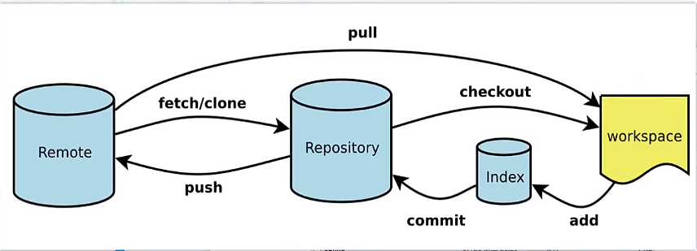

# 分布式代码仓库GIT的常用操作

## 分布的代码仓库介绍	

集中式代码仓库SVN，版本管理有一个中央服务器保存所有的代码和文档，所有的修改都可以提交到版本库里。

​	分布式代码仓库GIT，每一个节点都有完整的代码仓库，每一次修改都先提交到本地的代码仓库，然后可以再推送到远端的代码仓库。

​	git是分布式版本控制工具，可以保存文件的所有修改记录，并且使用版本号进行区分不同的修改。可以随时浏览历史的版本、还原历史的版本、对比不同版本的差异。

​	在多人协作开发同一个项目中，git是必不可少的。每个人都在代码库下载代码，进行开发修改，最后把不同的代码合在一起上传的代码托管平台，如github、gitee、gitlab。

## 仓库的建立

- 远程仓库的建立

  `git init --bare`   远端建立裸仓库，即使仓库泄漏了也看不到具体的代码。

- 本地仓库的建立

  `git clone  远端仓库`

​	`git clone` 远端仓库有3种协议进行代码的下载：http、ssh、git。一般使用SSH协议进行远程代码的下载。SSH是一个沿着授权的代码协议，使用SSH步骤如下：

1. 客户端生成公钥和私钥。执行：`ssh-keygen -t rsa`  ，然后一直回车。
2. 复制客户端`.ssh` 文件里的公钥`xxx.pub`的内容 到远程仓库服务器的`.ssh`文件夹里的`authorized_kyes` 文件里
3. 使用`git clone ssh//root@192.169.0.120:/home/mio` 克隆远端服务器192.169.0.120上的 root 用户的 /home/mio 下的代码仓。

## 用户名和邮箱的配置


1. 局部配置

```shell
git config user.name yangshuangxin
git config user.email yangshuangxin@qq.com
# 查看配置
git config --local -l
```

2. 全局配置

```shell
git config --global user.name yangshuangxin
git config --global user.email yangshuangxin@qq.com
# 查看配置
git config  -l
```

## 代码提交和管理



​	本地工作区增加代码到暂存区，暂且区提交代码到本地仓库。本地仓库可以推送代码到远端的仓库，也可以拉取远端的仓库到本地。每一次提交都会使用SHA1生成40位的版本号。

- 基本操作：

1. 增加代码到暂存区：`git add file`
2. 提交代码到本地仓库：`git commit -m "提交代码版本注释"`
3. 推送到远程origin仓库的master分支：`git push origin master`
4. 拉取远程仓库最新提交记录到本地：`git fetch`
5. 拉取远程仓库并与本地代码合并：`git pull`
6. 查看本地的状态：`git status`
7. 查看提交历史：`git log`


- 逆向操作：

1. index -> workspace ：`git restore -S`
2. 本地仓库 -> index ：`git reset --soft`
3. 本地仓库-> workspace ： `git reset --mixed`
4. 本地仓库-> null：`git reset --hard `
5. workspace -> null ：`git checkout -f`

## 本地仓库的整理

- 整理上一次提交，相同功能多次提交，复用上一次提交的信息

  `git commit --amend`

- 整理多次提交，进行合并、修改等操作

  `git rebase -i h1 h2`  整理h1 和h2 版本之间所有左开右闭的提交。

  `git rebase -i` 默认整理从远程版本到当前版本所有提交。常用选项pick、squash、fixup。

## 分支管理

1. 查看分支： `git branch`
2. 创建develop分支 ：`git branch develop`
3. 创建并切换到develop分支：`git branch -b develop`
4. 合并develop分支：`git merge develop`  (也可以使用`git rebase`进行合并，`git rebase`会提取当前分支的修改，应用到目标分支的最新提交的后面，当前分支指向目标分支的最新提交)
5. 切换develop分支：`git branch develop`  (也可以使用`git switch develop`)
6. 删除develop分支：`git branch -d develop`
7. 删除远端develop分支：`git push origin -d develop`

## 解决代码冲突

​	当不同的分支修改了同一个文件的同一行或者相邻行，就会产生代码冲突。代码冲突解决原则是不影响其他人提交的功能的同时，也不破坏自己提交的功能。

- git merge 冲突解决

  1. 修改冲突的文件
  2. 增加冲突的文件：`git add file`
  3. 提交到代码仓：`git commit -m "解决冲突"`

- git rebase 冲突解决

  1. 修改冲突的文件
  2. 增加冲突的文件：`git add file`
  3. 继续合并：`git rebase --continue`

  