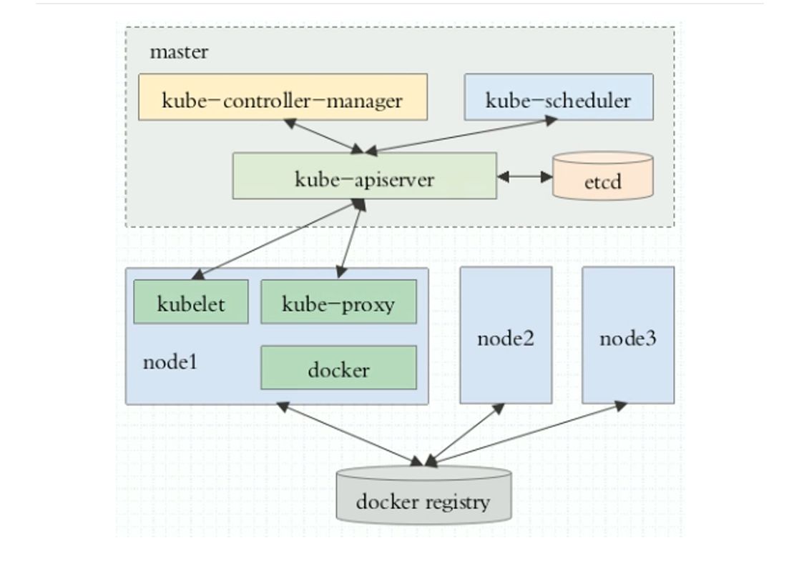
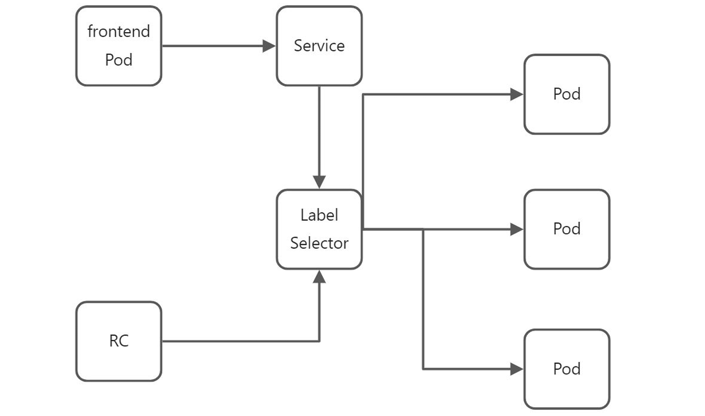

# Kubernetes(k8s)的介绍和基本概念

Kubernetes 是一个可移植、可扩展的开源平台。用于管理容器化的工作负载和服务，可进行容器的声明式配置和自动化。K8s是谷歌保密了十几年的秘密武器Borg的开源版本，谷歌一直通过Borg系统管理着数量庞大的应用程序集群。

Kubernetes是基于容器技术的分布式架构方案，不局限于任何编程语言。Kubernetes是一个可插拔的开放式平台，那些默认的解决方案可都是可选的。Kubernetes为构建开发 人员平台提供了基础，但是在重要的地方保留了用户的选择权，拥有更高的灵活性。

## Kubernetes 能做什么

- 服务发现和负载均衡。Kubernetes 可以使用 DNS 名称或自己的 IP 地址来曝露容器。 如果进入容 器的流量很大， Kubernetes 可以负载均衡并分配网络流量，从而使部署稳定。
- 部署和回滚。可以通过配置文件描述容器的期望状态，并且以受控的速率将容器的实际状态改为期 望状态。支持按部署回滚，支持回滚到指定部署版本。
- 弹性伸缩。可根据指标配置自动伸缩策略，以应对突发流量。
- 容器配额管理。允许为每个容器指定所需的CPU和内存。
- 故障发现和自我修复。Kubernetes将自动发现不符合运行状况检查的容器，并且尝试去重启、替换这些容器。在服务准备好之前不会将其通告给客户端。
- 密钥和配置管理。Kubernetes提供secret和configMap，两种资源来分别管理密钥信息和配置信息。
- 支持多种数据卷类型。例如：本地存储、公有云提供商、分布式存储系统等。

## Kubernetes 不能做什么

- 不支持限制应用程序类型。Kubernetes旨在支持多种多样的工作负载，如果应用程序能够在容器中运行，那么就能够在Kubernetes上很好的运行。
- 不部署源码、也不构建应用。Kubernetes是基于容器技术的平台，所以部署的都是镜像。
- 不提供应用程序级别的服务作为内置服务。例如：消息中间件、mysql数据库等。但是这些组件可 以运行在Kubernetes上。

## Kubernetes 的组件

Kubernetes 是由master控制平面和node节点组件组成，如下所示：



### 控制平面（master）组件

master节点会为集群做出全局决策，比如资源调度，检测和和响应集群事件，例如：启动或删除pod。 master节点通常不运行任何工作负载。

- kube-apiserver。apiserver是 Kubernetes master节点的组件， 该组件负责公开了 Kubernetes  API，负责处理接受请求的工作。 kube-apiserver 支持高可用部署。
- etcd。兼顾一致性与高可用的键值数据库，用来保存Kubernetes集群数据。
-  kube-scheduler。是master节点组件，负责监视新创建的、未指定运行节点的Pod，并选择节点 来运行Pod。
- kube-controller-manager。是master节点组件，负责运行控制器进程。

其中，控制器包括：

1. 节点控制器：负责在节点出现故障时进行通知和响应
2. 任务控制器：监测任务的job对象，创建Pod来执行这些任务
3. 端点控制器：填充端点对象，即加入service与pod 
4. 副本控制器：用来确保pod的实际数量与预期数量保持一致
5. 服务账户和令牌控制器：为新的命名空间创建默认账户和API访问凭据

### Node节点组件

- kubelet。在集群中每个节点（node）上运行，它保证容器（containers）都运行在 Pod 中。配 合master节点管理node节点，向master节点报告node节点信息，例如：操作系统、Docker版本、机器的CPU和内存情况，以及当前有哪些Pod在运行等。通过定时心跳向master报告节点状态。若超时未能上报节点状态，则master节点会判断该节点为“失联”并调度pod到其他节点运行。
- kube-proxy。是集群中每个节点上所运行的网络代理，实现Kubernetes服务（service）概念的一 部分。。kube-proxy 维护节点上的一些网络规则， 这些网络规则会允许从集群内部或外部的网络会 话与 Pod 进行网络通信。
- 容器运行时。例如：docker engine + cri-dockerd。

## K8S的基本概念

### Resource

Kubernetes中的大部分概念如 Node、Pod、Replication Controller、Service 等都可以被看做一种资源对象。

几乎所有资源对象都可以通过Kubernetes提供的kubectl工具（或API编程调用）执行增、删、 改、查等操作并将其保存在etcd中持久化存储。

Kubernetes其实是一个高度自动化的资源控制系统，通过跟踪对比etcd库里保存的“资源期望状态”与当前环境的“实际资源状态”的差异来实现自动控制和自动纠错的高级功能。

### Kubernetes API version

查看可用的apiversion命令：`kubectl api-versions `。k8s官方将apiversion分成了三个大类型，alpha、beta、stable：

- Alpha: 未经充分测试，可能存在bug，功能可能随时调整或删除。 
- Beta: 经过充分测试，功能细节可能会在未来进行修改。 
- Stable: 稳定版本，将会得到持续支持。

### Pod

Pod 是Kubernetes 最重要的基本概念，是Kubernetes的最小调度单位。

每个Pod都有一个特殊的被称为“根容器”的Pause容器。除了Pause跟容器外，每个Pod还包含了一个或多个紧密相关的用户业务容器。Kubernetes会这么设计的原因如下：

1. 在实际情况下，存在多个紧密相关的业务容器需要部署为一组容器，那么pod支持将多个容器部署 在一个pod，pod里的多个业务容器共享pause的IP和Volume，解决了密切关联的容器之间的通信问题，数据共享问题。
2. 一个pod里面包含多个业务容器，在这种情况下，Kubernetes无法对pod这个整体的状态做出正确 的判断。所以引入了Pause根容器，以pause根容器的状态来代表pod的状态。例如：pod是否死亡的问题。

Kubernetes为每个Pod都分配了唯一的IP地址，称之为Pod IP。一个Pod里的多个容器共享PodIP地址。Kubernetes要求底层网络支持集群内任意两个Pod之间的TCP/IP直接通信。例如：flannel、Open vSwitch等。因此，**一个pod里的容器与另外主机上的Pod容器能够直接通信**。Pod有两种类型：

- 普通pod。pod被创建后，会被存放到etcd中，随后被调度到具体的node节点上运行。在默认情况 下，当pod里的某个容器停止运行时，Kubernetes会自动检测到这个问题容器并重新启动这个pod，如 果pod所在node机器出现宕机，就会将这个node上的pod重新调度到其他node上。
- 静态pod。静态pod被存放到某个具体的Nod上的具体的文件当中，并且只在该node上启动、运行，不能被调度到其他节点。例如master节点组件均是以静态pod的方式运行，文件存放目录 为：`/etc/kubernetes/manifests/`。

对于绝大多数容器来说，一个CPU的资源配额相当大，所以在Kubernetes里通常以千分之一的 CPU配额为最小单位，用m来表示。通常一个容器的CPU配个被定义为100~300m，即占用0.1~0.3个 CPU。

```yaml
spec:
 containers:
 - name: db
 	image: mysql
 	resources:
 		requests:
 			memory: "64Mi"
 			cpu: "250m"
			limits:
 			memory: "128Mi"
 			cpu: "500m"
```

通常，Requests被设置为一个较小的值，表示容器平时的工作负载情况下的资源需求，而limits设置为 峰值负载情况下资源占用的最大值。

### Label

Label（标签）是Kubernetes系统中另外一个核心概念。一个Label是一个key=value的键值对，其中key 与value由用户自己指定。Label可以被附加到各种资源对象上，例如：Node、Pod、Service、RC等。

一个资源对象可以定义任意数量的Label，同一个Label也可以被添加到任意数量的资源对象上。通过给指定资源对象绑定Label从而实现资源对象的分组管理，方便Kubernetes进行资源分配、调度和部署等工作。

通过给指定的资源对象绑定一个或多个不同的Label来实现多维度的资源分组管理功能，以便灵活、方便 地进行资源分配、调度、部署等管理工作。例如：

- 版本标签：release:stable、release:beta
- 环境标签：env:dev、env:qa、env:production

通过Label为资源对象贴上相对应的标签，随后通过Label Selector（标签选择器）查询和筛选拥有某些 Label的资源对象。当前的有两种Label Selector 表达式：

- 基于等式：name=myweb,env!=production
- 基于集合：name in (myweb,myweb1),name not in (myweb,myweb1)

可通过多个Label Selector 表达式的组合实现复杂的条件选择，多个表达式之间用“,”分隔，条件之间是 “AND”关系，即同时满足多个条件：

```yaml
# 选择标签 key值为 app，value值为 myweb的资源
selector:
	app: myweb
# 选择标签 key值为 app且value值为 myweb 、 key 值为tier 且 value值 in （frontend，backend）
selector：
matchLabels:
	app: myweb
 matchExpressions:
 	- {key: tier, operator: In, values: [frontend,backend]}
 	#  或使用以下写法
 	- key: tier
 		operator: In # In, NotIn, Exists and DoesNotExist
 		values: ["frontend","backend"]
```

### RC（已不推荐）

Repliacation Controller （简称RC），RC是Kubernetes核心概念之一。。简单的说，RC定义了一个期望 的场景，即声明某种Pod的副本数量在任何时刻都符合某一个预期值。所以RC的定义包括：

- Pod期待的副本数。
- 用于筛选目标Pod的Label Selector。
- 当Pod的副本数量少于期望值时，用于创建Pod的模板。

一个基本的RC定义如下：

```yaml
apiVersion: v1
kind: ReplicationController # 副本控制器 RC
	metadata:
	name: myhello-rc # RC名称，全局唯一
	labels:
 		name: myhello-rc
spec:
	replicas: 5  # Pod副本期待数量
	selector:
 		name: myhello-pod
	template:
		metadata:
 			labels: 
				name: myhello-pod
 		spec:
 			containers:  # Pod 内容的定义部分        
 			- name: myhello  #容器的名称
				image: xlhmzch/hello:1.0.0 #容器对应的 Docker Image
				imagePullPolicy: IfNotPresent
 				ports:
 				- containerPort: 80
 				env: # 注入到容器的环境变量
 				- name: env1
 				  	value: "k8s-env1"  
 				- name: env2
 					value: "k8s-env2"
```

当定义一个RC后，Kubernetes的controller manager组件会定时巡检目标pod的副本数量是否与预期数量一致。

当实际副本数量大于预期数量则关闭一些目标pod，当实际副本数量小于预期数量，则通过 RC中pod的定义模板创建一些新的目标Pod。

### RS

Replica Set简写RS，是Kubernetes1.2版本中引入的一个新概念，Replica Set 为RC的升级版本。二者的区别在于：

1. RC的Label Selector 只支持基于等式的表达式，而RS的Label Selector 支持基于集合的表达式。
2. 在 线编辑RS后，RS会自动更新Pod，而RC的修改不会自动更新现有Pod。

RC（Replica Set）作用：

- 通过定义RC/RS 来自动创建pod以及pod副本数量的自动控制
- 通过Label Selector机制筛选目标pod
- 通过改变RC/RS所定义的副本数量来实现Pod的所对应服务的伸缩
- 通过改变RC/RS模板中的镜像，可以实现Pod的升级操作

### Deployment

Deployment 是Kubernetes在1.2版本中引入的概念，用于更好的解决pod的部署、升级、回滚等问题。Deployment 内部会自动创建RS用于Pod的副本控制。Deployment相较于RC/RS有以下优势：

- Deployment资源对象会自动创建RS资源对象来完成部署，对Deployment的修改并发布会产生新 的RS资源对象，为新的发布版本服务。
- Deployment支持查看部署进度，以确定部署操作是否完成。
- 更新Deployment，会触发部署从而更新pod，而RC的更新不会自动触发pod的更新。RS可以触发 pod更新。
- Deployment支持Pause操作，暂停之后对Deployment的修改不会触发发布动作。当完成修改之后 可以通过Resume 操作来发布新的Deployment。
- Deployment支持回滚操作，可以回滚到上一个版本或者回滚到指定的发布版本。
-  Deployment 支持重新启动操作，重新启动会触发Pod的更新。
- Deployment会自动清理不再需要的RS。

### HPA

Horizontal Pod Autoscaler（简称HPA），其主要作用是用于Pod横向自动伸缩。根据追踪和分析指定RC/RS控制的所有目标Pod的负载变化情况，来确定是否需要针对性地调整目标Pod的副本数量。

### DaemonSet

DaemonSet 确保全部（或者某些）节点上运行一个 Pod 的副本。当有节点加入集群时， 也会为他们新增一个 Pod 。 当有节点从集群移除时，这些 Pod 也会被回收。删除 DaemonSet 将会删除它创建的所有 Pod。

DaemonSet 的一些典型用法有：

1. 在每个节点上运行集群守护进程
2. 在每个节点上运行日志收集守护进程
3. 在每个节点上运行监控守护进程

 一种简单的用法是为每种类型的守护进程在所有的节点上都启动一个 DaemonSet。 

一个稍微复杂的用法是为同一种守护进程部署多个 DaemonSet，每个具有不同的标志， 并且对不同硬件类型具有不同的内存、CPU 要求。

### StatefulSet

在Kubernetes系统中，Pod的管理对象RC、Deployment、DaemonSet和Job等都是面向无状态的服 务。但现实中有很多服务是有状态的，StatefulSet就是用来管理有状态应用的Pod的。

和Deployment类似，StatefulSet也是通过Label Selector来管理一组相同定义的Pod。但和Deployment不同的是， StatefulSet为它的每一个Pod都维护了一个唯一的ID。

虽然每一个pod都是基于相同的定义文件而创建的，但是它们之间不能相互替换：无论怎么调度，每个pod都有一个永久不变的ID。

常见的有状态的应用程序例如：MySQL集群、MongoDB集群、kafka集群等。所以这些情况下应该使用StatefulSet：

- 需要稳定的、唯一的网络标识的应用程序
- 需要稳定的持久化存储的应用程序
-  需要有序的部署、更新和缩放的应用程序

使用StatefulSet的限制如下：

- Pod 的存储必须由 PersistentVolume 驱动
- 删除或收缩StatefulSet 不会删除关联的存储卷
- 需要使用Headless Service来负责Pod的网络标识，因此需要创建Headless Service
- 删除StatefulSet时，不能保证删除它管理的Pod。可以通过调整副本数量为0来实现

### Service

Service服务也是Kubernetes里的核心资源对象之一，其主要作用是将运行在一组Pods上的应用程序公开为网络服务，这其实就是我们经常提起的微服务。

通过service资源对象定义一个service的访问入口地址，然后前端应用通过访问这个入口，从而访问其背后的一组有Pod副本组成的集群实例。

目标Pods集合通常通过Label Selector来确定，如下图所示：



Service 一旦被定义，就被分配了一个不可变更的Cluster IP，在整个Service的生命周期内，该IP地址都 不会发生改变。

### Job

Job即工作任务，Job 会创建一个或者多个 Pods，来执行工作任务。

Job会跟踪记录成功完成的Pod数 量，当成功完成的数量达到了指定的成功个数时，Job结束。当执行过程中Pod出现失败的情况，Job会 创建新的Pod来替代该Pod。

删除 Job 的操作会清除所创建的全部 Pods； 挂起 Job 的操作会删除 Job 的所有活跃 Pod，直到 Job 被再次恢复执行。Job通常为单次任务，如果需要运行定时Job则应该使用 CronJob。

### Volume

Volume 是k8s抽象出来的对象，用于解决Pod中的容器运行时，文件存放的问题以及多容器数据共享的问题。

Pod 可以同时使用任意数量的Volume类型。 临时卷类型的生命周期与 Pod 相同，但持久卷的生 命周期与Pod无关。 当 Pod 不再存在时，Kubernetes 会销毁临时卷；不过 Kubernetes 不会销毁持久卷。 

对于给定 Pod 中任何类型的卷，在容器重启期间数据都不会丢失，也就是说数据卷的生命周期与容器无关。

Volume的核心是一个目录，其中可能存有数据，Pod 中的容器可以访问该目录中的数据。 所采用的特定的Volume类型将决定该目录如何形成的、使用何种介质保存数据以及目录中存放的内容。

Volume 支持多种Volume类型，例如：cephfs、configMap、csi、downwardAPI、emptyDir、fc (fibre channel)、gcePersistentDisk、glusterfs、hostPath、iscsi、local、nfs、persistentVolumeClaim、projected、secret、rbd 等。

Volume的使用比较简单，通常情况下，在Pod上声明一个Volume,然后再容器里引用该Volume并 挂载到容器的某个目录上即可，例如：

```yaml
template：
	metadata：
		labels:
 			app: myapp
 	spec:
 		volumes:
 			- name: datavol
 			emptyDir: {}
 			containers:
 			- name: nginx
 			  image: nginx
 			  volumeMounts:
 			  	- mountPath: /mydata
 				  name: datavol
```

### Persistent Volume

持久卷（PersistentVolume，PV）是集群中的一块存储，可以由管理员事先供应，或者使用存储类 （Storage Class）来动态供应。

 持久卷是集群资源，就像节点也是集群资源一样。PV 持久卷和普通的  Volume 一样，也是使用Volume插件来实现的，只是它们拥有独立的生命周期。 

Pod通过PersistentVolumeClaim（PVC）来申领PV作为存储卷使用。集群会通过PVC找到其绑定的 PV，并将该PV挂载到Pod。例如下面是一个NFS类型的PV的一个YAML定义文件，声明了8Gi的存储空间：

```yaml
apiVersion: v1
kind: PersistentVolume
metadata:
	name:pv0001
spec:
	capacity:
 storage: 8Gi
 accessModes:- ReadWriteOnce
 nfs:
 path: /somepath
 server: 192.168.239.142
```

在使用PV的accessModes属性有：

- ReadWriteOnce：读写权限，只允许被单个Node挂载
- ReadOnlyMany：只读权限，允许被多个Node挂载
- ReadWriteMany：读写权限，允许被多个Node挂载

如果某个Pod需要申请某种类型的PV，则需要先定义一个PersistentVolumeClaim对象：

```yaml
apiVersion: v1
kind: PersistentVolumeClaim
metadata:
	name: myclaim
spec:
	accessModes:
		- ReadWriteOnce
 	resources:
 		requests:
 			storage: 8Gi
```

然后，在Pod的Volume定义中引用PVC即可：

```yaml
volumes:
	- name: mypd
 		persistentVolumeClaim:
 			claimName: myclaim
```

PV的状态包括以下几种：

- Available：空闲状态
- Bound：已经绑定到某个PVC上
- Released：对应的PVC已经被删除，但资源还没有被集群回收
- Failed：PV自动回收失败

### Namespace

Namespace（命名空间）是Kubernetes系统中的另一个非常重要的概念，主要提供资源隔离。通过命 名空间可以将同一个集群中的资源划分为相互隔离的组。

统一命名空间下的资源名称必须唯一，但是不 同命名空间下的资源名称可以一样。命名空间的作用仅针对那些带有命名空间的资源对象，例如：Deployment，service，pod，rc等。对集群对象不适用，例如：Node，PV等。

### Annotation

Annotation（注解）与Label类似，也是使用key/value键值对的形式进行定义。

不同的是Label 义的是 Kubernetes对象的元数据（metadata），并且用于Label Selector。Annotation 则是用户任意定义的 附加信息，以便于外部工具查找。

### ConfigMap

ConfigMap用于将其他资源对象所需要使用的非机密配置项的数据保存在键值对中。例如：应用程序的 配置文件。如此一来，就可以集中管理集群所使用的所有配置项。

### Secret

Secret与ConfigMap类似，但是Secret是专门用来存储机密数据的。
