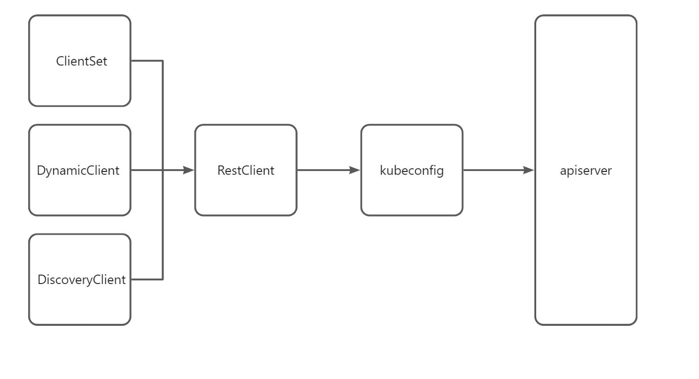

# Kubernetes(k8s)的客户端与kubebuilder标记

## k8s的客户端

k8s的客户端下载和相关文档如下：

```shell
# go客户端源： https://github.com/kubernetes/client-go
# k8s 客户端library：https://kubernetes.io/zh-cn/docs/reference/using-api/client-libraries/
```

k8s版本小于1.17.0，客户端对应tag为Kubernetes-1.x.y，例如：k8s版本为1.16.1 ，那么客户端tag为Kubernetes-1.16.1。k8s版的大于等于1.17.0 ，客户端对应tag为v0.x.y ，例如：k8s版本为 1.24.0 ，那么客户端版本为 v0.24.0。

安装依赖，版本与k8s版本对应，则客户端与k8s功能完全匹配，否则将会有一定的出入（客户端或k8s 功能的变化和调整尤其alpha版本的功能），但大多数api是可用的。

```shell
# 安装go 客户端依赖
go get k8s.io/client-go@v0.27.4
```

### k8s的客户端client-go 源码结构

- applyconfigurations：提供了用于构造服务器端应用请求的应用配置的类型安全go表示，即生成go表示的资源配置信息。
- discovery：用于发现Kubernetes API服务器支持的API组、版本和资源的方法。
- dynamic：包含一个动态客户端，可以对任意Kubernetes API对象执行通用操作。
- informers：为Kubernetes API提供生成的informers。Informer是一个带有本地缓存和索引机制的、可以注册事件处理函数的客户端。使用informer的目的是为了减轻apiserver数据交互的压力而抽象出来的一个缓存层。客户端对apiserver 数据的读取和监听操作都通过本地的infomer进行。
- kubernetes：包含访问kubernetes API的clientset，即每一个内置资源提供一个对应类型的客户端。
- listers：listers为Kubernetes API提供生成的lister。用于通过infomer获取资源对象list。
- metadata：用于描述k8s对象的元数据信息，可以通过元数据信息对k8s对象进行精确和有序的管理操作。
- plugin/pkg/client/auth：包含可选的身份验证插件，用于从外部源获取凭据。
- rest：用于与 Kubernetes API Server 进行通信。其中的 rest 包提供了对 RESTful API 的封装，可以简化与 Kubernetes API Server 的交互过程。
- restmapper：提供了资源映射功能，其作用是根据给定的API组、版本和资源类型，确定它们在Kubernetes集群中的对应关系。
- scale：提供 ScaleClient 客户端，用于扩容或缩容 Deployment, Replicaset, Replication Controller 等资源对象。
- tools：提供常用工具包，例如：tools/cache。
- transport：提供安全的 TCP 连接，支持 HTTP Stream。
- util：提供常用方法。例如 WorkQueue 工作队列，Certificate 证书管理等。

### k8s的客户端client-go 运行逻辑

客户端对象结构图：



RestClient是最基础的客户端，RestClient基于http request进行了封装，实现了restful的api，可以直接通过 是RESTClient提供的RESTful方法如Get()，Put()，Post()，Delete()进行交互。

ClientSet在RestClient的基础上封装了对Resouorce和Version的管理方法。一个Resource可以理解为一个客户端，而ClientSet是多个客户端的集合，其操作资源对象时需要指定Group、指定Version，然后根据Resource获取。

DynamicClient是一种动态客户端它可以对任何资源进行restful操作。包括crd自定义资源，不同于clientset，dynamic client 返回的对象是一个 map[string]interface{}。

DiscoveryClient是发现客户端，主要用于发现api server支持的资源组、资源版本、资源信息。k8s api server 支持很多资源组资源版本，资源信息，此时可以通过DiscoveryClient来查看。

## kubebuilder标记

Kubebuilder使用一个名为controller gen的工具来生成实用程序代码和Kubernetes YAML。这种代码和配置的生成是由Go代码中特殊的“标记注释”控制的。

 kubebuilder标记文档：` https://book.kubebuilder.io/reference/markers`

标记是以加号开头的单行注释，后跟标记名称，还可以选择后跟某些特定于标记的配置：

```go
// +kubebuilder:validation:Optional
// +kubebuilder:validation:MaxItems=2
// +kubebuilder:printcolumn:JSONPath=".status.replicas",name=Replicas,type=string
```

Controller-gen 支持`+kubebuilder:validation:Optional`和`+Optional`可以应用于字段，但是`+kubebuilder:validation:Optional`也可以应用于包级别，从而应用于包中的每个字段。

### kubebuilder标记语法

-  Empty(+kubebuilder:validation:Optional)：空标记就像命令行上的布尔标志——只需指定它们就可以实现某些行为。
- Anonymous(+kubebuilder:validation:MaxItems=2)：匿名标记使用单个值作为参数。
- Multi-option(+kubebuilder:printcolumn:JSONPath=".status.replicas",name=Replicas,type=string)：多选标记采用一个或多个命名参数。第一个参数与名称用冒号分隔，后一个参数用逗号分隔。

- 标记参数可以是字符串、int、布尔、切片或映射，字符串、int和bool遵循它们的Go语法。

```go
// +kubebuilder:validation:ExclusiveMaximum=false 表示该字段的最大值不包含边界值（即可等于最大值）
// +kubebuilder:validation:Format="date-time" 表示该字段需要符合日期时间格式
// +kubebuilder:validation:Maximum=42 表示该字段的最大值为42
 // +kubebuilder:validation:Type=string 表示该字段是一个字符串类型

// 枚举类型
// +kubebuilder:webhooks:Enum={"crackers, Gromit, we forgot the crackers!","not even wensleydale?"}
// +kubebuilder:validation:Enum=Wallace;Gromit;Chicken

//  map，map由“{}”括起来，由“:”分隔键和值，由逗号分隔多个键值
// +kubebuilder:default={magic: {numero: 42, stringified: forty-two}}
```

