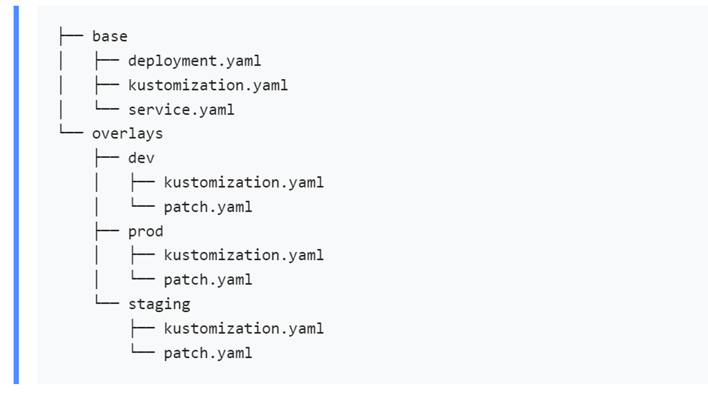

# Kubernetes(k8s)的 kustomize 声明式资源管理

kustomize 是一个可以遍历Kubernetes的yaml配置文件，并且提供添加、删除或更新配置选项。它既可以作为独立的二进制文件使用，也可以作为kubectl的原生功能使用。

```shell
# 官网：https://kustomize.io
# 指南：https://kubectl.docs.kubernetes.io/guides
# 参考文档：https://kubectl.docs.kubernetes.io/references/kustomize/
# generatoroptions：https://kubectl.docs.kubernetes.io/references/kustomize/kustomization/generatoroptions/

# 安装
wget https://github.com/kubernetes-sigs/kustomize/releases/download/kustomize%2Fv5.1.1/kustomize_v5.1.1_linux_amd64.tar.gz
tar -zxvf kustomize_v5.1.1_linux_amd64.tar.gz 
sudo mv kustomize /usr/bin/kustomize
```

基本命令如下：

- build：从目录或URL构建kustomization目标
- cfg ：用于读取和写入配置的命令
- completion：生成shell完成脚本
- create：在当前目录中创建一个新的kustomization
- edit：编辑kustomization文件
- fn：用于根据配置运行函数的命令
- help：查看命令的帮助
- localize：[Alpha]在目标位置创建目标kustomization根的本地化副本
- version：打印kustomize版本

目录结构常见布局为：



## kustomize内置转换器(transformers)

### Annotations（注解）

- commonAnnotations 字段，为所有资源添加注解

```yaml
commonAnnotations:
  oncallPager: 800-555-1212
```

- transformers 字段指定转换器，以下定义了一个annotations转换器，作用同commonAnnotations 字段。

1. 创建内置转换器 annotations转换器
2. 转换器名称 not-important-to-example
3. 为所有资源的metadata/annotations字段添加指定的annotations键值对

```yaml
apiVersion: builtin
kind: AnnotationsTransformer
metadata:
  name: not-important-to-example
annotations:
  app: myApp
  greeting/morning: a string with blanks
fieldSpecs:
- path: metadata/annotations
  create: true
```

### Labels（标签）

- commonLabels字段，为所有资源和selector添加指定标签

```yaml
commonLabels:
  someName: someValue
  owner: alice
  app: bingo
```

- transformers 字段指定转换器，以下定义了一个标签转换器

1. 创建内置转换器 labels转换器
2. 转换器名称 not-important-to-example
3. 为所有资源的metadata/labels字段添加指定的labels键值对

```yaml
apiVersion: builtin
kind: LabelTransformer
metadata:
  name: not-important-to-example
labels:
  app: myApp
  env: production
fieldSpecs:
- path: metadata/labels
  create: true
```

### Images（镜像）

images字段可以镜像在不创建patch的情况下修改镜像的名称（name）、标签（tags）和 摘要（digest）。

- 容器镜像定义

```yaml
containers:
- name: mypostgresdb
  image: postgres:8
- name: nginxapp
  image: nginx:1.7.9
- name: myapp
  image: my-demo-app:latest
- name: alpine-app
  image: alpine:3.7
```

- images字段根据镜像名修改容器镜像

```yaml
images:
- name: postgres
  newName: my-registry/my-postgres
  newTag: v1
- name: nginx
  newTag: 1.8.0
- name: my-demo-app
  newName: my-app
- name: alpine
  digest: sha256:24a0c4b4a4c0eb97a1aabb8e29f18e917d05abfe1b7a7c07857230879ce7d3d3
```

- transformers 字段指定转换器，以下定义了一个image转换器

1. 定义内置镜像转换器，名称为not-important-to-example
2. 将资源中nginx 镜像，替换为nginx:v2

```yaml
apiVersion: builtin
kind: ImageTagTransformer
metadata:
  name: not-important-to-example
imageTag:
  name: nginx
  newTag: v2
```

###  Namespace（命名空间）

- namespace字段，为所有资源添加命名空间

```yaml
namespace: my-namespace
```

- transformers 字段指定转换器，以下定义了一个namespace转换器。

1. unsetOnly：默认为false。当为true时表示仅更新没有设置命名空间的资源

2. setRoleBindingSubjects：控制NamespaceTransformer对RoleBinding和ClusterRoleBinding对象中subjects[].namespace 字段的处理。

    - defaultOnly :使用名称“default”更新主题的名称空间

    - 使用kind:ServiceAccount更新所有主题的命名空间

    - none：没有更新主题

此示例将更新所有Namespace对象的“metadata/name”字段和所有其他对象的“元数据/Namespace”字段（不需要字段规范），前提是它们还没有值。

```yaml
apiVersion: builtin
kind: NamespaceTransformer
metadata:
  name: not-important-to-example
  namespace: yangshuangxin
setRoleBindingSubjects: none
unsetOnly: true
fieldSpecs:
- path: metadata/name
  kind: Namespace
  create: true
```

###  PrefixSuffix（前缀、后缀）

- namePrefix、nameSuffix 字段指定所有资源名称的前缀和后缀

```yaml
namePrefix: alices-
nameSuffix: -v2
```

- transformers 字段指定转换器，以下定义了一个PrefixSuffix转换器

```yaml
apiVersion: builtin
kind: PrefixSuffixTransformer
metadata:
  name: not-important-to-example
 prefix: baked-
 suffix: -pie
 fieldSpecs:
   - path: metadata/name
```

###  ReplicaCount（副本数）

修改 Deployment、ReplicationController、ReplicaSet、StatefulSet等资源类型的副本数。replicas字段，修改资源副本数。

- 给定deployment

```yaml
kind: Deployment
metadata:
  name: deployment-name
spec:
  replicas: 3
```

- 根据资源名称修改副本数，不接受kind和group字段

```yaml
replicas:
- name: deployment-name
  count: 5
```

-  transformers 字段指定转换器，以下定义了一个ReplicaCount转换器

```yaml
apiVersion: builtin
kind: ReplicaCountTransformer
metadata:
  name: not-important-to-example
replica:
  name: myapp
  count: 23
fieldSpecs:
- path: spec/replicas
  create: true
  kind: Deployment
- path: spec/replicas
  create: true
  kind: ReplicationController
```

###  Patch（补丁）

通过patches指定补丁内容。此列表中的每个条目都应解析为一个Patch对象，该对象包括一个补丁和一个目标选择器。

该修补程序可以是战略性合并修补程序，也可以是JSON修补程序， 它可以是补丁文件，也可以是内联字符串。

目标按group、version、kind、name、namespace、labelSelector和annotationSelector选择资源，将选择与所有指定字段匹配的资源来应用修补程序。

```yaml
patches:
- path: patch.yaml
  target:
    group: apps
    version: v1
    kind: Deployment
    name: deploy.*
    labelSelector: "env=dev"
    annotationSelector: "zone=west"
- patch: |-
    - op: replace
      path: /some/existing/path
      value: new value
    target:
      kind: MyKind
      labelSelector: "env=dev"
```

- transformers 字段指定转换器，以下为patch转换器

```yaml
apiVersion: builtin
kind: PatchTransformer
metadata:
  name: not-important-to-example
patch: '[{"op": "replace", "path": "/spec/template/spec/containers/0/image","value": "nginx:latest"}]'
target:
  name: .*Deploy
  kind: Deployment
```

## kustomize生成器

### ConfigMap（配置）

configMapGenerator字段，指定配置生成内容。此列表中的每个条目都会创建一个ConfigMap资源。每个configMapGenerator项都接受一个参数 behavior：[create|replace|merge]。这允许覆盖从父级修改或替换现有的configMap。

此外，每个条目都有一个options字段，该字段与kustomization文件的generatorOptions字段具有相同的子字段。

options字段允许向生成的实例添加标签和/或注释，或者单独禁用该实例的名称后缀哈希。此处添加的标签和注释不会被与kustomization file generatorOptions字段关联的全局选项覆盖。但是，由于布尔值的行为方式，如果全局generatorOptions字段指定disableNameSuffixHash:true，这将拒绝任何本地覆盖它的尝试。

- 下面的示例创建了三个ConfigMaps。一个具有给定文件的名称和内容，一个具有作为数据的键/值，第三个通过单个ConfigMap的选项设置注释和标签

```yaml
generatorOptions:
  labels:
    fruit: apple
    
configMapGenerator:
- name: my-java-server-props
  behavior: merge
  files:
  - application.properties
  - more.properties
  
- name: my-java-server-env-vars
  literals: 
  - JAVA_HOME=/opt/java/jdk
  - JAVA_TOOL_OPTIONS=-agentlib:hprof
  options:
    disableNameSuffixHash: true
    labels:
      pet: dog
- name: dashboards
  files:
  - mydashboard.json
  options:
    annotations:
      dashboard: "1"
    labels:
      app.kubernetes.io/name: "app1"
```

- 配置文件案例

```yaml
configMapGenerator:
- name: app-whatever
  files:
  - myFileName.ini=whatever.ini
```

- generators 字段指定生成器，以下为configMap生成器

```yaml
apiVersion: builtin
kind: ConfigMapGenerator
metadata:
  name: mymap
envs:
- devops.env
- uxteam.env
literals:
- FRUIT=apple
- VEGETABLE=carrot
```

### Secret（密钥）

 使用secretGenerator字段指定生成secret资源内容。参数列表中的每个条目都会创建一个secret资源。与configMap 类似。

- secretGenerator案例

```yaml
secretGenerator:
- name: app-tls
  files:
  - secret/tls.cert
  - secret/tls.key
  type: "kubernetes.io/tls"
- name: app-tls-namespaced
  # 可以定义一个命名空间给创建的密钥，默认是"default"
  namespace: apps
  files:
  - tls.crt=catsecret/tls.cert
  - tls.key=secret/tls.key
  type: "kubernetes.io/tls"
- name: env_file_secret
  envs:
  - env.txt
  type: Opaque
- name: secret-with-annotation
  files:
  - app-config.yaml
  type: Opaque
  options:
    annotations:
      app_config: "true"
    labels:
      app.kubernetes.io/name: "app2"
```

- generators 字段指定生成器，以下为secret生成器

```yaml
apiVersion: builtin
kind: SecretGenerator
metadata:
  name: my-secret
  namespace: whatever
behavior: merge
envs:
- a.env
- b.env
files:
- obscure=longsecret.txt
literals:
- FRUIT=apple
- VEGETABLE=carrot
```

### HelmChartInflation（Helm）

```shell
# 参考文档：https://kubectl.docs.kubernetes.io/references/kustomize/builtins/#_helmchartinflationgenerator_
```

