# Kubernetes(k8s)的API 扩展（CRD）

考虑使用k8s API扩展（定制资源）的前提为：

-  API是声明式API
- 希望使用kubectl来读写新的资源
- 希望如其他内置资源一样可以在Kubernetes中查看新的资源
- API是新开发的API
- 可以接受Kubernetes对REST资源路径所做的格式限制
-  新的资源可以自然地界定为集群资源还是命名空间资源
- 希望复用Kubernetes API支持特性

其中声明式API满足：

- API包含相对而言为数不多的、尺寸较小的对象（资源）
- 对象定义了应用或者基础设施的配置信息
- 对象的更新操作频率较低
- 通常需要人来读取或写入对象
- 对象的主要操作时CRUD
- 不需要跨对象的事务支持：API对象代表的是期望状态而非确切实际状态

 k8s API扩展的两种方式为**自定义资源（CRD）**和**API 聚合**。通常情况下，CRD更合适的情况为：

1. 定制资源的字段不多。
2. 内部使用该资源或者小规模开源项目中使用该资源，而不是商用产品中使用。

CRD与聚合API公共特性为：

| 功能特性           | 具体含义                                                     |
| ------------------ | ------------------------------------------------------------ |
| CRUD               | 新的端点支持通过 HTTP 和 kubectl 发起的 CRUD 基本操作        |
| 监测（Watch）      | 新的端点支持通过 HTTP 发起的 Kubernetes Watch 操作           |
| 发现 （Discovery） | 类似 kubectl 和仪表盘（Dashboard）这类客户端能够自动提供列举、显 示、在字段级编辑你的资源的操作 |
| json-patch         | 新的端点支持带 Content-Type: application/json-patch+json 的 PATCH 操作 |
| merge-patch        | 新的端点支持带 Content-Type: application/merge-patch+json 的 PATCH 操作 |
| HTTPS              | 新的端点使用 HTTPS                                           |
| 内置身份认证       | 对扩展的访问会使用核心 API 服务器（聚合层）来执行身份认证操作 |
| 内置鉴权授权       | 对扩展的访问可以复用核心 API 服务器所使用的鉴权授权机制；例如RBAC |
| Finalizers         | 在外部清除工作结束之前阻止扩展资源被删除                     |
| 准入 Webhooks      | 在创建、更新和删除操作中对扩展资源设置默认值和执行合法性检查 |
| UI/CLI 展示        | kubectl 和仪表盘（Dashboard）可以显示扩展资源                |
| 区分未设置值和空值 | 客户端能够区分哪些字段是未设置的，哪些字段的值是被显式设置为零值的 |
| 生成客户端库       | Kubernetes 提供通用的客户端库，以及用来生成特定类别客户端库的工具 |
| 标签和注解         | 提供涵盖所有对象的公共元数据结构，且工具知晓如何编辑核心资源和定制资源的这些元数据 |

**自定义资源（CRD）**和**API 聚合** 易用性比较：

| CRD                                                          | 聚合 API                                                     |
| ------------------------------------------------------------ | ------------------------------------------------------------ |
| 资源的定义与声明无需编程。但 CRD 控制器需要编程实现。        | 需要编程，并构建可执行文件和镜像。                           |
| 无需额外运行服务；CRD 由 API 服务器处理。                    | 需要额外创建服务，且该服务可能失效。                         |
| 一旦 CRD 被创建，不需要持续提供支持。Kubernetes 主控节点升级过程中自动会带入缺陷修复。 | 可能需要周期性地从上游提取缺陷修复并更新聚合 API 服务器。    |
| 无需处理 API 的多个版本；例如，当你控制资源的客户端时，你可以更新它使之与 API 同步。 | 你需要处理 API 的多个版本；例如，在开发时打算与很多人共享的扩展时。 |

## 声明自定义资源类型CRD

通过crd创建自定义资源，resourcedefinition.yaml：

```yaml
apiVersion: apiextensions.k8s.io/v1
kind: CustomResourceDefinition
metadata:
   # 名字必需与下面的 spec 字段匹配，并且格式为 '<名称的复数形式>.<组名>'
  name: crontabs.stable.example.com
spec:
  # 组名称，用于 REST API: /apis/<组>/<版本>
  group: stable.example.com
  # 列举此 CustomResourceDefinition 所支持的版本
  versions:
  - name: v1
    # served是一个标志，用于启用/禁用通过REST API提供的此版本
    served: true
    # storage表示在将自定义资源持久化到存储区时应使用此版本。必须只有一个版本的storage=true
    storage: true
     # schema描述用于验证、精简和默认此版本的自定义资源的模式
     schema:
     # openAPIV3Schema是用于验证和修剪的OpenAPI v3模式
     openAPIV3Schema:
       type: object
       properties:
         spec:
           type: object
           properties:
             cronSpec:
               type: string
             image:
               type: string
             replicas:
               type: integer
  # 可以是 Namespaced 或 Cluster
  scope: Namespaced
  names:
    # 名称的复数形式，用于 URL：/apis/<组>/<版本>/<名称的复数形式>
    plural: crontabs
    # 名称的单数形式，作为命令行使用时和显示时的别名
    singular: crontab
    # kind 通常是单数形式的驼峰命名（CamelCased）形式。你的资源清单会使用这一形式。
    kind: CronTab
    # shortNames 允许你在命令行使用较短的字符串来匹配资源
    shortNames:
    - ct
```

应用场景自定义资源：

```shell
kubectl apply -f resourcedefinition.yaml
```

创建新资源对象的yaml:

```yaml
apiVersion: "stable.example.com/v1"
kind: CronTab
metadata:
  name: my-new-cron-object
spec:
  cronSpec: "* * * * */5"
  image: my-awesome-cron-image
```

## CRD控制器kubebuilder框架

```shell
# kubebuilder 官方文档：https://book.kubebuilder.io/
# kubebuilder quick start：https://book.kubebuilder.io/quick-start
# kubebuilder 标记文档：https://book.kubebuilder.io/reference/markers

# 启动docker registry
docker run -d -p 5000:5000 --name registry --restart=always registry:2.8.1
# /ect/docker/daemon.json 添加不安全的注册中心
"insecure-registries": ["192.168.239.142:5000"]
# reload 配置
sudo systemctl daemon-reload
# 重启服务
sudo systemctl restart docker

# 下载并安装kubebuilder
 curl -L -o kubebuilder "https://go.kubebuilder.io/dl/latest/$(go env GOOS)/$(go env GOARCH)"
 sudo chmod +x kubebuilder && sudo mv kubebuilder /usr/local/bin/
```

### 创建crontab-crd项目

- 创建项目

```shell
mkdir -p ~/work/crontab-crd
cd ~/work/crontab-crd
kubebuilder init --domain my.domain --repo my.domain/crontab-crd
go mod tidy
```

- 创建API与控制器

```shell
kubebuilder create api --group crd --version v1 --kind Crontab
```

- 自定义API

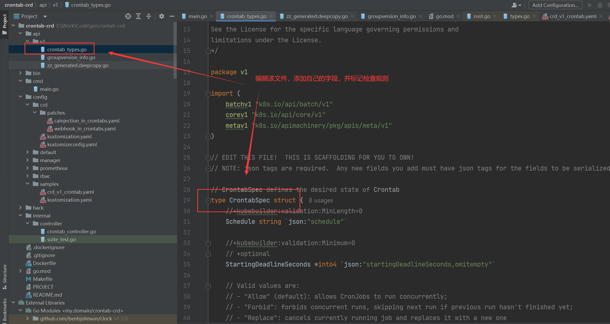

- 根据定义的API生成CRD资源定义

```shell
make manifests
```

### 框架生成的Controller

控制器是Kubernetes和operator的核心，控制器主要的工作是确保任何给定的对象的实际状态与设置的预期状态保持一致，这一过程称之为 reconciling。

核心的controller-runtime 依赖库：

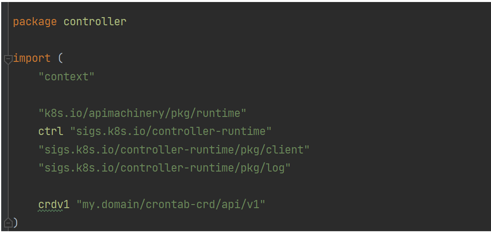

Reconciler 结构：

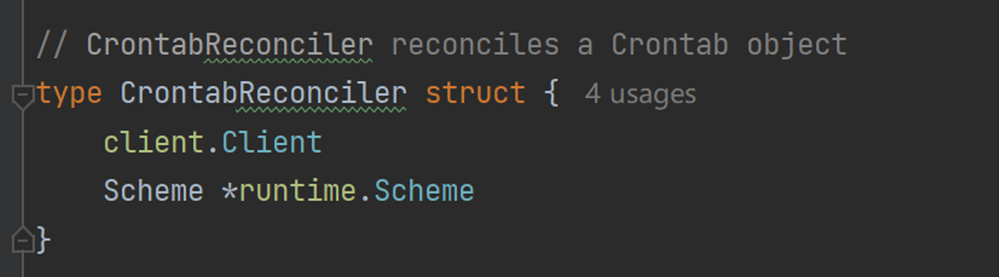

运行控制器所需的最低权限：

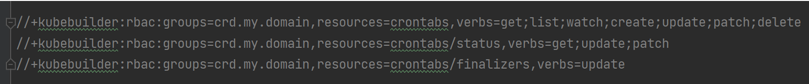

Reconcile 对单个命名对象执行协调，请求参数只有一个名称，可以从客户端缓存中获取该对象：

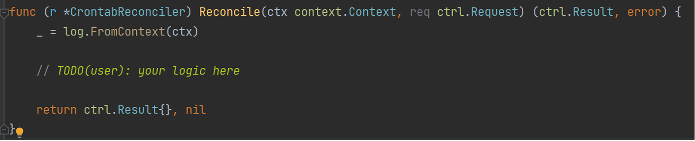将调节器添加到管理器中，以便在管理器启动的时候启动它：

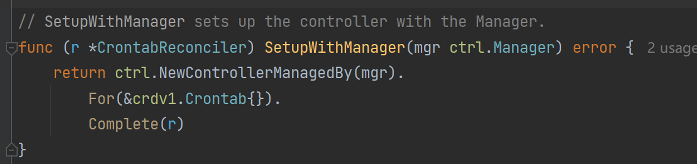

### 自定义资源Controller的实现

- 按需求修改controller

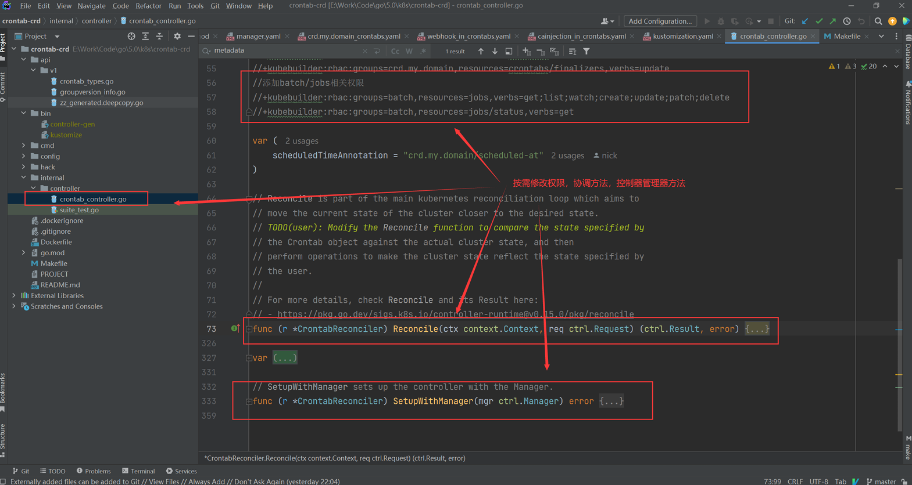

- 修改install命令与deploy命令，采用create的方式创建资源，避免annotation超长而失败

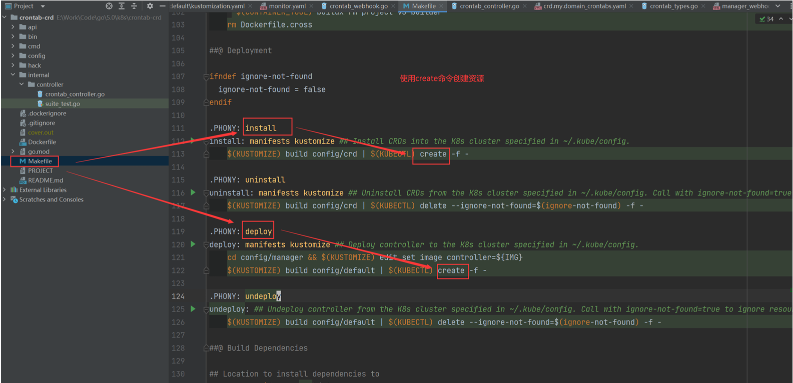

### 创建并实现webhook

项目中创建webhook：

```shell
kubebuilder create webhook --group crd --version v1 --kind Crontab --defaulting --programmatic-validation
```

- --group : 指定API组
-  --version: 指定API版本
-  --kind: 指定资源类型
- --defaulting: 自动生成默认值函数，用于填充缺失的字段
- --programmatic-validation: 自动生成校验函数，用于验证字段的有效性

实现webhook：

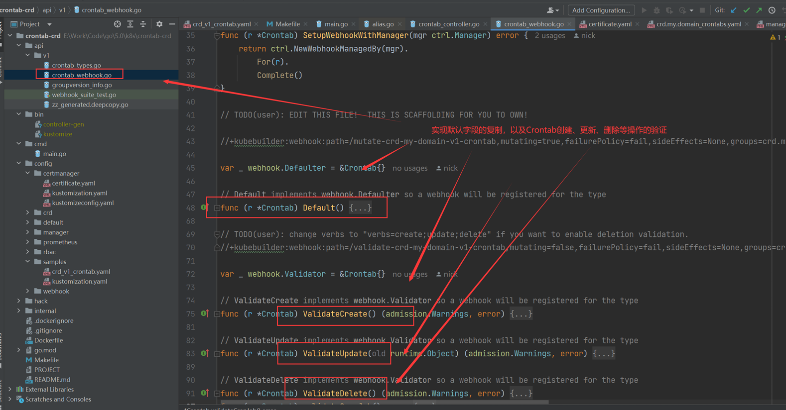

生成webhook相关文件：

```shell
make manifests
```

入口文件中添加环境变量判断，用于判断是否启用webhook：

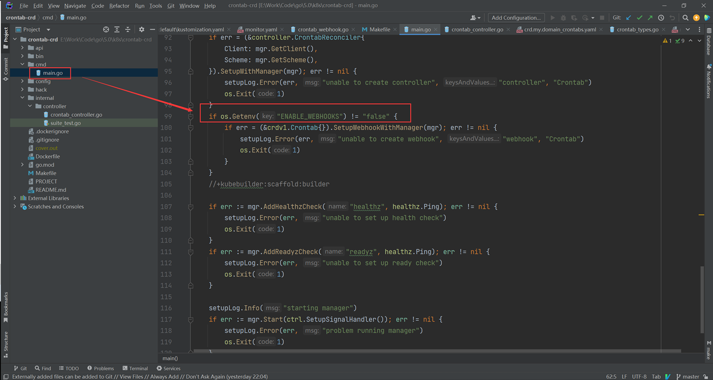

### 本地运行控制器（可用于本地调试）

根据api的定义生成相关的自定义资源定义文件：

```shell
make manifests
```

根据生成的manifest，安装自定义资源：

```shell
make install
```

启动本地服务（禁用webhook）：

```shell
# 禁用 webhook,并启动本地服务
# 之所以在本地禁用webhook ,是应为webhook的启动需要生成相应的证书
# 证书默认目录：/tmp/k8s-webhook-server/serving-certs/tls.crt
 # 所以通常情况下，禁用webhook 进行调试
 export ENABLE_WEBHOOKS=false
 make run
```

webhook的作用有：

1. 验证和过滤：通过 Webhook 可以对传入的请求进行验证，确保其符合特定的规则或安全策略。
2. 数据转换和校验：Webhook 可以将传入请求中的数据进行转换、修正或补充，以满足特定业务需求或约束条件。
3.  强制执行：通过 Webhook 可以强制执行特定操作，例如禁止某些操作、添加默认值等。

### 定义自定义资源对象（可用于本地调试）

修改config/samples/batch_v1_cronjob.yaml，定义自定义资源对象：

```yaml
apiVersion: crd.my.domain/v1
kind: Crontab
metadata:
  labels:
    app.kubernetes.io/name: crontab
    app.kubernetes.io/instance: crontab-sample
    app.kubernetes.io/part-of: crontab-crd
    app.kubernetes.io/managed-by: kustomize
    app.kubernetes.io/created-by: crontab-crd
  name: crontab-sample
spec:
  # TODO(user): Add fields here
  schedule: "*/10 * * * * *"
  startingDeadlineSeconds: 5
  concurrencyPolicy: Allow # explicitly specify, but Allow is also default.
  jobTemplate:
    spec:
      template:
        spec:
          containers:
          - name: hello
            image: busybox
            args:
            - /bin/sh
            - -c
            - date; echo yangshuangxin from the Kubernetes cluster
          restartPolicy: OnFailure  
```

创建自定义资源对象：

```shell
# 创建资源
kubectl create -f config/samples/batch_v1_cronjob.yaml
# 查看资源
kubectl get -f config/samples/batch_v1_cronjob.yaml
# 查看详细信息
kubectl describe -f config/samples/batch_v1_cronjob.yaml
# 查看自定义的crontab任务
kubectl get job
```

部署证书管理器：

```shell
kubectl apply -f https://github.com/cert-manager/cert-manager/releases/download/v1.12.0/cert-manager.yaml
```

### 构建镜像并推送到注册中心

- 修改dockerfile，设置golang代理

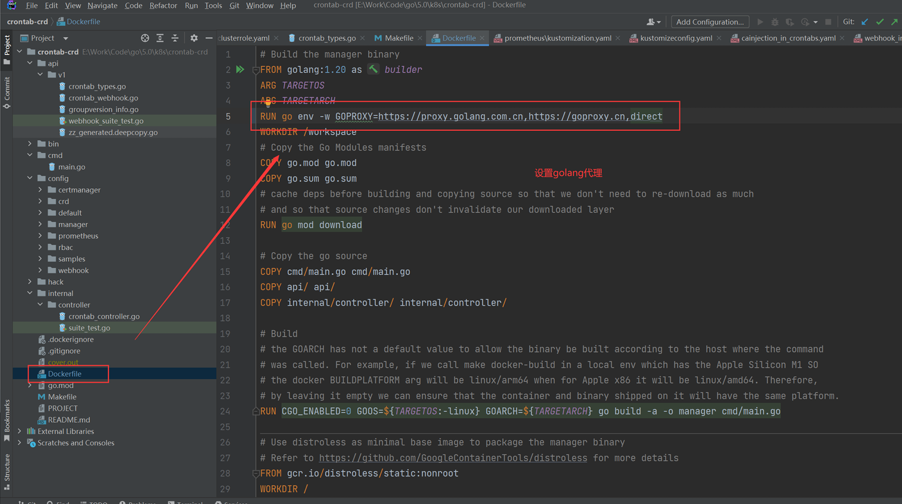

构建docker镜像，并推送的注册中心：

```shell
make docker-build docker-push IMG=192.168.239.142:5000/crontab-crd:1.0.0
```

### 启用webhook


- 更改default/kustomization.yaml文件

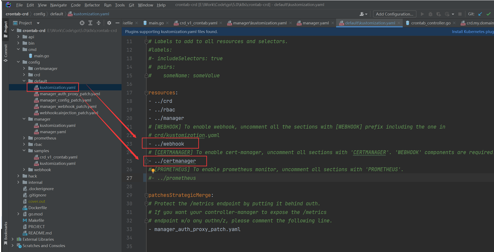

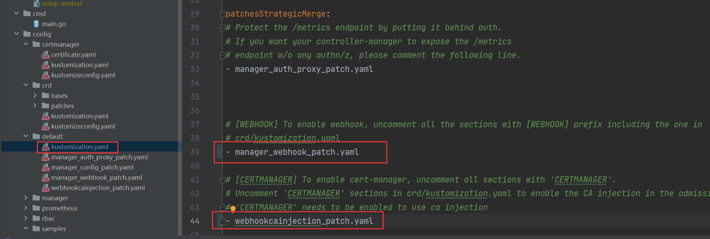

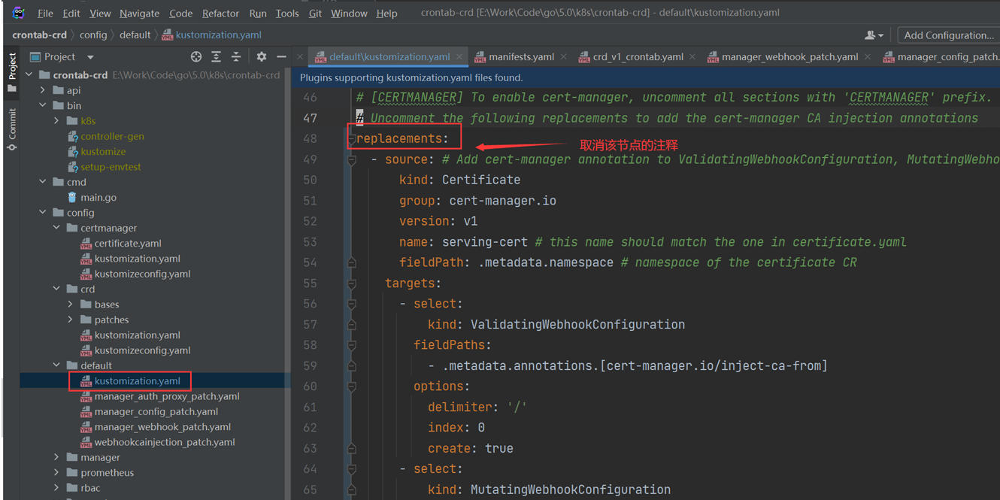

更改config/crd/kustomization.yaml文件：

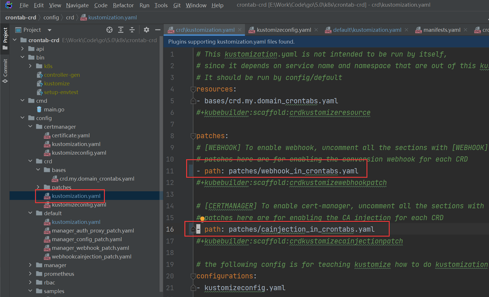

部署控制器到k8s集群：

```shell
make deploy IMG=192.168.239.142:5000/crontab-crd:1.0.0
```

