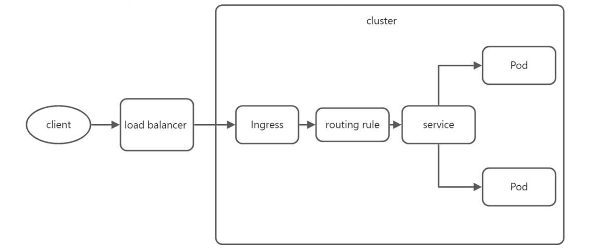
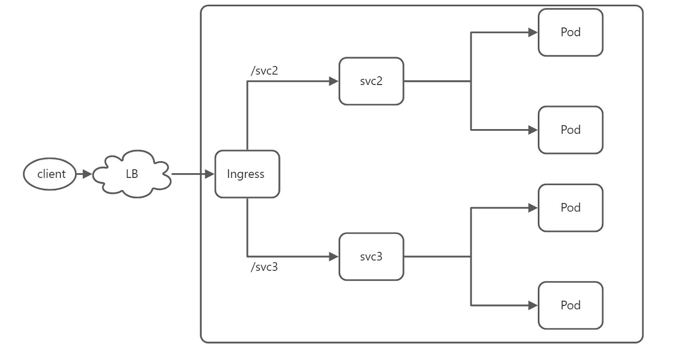
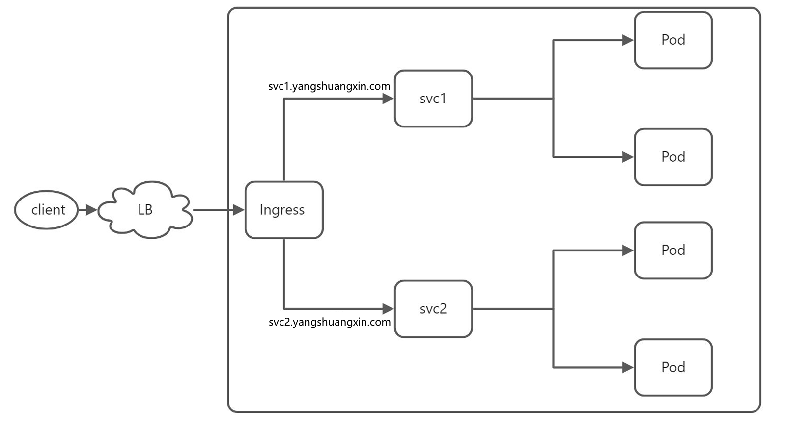

# Kubernetes(k8s)的Ingress的使用

Ingress是从集群外部到集群内服务的 HTTP 和 HTTPS 路由。流量路由由 Ingress 资源上定义的规则控制。简而言之，Ingress为一组路由规则。下图为简单的ingress 示意图：



Ingress为路由规则，那么在集群中使用Ingress 则必须在集群中安装Ingress controller。Ingress controller 负责通过负载均衡来实现Ingress 规则。

 Kubernetes 作为一个项目，目前支持和维护 AWS、 GCE 和 Nginx Ingress 控制器。Ingress的相关概念如下：

-  ingress：k8s中的一种资源对象，用于定义软件层面的路由规则。
-  ingress controller：一组pod负责解析ingress路由规则，根据规则将请求转发到对应的service。
- ingressClass：每一个ingress都需要指定一个class，用于表示采取哪个ingress controller解析规则。

```shell
# nginx ingress controller 文档
部署文档：https://kubernetes.github.io/ingress-nginx/deploy/
源码：https://github.com/kubernetes/ingress-nginx/tree/controller-v1.5.1
下载部署配置文件: https://github.com/kubernetes/ingress-nginx/blob/controller-v1.5.1/deploy/static/provider/cloud/deploy.yaml
```

下载部署配置文件后需要修改配置文件镜像地址：

```shell
# 修改 ingress-nginx-controller镜像地址
image: registry.k8s.io/ingress-nginx/controller:v1.5.1@sha256:4ba73c697770664c1e00e9f968de14e08f606ff961c76e5d7033a4a9c593c629
#  修改为阿里云的镜像地址
image: registry.aliyuncs.com/google_containers/nginx-ingress-controller:v1.5.1

image: registry.k8s.io/ingress-nginx/kube-webhook-certgen:v20220916-gd32f8c343@sha256:39c5b2e3310dc4264d638ad28d9d1d96c4cbb2b2dcfb52368fe4e3c63f61e10f
# 修改为阿里云的镜像地址
image: registry.aliyuncs.com/google_containers/kube-webhook-certgen:v20220916-gd32f8c343
```

进行安装和配置：

```shell
 # 安装
 kubectl apply -f deploy.yaml
 
# 设置默认ingress controller
# 编辑nginx ingress controller 的 ingressclass
kubectl edit -n ingress-nginx ingressclasses.networking.k8s.io nginx

# 在annotations字段下，添加注解 ingressclass.kubernetes.io/is-default-class: "true"
annotations:
	ingressclass.kubernetes.io/is-default-class: "true"
	
# 查看ingress-nginx下的资源
 kubectl get  -f deploy.yaml
```

## Ingress的使用

准备三组service，myservice1的Deployment定义如下：

```yaml
apiVersion: apps/v1
kind: Deployment
metadata:
  name: mysvc1-deployment
  labels:
    name: mysvc1-app
spec:
  replicas: 2
  selector:
    matchLabels:
      name: mysvc1-app
  template:
    metadata:
      labels:
        name: mysvc1-app
    spec:
      containers:                        
      - name: myhello
        image: yangshuangxin/hello:1.0.2
        imagePullPolicy: IfNotPresent
        ports:
        - containerPort: 80
        env: # 注入到容器的环境变量
        - name: env1
          value: "myservice1"
```

myservice1的Service定义如下：

```yaml
apiVersion: v1
kind: Service
metadata:
  name: mysvc1
  labels:
    name: mysvc1-app
 spec:
    ports:
    - port: 8081
      protocol: TCP
      targetPort: 80
      name: http
    selector:
      name: mysvc1-app
```

创建和应用myservice1

```shell
kubectl create -f mysvc1-deployment.yaml
kubectl create -f mysvc1.yaml
 kubectl get -f mysvc1.yaml
 # 访问service
 curl http://<serviceIP>:8081/print/env
```

修改Deployment、Service中的name 改为xxx2、xxx3，修改Service的port为不同的端口，分别进行创建和应用service。

使用Ingress暴露单个service的定义yaml：

```yaml
apiVersion: networking.k8s.io/v1
kind: Ingress
metadata:
  name: default-backend-ingress
 spec:
   defaultBackend:
     service:
       name: mysvc1
       port:
         number: 8081
```

进行Ingress的应用：

```shell
kubectl create -f defaultBackend-ingress.yaml
kubectl get -f defaultBackend-ingress.yaml

# 访问
curl http://<ADDRESS>/print/env
```

###  Ingress 的扇出

一个扇出（fanout）配置根据请求的 HTTP URI 将来自同一 IP 地址的流量路由到多个 Service。

 Ingress允许将负载均衡器的数量降至最低。如下图所示：



Ingress 使用定义yaml如下：

```yaml
apiVersion: networking.k8s.io/v1
kind: Ingress
metadata:
  annotations:
    nginx.ingress.kubernetes.io/rewrite-target: "/$1"
  name: fanout-ingress
spec:
  rules:
  - host: www.yangshuangxin.com
    http:
      paths:
      - path: /svc2/(.*)$
        pathType: Prefix
        backend:
          service:
            name: mysvc2
            port:
              number: 8082
      - path: /svc3/(.*)$
        pathType: Prefix
        backend:
          service:
            name: mysvc3
            port:
              number: 8083
```

Ingress进行应用： 

```shell
 kubectl create -f fanout-ingress.yaml
 kubectl get -f fanout-ingress.yaml
 kubectl describe  -f fanout-ingress.yaml
```

进行测试验证：

```shell
# 修改/etc/hosts,增加 <ADDRESS> www.yangshuangxin.com 映射
# ADDRESS 为分配的负载均衡IP地址或ingress controller service集群IP
192.168.1.240 www.yangshuangxin.com

# 访问
curl http://www.yangshuangxin.com/print/env
```

### Ingress基于名称虚拟托管

基于名称的虚拟主机支持将针对多个主机名的 HTTP 流量路由到同一 IP 地址上。如下图：



定义Ingress的yaml如下：

```yaml
apiVersion: networking.k8s.io/v1
kind: Ingress
metadata:
  name: hostname-ingress
spec:
  rules:
  - host: svc1.yangshuangxin.com
    http:
      paths:
      - path: /
        pathType: Prefix
        backend:
          service:
            name: mysvc1
            port:
              number: 8081
  - host: svc2.nick.com
    http:
      paths:
      - path: /
        pathType: Prefix
        backend:
          service:
            name: mysvc2
            port:
              number: 8082
```

应用基于名称虚拟托管的Ingress：

```shell
kubectl create -f hostname-ingress.yaml
kubectl get -f hostname-ingress.yaml
kubectl describe  -f hostname-ingress.yaml
```

增加地址映射：

```shell
# 修改/etc/hosts,增加 <ADDRESS> svc1.yangshuangxin.com 映射,增加 <ADDRESS> svc2.yangshuangxin.com 映射
# ADDRESS 为分配的负载均衡IP地址 或ingress controller service集群IP
192.168.1.240 svc1.yangshuangxin.com
192.168.1.240 svc2.yangshuangxin.com
# 访问
curl http://svc1.yangshuangxin.com/print/env
curl http://svc2.yangshuangxin.com/print/env
```

### Ingress TLS的使用

使用TLS需要注意的点为：

- 自签证书中的CN字段必须为全限定域名，例如：https-www.yangshuangxin.com。
-  自签证书中的CN字段必须与ingress定义中rules.host匹配。
- ingress定义中tls.hosts 字段的值必须与rules.host完全匹配。
-  TLS Secret 的数据中必须包含用于 TLS 的以键名 tls.crt 保存的证书和以键名 tls.key 保存的私钥，即 tls.crt为键值保存证书，tls.key为键值保存私钥。

首先自签证书和新建Secret：

```shell
# 创建公钥和相对应的私钥
openssl req -x509 -nodes -days 365 -newkey rsa:2048 -keyout /tmp/fanouttls.key -out /tmp/fanouttls.crt -subj "/CN=https-www.yangshuangxin.com/O=https-www.yangshuangxin.com"

# 创建secret
kubectl create secret tls fanout-ingress-tls --cert=/tmp/fanouttls.crt --key=/tmp/fanouttls.key 
# 查看secret
kubectl get secrets fanout-ingress-tls -o yaml
```

定义TLS的ingress的yaml：

```yaml
apiVersion: networking.k8s.io/v1
kind: Ingress
metadata:
  annotations:
    nginx.ingress.kubernetes.io/rewrite-target: "/$1"
  name: fanout-tls-ingress
spec:
  tls:
  - hosts:
      - https-www.yangshuangxin.com
    secretName: fanout-ingress-tls
  rules:
  - host: https-www.yangshuangxin.com
    http:
      paths:
      - path: /svc2/(.*)$
      pathType: Prefix
      backend:
        service:
          name: mysvc2
          port:
            number: 8082
      
      - path: /svc3/(.*)$
        pathType: Prefix
        backend:
          service:
            name: mysvc3
            port:
              number: 8083
```

ingress的应用：

```shell
kubectl create -f  fanout-tls-ingress.yaml
kubectl get -f  fanout-tls-ingress.yaml
kubectl describe -f  fanout-tls-ingress.yaml
```

进行地址映射：

```shell
# 修改/etc/hosts,增加 <ADDRESS> https-www.yangshuangxin.com 映射
# ADDRESS 为分配的负载均衡IP地址 或ingress controller service集群IP
192.168.1.240 https-www.yangshuangxin.com
# 访问
curl  https://https-www.yangshuangxin.com/svc2/print/env --cacert /tmp/fanouttls.crt
curl  https://https-www.yangshuangxin.com/svc3/print/env --cacert /tmp/fanouttls.crt
```

