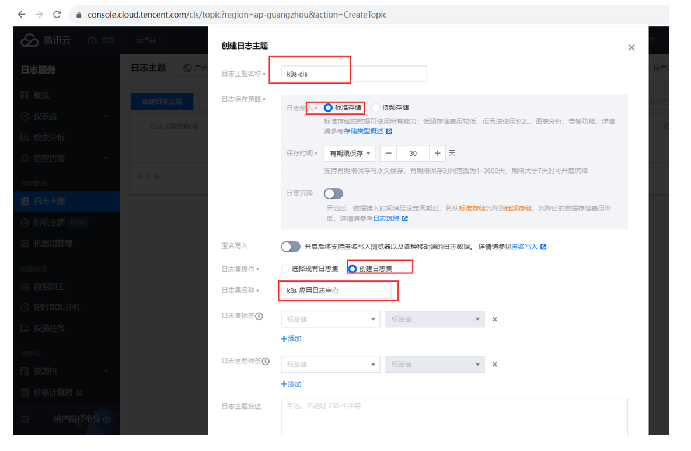
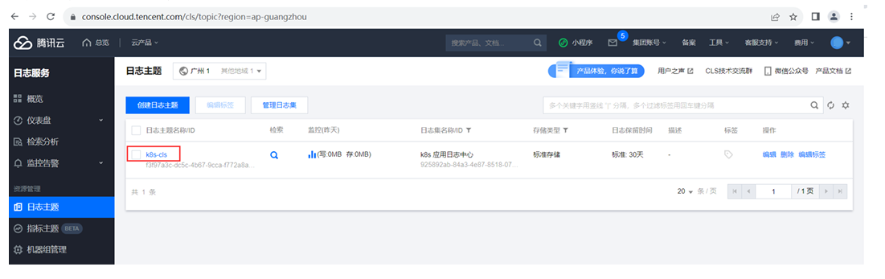
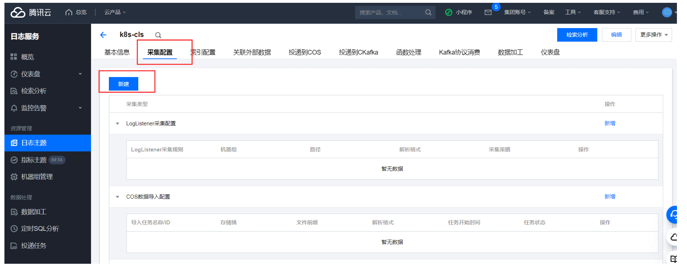
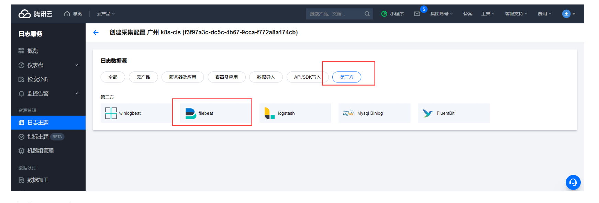
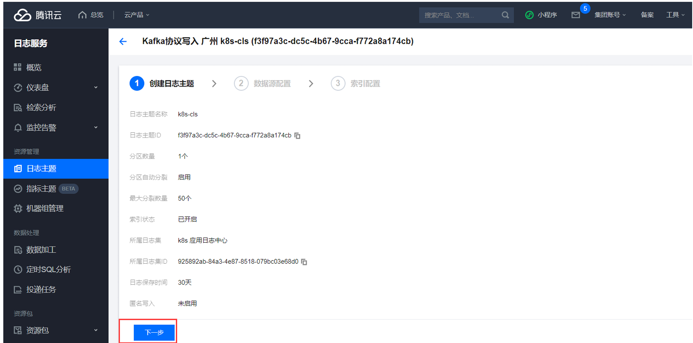
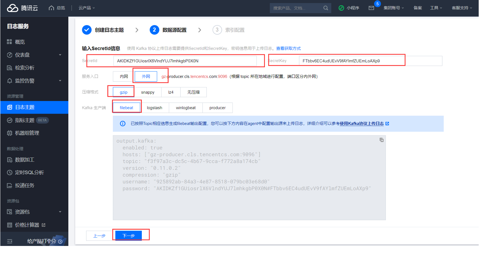
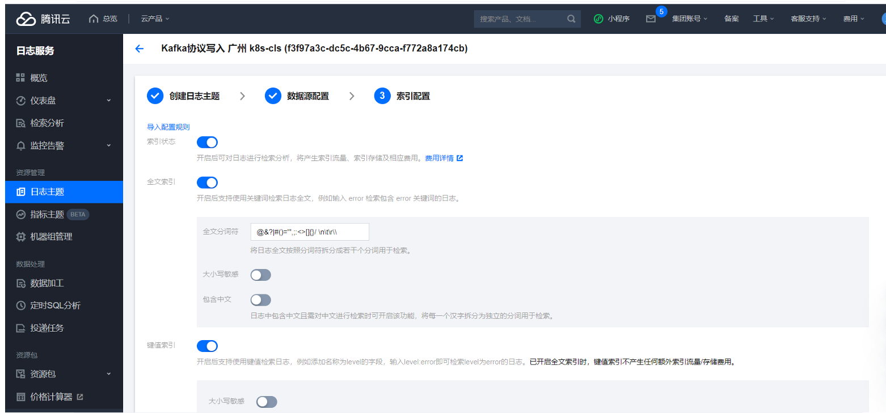

# Kubernetes(k8s)的集群日志Filebeat采集上云

Filebeat 通过采集K8s的文件日志，通过kafka协议上传到云上的CSL上。CLS通过kafka上传日志：` https://cloud.tencent.com/document/product/614/64157`

## cls采集创建和配置

- cls 创建



- 找到对应的日志主题



- 选择采集配置，点击新建



- 选择第三方，filebeat



- 点击下一步，创建日志主题



- 填写相关信息，点击下一步



- 索引配置，并提交



## filebeats配置

```shell
# 官方文档：https://www.elastic.co/cn/downloads/beats/filebeat
# 基于docker容器运行：https://www.elastic.co/guide/en/beats/filebeat/current/running-on-docker.html
# 基于Kubernetes运行：https://www.elastic.co/docs/reference/beats/filebeat/running-on-kubernetes
# filebeat配置文件：https://www.elastic.co/docs/reference/beats/filebeat/configuring-howto-filebeat

# 拉取镜像
docker pull docker.elastic.co/beats/filebeat:8.9.0
```

## sidecar模式部署

使用sidecar模式部署业务服务和日志采集，每一个pod里都存在一个filebeat进行日志采集上云。

```yaml
apiVersion: v1
kind: Namespace
metadata:
  name: management
---
apiVersion: v1
data:
  .dockerconfigjson: eyJhdXRocyI6eyIxOTIuMTY4LjIzOS4xNDI6NTAwMCI6eyJ1c2VybmFtZSI6Im5pY2siLCJwYXNzd29yZCI6IjEyMzQ1NiIsImF1dGgiOiJibWxqYXpveE1qTTBOVFk9In19fQ==
kind: Secret
metadata:
  name: dockerregistry
  namespace: management
type: kubernetes.io/dockerconfigjson
---
apiVersion: v1
kind: ConfigMap
metadata:
  name: management-config
  namespace: management
data:
  config.yaml: |
    cls:
      topicId: 55d523ba-1795-4457-a053-ac88100a2076
      endpoint: ap-guangzhou.cls.tencentcs.com
      secretId: "AKIDKZf1GUiosrlX6VlndYUJ7lmhkgbP0X0N"
      secretKey: "FTbbv6EC4udUEvV9fAYlmfZUEmLoAXp9"
    log:
      path: "runtime/logs"
---
apiVersion: v1
kind: ConfigMap
metadata:
  name: filebeat-config
  namespace: management
data:
  filebeat.yml: |
    filebeat.inputs:
      - type: filestream
        id: myapp-management-id
        paths:
          - "/app/runtime/logs/*.log"
    output.kafka:
      enabled: true
      hosts: ["gz-producer.cls.tencentcs.com:9096"]
      topic: "55d523ba-1795-4457-a053-ac88100a2076"
      version: "0.11.0.2"
      compression: "gzip"
      username: "742b39e9-7454-423b-8079-5afb2f4f3413"
      password: "AKIDKZf1GUiosrlX6VlndYUJ7lmhkgbP0X0N#FTbbv6EC4udUEvV9fAYlmfZUEmLoAXp9"
      codec.format:
        string: "%{[message]}"
---
apiVersion: apps/v1
kind: Deployment
metadata:
  namespace: management
  name: management-deploy
  labels:
    name: management-deploy
spec:
  replicas: 10
  selector:
    matchLabels:
      name: management-pod
  template:
    metadata:
      labels:
        name: management-pod
    spec:
      imagePullSecrets:
        - name: dockerregistry
      containers:
        - name: management-c
          image: 192.168.239.142:5000/management:1.0.1
          # Always,IfNotPresent,Never
          imagePullPolicy: Always
          workingDir: /app
          ports:
            - containerPort: 8080
          livenessProbe:
            httpGet:
              path: /health
              port: 8080
            initialDelaySeconds: 5
            periodSeconds: 5
            failureThreshold: 3
            successThreshold: 1
            timeoutSeconds: 1
          volumeMounts:
            - name: management-conf-v
              mountPath: "/app/conf"
              readOnly: true
            - name: management-log-v
              mountPath: "/app/runtime/logs"
        - name: filebeat
          image: docker.elastic.co/beats/filebeat:8.9.0
          volumeMounts:
            - name: filebeat-conf-v
              mountPath: "/usr/share/filebeat/filebeat.yml"
              subPath: "filebeat.yml"
            - name: management-log-v
              mountPath: "/app/runtime/logs"
      volumes:
        - name: management-conf-v
          configMap:
            name: management-config
            items:
              - key: "config.yaml"
                path: "config.yaml"
        - name: filebeat-conf-v
          configMap:
            name: filebeat-config
        - name: management-log-v
          emptyDir:
            sizeLimit: 500Mi
---
apiVersion: v1
kind: Service
metadata:
  namespace: management
  name: management-svc
spec:
  type: NodePort
  selector:
    name: management-pod
  ports:
    - protocol: TCP
      name: http8080
      port: 8081
      targetPort: 8080
      nodePort: 30080
```

## 节点守护进程部署

使用节点守护进程部署的方式部署日志采集，每一个node节点只有一个filebeat，把日志采集的目录映射到node节点的所有的pod里，在pod里所有的容器共享存储空间。

```yaml
apiVersion: v1
kind: Namespace
metadata:
  name: management
---
apiVersion: v1
data:
  .dockerconfigjson: eyJhdXRocyI6eyIxOTIuMTY4LjIzOS4xNDI6NTAwMCI6eyJ1c2VybmFtZSI6Im5pY2siLCJwYXNzd29yZCI6IjEyMzQ1NiIsImF1dGgiOiJibWxqYXpveE1qTTBOVFk9In19fQ==
kind: Secret
metadata:
  name: dockerregistry
  namespace: management
type: kubernetes.io/dockerconfigjson
---
apiVersion: v1
kind: ConfigMap
metadata:
  name: management-config
  namespace: management
data:
  config.yaml: |
    cls:
      topicId: 55d523ba-1795-4457-a053-ac88100a2076
      endpoint: ap-guangzhou.cls.tencentcs.com
      secretId: "AKIDKZf1GUiosrlX6VlndYUJ7lmhkgbP0X0N"
      secretKey: "FTbbv6EC4udUEvV9fAYlmfZUEmLoAXp9"
    log:
      path: "runtime/logs"
---
apiVersion: v1
kind: ConfigMap
metadata:
  name: filebeat-config
  namespace: management
data:
  filebeat.yml: |
    filebeat.inputs:
      - type: filestream
        id: myapp-management-id
        paths:
          - "/app/runtime/logs/*.log"
    output.kafka:
      enabled: true
      hosts: ["gz-producer.cls.tencentcs.com:9096"]
      topic: "55d523ba-1795-4457-a053-ac88100a2076"
      version: "0.11.0.2"
      compression: "gzip"
      username: "742b39e9-7454-423b-8079-5afb2f4f3413"
      password: "AKIDKZf1GUiosrlX6VlndYUJ7lmhkgbP0X0N#FTbbv6EC4udUEvV9fAYlmfZUEmLoAXp9"
      codec.format:
        string: "%{[message]}"
---
apiVersion: apps/v1
kind: Deployment
metadata:
  namespace: management
  name: management-deploy
  labels:
    name: management-deploy
spec:
  replicas: 10
  selector:
    matchLabels:
      name: management-pod
  template:
    metadata:
      labels:
        name: management-pod
    spec:
      imagePullSecrets:
        - name: dockerregistry
      containers:
        - name: management-c
          image: 192.168.239.142:5000/management:1.0.2
          # Always,IfNotPresent,Never
          imagePullPolicy: Always
          workingDir: /app
          ports:
            - containerPort: 8080
          livenessProbe:
            httpGet:
              path: /health
              port: 8080
            initialDelaySeconds: 5
            periodSeconds: 5
            failureThreshold: 3
            successThreshold: 1
            timeoutSeconds: 1
          volumeMounts:
            - name: management-conf-v
              mountPath: "/app/conf"
              readOnly: true
            - name: management-log-v
              mountPath: "/app/runtime/logs"
      volumes:
        - name: management-conf-v
          configMap:
            name: management-config
            items:
              - key: "config.yaml"
                path: "config.yaml"
        - name: management-log-v
          hostPath:
            path: /var/log/management
            type: DirectoryOrCreate
---
apiVersion: v1
kind: Service
metadata:
  namespace: management
  name: management-svc
spec:
  type: NodePort
  selector:
    name: management-pod
  ports:
    - protocol: TCP
      name: http8080
      port: 8081
      targetPort: 8080
      nodePort: 30080
    - protocol: TCP
      name: http2223
      port: 2223
      targetPort: 2223
      nodePort: 30023
---
apiVersion: apps/v1
kind: DaemonSet
metadata:
  namespace: management
  name: filebeat-ds
  labels:
    name: filebeat-ds
spec:
  selector:
    matchLabels:
      name: filebeat-pod
  template:
    metadata:
      labels:
        name: filebeat-pod
    spec:
      containers:
        - name: filebeat
          image: docker.elastic.co/beats/filebeat:8.9.0
          volumeMounts:
            - name: filebeat-conf-v
              mountPath: "/usr/share/filebeat/filebeat.yml"
              subPath: "filebeat.yml"
            - name: management-log-v
              mountPath: "/app/runtime/logs"
      volumes:
        - name: filebeat-conf-v
          configMap:
            name: filebeat-config
        - name: management-log-v
          hostPath:
            path: /var/log/management
            type: DirectoryOrCreate
```

