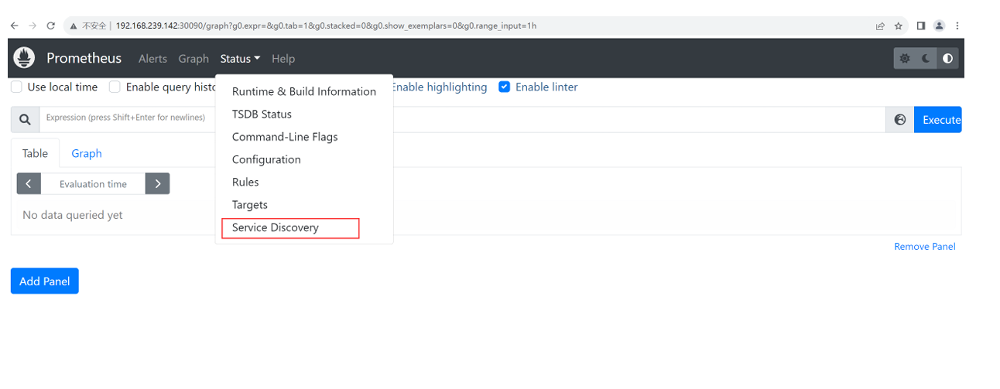
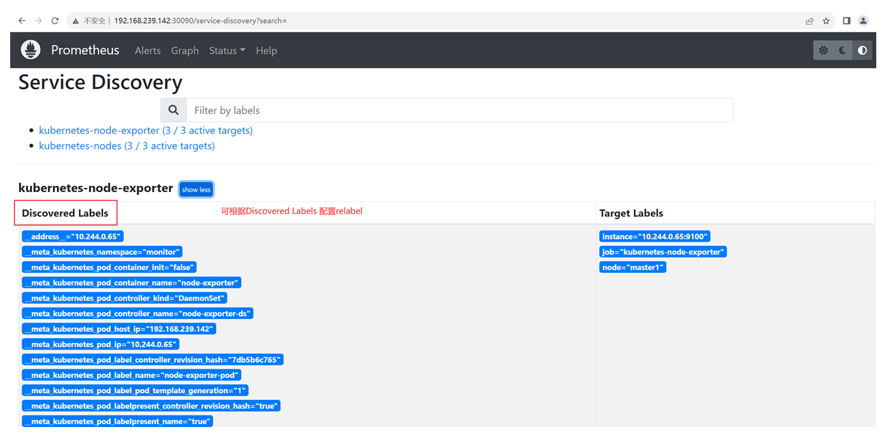

# Kubernetes(k8s)的集群监控Prometheus

Prometheus是进行K8s集群中进行业务数据采集、指标计算，进行集群数据的监控。Prometheus支持单节点部署，支持端点发现。

```shell
# 相关文档
# k8s_sd_config：https://prometheus.io/docs/prometheus/latest/configuration/configuration/#kubernetes_sd_config
# 配置文件参考：https://github.com/prometheus/prometheus/blob/release-2.46/documentation/examples/prometheus-kubernetes.yml

# 相关docker镜像
docker pull quay.io/prometheus/node-exporter:v1.6.1
docker pull prom/prometheus:v2.37.9
```

## kubernetes_sd_config角色元数据标签

### node角色的标签

节点角色为每个集群节点发现一个目标，地址默认为Kubelet的HTTP端口。目标地址默认为Kubernetes节点对象的第一个现有地址，地址类型顺序为NodeInternalIP、NodeExternalIP、NodeLegacyHostIP和NodeHostName。

-  meta_kubernetes\node_name：节点对象的名称。
- meta_kubernetes\node_provider_id：节点对象的云提供程序名称。
- meta_kubernetes\node_label_＜labelname＞：节点对象中的每个标签。
- meta_kubernetes\node_labelpresent：对于节点对象中的每个标签都为true。
- __meta_kubernetes\node_annotation：节点对象中的每个注释。
- meta_kubernetes_nod_annotationpresent_：对于节点对象中的每个注释都为true。
- meta_kubernetes\node_address_：每个节点地址类型的第一个地址（如果存在）。

### service角色的标签

服务角色为每个服务的每个服务端口发现一个目标， 这对于服务的黑盒监视通常很有用。地址将设置为服务的Kubernetes DNS名称和相应的服务端口。

- meta_kubernetes_namespace：服务对象的命名空间。
- meta_kubernetes\service_annotation：服务对象中的每个注释。
- __meta_kubernetes_service_annotationpresent：服务对象的每个注释都为“true”。
- meta_kubernete_service_cluster_ip：服务的集群ip地址。（不适用于ExternalName类型的服务）
- meta_kubernetes_service_loadbalancer_ip：负载均衡器的ip地址。（适用于LoadBalancer类型的服务）
- meta_kubernetes_service_external_name：服务的DNS名称。（适用于ExternalName类型的服务）
- meta_kubernetes\service_label＜labelname＞：服务对象中的每个标签。
- __meta_kubernetes\service_labelpresent：对于服务对象的每个标签都为true。
- meta_kubernetes_service_name：服务对象的名称。
- meta_kubernetes\service_port_name：目标的服务端口的名称。
- meta_kubernetes\service_port_number：目标的服务端口号。
- meta_kubernetes\service_port_procol：目标的服务端口的协议。
- __meta_kubernetes_service_type：服务的类型。

### pod角色的标签

 pod角色发现所有pod并将其容器作为目标公开，对于容器的每个声明端口，都会生成一个目标。如果容器没有指定的端口，则会为每个容器创建一个无端口目标，用于通过重新标记手动添加端口。

- meta_kubernetes_namespace：pod对象的名称空间。
- meta_kubernetes_pod_name：pod对象的名称。
- meta_kubernetes_po_ip：pod对象的pod ip。
- meta_kubernetes_pod_label：pod对象中的每个标签。
- __meta_kubernetes_pod_labelpresent：对于pod对象中的每个标签都为true。
- meta_kubernetes_po_annotation_：pod对象中的每个注释。
- meta_kubernetes_po_annotationpresent_：对于pod对象中的每个注释都为true
- meta_kubernetes_po_container_init：如果容器是InitContainer，则为true。
- meta_kubernetes_pod_container_name：目标地址指向的容器的名称。
- meta_kubernete_pod_container_id：目标地址指向的容器的id。该id的形式为：//<container_id>。
- meta_kubernetes_po_container_image：容器正在使用的镜像。
- meta_kubernetes_po_container_port_name：容器端口的名称。
- meta_kubernetes_po_container_port_number：容器端口号。
- meta_kubernete_pod_container_port_procol：容器端口的协议。
- meta_kubernetes_pod_ready：将pod的就绪状态设置为true或false。
- meta_kubernetes_pod_phase：在生命周期中设置为Pending、Running、Successed、Failed或Unknown。
- meta_kubernetes_pod_node_name：pod被调度到的节点的名称。
- meta_kubernetes_po_host_ip：pod对象的当前主机ip。
- meta_kubernetes_po_uid：pod对象的uid。
- meta_kubernetes_pod_controller_kind:pod控制器的对象类型。
- meta_kubernetes_pod_controller_name：pod控制器的名称。

### endpoints角色的标签

端点角色从列出的服务端点中发现目标，如果端点由pod支持，则该pod的所有未绑定到端点端口的其他容器端口也会被发现为目标。

如果端点属于某个服务，则会附加角色的所有标签：服务发现。

对于由pod支持的所有目标，将附加角色的所有标签：pod发现。

- meta_kubernetes_namespace：端点对象的命名空间。
- meta_kubernetes_endpoints_name：端点对象的名称。
- meta_kubernetes_endpoints_label_＜labelname＞：端点对象中的每个标签。
- meta_kubernetes_endpoints_labelpresent：对于端点对象中的每个标签都为true。
- __meta_kubernetes_endpoints_annotation：端点对象中的每个注释。
- __meta_kubernetes_endpoints_annotationpresent：对于端点对象的每个注释为true。

对于直接从端点列表中发现的所有目标（那些没有从底层pod中额外推断的目标），将附加以下标签：

- meta_kubernetes_endpoint_hostname：端点的主机名。
- meta_kubernetes_endpoint_node_name：承载端点的节点的名称。
- meta_kubernetes_endpoint_ready：将端点的就绪状态设置为true或false。
- meta_kubernetes_endpoint_port_name：端点端口的名称。
- meta_kubernetes_endpoint_port_procol：端点端口的协议。
- meta_kubernetes_endpoint_address_target_kind:端点地址目标的类型。
- __meta_kubernetes_endpoint_address_target_name：端点地址目标的名称。

### endpointslice角色的标签

 endpointslice角色从现有的endpointslies中发现目标，对于endpointslice对象中引用的每个端点地址，都会发现一个目标。

如果端点由pod支持，那么pod的所有未绑定到端点端口的附加容器端口也会被发现为目标。 如果端点属于某个服务，则会附加角色的所有标签：服务发现。对于由pod支持的所有目标，将附加角色的所有标签：pod发现。

- meta_kubernetes_namespace：端点对象的命名空间。
- meta_kubernetes_endpointslice_name：endpointslice对象的名称。
- meta_kubernetes_endpointslice_label_＜labelname＞：来自endpointslice对象的每个标签。
- meta_kubernetes_endpointslice_labelpresent：对于endpointslice对象中的每个标签为true。
- __meta_kubernetes_endpointslice_annotation：来自endpointslice对象的每个注释。
- _meta_kubernetes_endpointslice_annotationpresent：对于来自endpointslice对象的每个注释为true。

对于直接从endpointslice列表中发现的所有目标（那些没有从底层pod中额外推断的目标），将附加以下标签：

- meta_kubernetes_endpointslice_address_target_kind:被引用对象的类型。
- meta_kubernetes_endpointslice_address_target_name：被引用对象的名称。
- meta_kubernetes_endpointslice_address_type：目标地址的ip协议族。
- meta_kubernetes_endpointslice_endpoint_conditions_ready：将引用端点的就绪状态设置为true或false。
- meta_kubernetes_endpointslice_endpoint_conditions_serviceing：将引用端点的服务状态设置为true或false。
- meta_kubernetes_endpointslice_endpoint_conditions_terminating：将被引用端点的终止状态设置为true或false。
- meta_kubernetes_endpointslice_endpoint_topology_kubernetes_io_hostname：承载引用端点的节点的名称。
- meta_kubernetes_endpointslice_endpoint_topology_present_kubernet s_io_hostname：显示被引用对象是否具有kubernetes.io/hostname注释的标志。
- meta_kubernetes_endpointslice_port：被引用端点的端口。
- meta_kubernetes_endpointslice_port_name：被引用端点的命名端口。
- __meta_kubernetes_endpointslice_port_procol：被引用端点的协议。

### ingress角色的标签

 ingress角色为每个入口的每个路径发现一个目标，这对于黑盒监控入口通常很有用。地址将设置为入口规范中指定的主机。

- meta_kubernetes_namespace：入口对象的命名空间。
- meta_kubernetes_engress_name：入口对象的名称。
- meta_kubernete_ingress_label_＜labelname＞：来自ingress对象的每个标签。
- meta_kubernetes_ingress_labelpresent：对于来自ingress对象的每个标签为true。
- __meta_kubernete_ingress_annotation：来自ingress对象的每个注释。
- meta_kubernetes_ingress_annotationpresent_：对于来自ingress对象的每个注释为true。
- meta_kubernetes_ingress_class_name：入口规范中的类名（如果存在）。
- meta_kubernete_ingress_scheme：入口的协议方案，如果设置了TLS配置，则为https。默认为http。
- meta_kubernetes_engress_path：入口规范的路径。默认为/。

## Prometheus部署

prometheus的配置直接写在监控monitor.yaml中：

```yaml
apiVersion: v1
kind: Namespace
metadata:
  name: monitor
---
apiVersion: apps/v1
kind: DaemonSet
metadata:
  namespace: monitor
  name: node-exporter-ds
  labels:
    name: node-exporter-ds
spec:
  selector:
    matchLabels:
      name: node-exporter-pod
  template:
    metadata:
      labels:
        name: node-exporter-pod
    spec:
      tolerations:
        - key: "node-role.kubernetes.io/control-plane"
          operator: "Exists"
          effect: "NoSchedule"
      containers:
        - name: node-exporter
          image: quay.io/prometheus/node-exporter:v1.6.1
          args:
            - "--path.rootfs=/host"
          volumeMounts:
            - name: host-root
              mountPath: "/host"
              readOnly: true
      volumes:
        - name: host-root
          hostPath:
            path: /
            type: Directory
---
apiVersion: v1
kind: Service
metadata:
  namespace: monitor
  name: node-exporter-svc
spec:
  type: NodePort
  selector:
    name: node-exporter-pod
  ports:
    - protocol: TCP
      name: http9100
      port: 9100
      targetPort: 9100
      nodePort: 30091
---
apiVersion: v1
kind: ConfigMap
metadata:
  name: prometheus-config
  namespace: monitor
data:
  prometheus.yml: |
    global:
      # 每20s获取一次数据
      scrape_interval: 20s
      # 获取数据的超时时间
      scrape_timeout: 10s
      # 规则评估频率
      evaluation_interval: 20s
    # 采集配置
    scrape_configs:
    # 采集任务名称
      - job_name: k8s-cadvisor
        kubernetes_sd_configs:
         # 发现指定这角色
          - role: node
        # tls配置，该字段若没有配置，则使用上一级节点的配置
        tls_config:
        # k8s启动的容器中，存储ca的位置
          ca_file: /var/run/secrets/kubernetes.io/serviceaccount/ca.crt
          insecure_skip_verify: true
        # k8s启动的容器中，存储bearertoken的位置
        bearer_token_file: /var/run/secrets/kubernetes.io/serviceaccount/token
        scheme: https
        relabel_configs:
          - action: replace
            replacement: kubernetes.default.svc:443
            target_label: __address__
          - action: replace
            source_labels:
              - __meta_kubernetes_node_name
            regex: (.*)
            replacement: /api/v1/nodes/$1/proxy/metrics/cadvisor
            target_label: __metrics_path__
          - action: labelmap
            regex: __meta_kubernetes_node_label_(.*)
      - job_name: k8s-node-exporter
        kubernetes_sd_configs:
          - role: pod
            namespaces:
              names:
                - monitor
            selectors:
              - role: pod
                label: name=node-exporter-pod
        scheme: http
        tls_config:
          # k8s启动的容器中，存储ca的位置
          ca_file: /var/run/secrets/kubernetes.io/serviceaccount/ca.crt
          insecure_skip_verify: true
        # k8s启动的容器中，存储bearertoken的位置
        bearer_token_file: /var/run/secrets/kubernetes.io/serviceaccount/token
        relabel_configs:
          - action: replace
            source_labels:
              - __meta_kubernetes_pod_node_name
            target_label: node
          - action: replace
            source_labels:
              - __meta_kubernetes_pod_ip
            regex: (.*)
            replacement: $1:9100
            target_label: __address__
          - action: replace
            replacement: /metrics
            target_label: __metrics_path__
      - job_name: bus-data-collector
        kubernetes_sd_configs:
          - role: pod
           # 指定命名空间，不指定则为所有命名空间
            namespaces:
              names:
                - management
            selectors:
              - role: pod
                label: name=management-pod
        scheme: http
        tls_config:
          # k8s启动的容器中，存储ca的位置
          ca_file: /var/run/secrets/kubernetes.io/serviceaccount/ca.crt
          insecure_skip_verify: true
        # k8s启动的容器中，存储bearertoken的位置
        bearer_token_file: /var/run/secrets/kubernetes.io/serviceaccount/token
        relabel_configs:
          - action: replace
            source_labels:
              - __meta_kubernetes_pod_name
            target_label: pod_name
          - action: replace
            source_labels:
              - __meta_kubernetes_pod_ip
            regex: (.*)
            replacement: $1:2223
            target_label: __address__
          - action: replace
            replacement: /metrics
            target_label: __metrics_path__
---
apiVersion: rbac.authorization.k8s.io/v1
kind: ClusterRole
metadata:
  name: prometheus
rules:
  - apiGroups: [""]
    resources:
      - nodes
      - nodes/proxy
      - services
      - endpoints
      - pods
    verbs: ["get", "list", "watch"]
  - nonResourceURLs: ["/metrics"]
    verbs: ["get"]
---
apiVersion: rbac.authorization.k8s.io/v1
kind: ClusterRoleBinding
metadata:
  name: prometheus
roleRef:
  apiGroup: rbac.authorization.k8s.io
  kind: ClusterRole
  name: prometheus
subjects:
  - kind: ServiceAccount
    name: default
    namespace: monitor
---
apiVersion: apps/v1
kind: Deployment
metadata:
  namespace: monitor
  name: prometheus-deploy
  labels:
    name: prometheus-deploy
spec:
  replicas: 1
  selector:
    matchLabels:
      name: prometheus-pod
  template:
    metadata:
      labels:
        name: prometheus-pod
    spec:
      containers:
        - name: prometheus-c
          image:  prom/prometheus:v2.37.9
          args:
            - "--config.file=/etc/prometheus/prometheus.yml"
          ports:
            - containerPort: 9090
          volumeMounts:
            - name: prometheus-conf-v
              mountPath: "/etc/prometheus/"
              readOnly: true
      volumes:
        - name: prometheus-conf-v
          configMap:
            name: prometheus-config
---
apiVersion: v1
kind: Service
metadata:
  namespace: monitor
  name: prometheus-svc
spec:
  type: NodePort
  selector:
    name: prometheus-pod
  ports:
    - protocol: TCP
      name: http9090
      port: 9090
      targetPort: 9090
      nodePort: 30090
```

在进行relabel_configs配置中，语法如下：

```shell
# 源标签
[ source_labels: '[' <labelname> [, ...] ']' ]
# 原标签分隔符
[ separator: <string> | default = ; ]
# 目标标签，原标签经过处理后，最终对外呈现的标签
[ target_label: <labelname> ]
# 提取值匹配的正则表达式
[ regex: <regex> | default = (.*) ]
# 获取源标签值的哈希值的模数
[ modulus: <int> ]
# 正则表达式匹配时执行正则表达式替换的替换值
[ replacement: <string> | default = $1 ]
 # 基于正则表达式匹配要执行的操作
[ action: <relabel_action> | default = replace ]
```

- replace：将regex与连接的source_labels进行匹配。然后，将target_label设置为replacement，替换中的匹配组引用（\$｛1｝、\$｛2｝、…）由其值替换。如果正则表达式不匹配，则不会进行替换。
-  lowercase：将连接的source_labels映射到它们的小写
- uppercase：将连接的source_labels映射到它们的大写
- keep：删除regex与连接的source_labels不匹配的目标
- drop：删除regex与连接的source_labels匹配的目标
- keepequal：删除连接的source_label与target_label不匹配的目标
- dropequal：删除连接的source_label与target_label匹配的目标
- hashmod：将target_label设置为串联的source_labels的哈希的模数
-  labelmap：将regex与所有源标签名称匹配，而不仅仅是在source_labels中指定的名称。然后将匹配标签的值复制到标签名称

## relabel_configs配置方法

简单配置Kubernetes_sd_config后，打开prometheus 服务发现菜单



根据Discovered label 配置relabel_config



```shell
# 验证节点是否仅包含各自的数据
# 启动代理
kubectl proxy --address='192.168.239.142' --accept-hosts='^192.168.239.142$'
# 通过代理访问集群中各个节点的监控数据
http://192.168.239.142:8001/api/v1/nodes/master1/proxy/metrics/cadvisor
http://192.168.239.142:8001/api/v1/nodes/worker1/proxy/metrics/cadvisor http://192.168.239.142:8001/api/v1/nodes/worker2/proxy/metrics/cadvisor
# 查看集群中的所有pod，并展示更多信息，选择不同节点的信息，去监控数据中查找
kubectl get pod -A -o wide
```


