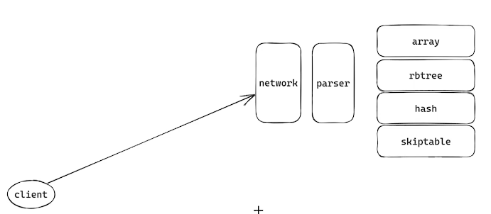

# NOSQL（KV存储）的架构设计和数组存储

nosql数据库的使用十分广泛，其中最有名的nosql数据库就是Redis，Redis在各种项目中都有应用。nosql通常都是内存数据库，数据都放入内存中，其具体的操作方式是Key-Value存储。可以向nosql数据库中提交key 和 value 的键值对，在需要的使用对key和value键值对进行获取、修改、删除等操作。其机构设计如下所示：



如上图所示，客户端可以通过网络，向KV存储的服务器端提交操作数据，数据通过网络传输到达服务器后，服务器进行解析后进行存储。具体实现时，服务器端可以使用多种方式接受数据，如select、poll、epoll、协程、io_uring等，解析后的数据需要进行存储，存储的数据结构可以选择数组、红黑树、哈希表、跳表等。网络部分的内容不再赘述，本文重点在于解析数据和数据存入数组。

## KV数据解析

基本的数据操作有增、删、改、查，所以需要实现的KV存储数据库首先需要实现的操作就是这四个。数据操作定然如下：

- 增加：SET name yangshuangxin
- 查询：GET name  -->  yangshuangxin
- 修改：MOD name YSX
- 删除：DEL name 

### 网络数据切分

```c++
// 从网络IO中获取的数据存入rbuffer中，待发送的数据存入wbuffer中
struct connItem {
	char rbuffer[BUFFER_LENGTH];
	int rlen;
	char wbuffer[BUFFER_LENGTH];
	int wlen;
};
// 分割字符串,返回分割后的数量
int KVstoreSplitToken(char *msg, char **tokens) {
	if (msg == nullptr || tokens == nullptr) {
        return -1;
    } 
    // 按照空格进行切分
	int idx = 0;
	char *token = strtok(msg, " ");
	while (token != nullptr) {
		tokens[idx++] = token;
		token = strtok(nullptr, " ");
	}
	return idx;
}
static constexpr uint32_t KVSTORE_MAX_TOKENS = 128;
// 入口函数，传入接收到的数据进行解析
int KVstoreRequest(struct connItem *item) {
	printf("recv: %s\n", item->rbuffer);
	char *msg = item->rbuffer;
	char *tokens[KVSTORE_MAX_TOKENS];
    // 第一步，分割字符串
	int count = KVstoreSplitToken(msg, tokens);
	int idx = 0;
	for (idx = 0;idx < count;idx ++) {
		printf("idx: %s\n", tokens[idx]);
	}
    // 开始进行协议解析
	KVstoreParserProtocol(item, tokens, count);
	return 0;
}
```

### 解析协议

```c++
// 定义方法
const char *commands[] = {
	"SET", "GET", "DEL", "MOD",
};
// 定义方法对应的枚举
enum {
	KVS_CMD_START = 0,
	KVS_CMD_SET = KVS_CMD_START,
	KVS_CMD_GET,
	KVS_CMD_DEL,
	KVS_CMD_MOD,
	KVS_CMD_COUNT,
};

// 解析协议（增、删、改、查）
int KVstoreParserProtocol(struct connItem *item, char **tokens, int count) {
	if (item == NULL || tokens[0] == NULL || count == 0) {
        return -1;
    }
    // 找到匹配的方法
	int cmd = KVS_CMD_START;
	for (cmd = KVS_CMD_START; cmd < KVS_CMD_COUNT; cmd ++) {
		if (strcmp(commands[cmd], tokens[0]) == 0) {
			break;
		}
	}
	// 写buffer 初始化
	char *msg = item->wbuffer;
	memset(msg, 0, BUFFER_LENGTH);
    // 按照不同的增、删、改、查进行数据处理
	switch (cmd) {
		case KVS_CMD_SET:
			int res = KVstoreArraySet(tokens[1], tokens[2]);
			if (!res) {
				snprintf(msg, BUFFER_LENGTH, "SUCESS");
			} else {
				snprintf(msg, BUFFER_LENGTH, "FAILED");
			}
			printf("set: %d\n", res);
			break;
		case KVS_CMD_GET:
			char *value = KVstoreArrayAet(tokens[1]);
			if (value) {
				snprintf(msg, BUFFER_LENGTH, "%s", value);
			} else {
				snprintf(msg, BUFFER_LENGTH, "NO EXIST");
			}
			printf("get: %s\n", value);
			break;
		case KVS_CMD_DEL:
            bool ret = KVstoreArrayDel(tokens[1], tokens[2]);
            if (ret) {
				snprintf(msg, BUFFER_LENGTH, "%s", value);
			} else {
				snprintf(msg, BUFFER_LENGTH, "NO EXIST");
			}
			printf("del\n");
			break;
		case KVS_CMD_MOD:
            bool ret = KVstoreArrayMod(tokens[1], tokens[2]);
            if (ret) {
				snprintf(msg, BUFFER_LENGTH, "%s", value);
			} else {
				snprintf(msg, BUFFER_LENGTH, "NO EXIST");
			}
			printf("mod\n");
			break;
		default: {
			printf("Error cmd: %s\n", commands[cmd]);
		}
	}
}
```

## KV数据存储

最容易的存储方式就是数组，把接收到的数据直接放入数组中，具体实现如下。

```c++
// 定义KV数据结构
struct kVarrayItem {
	char *key;
	char *value;
};
// 定义KV数组
static constexpr uint32_t KVS_ARRAY_SIZE = 128;
struct kVarrayItem arrayTable[KVS_ARRAY_SIZE] = {};
int arrayIdx = 0;
// 存储KV
int KVstoreArraySet(char *key, char *value) {
	if (key == nullptr || value == nullptr || array_idx == KVS_ARRAY_SIZE) {
        return -1;
    }
    // 申请KV的空间
	char *kcopy = malloc(strlen(key) + 1);
    memset(kcopy, 0, strlen(key) + 1);
	if (kcopy == nullptr) {
        return -1;
    }
	strncpy(kcopy, key, strlen(key) + 1);
	char *vcopy = malloc(strlen(value) + 1);
    memset(vcopy, 0, strlen(value) + 1);
	if (kcopy == nullptr) {
		free(kcopy);
		return -1;
	}
	strncpy(vcopy, value, strlen(value)+1);
    // 存入数组
	arrayTable[arrayIdx].key = kcopy;
	arrayTable[arrayIdx].value = vcopy;
	arrayIdx++;
	return 0;
}

// 获取数据
char * KVstoreArrayGet(char *key) {
	int i = 0;
	for (i = 0;i < arrayIdx; i++) {
		if (strcmp(arrayTable[i].key, key) == 0) {
			return arrayTable[i].value;
		}
	}
	return nullptr;
}

// 修改数据
bool KVstoreArrayMod(char *key, char *val) {
	int i = 0;
	for (i = 0;i < arrayIdx;i ++) {
		if (strcmp(arrayTable[i].key, key) == 0) {
			if (strlen(arrayTable[i].value) < strlen(val)) {
                arrayTable[i].value = realloc(arrayTable[i].value, strlen(val) + 1);
                if (arrayTable[i].value == nullptr) {
                    return false;
                }
                strncpy(arrayTable[i].value, val, strlen(val)+1);
            }
		}
	}
	return false;
}
// 删除数据
bool KVstoreArrayDel(char *key, char *val) {
	int i = 0;
	for (i = 0;i < arrayIdx; i++) {
		if (strcmp(arrayTable[i].key, key) == 0) {
			free(arrayTable[i].key );
            free(arrayTable[i].value);
            arrayTable[i].key = nullptr;
            arrayTable[i].value = nullptr;
            return true;
		}
	}
	return false;
}
```

