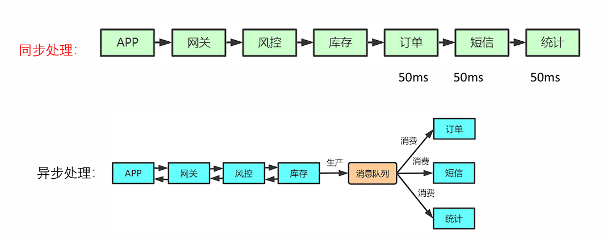
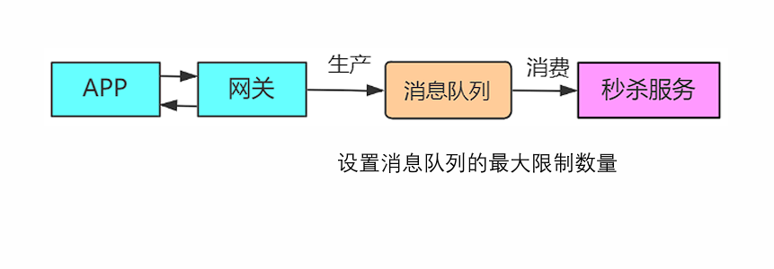
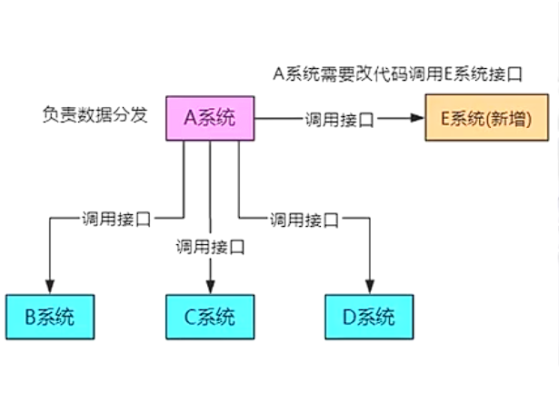
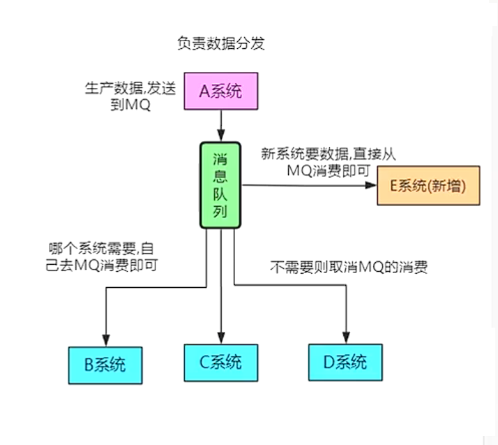
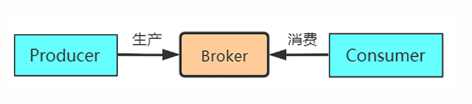

# 消息队列和Kafka的安装使用

## 消息队列

本质是就是个队列，FIFO先入先出，只不过队列中存放的内容是message，从而叫消息队列。消息+队列（MessageQueue，简称MQ）。主要用作不同服务server、进程process、线程thread之间通信。

### 消息队列的使用场景

#### 异步处理

假如在购物时需要处理的操作有短信通知、终端状态推送、App推送、用户注册等，可以使用异步处理更快速返回结果，减少等待，实现并发处理，提升系统总体性能。



#### 流量控制(削峰)

在大量流量突然涌入时，例如秒杀场景下的下单状态，使用消息队列隔离网关和后端服务，以达到流量控制和保护后端服务的目的。



同时也可以作为**高并发缓冲**进行数据的流量控制。

#### 服务解耦

使用消息队列实现系统的解耦，对于扩展新模块更容易。例如A系统负责数据分发，不使用消息队列，需要依次调用其他系统的接口进行数据的交互，如果需要心中模块，就需要修改A系统的代码新调用E系统的接口。



解耦后，不需要关注其他模块的接口，只需要推送数据到消息队列中，实现解耦。



解耦后的消息队列可以使用**发布订阅**模式，让数据可以被多个消费者自由选择是否进行消费数据处理。

### 消息队列的基本概念

- Broker多个，可以集群的方式。Broker的概念来自与Apache ActiveMQ，通俗的讲一个Broker就是一个MQ的服务器。
- 消息的生产者Producer：发送消息到消息队列；消息消费者Consumer：从消息队列接收消息。



- 点对点消息队列模型。消息生产者向一个特定的队列发送消息，消息消费者从该队列中接收消息，一条消息只有一个消费者能收到。（例如线程池）
- 发布订阅消息模型。发布订阅消息模型中，支持向一个特定的**主题Topic**发布消息，0个或多个订阅者接收来自这个消息主题的消息。在这种模型下，发布者和订阅者彼此不知道对方。（例如知乎关注）
- 消息的顺序性保证。基于Queue消息模型，利用FIFO先进先出的特性，可以保证消息的顺序性。
-  消息的ACK确认机制。即消息的Ackownledge确认机制，为了保证消息不丢失，消息队列提供了消息Acknowledge机制，即ACK机制，当Consumer确认消息已经被消费处理，发送一个ACK给消息队列，此时消息队列便可以删除这个消息了。如果Consumer宕机/关闭，没有发送ACK，消息队列将认为这个消息没有被处理，会将这个消息重新发送给其他的Consumer重新消费处理。（ACK会降低实时性，牺牲吞吐量）
- 消息的持久化。对于一些关键的核心业务来说是非常重要的，启用消息持久化后，消息队列宕机重启后，消息可以从持久化存储恢复，消息不丢失，可以继续消费处理。
- 消息的同步收发。消息的收发支持同步收发的方式一应一答。**消息的接收**如果以同步的方式(Pull)进行接收，如果队列中为空，此时接收将处于同步阻塞状态，会一直等待，直到消息的到达。**消息的发送**类似于TCP批量应答，如果超过一定的时间没有收到应答，要重复消息。
- 消息的异步收发。异步接收消息，生产者以Push的方式触发消息消费者接收消息。

### 消息队列的对比

| 特性                      | Rabbit MQ                                           | Rocket MQ                                                    | Kafka                                                        | Zero MQ                                                      |
| ------------------------- | --------------------------------------------------- | ------------------------------------------------------------ | ------------------------------------------------------------ | ------------------------------------------------------------ |
| 单机吞吐量                | 万级，比RocketMQ、 Kafka 低一个数量级               | 10 万级，支撑高吞吐                                          | 10 万级，高吞吐，一般配 合大数据类的系统来进行 实时数据计算、日志采集 等场景 | 100万级别，最早设计 用于股票实时交易系统                     |
| topic 数量对吞 吐量的影响 |                                                     | topic 可以达到几百/几千的 级别，吞吐量会有较小幅度 的下降，这是RocketMQ 的 一大优势，在同等机器下， 可以支撑大量的topic | topic 从几十到几百个时候， 吞吐量会大幅度下降，在 同等机器下，Kafka 尽量保 证topic 数量不要过多，如 果要支撑大规模的topic， 需要增加更多的机器资源 |                                                              |
| 时效性                    | 微秒级，这是 RabbitMQ 的一大特 点，延迟最低         | ms 级                                                        | 延迟在ms级以内                                               | 延迟在微妙级别/毫秒 级别                                     |
| 可用性                    | 高，基于主从架构实 现高可用                         | 非常高，分布式架构                                           | 非常高，分布式，一个数 据多个副本，少数机器宕 机，不会丢失数据，不会 导致不可用 | 不是一个独立的服务， 要嵌套到自己的程序里 面去               |
| 消息可靠性                | 基本不丢                                            | 经过参数优化配置，可以做 到0 丢失                            | 同Rocket MQ                                                  |                                                              |
| 功能支持                  | 基于erlang 开发，并 发能力很强，性能极 好，延时很低 | MQ 功能较为完善，支持分 布式部署，扩展性好                   | 功能较为简单，主要支持 简单的MQ 功能，在大数 据领域的实时计算以及日 志采集被大规模使用 | 如果需求是将消息 队列的功能集成到你的 系统进程中，可以考虑使用。 |


## Kafka的安装

安装java 环境。

```shell
# 下载java安装包，例如jdk-8u202-linux-x64.tar.gz
tar -zxvf jdk-8u291-linux-x64.tar.gz
# 在/usr/bin目录下新建jdk目录，将解压的jdk文件移动到新建的/usr/lib/jdk目录下来
mkdir /usr/lib/jdk
mv jdk1.8.0_291 /usr/lib/jdk/
# 配置java环境变量，将环境变量配置在etc/profile中
vim /etc/profile
# 末尾增加
#set java env 
export JAVA_HOME=/usr/lib/jdk/jdk1.8.0_291 
export JRE_HOME=${JAVA_HOME}/jre     
export CLASSPATH=.:${JAVA_HOME}/lib:${JRE_HOME}/lib     
export PATH=${JAVA_HOME}/bin:$PATH

# 执行命令使修改立即生效
source /etc/profile
```

安装kafka环境。

```shell
wget https://archive.apache.org/dist/kafka/2.0.0/kafka_2.11-2.0.0.tgz
tar -zxvf kafka_2.11-2.0.0.tgz 
# 下载的kafka程序里自带了zookeeper，kafka自带的Zookeeper程序脚本与配置文件名与原生Zookeeper稍有不同。
# kafka自带的Zookeeper程序使用bin/zookeeper-server-start.sh，以及bin/zookeeper-server-stop.sh来启动和停止Zookeeper。
# kafka依赖于zookeeper来做master选举一起其他数据的维护。可以通过kafka自带的脚本来启动zk服务，当然，也可以自己独立搭建zk的集群来实现。
sh zookeeper-server-start.sh  ../config/zookeeper.properties # 前台运行
sh zookeeper-server-start.sh -daemon ../config/zookeeper.properties #后台运行
# 默认端口为：2181，可以通过命令lsof -i:2181 查看zookeeper是否启动成功

# 启动kafka修改server.properties（在config目录）, 增加zookeeper的配置
zookeeper.connect=localhost:2181
# 启动kafka，默认端口为：9092，可以通过命令lsof -i:9092查看kafka是否启动成功
sh kafka-server-start.sh -daemon ../config/server.properties
# 停止kafka
sh kafka-server-stop.sh -daemon ../config/server.properties
```

## Kafka的基本使用操作

### 创建topic  --create

```shell
sh kafka-topics.sh --create --zookeeper localhost:2181 --replication-factor 1 --partitions 1 --topic test
Created topic "test".
```

参数说明如下：

- --create 是创建主题的的动作指令
- --zookeeper 指定kafka所连接的zookeeper服务地址
- --replicator-factor 指定了副本因子（即副本数量）
- --partitions 指定分区个数
- --topic 指定所要创建主题的名称，比如test

 replication-factor 表示该topic需要在不同的broker中保存几份，这里设置成1，表示在两个broker中保存两份Partitions分区数。

kafka 创建主题的时候其副本数量不能大于broker的数量，否则创建主题 topic 失败。

创建主题时候，有3个参数是必填的，分别是 --partitions（分区数量）、 --topic（主题名） 、 --replication-factor（复制系数）， 同时还需使用 --create 参数表明本次操作是想要创建一个主题操作。

另外在创建主题的时候，还可以附加以下两个选项：–if-not-exists 和 --if-exists . 第一个参数表明仅当该主题不存在时候，创建； 第二个参数表明当修改或删除这个主题时候，仅在该主题存在的时候去执行操作。

### 查看topic  --list/ --describe

```shell
sh kafka-topics.sh --list --zookeeper localhost:2181
# 查看topic属性，该参数会将该主题的所有信息一一列出打印出来，比如分区数量、副本系数、领导者等。
sh kafka-topics.sh --describe --zookeeper localhost:2181 --topic test
```

###  收发消息

```shell
# 消费消息
sh kafka-console-consumer.sh --bootstrap-server 127.0.0.1:9092 --topic test--from-beginning
# 发送消息
 sh kafka-console-producer.sh --broker-list 127.0.0.1:9092 --topic test
```

### 修改主题信息 --alter

```shell
# 增加主题分区数量
sh kafka-topics.sh --zookeeper localhost:2181 --topic test1 --alter --partitions 2
# 不要使用 --alter 去尝试减少分区的数量，如果非要减少分区的数量，只能删除整个主题 topic， 然后重新创建
```

###  删除主题 topic --delete

```shell
sh kafka-topics.sh --zookeeper localhost:2181 --delete --topic test1
```

主题 test1已经被标记删除状态，但是若delete.topic.enable 没有设置为 true ， 则将不会有任何作用。生产者、消费者还是可以发送消息和接收消息。

如果要支持能够删除主题的操作，则需要在 /bin 的同级目录 /config目录下的文件server.properties中，修改配置delete.topic.enable=true（如果置为false，则kafka broker 是不允许删除主题的）。

