# Kafka 的存储

Kafka 是为了解决大数据的实时日志流而生的, 每天要处理的日志量级在千亿规模。对于日志流的特点主要包括 ：数据实时产生、海量数据存储与处理。所以它必然要面临分布式系统遇到的高并发、高可用、高性能等三高问题。对于 Kafka 的存储需要保证以下几点：

1. 存储的主要是消息流（可以是简单的文本格式也可以是其他格式，对于 Broker 存储来说，它并不 关心数据本身）
2. 要支持海量数据的高效存储、高持久化（保证重启后数据不丢失）
3. 要支持海量数据的高效检索（消费的时候可以通过offset或者时间戳高效查询并处理）
4. 要保证数据的安全性和稳定性、故障转移容错性

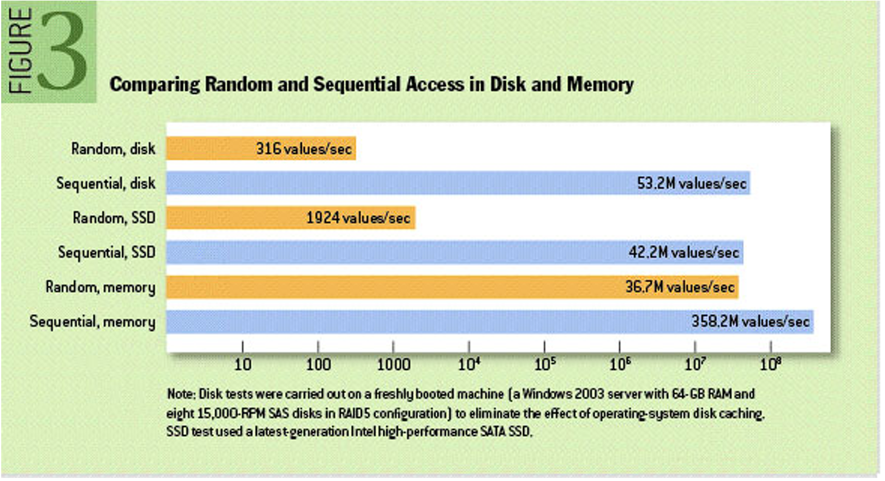

从上图性能测试的结果看出普通机械磁盘的顺序I/O性能指标是53.2M values/s，而内存的随机I/O性能指标是36.7M values/s。由此似乎可以得出结论：**磁盘的顺序I/O性能要强于内存的随机I/O性能**。

如果需要较高的存储性能，必然是提高读速度和写速度：

1.  提高读速度。利用索引，来提高查询速度，但是有了索引，大量写操作都会维护索引，那么会降低 写入效率。常见的如关系型数据库：mysql等。
2. 提高写速度。这种一般是采用日志存储, 通过顺序追加（批量）写的方式来提高写入速度，因为没有索引，无法快速查询，最严重的只能一行行遍历读取。常见的如大数据相关领域的基本都基于此 方式来实现。

## Kafka 存储方案

对于 Kafka 来说， 它主要用来处理海量数据流，这个场景的特点主要包括：

1. 写操作：写并发要求非常高，基本得达到百万级 TPS，顺序追加写日志即可，无需考虑更新操作。
2. 读操作：相对写操作来说，比较简单，只要能按照一定规则高效查询即可（offset或者时间戳）

对于写操作来说，直接采用顺序追加写日志的方式就可以满足 Kafka 对于百万TPS写入效率要求。所以需要重点考虑如何解决高效查询这些日志。Kafka采用了**稀疏哈希索引**（底层基于Hash Table 实 现）的方式。

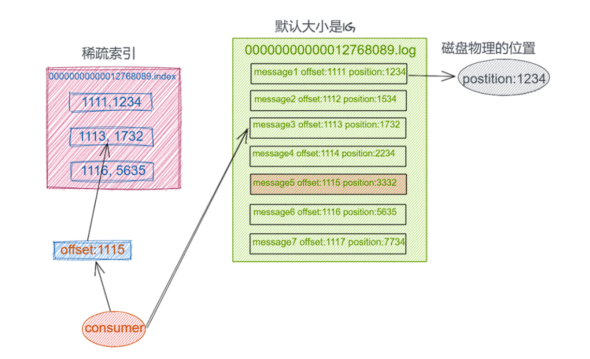

把消息的 Offset 设计成一个有序的字段，这样消息在日志文件中也就有序存放了，也不需要额外引入哈希表结构， 可以直接将消息划分成若干个块。对于每个块，我们只需要索引当前块的第一条消息的  Offset （类似二分查找算法的原理），即先根据 Offset 大小找到对应的块， 然后再从块中顺序查找， 这样就可以快速定位到要查找的消息。

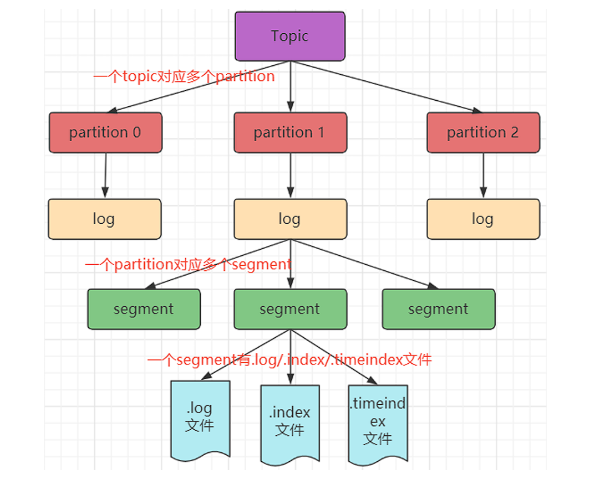

由于生产者生产的消息会不断追加到 log 文件末尾，为防止 log 文件过大导致数据定位效率低下，Kafka  采取了分片和索引机制。它将每个 Partition 分为多个 Segment，每个 Segment 对应两个文件：“.index” 索引文件和 “.log” 数据 文件。这些文件位于同一文件下，该文件夹的命名规则为：topic 名-分区号。

- “.index” 文件存储大量的索引信息
- “.log” 文件存储大量的数据

例如，test这个 topic 有三分分 区，则其对应的文件夹为 test-0，test-1，test-2。 index 和 log 文件以当前 Segment 的第一条消息的 Offset 命名。下图为 index 文件和 log 文件的结构和查找示意图：

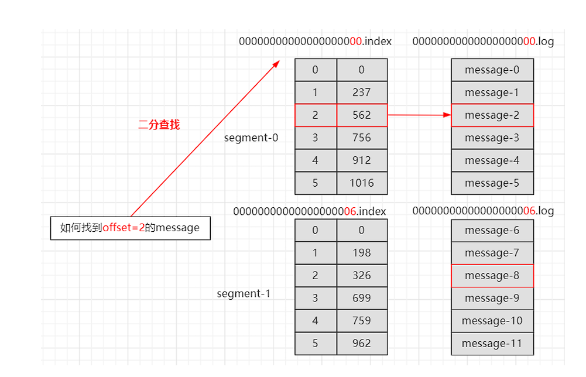

索引文件中的元数据指向对应数据文件中 Message 的物理偏移量。

```shell
# 查看索引
./kafka-dump-log.sh --files /tmp/kafka-logs/test-1/00000000000000000000.index 
```

##  kafka 存储架构设计

Kafka 最终的存储实现方案， 即基于顺序追加写日志 + 稀疏哈希索引。

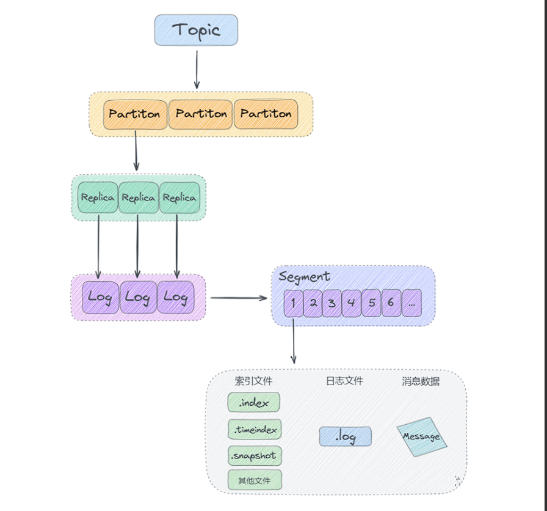

从上图可以看出Kafka 是基于「主题 + 分区 + 副本 + 分段 + 索引」的结构。

-  kafka 中消息是以主题 Topic 为基本单位进行归类的，这里的 Topic 是逻辑上的概念，实际上在磁盘存储是根据分区 Partition 存储的, 即每个 Topic 被分成多个 Partition，分区 Partition 的数量可 以在主题 Topic 创建的时候进行指定。
- Partition 分区主要是为了解决 Kafka 存储的水平扩展问题而设计的， 如果一个 Topic 的所有消息 都只存储到一个 Kafka Broker上的话， 对于 Kafka 每秒写入几百万消息的高并发系统来说，这个  Broker 肯定会出现瓶颈， 故障时候不好进行恢复，所以 Kafka 将 Topic 的消息划分成多个  Partition， 然后均衡的分布到整个 Kafka Broker 集群中。
- Partition 分区内每条消息都会被分配一个唯一的消息 id,即我们通常所说的偏移量 Offset,  因此  kafka 只能保证每个分区内部有序性,并不能保证全局有序性。
- 每个 Partition 分区又被划分成了多个 LogSegment，这是为了防止 Log 日志过大，Kafka 又 引入了日志分段(LogSegment)的概念，将 Log 切分为多个 LogSegement，相当于一个巨型文件 被平均分割为一些相对较小的文件，这样也便于消息的查找、维护和清理。这样在做历史数据清理 的时候，直接删除旧的 LogSegement 文件就可以了。
- Log 日志在物理上只是以文件夹的形式存储，而每个 LogSegement 对应磁盘上的一个日志文件和 两个索引文件，以及可能的其他文件(比如以".snapshot"为后缀的快照索引文件等)

## kafka 日志系统架构设计

 kafka 消息是按主题 Topic 为基础单位归类的，各个 Topic 在逻辑上是独立的，每个 Topic 又可以分为 一个或者多个 Partition，每条消息在发送的时候会根据分区规则被追加到指定的分区中，4个分区的主题逻辑结构图如下图所示：

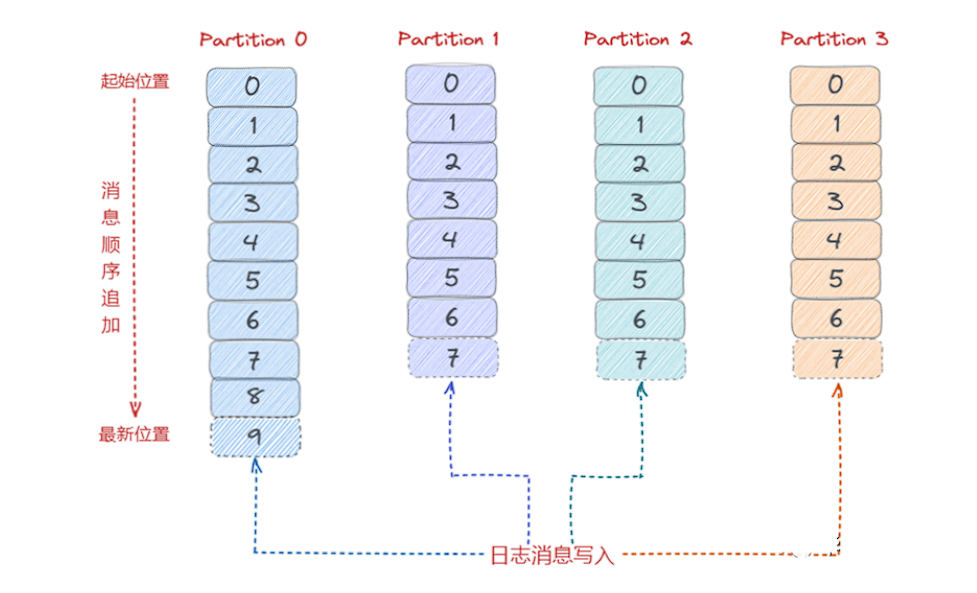

### 日志目录布局

Log 对应了一个命名为 “主题-分区” 的文件夹。举个例子，假设现在有一个名为“topic-order”的 Topic，该 Topic 中 有4个 Partition，那么在实际物理存储上表现为“topic-order-0”、“topic-order-1”、“topic-order-2”、 “topic-order-3” 这4个文件夹。

Log 中写入消息是顺序写入的。但是只有最后一个 LogSegement 才能执行写入操作，之前的所有  LogSegement 都不能执行写入操作。为了更好理解这个概念，将最后一个 LogSegement 称 为"activeSegement"，即表示当前活跃的日志分段。随着消息的不断写入，当 activeSegement 满足 一定的条件时，就需要创建新的 activeSegement，之后再追加的消息会写入新的 activeSegement。

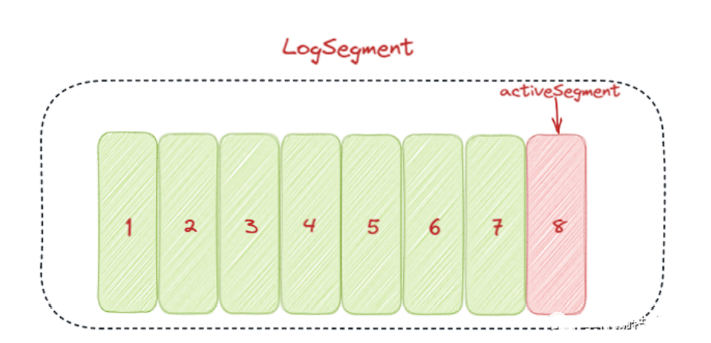

为了更高效的进行消息检索，每个 LogSegment 中的日志文件（以“.log”为文件后缀）都有对应的几个 索引文件：**偏移量索引文件**（以“.index”为文件后缀）、**时间戳索引文件**（以“.timeindex”为文件后 缀）、**快照索引文件** （以“.snapshot”为文件后缀）。

其中每个 LogSegment 都有一个 Offset 来作为 基准偏移量（baseOffset），用来表示当前 LogSegment 中第一条消息的 Offset。偏移量是一个64位的  Long 长整型数，日志文件和这几个索引文件都是根据基准偏移量（baseOffset）命名的，名称固定为 20位数字，没有达到的位数前面用0填充。比如第一个 LogSegment 的基准偏移量为0，对应的日志文件 为00000000000000000000.log。

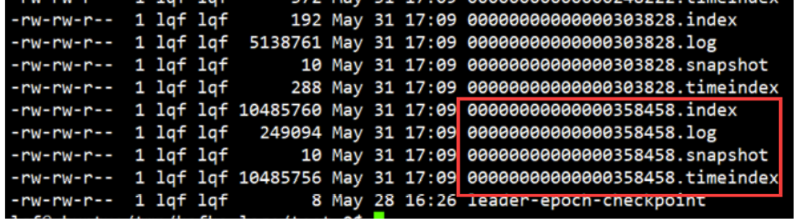

上图中 LogSegment 对应的基准位移是358458，也说明了当前 LogSegment 中的第一条消息的 偏移量为358458，同时可以说明前一个 LogSegment 中共有358458条消息（偏移量从0至 358458的消息）

当消费者消费的时候，会将提交的位移保存在 Kafka 内部的主题__consumer_offsets中，下图为整体的日志目录结构图：

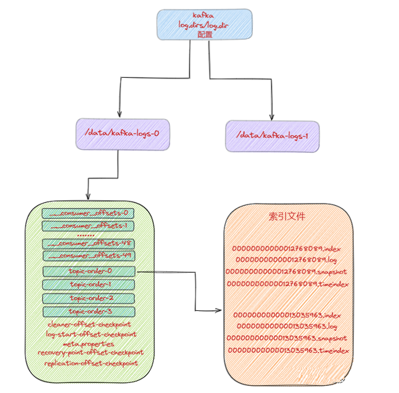

## Kafka的磁盘数据存储

Kafka 是依赖文件系统来存储和缓存消息，以及典型的顺序追加写日志操作，另外它使用操作 系统的 PageCache 来减少对磁盘 I/O 操作，即将**磁盘的数据缓存到内存中**，把**对磁盘的访问转变为对内存的访问**。

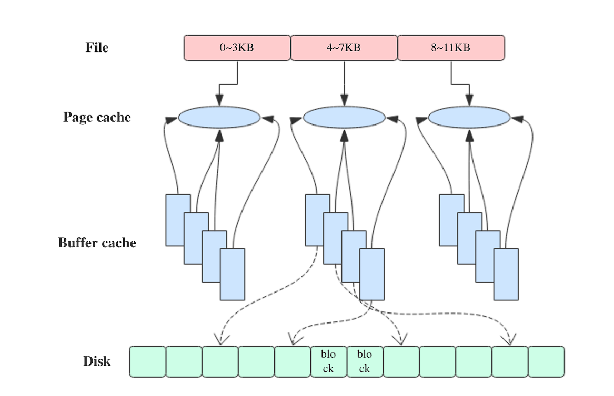

在 Kafka 中，**大量使用了 PageCache**， 这也是 Kafka 能实现高吞吐的重要因素之一， 当一个进程准 备读取磁盘上的文件内容时，操作系统会先查看待读取的数据页是否在 PageCache 中，如果命中则直 接返回数据，从而避免了对磁盘的 I/O 操作；如果没有命中，操作系统则会向磁盘发起读取请求并将读取的数据页存入 PageCache 中，之后再将数据返回给进程。

同样，如果一个进程需要将数据写入磁盘，那么操作系统也会检查数据页是否在页缓存中，如果不存在，则 PageCache 中添加相应的数据 页，最后将数据写入对应的数据页。被修改过后的数据页也就变成了脏页，操作系统会在合适的时间把 脏页中的数据写入磁盘，以保持数据的一致性。

除了消息顺序追加写日志、PageCache以外， kafka 还使用了**零拷贝**（Zero-Copy）技术来进一步提 升系统性能， 如下图所示：

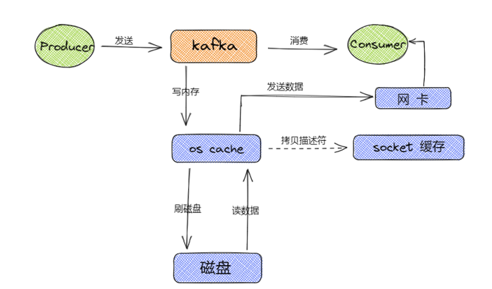

消息从生产到写入磁盘的整体过程如下图所示：

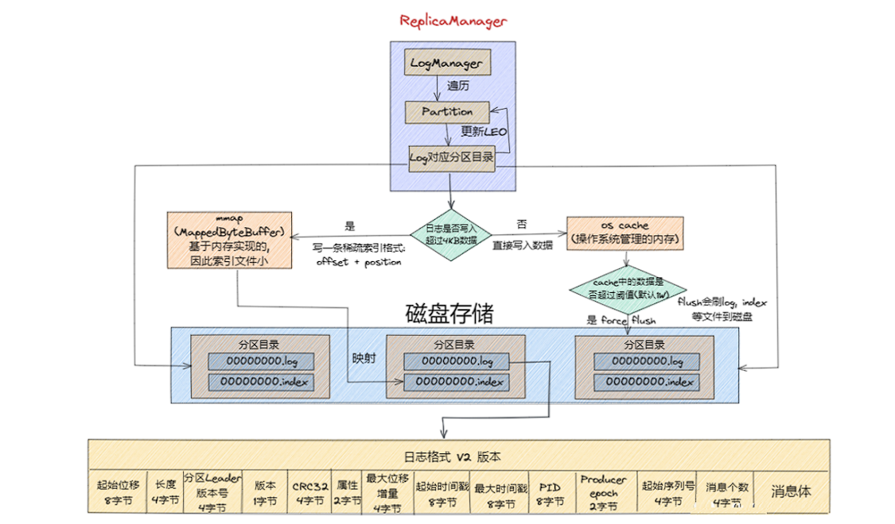

