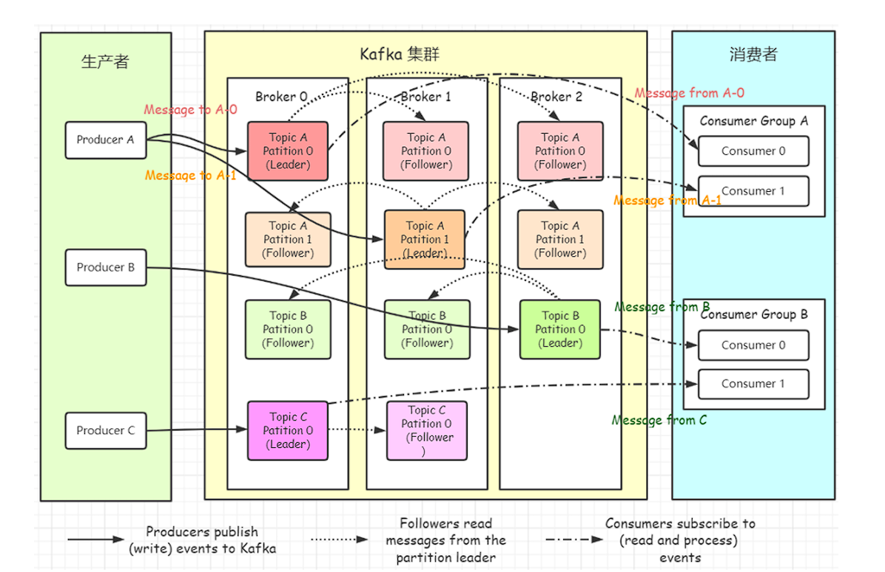
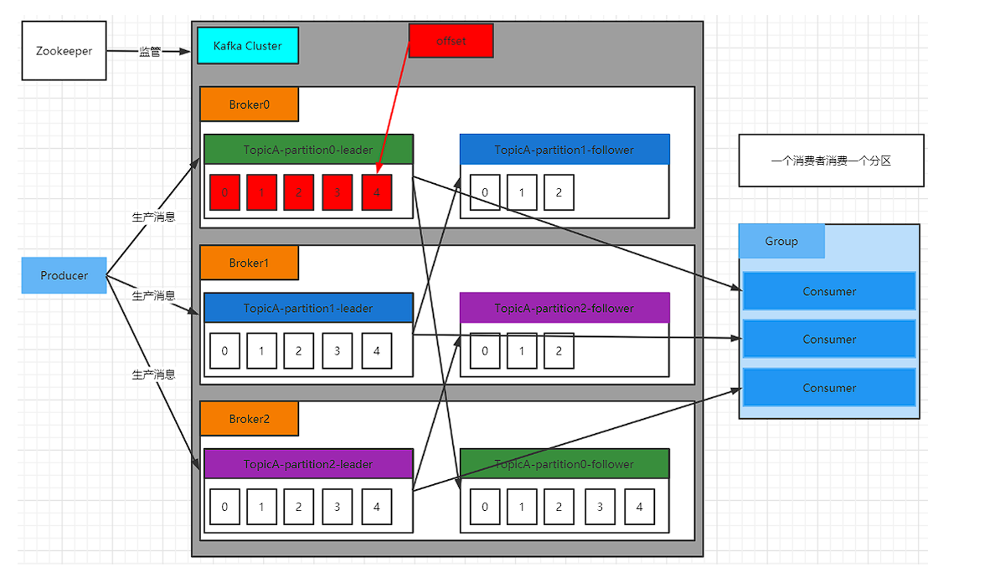
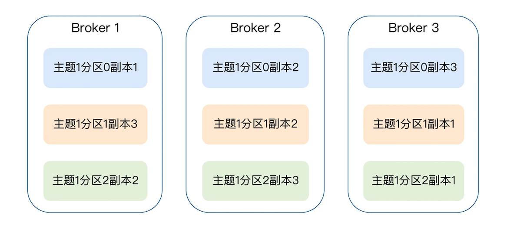
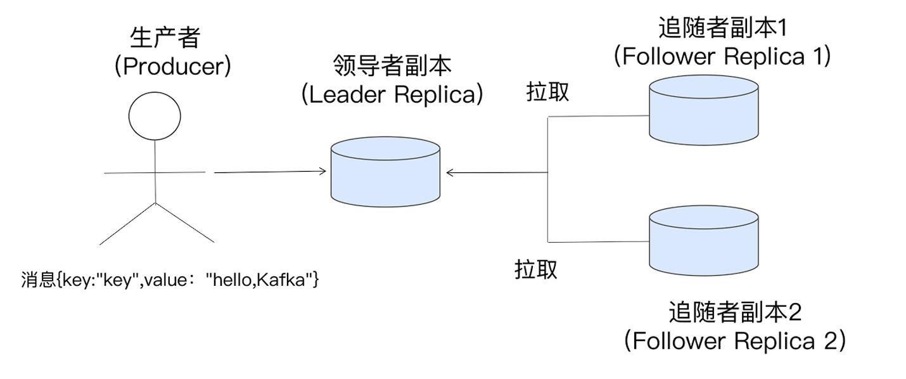
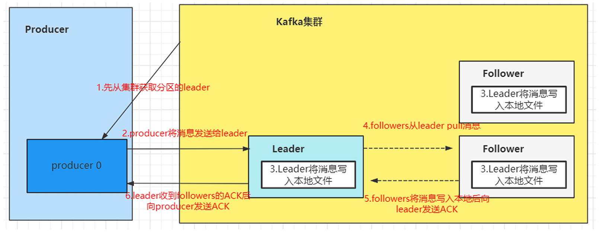
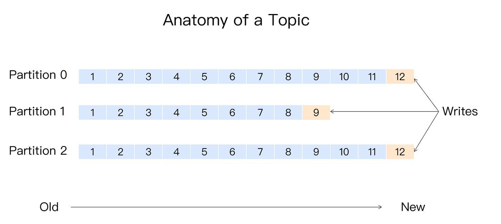
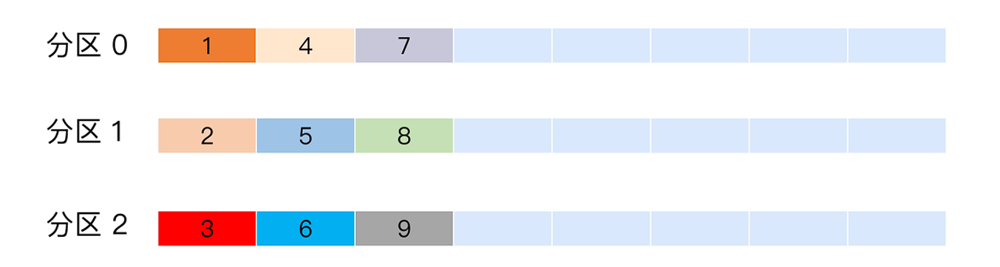
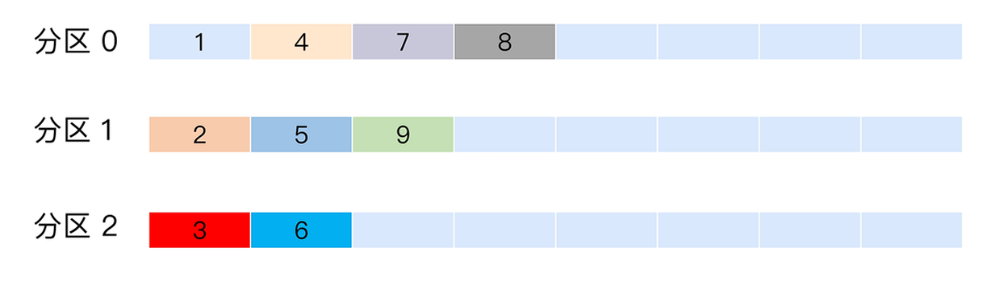

# Kafka的架构设计和生产者

Kafka 本质上是一个 MQ（Message Queue），其作为消息队列的作用有：

1. 解耦：允许我们独立的扩展或修改队列两边的处理过程。
2. 可恢复性：即使一个处理消息的进程挂掉，加入队列中的消息仍然可以在系统恢复后被处理。
3. 缓冲：有助于解决生产消息和消费消息的处理速度不一致的情况。
4. 灵活性和峰值处理能力：不会因为突发的超负荷的请求而完全崩溃，消息队列能够使关键组件顶住突发的访问压力。
5. 异步通信：消息队列允许用户把消息放入队列但不立即处理它。

Kafka 存储的消息来自任意多被称为 Producer 生产者的进程。数据从而可以被发布到不同的 topic 主题下的不同 Partition 分区。在一个分区内，这些消息被索引并连同时间戳存储在一起。

其它被称为 Consumer 消费者的进程可以从分区订阅消息。Kafka 运行在一个由一台或多台服务器组成的集群上，并且分区可以跨集群结点分布。

- Producer：消息生产者，向 Kafka Broker 发消息的客户端。
- Consumer：消息消费者，从 Kafka Broker 取消息的客户端。
- Consumer Group：消费者组（CG），消费者组内每个消费者负责消费不同分区的数据，提高消费能力。一个分区只能由组内一个消费者消费，消费者组之间互不影响。所有的消费者都属于某个消费者组，即消费者组是逻辑上的一个订阅者。
- Broker：一台 Kafka 机器就是一个 Broker。一个集群(kafka C1uster)由多个 Broker 组成。一个 Broker 可以容纳多个 topic。 broker都是由**zookeeper管理**。
- topic：可以理解为一个队列，topic 将消息分类，生产者和消费者面向的是同一个 topic。
- Partition：为了实现扩展性，提高并发能力，一个非常大的 topic 可以分布到多个 Broker （即服务器）上，一个 topic 可以分为多个 Partition，同一个topic在不同的分区的数据是不重复的，每个 Partition 是一个有序的队列，其表现形式就是一个一个的文件夹。
- Replication：每一个分区都有多个副本，副本的作用是做备胎。当主分区（Leader）故障的时候会选择一个备胎（Follower）上位，成为Leader。在kafka中默认副本的最大数量是10个，且副本的数量不能大于Broker的数量，follower和leader绝对是在不同的机器，同一机器对同一个分区也只可能存放一个副本（包括自己）。
- Message：消息，每一条发送的消息主体。
- Leader：每个分区多个副本的“主”副本，生产者发送数据的对象，以及消费者消费数据的对象，都是 Leader。
- Follower：每个分区多个副本的“从”副本，实时从 Leader 中同步数据，保持和 Leader 数据的同步。Leader 发生故障时，某个 Follower 还会成为新的 Leader。
- Offset：消费者消费的位置信息，监控数据消费到什么位置，当消费者挂掉再重新恢复的时候，可以从消费位置继续消费。
- ZooKeeper：Kafka 集群能够正常工作，需要依赖于 ZooKeeper，ZooKeeper 帮助 Kafka 存储和管理集群信息。

## Kafka的工作原理

Kafka 中消息是以 topic 进行分类的，生产者生产消息，消费者消费消息，面向的都是同一个 topic。topic 是逻辑上的概念，而 Partition 是物理上的概念，每个 Partition 对应于一个 log 文件，该 log 文件中存储的就是 Producer 生产的数据。

Producer 生产的数据会不断追加到该 log 文件末端，且每条数据都有自己的 Offset。不同的Partition的offset 是独立的。

消费者组中的每个消费者，都会实时记录自己消费到了哪个 Offset，以便出错恢复时，从上次的位置继续消费。

> kafka日志默认在：/tmp/kafka-logs

## kafka的副本

副本机制（Replication），也可以称之为备份机制，通常是指分布式系统在多台网络互联的机器上保存有相同的数据拷贝。通常副本机制的好处在于：

1. 提供数据冗余。在一部分节点宕机的时候，系统仍能继续工作（即提高可用性）。
2. 提供高伸缩性。支持扩大机器数量，从而可以支撑更高的读请求量，比如fastdfs、mongodb。
3. 改善数据局部性。允许将数据放入与用户地理位置相近的地方，从而降低系统延时。

但是kafka不支持通过副本机制提高读的请求量，也不支持改善数据局部性的特性，只实现了副本机制带来的第 1 个好处，即是提供数据冗余实现高可用性和高持久性。

在kafka生产环境中，每台 Broker 都可能保存有各个主题下不同分区的不同副本，因此，单个 Broker 上存有成百上于个副本的现象是非常正常的。如下所示，一个有 3 台 Broker 的 Kafka 集群上的副本分布情况。

主题 1 分区 0 的 3 个副本分散在 3 台 Broker 上，其他主题分区的副本也都散落在不同的 Broker 上，从而实现数据冗余。

Kafka的副本是基于领导者（Leader-based）的副本机制 。 在 Kafka 中，副本分成两类：领导者副本（Leader Replica）和追随者副本（Follower Replica）。每个分区在创建时都要选举一个副本，称为领导者副本，其余的副本自动称为追随者副本。

Kafka 副本机制中的追随者副本是不对外提供服务的，不同于Fastdfs、MongdoDB等。当领导者副本挂掉了，或领导者副本所在的 Broker 宕机时，Kafka 依托于 ZooKeeper 提供的监控功能能够实时感知到，并立即开启新一轮的领导者选举，从追随者副本中选一个作为新的领导者。老 Leader 副本重启回来后，只能作为追随者副本加入到集群中。

> 一个分区只能属于一个主题，一个主题可以有多个分区。同一主题的不同分区内容不一样，每个分区有自己独立的offset。同一主题不同的分区能够被放置到不同节点的broker。分区规则设置得当可以使得同一主题的消息均匀落在不同的分区。

## Kafka的生产者

producer就是生产者，是数据的入口。Producer在写入数据的时候永远的**找leader**，不会直接将数据写入follower。具体流程如下所示：

kafka分区最主要的目的是可以实现水平扩展。Kafka 的消息组织方式实际上是三级结构：主题 - 分区 - 消息。主题下的每条消息只会保存在某一个分区中，而不会在多个分区中被保存多份。如下所示：

分区的作用主要提供**负载均衡**的能力，能够实现系统的高伸缩性（Scalability)。不同的分区能够被放置到不同节点的机器上，而数据的读写操作也都是针对分区这个粒度而进行的，这样每个节点的机器都能独立地执行各自分区的读写请求处理。

当性能不足的时候可以通过添加新的节点机器来增加整体系统的吞吐量。实际使用中，需要将 Producer 发送的数据封装成一个 ProducerRecord对象，该对象需要指定一些参数：

- topic：string 类型，NotNull。
- partition：int 类型，可选。
- timestamp：long 类型，可选。
- key：string 类型，可选。
- value：string 类型，可选。
- headers：array 类型，Nullable。

### 生产者的分区策略

所谓分区策略是决定生产者将消息发送到哪个分区的算法。Kafka 为我们提供了默认的分区策略，同时它也支持你自定义分区策略：轮询策略、随机策略、按消息键、默认分区。

#### 轮询策略

Round-robin 策略，即顺序分配。比如一个主题下有 3 个分区，那么第一条消息被发送到分区 0，第二条被发送到分区 1，第三条被发送到分区 2，以此类推。当生产第 4 条消息时又会重新开始，即将其分配到分区 0 。

轮询策略有非常优秀的负载均衡表现，它总是能保证消息最大限度地被平均分配到所有分区上，故默认情况下它是最合理的分区策略，也是我们最常用的分区策略之一。

#### 随机策略

Randomness 策略，随机就是我们随意地将消息放置到任意一个分区上。随机策略是老版本生产者使用的分区策略，在新版本中已经改为轮询了。

####  按消息键保序策略

Key-ordering 策略，Kafka 允许为每条消息定义消息键，简称为 Key。这个 Key 的作用非常大，它可以是一个有着明确业务含义的字符串，比如客户代码、部门编号或是业务 ID 等；也可以用来表征消息元数据。

特别是在 Kafka不支持时间戳的年代，在一些场景中，工程师们都是直接将消息创建时间封装进 Key 里面的。一旦消息被定义了 Key，那么你就可以保证同一个 Key 的所有消息都进入到相同的分区里面，由于每个分区下的消息处理都是有顺序的，故这个策略被称为按消息键保序策略。

#### 默认分区规则

默认的分区规则，消息是按照三种策略进入分区

1. 指明 Partition 的情况下，直接将给定的 Value 作为 Partition 的值。
2.  没有指明 Partition 但有 Key 的情况下，将 Key 的 Hash 值与分区数取余得到 Partition 值。
3.  既没有 Partition 有没有 Key 的情况下，第一次调用时随机生成一个整数（后面每次调用都在这个整数上自增），将这个值与可用的分区数取余，得到 Partition 值，也就是常说的 Round-Robin 轮询算法。

