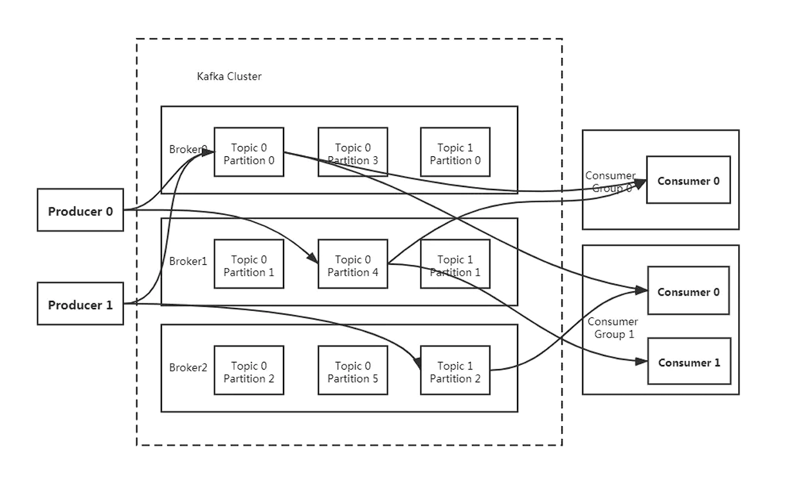
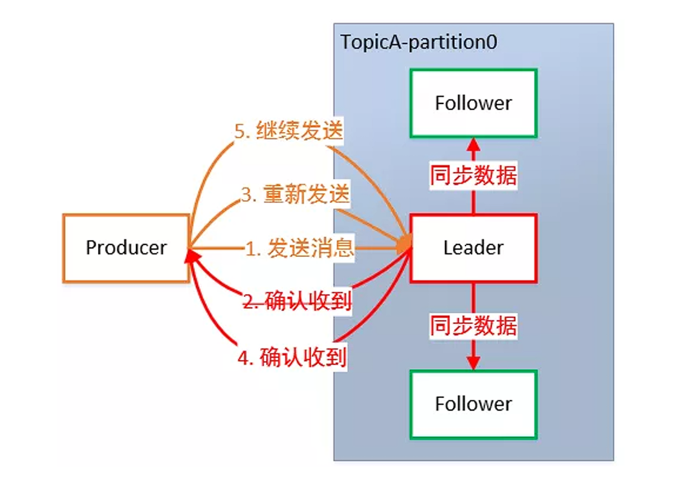
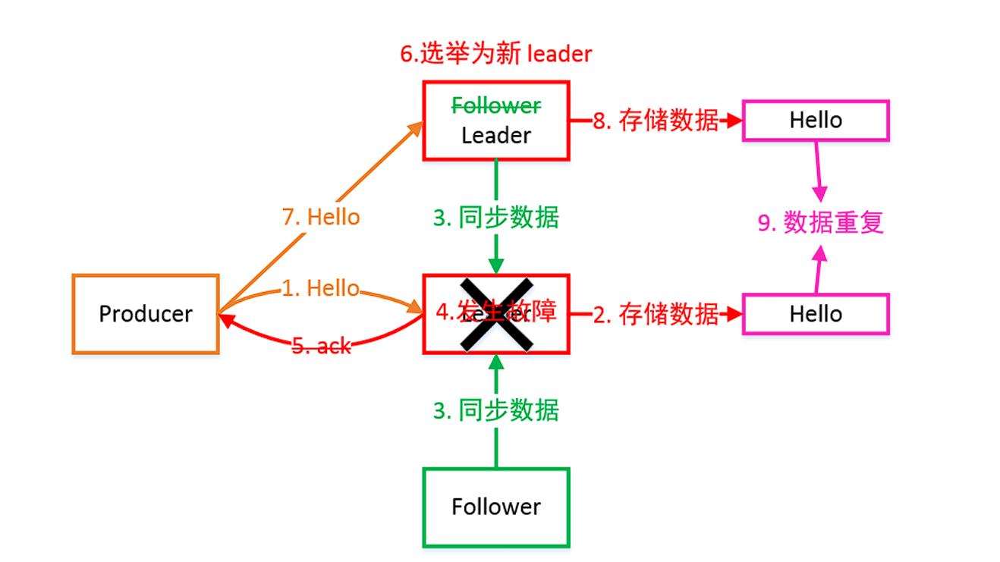

# Kafka的消费者和数据可靠性

## 消费组

传统的消息队列模型的缺陷在于消息一旦被消费，就会从队列中被删除（zeromq），而且只能被下游的一个 Consumer 消费。严格来说，这一点不算是缺陷，只能算是它的一个特性。但很显然，这种模型的伸缩性（scalability）很差，因为下游的多个 Consumer 都要“抢”这个共享消息队列的消息。

发布 / 订阅模型倒是允许消息被多个 Consumer 消费，但它的问题也是伸缩性不高，因为每 个订阅者都必须要订阅主题的所有分区。这种全量订阅的方式既不灵活，也会影响消息的真实投递效 果。

当 Consumer Group 订阅了多个主题后，组内的每个实例不要求一定要订阅主题的所有分区，它只会消 费部分分区中的消息。Consumer Group 之间彼此独立，互不影响，它们能够订阅相同的一组主题而互 不干涉。再加上 Broker 端的消息留存机制，Kafka 的 Consumer Group 完美地规避了上面提到的伸缩 性差的问题。

Kafka 仅仅使用 Consumer Group 这一种机制，却同时实现了传统消息引擎系统的两大模型：

1. 如果所有实例（消费者）都属于同一个 Group，那么它实现的就是点对点消息队列模型。
2. 如果所有实例（消费者）分别属于不同的 Group，那么它实现的就是发布 / 订阅模型。

Consumer 采用 Pull（拉取）模式从 Broker 中读取数据。Pull 模式则可以根据 Consumer 的消费能力以适当的速率消费消息。

Pull 模式不足之处是，如果 Kafka没有数据，消费者可能会陷入循环中，一直返回空数据。因为消费者从 Broker 主动拉取数据，需要维护一个长轮询。

针对长轮询这一点， Kafka 的消费者在消费数据时会传入一个时长参数 timeout。如果当前没有数据可供消费，Consumer 会等待一段时间之后再返回，这段时长即为 timeout。

### 消费者分区的分配策略

一个消费者可以订阅多个主题，可以去消费多个分区，一个分区不支持多个消费者（同一个消费组）读 取。一个消费者组中有多个 consumer，一个 topic 有多个 partition，所以必然会涉及到 partition 的分 配问题，即确定那个 partition 由哪个 consumer 来消费。

Kafka 有四种分配策略，可以通过参数 partition.assignment.strategy 来配置，默认 Range +  CooperativeSticky。当消费者组里面的消费者个数发生改变的时 候，也会触发再平衡。

- Range：针对每个 topic。将 topic 中的分区与消费者排序，通过分区数/消费者数决定每个消费者 消费几个分区，若除不尽则前面几个消费者会多消费1个分区。注意，如果有N个 topic，容易产生 数据倾斜。
- Round Robin：针对集群中的所有 topic。把所有分区和所有的消费者都列出来，然后按照  hashcode 进行排序，最后通过轮训算法来分配分区给到各个消费者。
- Sticky：粘性分区从 0.11.x 版本开始引入，首先会尽量均衡的放置分区到消费者上面，在出现同一 消费者组内消费者出现问题的时候，会尽量保持原有分配的分区不变化。
- Cooperative Sticky: 在**不停止**消费的情况下进行**增量再平衡**。这与 Sticky 的逻辑相同，但具有增 量支持。这种策略可能会产生不平衡的分配。

#### Range Assignor分配策略

RangeAssignor 分配策略的原理是按照消费者总数和分区总数进行整除运算来获得一个跨度， 然后将分 区按照跨度进行平均分配，以保证分区尽可能均匀地分配给所有的消费者。

每一个主题，Range Assignor策略会将消费组内所有订阅这个主题的消费者按照名称的字典序排序，然后为每个消费者划分固定的分区范围，如果不够平均分配，那么字典序靠前的消费者会被多分配一个分 区。

假设n= 分区数／消费者数量，m= 分区数％消费者数量，那么前m个消费者每个分配n+1个分区，后面 的（消费者数量-m)个消费者每个分配n个分区。

假设消费组内有2个消费者C0和C1都订阅了主题t0和t1, 并且每个主题都有4个分区，那 么订阅的所有分 区可以标识为： t0p0、t0p1、t0p2、t0p3、t1p0、t1p1、t1p2、t1p3。最终的分配结果为：

- 消费者C0: t0p0、t0p1、t1p0、t1p1
- 消费者C1: t0p2、t0p3、t1p2、t1p3

上面的情况这样分配得很均匀，但是并不能一直保持这种良好的特性，比如假设上面例子中2个主题都只有3个分区，那么订阅的所有分区可以标识为：t0p0、 t0p1、t0p2、t1p0、t1p1、t1p2最终的分配结果为：

- 消费者C0: t0p0、t0p1、t1p0、t1p1
- 消费者C1: t0p2、t1p2

可以明显地看到这样的分配并不均匀，如果将类似的情形扩大，则有可能出现部分消费者过载的情况。 

####  Round Robin Assignor分配策略

Round Robin Assignor 分配策略的原理是将消费组内所有消费者及消费者订阅的所有主题的分区按照字典序排序，然后通过轮询方式逐个将分区依次分配给每个消费者。

Round Robin Assignor 分配策略对应 的Partition.assignment.strategy参数值为 org.apache.kafka.C1ients.Consumer.RoundRobinAssignor。 如果同一个消费组内所有的消费者的订阅信息都是相同的，那么Round Robin Assignor分配策略的分区 分配会是均匀的。

假设消费组中有2个消费者C0 和C1都订阅了主题 t0和t1, 并且每个主题都有3个分区，那么订阅的 所有分区可以标识为：t0p0、t0p1、t0p2、t1p0、 t1p1、t1p2。最终的分配结果为： 

- 消费者C0: t0p0、t0p2、t1p1 
- 消费者C1: t0p1、t1p0、t1p2

如果同一个消费组内的消费者订阅的信息是不相同的， 那么在执行分区分配的时候就不是完全的轮询分 配，有可能导致分区分配得不均匀。 如果某个消费者没有订阅消费组内的某个主题， 那么在分配分区的 时候此消费者将分配不到这个主题的任何分区。

例如假设消费组内有3个消费者(C0、 C1和C2), 它们共订阅了3个主题(t0、t1、 t2) , 这 3个主题分别有 1、2、3个分区， 即整个消费组订阅了t0p0、 t1p0、 t1p1、 t2p0、 t2p1、 t2p2这6个分区。 具体而 言， 消费者 C0 订阅的是主题t0, 消费者C1 订阅的是主题t0和t1, 消费者C2 订阅的是主题t0、t1和t2, 那 么最终的分配结果为： 

- 消费者C0: t0p0
- 消费者C1: t1p0  
- 消费者C2: t1p1、t2p0、 t2p1、t2p2

可以看到Round Robin Assignor策略也不是十分完美， 这样分配其实并不是最优解， 因为完全可以将分区t1p1 分配给消费者C1。所以如果使用Round Robin Assignor策略，则消费者应该订阅相同的主题。

#### Sticky Assignor分配策略

"sticky"这个单词可以翻译为“ 黏性的", Kafka  从0.11.x版本 开始引入这种分配策略， 它主要有两个目的：

1. 分区的分配要尽可能均匀。
2. 分区的分配尽可能与上次分配的保待相同。

当两者发生冲突时， 第一个目标优先于第二个目标。鉴于这两个目标， Sticky Assignor分配策略的具体实现要比Range Assignor和Round Robin Assignor这 两种分配策略要复杂得多。

假设消费组内有3个消费者(C0、C1和C2)，它们都订阅了4个主题(t0、t1、t2、t3)，并且每个主题有2个 分区。 也就是说，整个消费组订阅了t0p0、 t0p1、 t1p0、 t1p1、 t2p0、 t2p1、 t3p0、 t3p1这8个分 区。 最终的分配结果如下：

- 消费者C0: t0p0、t1p1、t3p0 
- 消费者C1: t0p1、t2p0、t3p1
- 消费者C2: t1p0、t2p1

这样初看上去似乎与采用Round Robin Assignor分配策略所分配的结果相同， 但再假设此时消费者 C1脱离了消费组， 那么消费组就会执行再均衡操作，进而消费分区会重新分配。 如果采用Round Robin Assignor 分配策略， 那么此时的分配结果如下：

- 消费者C0: t0p0、t1p0、t2p0、t3p0
- 消费者C2: t0p1、t1p1、t2p1、t3p1

如上面的分配结果所示，Round Robin Assignor分配策略会按照消费者C0 和C2进行重新轮询分配。 如果此时 使用的是Sticky Assignor分配策略，那么分配结果为：

- 消费者C0: t0p0、t1p1、t3p0、t2p0
- 消费者C2: t1p0、t2p1、t0p1、t3p1 

可以看到分配结果中保留了上一次分配中对消费者 C0 和C2的所有分配结果，并将原来消费者C1的 "负担 " 分配给了剩余的两个消费者 C0 和C2， 最终 C0 和C2的分配还保持了均衡。 

如果发生分区重分配，那么对于同一个分区而言，有可能之前的消费者和新指派的消费者不是同一个， 之前消费者**进行到一半的处理**还要在新指派的消费者中再次**复现一遍**，这显然很浪费系统资源。

Sticky Assignor 分配策略如同其名称中的"Sticky" 一样，让分配策略具备一定的"黏性 " ，尽可能地让 前后两次分配相同，进而减少系统资源的损耗及其他异常情况的发生。

如果在订阅信息不同的清况下的处理，例如当同样消费组内有3个消费者(C0、C1和C2) , 集群中有3个主题(t0、t1和 t2) , 这3个主题分别有 1、2、3个分区。也就是说，集群中有t0p0、 t1p0、 t1p1、 t2p0、 t2p1、 t2p2这6个分区。消费者  C0 订阅了主题t0，消费者C1订阅了主题t0和t1, 消费者C2订阅了主题t0、t1和t2。 如果此时采用  Round Robin Assignor分配策略，分配结果为：

- 消费者C0: t0p0  
- 消费者C1: t1p0 
- 消费者C2: t1p1、t2p0、t2p1、t2p2

如果此时采用的是Sticky Assignor分配策略，那么最终的分配结果如下所示：

- 消费者C0: t0p0 
- 消费者C1: t1p0、t1p1 
- 消费者C2: t2p0、t2p1、t2p2

可以看到这才是一个最优解（消费者C0 没有订阅主题t1和t2，所以不能分配主题t1和t2 中的任何分区给 它， 对于消费者C1也可同理推断）。

假如此时消费者C0 脱离了消费组， 那么Round Robin Assignor分配策略的分配结果为：

- 消费者C1: t0p0、t1p1 
- 消费者C2: t1p0、t2p0 、t2p1、 t2p2

可以看到Round Robin Assignor策略保留了消费者C1和C2中原有的3个分区的分配：t2p0、 t2p1和t2p2。 如果采用的是Sticky Assignor分配策略， 那么分配结果为：

- 消费者C1: t1p0、t1p1、t0p0 
- 消费者C2: t2p0、t2p1、 t2p2

可以看到Sticky Assignor分配策略保留了消费者C1和C2中原有的5个分区的分配。使用Sticky Assignor分配策略的一个优点就是可以使分区重分配具备 “ 黏性"' 减少不必要的分区移动（即 一个分区剥离之前的消费者，转而分配给另一个新的消费者）

Sticky Assignor分配策略比另外两者分配策略而言显得更加优异，但这个策略的代码实现也异常复杂。

## 数据可靠性

为保证 Producer 发送的数据，能可靠地发送到指定的 topic，topic 的每个Partition 收到 Producer 发送的数据后，都需要向 Producer 发送 ACK 确认收到。如果 Producer 收到 ACK，就会进行下一轮的发送，否则重新发送数据。

何时发送 ACK？确保有 Follower 与 Leader 同步完成，Leader 再发送 ACK，这样才能保证 Leader 挂 掉之后，能在 Follower 中选举出新的 Leader 而不丢数据。一般有以下两种方案：

| 方案                         | 优点                                                | 缺点                                                |
| ---------------------------- | --------------------------------------------------- | --------------------------------------------------- |
| 半数以上完成同 步，就发送ack | 延迟低                                              | 选举新的leader时，容忍n台节点故障，需要2n+1个副本。 |
| 全部完成同步， 才发送ack     | 选举新的leader时，容忍n台节点 故障，需要n+1个副本。 | 延迟高。                                            |

当采用第二种方案时，所有 Follower 完成同步，Producer 才能继续发送数据，如果有一个 Follower 因为某种原因出现故障一直没有发送ACK，采用如下的策略:

1.  Leader维护了一个动态的**in-sync replica set（ISR）**。和 Leader 保持同步的 Follower 集 合。
2. 当 ISR 集合中的 Follower 完成数据的同步之后，Leader 就会给 Follower 发送 ACK。
3. 如果 Follower 长时间未向 Leader 同步数据，则该 Follower 将被踢出 ISR 集合，该时间阈值由  replica.lag.t1me.max.ms 参数设定。Leader 发生故障后，就会从 ISR 中选举出新的 Leader。

### 可靠性的ACK应答机制

对于某些不太重要的数据，对数据的可靠性要求不是很高，能够容忍数据的少量丢失，所以没必要等  ISR 中的 Follower 全部接受成功。所以 Kafka 为用户提供了三种可靠性级别，用户根据可靠性和延迟的要求进行权衡，选择以下的配置：

- 0：Producer 不等待 Broker 的 ACK，这提供了最低延迟，Broker 一收到数据还没有写入磁盘就 已经返回，当 Broker 故障时有可能丢失数据。
- 1：Producer 等待 Broker 的 ACK，Partition 的 Leader 落盘成功后返回 ACK，如果在 Follower  同步成功之前 Leader 故障，那么将会丢失数据。
- -1（all）：Producer 等待 Broker 的 ACK，Partition 的 Leader 和 Follower 全部落盘成功后才返 回 ACK。但是在 Broker 发送 ACK 时，Leader 发生故障，则会造成数据重复。

### kafka 的可靠性指标

没有一个中间件能够做到百分之百的完全可靠。软件系统的可靠性只能够无限去接近100%，但不可能达到100%。所以kafka为了实现最大可能 的可靠性可以使用以下的方法：

1. 分区副本。可以创建更多的分区来提升可靠性，但是分区数过多也会带来性能上的开销。一般来说，3个副本就能满足对大部分场景的可靠性要求。
2. ACKS。生产者发送消息的可靠性，也就是要保证我这个消息一定是到了broker并且完成了多副本的持久化。
3. enable.aut0.Commit默认为true，也就是自动提交offset，自动提交是批量执行的，有一个时间窗口，这种方式会带来重复提交或者消息丢失的问题，所以对于高可靠性要求的程序，要使用手动提交。 对于高可靠要求的应用来说，宁愿重复消费也不应该因为消费异常而导致消息丢失。