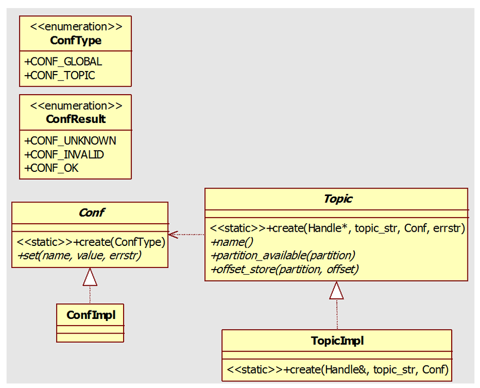

#  Kafka的常用C++操作API接口

安装kafka从C++操作库librdkafka

```shell
git clone https://github.com/edenhill/librdkafka.git
cd librdkafka
./configure
make && make install
sudo ldconfig
```

kafka的常用缩略语

| 缩略语  | 缩略语全称        | 示例或说明                                  |
| ------- | ----------------- | ------------------------------------------- |
| rd      | Rapid Development | 快速开发rd.h                                |
| rk      | RdKafka           |                                             |
| toppar  | Topic Partition   | struct rd_kafka_toppar_t { }                |
| rep     | Reply             | struct rd_kafka_t { rd_kafka_q_t *rk_rep }; |
| msgq    | Message Queue     | struct rd_kafka_msgq_t { };                 |
| rkb     | RdKafka Broker    | Kafka代理                                   |
| rko     | RdKafka Operation | Kafka操作                                   |
| rkm     | RdKafka Message   | Kafka消息                                   |
| payload |                   | 存在Kafka上的消息（或叫Log)                 |

## kafka常用的API

### 常用的数据结构

| 名称                             | 说明                            |
| -------------------------------- | ------------------------------- |
| RdKafka::DeliveryReportCb        | Delivery Report回调类           |
| RdKafka::PartitionerCb           | Partitioner回调类               |
| RdKafka::PartitionerKeyPointerCb | 带key指针的Partitioner回调类    |
| RdKafka::EventCb                 | Event回调类                     |
| RdKafka::Event                   | Event类                         |
| RdKafka::ConsumeCb               | Consume回调类                   |
| RdKafka::RebalanceCb             | KafkaConsunmer: Rebalance回调类 |
| RdKafka::OffsetCommitCb          | Offset Commit回调类             |
| RdKafka::SocketCb                | Socket回调类                    |
| RdKafka::OpenCb                  | Open回调类                      |
| RdKafka::Conf                    | 配置接口类                      |
| RdKafka::Handle                  | 客户端基类                      |
| RdKafka::TopicPartition          | Topic+Partion类                 |
| RdKafka::Topic                   | Topic Handle                    |
| RdKafka::Message                 | 消息对象类                      |
| RdKafka::Queue                   | 队列接口                        |
| RdKafka::KafkaConsumer           | KafkaConsumer高级接口           |
| RdKafka::Consumer                | 简单Consumer类                  |
| RdKafka::Producer                | Producer类                      |
| RdKafka::BrokerMetadata          | Broker元数据信息类              |
| RdKafka::PartitionMetadata       | Partition元数据信息类           |
| RdKafka::TopicMetadata           | Topic元数据信息类               |
| RdKafka::Metadata                | 元数据容器                      |

### 通用API

| 名称                                                  | 说明                            |
| ----------------------------------------------------- | ------------------------------- |
| int RdKafka::version ();                              | 获取librdkafka版本              |
| std::string RdKafka::version_str();                   | 获取librdkafka版本              |
| std::string RdKafka::get_debug_contexts ();           | 获取librdkafka调试环境          |
| int RdKafka::wait_destroyed(int timeout_ms);          | 等待所有的 rd_kafka_t对象销毁   |
| std::string RdKafka::err2str(RdKafka::ErrorCode err); | 将Kafka错误代码转换成可读字符串 |

### 配置RdKafka::Conf的API

```c++
enum  ConfType{ 
CONF_GLOBAL, // 全局配置
CONF_TOPIC // Topic配置
};
enum  ConfResult{ 
CONF_UNKNOWN = -2, 
CONF_INVALID = -1, 
CONF_OK = 0 
};
```



| 名称                                                         | 说明                                                         |
| ------------------------------------------------------------ | ------------------------------------------------------------ |
| static Conf * create(ConfType type);                         | 创建配置对象                                                 |
| Conf::ConfResult set(const std::string &name, const std::string &value, std::string &errstr); | 设置配置对象的属性值，成功返回CONF_OK，错误时错误信息输出到errstr |
| Conf::ConfResult set(const std::string &name, DeliveryReportCb *dr_cb, std::string &errstr); | 设置dr_cb属性值                                              |
| Conf::ConfResult set(const std::string &name, EventCb *event_cb, std::string &errstr); | 设置event_cb属性值                                           |
| Conf::ConfResult set(const std::string &name, const Conf *topic_conf, std::string &errstr); | 设置用于自动订阅Topic的默认Topic配置                         |
| Conf::ConfResult set(const std::string &name, PartitionerCb *partitioner_cb, std::string &errstr); | 设置partitioner_cb属性值，配置对象必须是CONF_TOPIC类型       |
| Conf::ConfResult set(const std::string &name, PartitionerKeyPointerCb *partitioner_kp_cb,  std::string &errstr); | 设置partitioner_key_pointer_cb属性值                         |
| Conf::ConfResult set(const std::string &name, SocketCb *socket_cb, std::string &errstr); | 设置socket_cb属性值                                          |
| Conf::ConfResult set(const std::string &name, OpenCb *open_cb, std::string &errstr); | 设置open_cb属性值                                            |
| Conf::ConfResult set(const std::string &name, RebalanceCb *rebalance_cb, std::string &errstr); | 设置rebalance_cb属性值                                       |
| Conf::ConfResult set(const std::string &name, OffsetCommitCb *offset_commit_cb, std::string  &errstr); | 设置offset_commit_cb属性值                                   |
| Conf::ConfResult get(const std::string &name, std::string &value) const; | 查询单条属性配置值                                           |
| std::list std::string * dump ();                             | 按name,value元组序列化配置对象的属性名称和属性值到链表       |
| virtual struct rd_kafka_conf_s *c_ptr_global () = 0;         | 如果是CONF_GLOBAL类型配置对象，返回底层数据结构rd_kafka_conf_t句柄，否则返回NULL |
| virtual struct rd_kafka_topic_conf_s *c_ptr_topic () = 0;    | 如果是CONF_TOPIC类型配置对象，返回底层数据结构的rd_kafka_topic_conf_t句柄，否则返回0 |

### RdKafka::Topic主题类API

| 名称                                                         | 说明                                                         |
| ------------------------------------------------------------ | ------------------------------------------------------------ |
| static Topic * create(Handle *base, const std::string &topic_str, Conf *conf, std::string  &errstr); | 使用conf配置创建名为topic_str的Topic句柄                     |
| const std::string name ();                                   | 获取Topic名称                                                |
| bool partition_available(int32_t partition) const;           | 获取parition分区是否可用，只能在 RdKafka::PartitionerCb回调函数内被调用 |
| ErrorCode offset_store(int32_t partition, int64_t offset);   | 存储Topic的partition分区的offset位移，只能用于RdKafka::Consumer，不能用于  RdKafka::KafkaConsumer高级接口类。使用本接口时，auto.commit.enable参数必须设置为 false |
| virtual struct rd_kafka_topic_s *c_ptr () = 0;               | 返回底层数据结构的rd_kafka_topic_t句柄，不推荐利用rd_kafka_topic_t句柄调用C API。但如果 C++ API没有提供相应功能，可以直接使用C API和librdkafka核心交互 |
| static const int32_t PARTITION_UA = -1;                      | 未赋值分区                                                   |
| static const int64_t OFFSET_BEGINNING = -2;                  | 特殊位移，从开始消费                                         |
| static const int64_t OFFSET_END = -1;                        | 特殊位移，从末尾消费                                         |
| static const int64_t OFFSET_STORED = -1000;                  | 使用offset存储                                               |

### 消息RdKafka::Message的API

Message表示一条消费或生产的消息或是事件。

| 名称                                                         | 说明                                                         |
| ------------------------------------------------------------ | ------------------------------------------------------------ |
| std::string errstr() const;                                  | 如果消息是一条错误事件，返回错误字符串，否则返回空字符串。   |
| ErrorCode err() const;                                       | 如果消息是一条错误事件，返回错误代码，否则返回0              |
| Topic * topic() const;                                       | 返回消息的Topic对象。如果消息的Topic对象没有显示使用RdKafka::Topic::create()创建，需要使 用topic_name函数 |
| std::string topic_name() const;                              | 返回消息的Topic名称                                          |
| int32_t partition() const;                                   | 如果分区可用，返回分区号                                     |
| void * payload() const;                                      | 返回消息数据                                                 |
| size_t len() const;                                          | 返回消息数据的长度                                           |
| const std::string * key() const;                             | 返回字符串类型的消息key                                      |
| const void * key_pointer() const;                            | 返回void类型的消息key                                        |
| size_t key_len() const;                                      | 返回消息key的二进制长度                                      |
| int64_t offset () const;                                     | 返回消息或错误的位移                                         |
| void * msg_opaque() const;                                   | 返回RdKafka::Producer::produce()提供的msg_opaque             |
| virtual MessageTimestamp timestamp() const = 0;              | 返回消息时间戳                                               |
| virtual int64_t latency() const = 0;                         | 返回produce函数内生产消息的微秒级时间延迟，如果延迟不可用，返回-1 |
| virtual struct rd_kafka_message_s *c_ptr () = 0;             | 返回底层数据结构的C的 rd_kafka_message_t句柄                 |
| virtual Status status () const = 0;                          | 返回消息在Topic Log的持久化状态                              |
| virtual RdKafka::Headers *headers () = 0;                    | 返回消息头                                                   |
| virtual RdKafka::Headers *headers (RdKafka::ErrorCode *err) = 0; | 返回消息头，错误信息会输出到err                              |

### 主题分区RdKafka::TopicPartition的API

| 名称                                                         | 说明                       |
| ------------------------------------------------------------ | -------------------------- |
| static TopicPartition * create(const std::string &topic, int partition);· | 创建一个TopicPartition对象 |
| static TopicPartition *create (const std::string &topic, int partition,int64_t offset); | 创建TopicPartition对象     |
| static void destroy (std::vector &partitions);               | 销毁所有TopicPartition对象 |
| const std::string & topic () const;                          | 返回Topic名称              |
| int partition ();                                            | 返回分区号                 |
| int64_t offset();                                            | 返回位移                   |
| void set_offset(int64_t offset);                             | 设置位移                   |
| ErrorCode err();                                             | 返回错误码                 |

### 生产者RdKafka::Producer的API

| 名称                                                         | 说明                                                         |
| ------------------------------------------------------------ | ------------------------------------------------------------ |
| static Producer * create(Conf *conf, std::string &errstr);   | 创建一个新的Producer客户端对象，conf用于替换默认配置对象，本函数调用后conf可以重用。  成功返回新的Producer客户端对象，失败返回NULL，errstr可读错误信息。 |
| ErrorCode produce(Topic *topic, int32_t partition, int msgflags, void *payload, size_t len,  const std::string *key, void *msg_opaque); | 生产和发送单条消息到Broker。                                 |
| ErrorCode produce(Topic *topic, int32_t partition, int msgflags, void *payload, size_t len,  const void *key, size_t key_len, void *msg_opaque); | 生产和发送单条消息到Broker，传递key数据指针和key长度。       |
| ErrorCode produce(Topic *topic, int32_t partition, const std::vector< char > *payload, const  std::vector< char > *key, void *msg_opaque); | 生产和发送单条消息到Broker，传递消息数组和key数组。接受数组类型的key和payload，数组会被复制。 |
| ErrorCode flush (int timeout_ms)                             | 等待所有未完成的所有Produce请求完成。 为了确保所有队列和已经执行的Produce请求在中止前完成，flush操作优先于销毁生产者实例完成。本函数会调用Producer::poll()函数，因此会触发回调函数。 |
| ErrorCode purge (int purge_flags)                            | 清理生产者当前处理的消息。本函数调用时可能会阻塞一定时间，当后台线程队列在清理时。 应用程序需要在调用poll或flush函数后，执行清理消息的dr_cb回调函数 |
| virtual Error *init_transactions (int timeout_ms) = 0;       | 初始化Producer实例的事务。 失败返回RdKafka::Error错误对象，成功返回NULL。通过调用RdKafka::Error::is_retriable()函数可以检查返回的错误对象是否有权限重试。调用 RdKafka::Error::is_fatal()检查返回的错误对象是否是严重错误。返回的错误对象必须delete。 |
| virtual Error *begin_transaction () = 0;                     | 启动事务。本函数调用前，init_transactions()函数必须被成功调用。成功返回NULL，失败返回错误对象。通过调用RdKafka::Error::is_fatal_error()函数可以检查是否是严重错误，返回的错误对象必须delete。 |
| virtual Error send_offsets_to_transaction (const std::vector &offsets,const  ConsumerGroupMetadata *group_metadata,int timeout_ms) = 0; | 发送TopicPartition位移链表到由group_metadata指定的Consumer Group协调器，如果事务提交 成功，位移才会被提交。 |
| virtual Error *commit_transaction (int timeout_ms) = 0;      | 提交当前事务。在实际提交事务时，任何未完成的消息会被完成投递。成功返回NULL，失败返回错误对象。通过调用错误对象的方法可以检查是否有权限重试，是否是严重错误、可中止错误等。 |
| virtual Error *abort_transaction (int timeout_ms) = 0;       | 停止事务。本函数从非严重错误、可终止事务中用于恢复。未完成消息会被清理。 |

```c++
ErrorCode produce(Topic *topic, int32_t partition, int msgflags, void *payload, size_t len, const std::string *key, void *msg_opaque);
// topic：主题
// partition：分区
// msgflags：可选项为RK_MSG_BLOCK、RK_MSG_FREE、RK_MSG_COPY。
// RK_MSG_FREE表示RdKafka调用produce完成后会释放payload数据
// RK_MSG_COPY表示payload数据会被拷贝，在produce调用完成后RdKafka不会使用payload指针
// RK_MSG_BLOCK表示在消息队列满时阻塞produce函数，如果dr_cb回调函数被使用，应用程序必须调用rd_kafka_poll函数确保投递消息队列的投递消息投递完。当消息队列满时，失败会导致produce函数的永久阻塞。
// RK_MSG_FREE和RK_MSG_COPY是互斥操作。
// 如果produce函数调用时指定了RK_MSG_FREE，并返回了错误码，与payload指针相关的内存数据必须由使用者负责释放。

// payload：长度为len的消息负载数据
// len：payload消息数据的长度
// key：key是可选的消息key，如果非NULL，会被传递给主题partitioner，并被随消息发送到Broker和传递给Consumer
// msg_opaque：msg_opaque是可选的应用程序提供给每条消息的opaque指针，opaque指针会在dr_cb回调函数内提供
/*
函数返回的值:
ERR_NO_ERROR：消息成功发送并入对列
ERR_QUEUE_FULL：最大消息数量达到queue.buffering.max.message
ERR_MSG_SIZE_TOO_LARGE：消息数据大小太大，超过messages.max.bytes配置的值
ERR_UNKNOWN_PARTITION：请求一个Kafka集群内的未知分区
ERR_UNKNOWN_TOPIC：topic是Kafka集群的未知主题
*/
```

### 处理RdKafka::Handle基类API

客户端handle基类，消费者需要继承该基类。

| 名称                                                         | 说明                                                         |
| ------------------------------------------------------------ | ------------------------------------------------------------ |
| const std::string name();                                    | 返回Handle的名称                                             |
| const std::string memberid() const;                          | 返回客户端组成员ID                                           |
| int poll (int timeout_ms);                                   | 轮询处理指定的Kafka句柄的Event，返回事件数量。事件会触发应用程序提供的回调函数调用。timeout_ms参数指定回调函数指定阻塞等待的最大时间间隔；对于非阻塞调用，指定timeout_ms参数为0；如果永远等待事件，设置timeout_ms参数为-1。RdKafka::KafkaConsumer实例禁止使用poll方法，使用RdKafka::KafkaConsumer::consume()方法代替。 |
| int outq_len();                                              | 返回当前出队列的长度，出队列包含等待发送到Broker的消息、请求和Broker要确认的消息、请求。 |
| ErrorCode metadata(bool all_topics, const Topic *only_rkt, Metadata **metadatap, int  timeout_ms); | 从Broker请求元数据，成功返回RdKafka::ERR_NO_ERROR，超时返回 RdKafka::ERR_TIMED_OUT，错误返回其它错误码。 |
| virtual ErrorCode pause (std::vector &partitions) = 0;       | 暂停分区链表中分区的消费和生产，返回ErrorCode::NO_ERROR。partitions中分区会返回成功或 错误信息 |
| virtual ErrorCode resume (std::vector &partitions) = 0;      | 恢复分区链表中分区的生产和消费，返回ErrorCode::NO_ERROR      |
| virtual ErrorCode query_watermark_offsets (const std::string &topic,int32_t partition,int64_t  *low, int64_t *high,int timeout_ms) = 0; | 查询topic主题partition分区的高水位和低水位，高水位输出到high，低水位输出到low，成功返回 RdKafka::ERR_NO_ERROR，失败返回错误码。 |
| virtual ErrorCode get_watermark_offsets (const std::string &topic,int32_t partition,int64_t  *low, int64_t *high) = 0; | 获取topic主题partition分区的高水位和低水位，高水位输出到high，低水位输出到low，成功返回 RdKafka::ERR_NO_ERROR，失败返回错误码。 |
| virtual ErrorCode offsetsForTimes (std::vector &offsets,int timeout_ms) = 0; | 通过时间戳查询给定分区的位移，每个分区返回的位移是最新的位移，阻塞timeout_ms |
| virtual Queue *get_partition_queue (const TopicPartition *partition) = 0; | 获取指定TopicPartition的消息队列，成功返回从指定分区获取的队列，否则返回NULL |
| virtual ErrorCode set_log_queue (Queue *queue) = 0;          | 将rdkafka logs转移到指定消息队列。queue是要转移rdkafka logs到的消息队列，如果为NULL， 则转移到主消息队列。Log.queue属性必须设置为true |
| virtual void yield () = 0;                                   | 取消当前回调函数调度器，如Handle::poll()、KafkaConsumer::consume()。只能再RdKafka回调 函数内调用。 |
| virtual const std::string clusterid (int timeout_ms) = 0;    | 返回Broker元数据报告的集群ID。                               |
| virtual struct rd_kafka_s *c_ptr () = 0;                     | 返回底层数据的rd_kafka_t句柄                                 |
| virtual int32_t controllerid (int timeout_ms) = 0;           | 返回Broker元数据报告的当前控制器ID，要求Kafka 0.10.0以上版本，并且 api.version.request=true |
| virtual ErrorCode fatal_error (std::string &errstr) = 0;     | 返回客户端实例的第一个fatal错误的错误代码                    |
| virtual ErrorCode oauthbearer_set_token (const std::string &token_value, int64_t md_lifetime_ms,  const std::string &md_principal_name,  const std::list \< std::string \> &extensions,  std::string &errstr) = 0; | 设置SASL/OAUTHBEARER令牌和元数                               |
| virtual ErrorCode oauthbearer_set_token_failure (const std::string &errstr) = 0; | 设置SASL/OAUTHBEARER刷新失败指示器                           |

### 普通消费者RdKafka::Consumer的API

RdKafka::Consumer是简单的非Rebalance、非Group的消费者。

| 名称                                                         | 说明                                                         |
| ------------------------------------------------------------ | ------------------------------------------------------------ |
| static Consumer * create(Conf *conf, std::string &errstr);   | 创建一个Kafka Consumer客户端对象                             |
| static int64_t OffsetTail(int64_t offset);                   | 从Topic尾部转换位移为逻辑位移                                |
| ErrorCode start(Topic *topic, int32_t partition, int64_t offset); | 从topic主题partition分区的offset位移开始消费消息，offset可以是普通位移，也可以是 OFFSET_BEGINNING或OFFSET_END，rdkafka会试图从Broker重复拉取批量消息到本地队列使其 维持queued.min.messages参数值数量的消息。start函数在没有调用stop函数停止消费时不能对同一个TopicPartition调用多次。应用程序会使用consume函数从本地队列消费消息。 |
| ErrorCode start(Topic *topic, int32_t partition, int64_t offset, Queue *queue); | 在消息队列queue的topic主题的partition分区开始消费            |
| ErrorCode stop(Topic *topic, int32_t partition);             | 停止从topic主题的partition分区消费消息，并清理本地队列的所有消息。应用程序需要在销毁所有 Consumer对象前停止所有消费者。 |
| ErrorCode seek (Topic *topic, int32_t partition, int64_t offset, int timeout_ms); | 定位topic的partition分区的Consumer位移到offset               |
| Message * consume(Topic *topic, int32_t partition, int timeout_ms); | 从topic主题和partition分区消费一条消息。timeout_ms是等待获取消息的最大时间。消费者必须 提前调用start函数。应用程序需要检查消费的消息是正常消息还是错误消息。应用程序完成时消息 对象必须销毁 |
| Message * consume(Queue *queue, int timeout_ms);             | 从指定消息队列queue消费一条消息                              |
| int consume_callback(Topic *topic, int32_t partition, int timeout_ms, ConsumeCb  *consume_cb, void *opaque); | 从topic主题和partition分区消费消息，并对每条消费的消息使用指定回调函数处理。consume_callback提供了比consume更高的吞吐量。 opaque参数回被传递给consume_cb的回调函数。 |
| int consume_callback(Queue *queue, int timeout_ms, RdKafka::ConsumeCb *consume_cb,  void *opaque); | 从消息队列queue消费消息，并对每条消费的消息使用指定回调函数处理。 |

### 高级消费者RdKafka::KafkaConsumer的API

KafkaConsumer是高级API，要求Kafka 0.9.0以上版本，当前支持range和roundrobin分区分配策略。

| 名称                                                         | 说明                                                         |
| ------------------------------------------------------------ | ------------------------------------------------------------ |
| static KafkaConsumer * create(Conf *conf, std::string &errstr); | 创建KafkaConsumer对象，conf对象必须配置Consumer要加入的消费者组。使用 KafkaConsumer::close()进行关闭。 |
| ErrorCode assignment(std::vector< RdKafka::TopicPartition * > &partitions); | 返回由RdKafka::KafkaConsumer::assign() 设置的当前分区        |
| ErrorCode subscription(std::vector< std::string > &topics);  | 返回由RdKafka::KafkaConsumer::subscribe() 设置的当前订阅Topic |
| ErrorCode subscribe(const std::vector< std::string > &topics); | 更新订阅Topic分区                                            |
| ErrorCode unsubscribe();                                     | 将当前订阅Topic取消订阅分区                                  |
| ErrorCode assign(const std::vector< TopicPartition * > &partitions); | 将分配分区更新为partitions                                   |
| ErrorCode unassign();                                        | 停止消费并删除当前分配的分区                                 |
| Message * consume(int timeout_ms);                           | 消费消息或获取错误事件，触发回调函数，会自动调用注册的回调函数，包括RebalanceCb、 EventCb、OffsetCommitCb等。需要使用delete释放消息。应用程序必须确保consume在指定时 间间隔内调用，为了执行等待调用的回调函数，即使没有消息。当RebalanceCb被注册时，在需要 调用和适当处理内部Consumer同步状态时，确保consume在指定时间间隔内调用极为重要。应用 程序必须禁止对KafkaConsumer对象调用poll函数。如果RdKafka::Message::err()是ERR_NO_ERROR，则返回正常的消息；如果RdKafka::Message::err()是ERR_NO_ERRO，返回错误事件；如果RdKafka::Message::err()是ERR_TIMED_OUT，则超时。 |
| ErrorCode commitSync();                                      | 提交当前分配分区的位移，同步操作，会阻塞直到位移被提交或提交失败。如果注册了 RdKafka::OffsetCommitCb回调函数，其会在KafkaConsumer::consume()函数内调用并提交位 移。 |
| ErrorCode commitAsync();                                     | 异步提交位移                                                 |
| ErrorCode commitSync(Message *message);                      | 基于消息对单个topic+partition对象同步提交位移                |
| virtual ErrorCode commitSync (std::vector &offsets) = 0;     | 对指定多个TopicPartition同步提交位移                         |
| ErrorCode commitAsync(Message *message);                     | 基于消息对单个TopicPartition异步提交位移                     |
| virtual ErrorCode commitAsync (const std::vector &offsets) = 0; | 对多个TopicPartition异步提交位移                             |
| ErrorCode close();                                           | 正常关闭，会阻塞直到四个操作完成（触发避免当前分区分配的局部再平衡，停止当前赋值消费， 提交位移，离开分组） |
| virtual ConsumerGroupMetadata *groupMetadata () = 0;         | 返回本Consumer实例的Consumer Group的元数据                   |
| ErrorCode position (std::vector &partitions)                 | 获取TopicPartition对象中当前位移，会别填充TopicPartition对象的offset字段。 |
| ErrorCode seek (const TopicPartition &partition, int timeout_ms) | 定位TopicPartition的Consumer到位移。timeout_ms为0，会开始Seek并立即返回；timeout_ms非0，Seek会等待timeout_ms时间。 |
| ErrorCode offsets_store (std::vector &offsets)               | 为TopicPartition存储位移，位移会在auto.commit.interval.ms时提交或是被手动提交。  enable.auto.offset.store属性必须设置为fasle。 |

### 事件RdKafka::Event和队列RdKafka::Queue的API

```c++
enum  Type{ 
EVENT_ERROR, //错误条件事件
EVENT_STATS, // Json文档统计事件
EVENT_LOG, // Log消息事件
EVENT_THROTTLE // 来自Broker的throttle级信号事件
};
```

| 名称                                        | 说明              |
| ------------------------------------------- | ----------------- |
| virtual Type type() const =0;               | 返回事件类型      |
| virtual ErrorCode err() const =0;           | 返回事件错误代码  |
| virtual Severity severity() const =0;       | 返回log严重级别   |
| irtual std::string fac() const =0;          | 返回log基础字符串 |
| virtual std::string str () const =0;        | 返回Log消息字符串 |
| virtual int throttle_time() const =0;       | 返回throttle时间  |
| virtual std::string broker_name() const =0; | 返回Broker名称    |
| virtual int broker_id() const =0;           | 返回Broker ID     |

Kafka可以创建客户端的新的消息队列，消息队列运行客户端从多个topic+partitions对象重新路由消费消息到单个消息队列。包含多个topic+partitions对象的消息队列会运行一次consume()，而不是针对每个topic+partitions 对象都执行。

| 名称                                                         | 说明                                                         |
| ------------------------------------------------------------ | ------------------------------------------------------------ |
| static Queue * create(Handle *handle);                       | 创建Kafka客户端的消息队列 。消息队列允许应用程序转发从多个Topic+Partition消费的消息到队列点。 |
| virtual ErrorCode forward (Queue *dst) = 0;                  | 将消息队列消息转移到dst消息队列。无论dst是否为NULL，调用本函数后，src不会转移其fetch队列到消费者队列。 |
| virtual Message *consume (int timeout_ms) = 0;               | 从消息队列中消费消息或获取错误事件。释放消息需要使用delete。 |
| virtual int poll (int timeout_ms) = 0;                       | poll消息队列，在任何入队回调函数会运行。禁止对包含消息的队列使用。返回事件数量，超时返 回0。 |
| virtual void io_event_enable (int fd, const void *payload, size_t size) = 0; | 开启消息队列的IO事件触发。fd=-1，关闭事件触发。RdKafka会维护一个payload的拷贝。使用转 移队列时，IO事件触发必须打开。 |

### 元数据的API

```c++
typedef std::vector<const BrokerMetadata*> BrokerMetadataVector;
typedef std::vector<const TopicMetadata*> TopicMetadataVector;
typedef BrokerMetadataVector::const_iterator BrokerMetadataIterator;
typedef TopicMetadataVector::const_iterator TopicMetadataIterator;
```

#### RdKafka::BrokerMetadata

| 名称                                       | 说明               |
| ------------------------------------------ | ------------------ |
| virtual int32_t id() const =0;             | 返回Broker的ID     |
| virtual const std::string host() const =0; | 返回Broker主机     |
| virtual int port() const =0;               | 返回Broker监听端口 |

#### RdKafka::Metadata

| 名称                                                     | 说明                         |
| -------------------------------------------------------- | ---------------------------- |
| virtual const BrokerMetadataVector * brokers() const =0; | 返回Broker链表               |
| virtual const TopicMetadataVector * topics() const =0;   | 返回Topic链表                |
| virtual int32_t orig_broker_id() const =0;               | 返回metadata所在Broker的ID   |
| virtual const std::string orig_broker_name() const =0;   | 返回metadata所在Broker的名称 |

#### RdKafka::PartitionMetadata

```c++
typedef std::vector<int32_t> ReplicasVector;
typedef std::vector<int32_t> ISRSVector;
typedef ReplicasVector::const_iterator ReplicasIterator;
typedef ISRSVector::const_iterator ISRSIterator;
```

| 名称                                             | 说明                                                         |
| ------------------------------------------------ | ------------------------------------------------------------ |
| virtual int32_t id() const =0;                   | 返回分区ID                                                   |
| virtual ErrorCode err() const =0;                | 返回Broker报告的分区错误                                     |
| virtual int32_t leader() const =0;               | 返回分区Leader的Broker ID                                    |
| virtual const std::vector * replicas() const =0; | 返回备份Broker链表                                           |
| virtual const std::vector * isrs() const =0;     | 返回ISR Broker链表，Broker可能会返回一个缓存或过期的ISR链表。 |

#### RdKafka::TopicMetadata

```c++
typedef std::vector<const PartitionMetadata*> PartitionMetadataVector;
typedef PartitionMetadataVector::const_iterator PartitionMetadataIterator;
```

| 名称                                                         | 说明                        |
| ------------------------------------------------------------ | --------------------------- |
| virtual const std::string topic() const = 0;                 | 返回Topic名称。             |
| virtual const PartitionMetadataVector *partitions() const = 0; | 返回Partition列表           |
| virtual ErrorCode err() const = 0;                           | 返回Broker报告的Topic错误。 |

### 回调函数API

| 回调函数                         | API                                                          | 说明                                                         |
| -------------------------------- | ------------------------------------------------------------ | ------------------------------------------------------------ |
| RdKafka::ConsumeCb               | virtual void consume_cb(Message &message, void *opaque)=0;   | ConsumeCb用于RdKafka::Consumer::consume_callback()接口，对消费的每条消息会调用 ConsumeCb回调函数。 |
| RdKafka::DeliveryReportCb        | virtual void dr_cb(Message &message)=0;                      | 每收到一条RdKafka::Producer::produce()函数生产的消息，调用一次投递报告回调函数，RdKafka::Message::err()将会标识Produce请求的结果。为了使用队列化的投递报告回调函数，必须调 用RdKafka::poll()函数。当一条消息成功生产或是rdkafka遇到永久失败或是重试次数耗尽，投递报告回调函数会被调用。 |
| RdKafka::EventCb                 | virtual void event_cb(Event &event)=0;                       | 事件回调函数。事件是从RdKafka传递错误、统计信息、日志等消息到应用程序的通用接口。 |
| RdKafka::OffsetCommitCb          | virtual void offset_commit_cb(RdKafka::ErrorCode err, std::vector< TopicPartition * >  &offsets)=0; | 用于消费者组的位移提交回调函数。自动或手动提交位移的结果会被位移提交回调函数调用。需要配合RdKafka::KafkaConsumer::consume()函数使用。如果没有分区有合法的位移要提交，位移提交回调函数会被调用，此时err为ERR_NO_OFFSET。offsets链表包含每个分区的信息，提交的Topic、Partition、offset、提交错误。 |
| RdKafka::OpenCb                  | virtual int open_cb(const std::string &path, int flags, int mode)=0; | Open回调函数用于使用flags、mode打开指定path的文件            |
| RdKafka::PartitionerCb           | virtual int32_t partitioner_cb(const Topic *topic, const std::string *key, int32_t partition_cnt,  void *msg_opaque)=0; | PartitionerCb用实现自定义分区策略，需要使用RdKafka::Conf::set()设置partitioner_cb属性。Partitioner回调函数返回topic主题中使用key的分区，key可以是NULL或字符串。 返回值必须在0到partition_cnt间，如果分区失败可能返回RD_KAFKA_PARTITION_UA(-1)。msg_opaque与RdKafka::Producer::produce()调用提供的msg_opaque相同。 |
| RdKafka::PartitionerKeyPointerCb | virtual int32_t partitioner_cb(const Topic *topic, const void *key, size_t key_len, int32_t  partition_cnt, void *msg_opaque)=0; | 变体partitioner回调函数 ，使用key指针及其长度替代字符串类型key。key可以为NULL，key_len可以为0。 |
| RdKafka::RebalanceCb             | virtual void rebalance_cb(RdKafka::KafkaConsumer *consumer, RdKafka::ErrorCode err,  std::vector< TopicPartition * > &partitions)=0; | 用于RdKafka::KafkaConsunmer的组再平衡回调函数 。注册rebalance_cb回调函数会关闭rdkafka的自动分区赋值和再分配并替换应用程序的 rebalance_cb回调函数。再平衡回调函数负责对基于RdKafka::ERR_ASSIGN_PARTITIONS和 RdKafka::ERR_REVOKE_PARTITIONS事件更新rdkafka的分区分配，也能处理任意前两者错误除外其它再平衡失败错误。对于RdKafka::ERR_ASSIGN_PARTITIONS和  RdKafka::ERR_REVOKE_PARTITIONS事件之外的其它再平衡失败错误，必须调用unassign()同步状 态。没有再平衡回调函数，rdkafka也能自动完成再平衡过程，但注册一个再平衡回调函数可以使应用 程序在执行其它操作时拥有更大的灵活性，例如从指定位置获取位移或手动提交位移。 |
| RdKafka::SocketCb                | virtual int socket_cb(int domain, int type, int protocol)=0; | SocketCb回调函数用于打开一个Socket套接字。用于打开使用domain、type、protocol创建的Socket连接。 |

### 错误信息RdKafka::Error的API

| 名称                                                         | 说明                                                         |
| ------------------------------------------------------------ | ------------------------------------------------------------ |
| static Error *create (ErrorCode code, const std::string *errstr); | 创建Kafka错误对象，RdKafka::Error对象必须要显示释放。        |
| virtual ErrorCode code () const = 0;                         | 返回Kafka错误的错误码                                        |
| virtual std::string name () const = 0;                       | 返回Kafka错误的错误码名称                                    |
| virtual std::string str () const = 0;                        | 返回Kafka错误的错误描述                                      |
| virtual bool is_fatal () const = 0;                          | 如果Kafka错误会导致客户端不可用的fatal错误，返回1，否则返回0。 |
| virtual bool is_retriable () const = 0;                      | 如果操作可重试，返回1，否则返回0。                           |
| virtual bool txn_requires_abort () const = 0;                | 如果Kafka错误是可终止的事务型错误，返回1，否则返回0。        |

