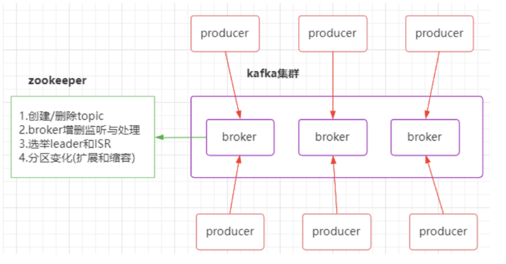

# Kafka的集群

Kafka架构是由producer（消息生产者）、consumer（消息消费者）、borker(kafka集群的server，负责处理消息读、写请求，存储消息。在kafka cluster这一层这里，其实里面是有很多个broker)、topic（消息队列/分类相当于队列，里面有生产者和消费者模型）、zookeeper 这些部分组成。  



kafka里面的消息是有topic来组织的，简单的理解可以想象为一个队列，一个队列就是一个topic。然后它把每个topic又分为很多个partition，这个是为了做并行的，在每个partition内部消息强有序，相当于有序的队列。其中每个消息都有个序号offset，比如0到12，从前面读往后面写。

一个partition对应一个broker，一个broker可以管多个partition，比如说，topic有6个partition，有两个broker，那每个broker就管3个partition。这个partition可以很简单想象为一个文件，当数据发过来的时候它就往这个partition上面append追加就行，消息不经过内存缓冲，直接写入文件。 kafka和很多消息系统不一样，很多消息系统是消费完了就把它删掉，而kafka是根据时间策略删除，而不是消费完就删除。所以在kafka里面没有一个消费完这么个概念，只有过期这样一个概念  。

producer自己决定往哪个partition里面去写，有一些可以配置的策略，譬如使用hash。consumer自己维护消费到哪个offset，每个consumer都有对应的group，group内是queue消费模型（各个consumer消费不同的partition，因此一个消息在group内只消费一次），group间是publish-subscribe消费模型，各个group各自独立消费，互不影响，因此一个消息在被每个group消费一次。  

## 集群的搭建

使用192.168.0.120作为集群的zookeeper ，在192.168.0.120上启动zookeeper 。

使用192.168.0.121作为生产者，192.168.0.122作为消费者。

```shell
#修改server.properties（在config目录）增加zookeeper的配置、修改broker.id（也可以改为-1，自动分配）
# 192.168.0.121 的配置文件
broker.id=0
zookeeper.connect=192.168.0.120:2181
# 192.168.0.122 的配置文件
broker.id=1
zookeeper.connect=192.168.0.120:2181
# 启动kafka,默认端口为：9092，可以通过命令lsof -i:9092查看kafka是否启动成功
# 192.168.0.121 启动
sh kafka-server-start.sh -daemon ../config/server.properties
# 192.168.0.122 启动
sh kafka-server-start.sh -daemon ../config/server.properties
```

生产者创建主题

```shell
sh kafka-topics.sh --create --zookeeper 192.168.0.120:2181 -replication-factor 2 --partitions 2 --topic yangshuangxin
# 查看主题
sh kafka-topics.sh --describe --zookeeper 192.168.0.120:2181 --topic yangshuangxin
```

生产者生产数据，消费者消费数据

```shell
# 开启一个生产者，两个消费者
# 生产者
sh kafka-console-producer.sh --broker-list 192.168.0.120:9092 --topic yangshuangxin
# 消费者
sh kafka-console-consumer.sh --bootstrap-server 192.168.0.120:9092 --topic yangshuangxin --group 0 --from-beginning
sh kafka-console-consumer.sh --bootstrap-server 192.168.0.120:9092 --topic yangshuangxin --group 0 --from-beginning
# 当两个消费者同属一个消费组开启后，消费者轮流收到发送者的数据
```

消费者kafka-console-consumer.sh脚本支持的部分参数如下：

| 参数                | 值类型  | 说明                                                         |
| ------------------- | ------- | ------------------------------------------------------------ |
| --topic             | string  | 被消费的topic                                                |
| --partition         | integer | 指定分区。 除非指定’–offset’，否则从分区结束(latest)开始消费 |
| --offset            | string  | 执行消费的起始offset位置 默认值:latest，可选择earliest       |
| --consumer-property | string  | 将用户定义的属性以key-value的形式传递给使用者                |
| --consumer.config   | string  | 消费者配置属性文件。 （请注意[consumer-property]优先于此配置） |
| --from-beginning    |         | 从存在的最早消息开始，而不是从最新消息开始                   |
| --group             | string  | 指定消费者所属组的ID                                         |

