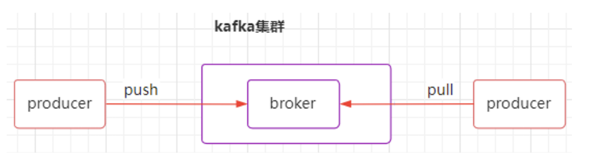
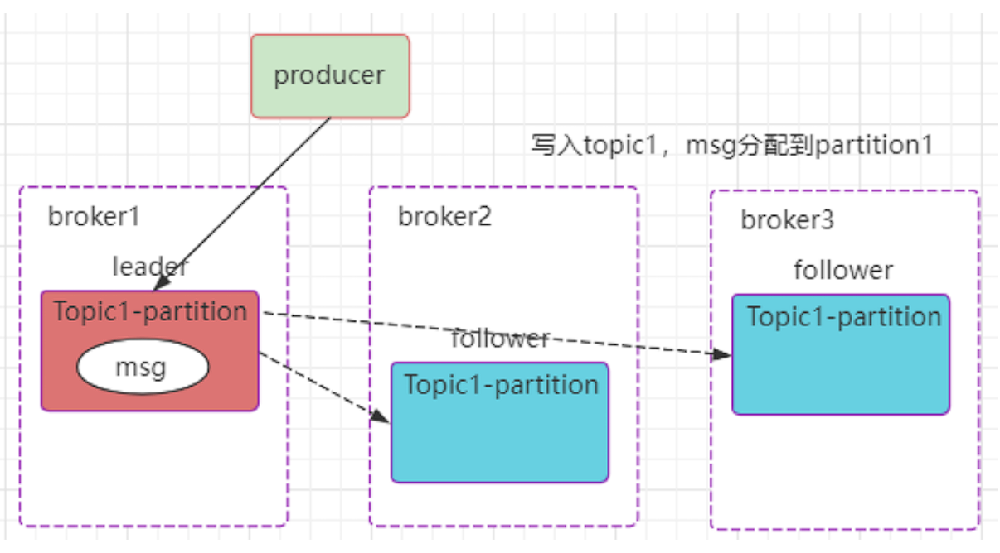
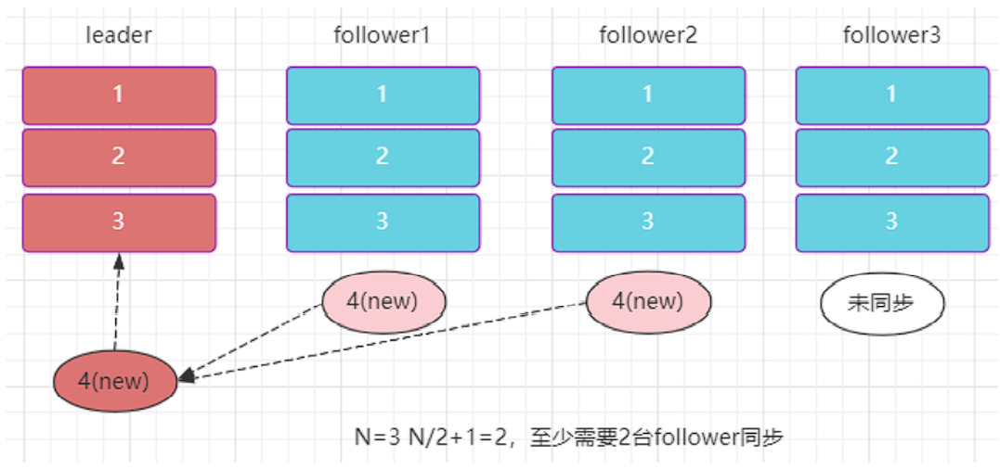
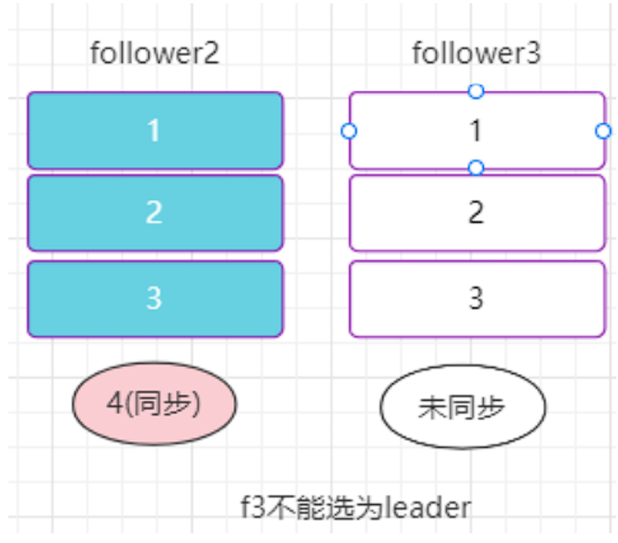
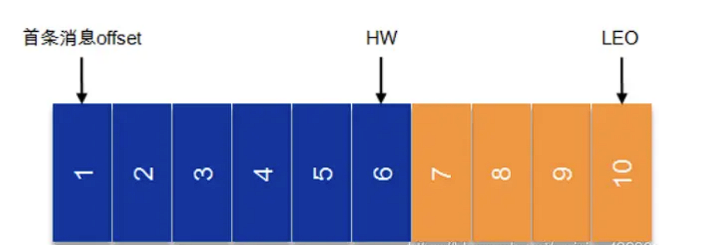
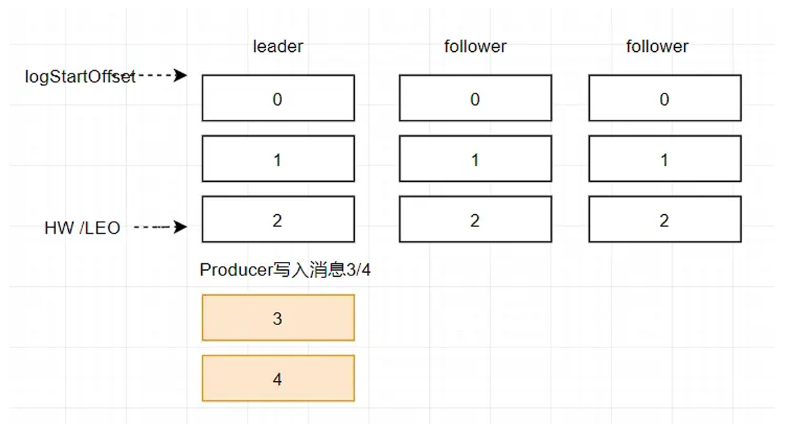
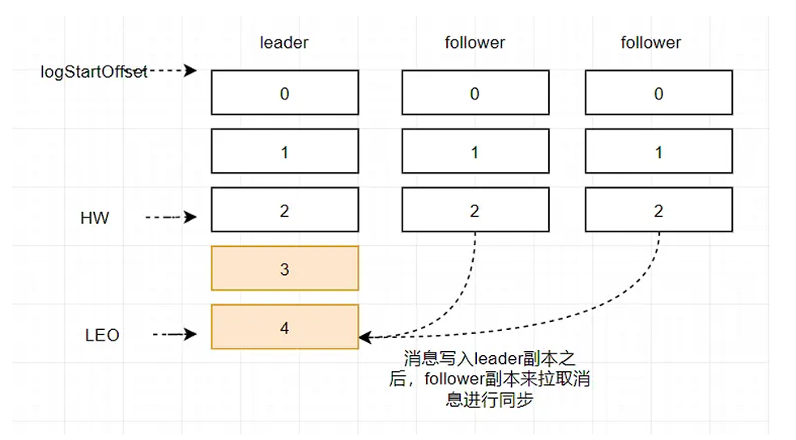
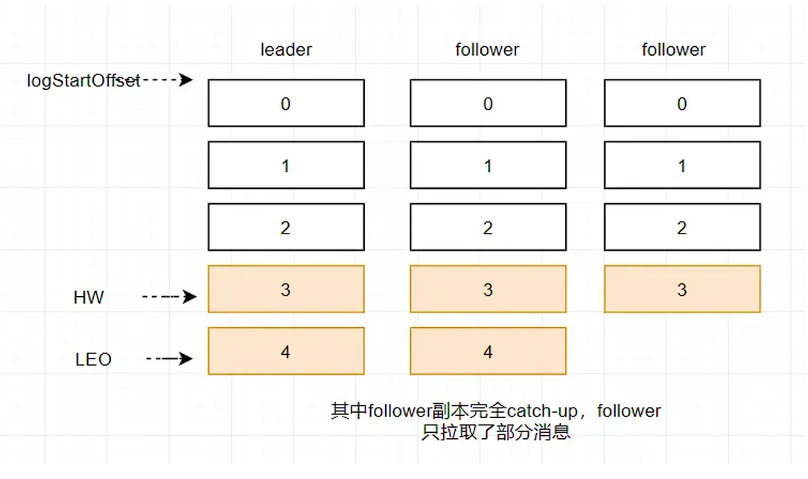
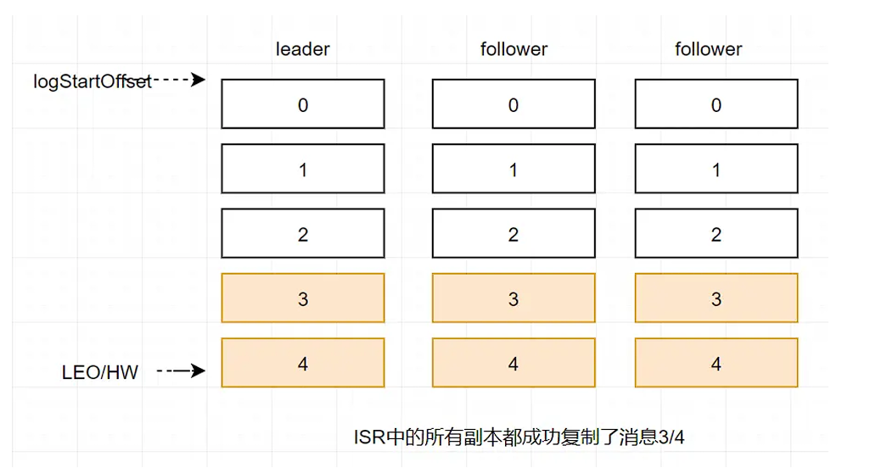

# Kafka 的可靠性

Kafka 从拓扑上分有3个角色：

1. Consumer: 消费者，一般以 API 形式存在于各个业务 svr 中
2. Producer: 生产者，一般以 API 形式存在于各个业务 svr 中
3. Kafka broker: kafka 集群中的服务器，topic 里的消息数据存在上面



Producer 采用发送 push 的方式将消息发到 broker 上，broker 存储后。由 consumer 采用 pull 模式 订阅并消费消息。



## Producer的可靠性保证

生产者的可靠性保证，是通过发消息之后有么有 ack。

发消息收到 ack 后，是不是消息就不会丢失了？Kafka 通过配置来指定 producer 生产者在发送消息时的 ack 策略：

```shell
# -1(全量同步确认，强可靠性保证)
 Request.required.acks= -1
 # 1(leader 确认收到, 默认)
 Request.required.acks = 1
 # 0(不确认，但是吞吐量大)
 Request.required.acks = 0
```

### kafka 配置为一致性和分区容错性(CP)系统

如果想实现 kafka 配置为 CP(Consistency & Partition tolerance) 系统, 配置需要如下:

```shell
request.required.acks=-1
 min.insync.replicas = ${N/2 + 1}
 unclean.leader.election.enable = false
```

如图下所示，在 acks=-1 的情况下，新消息只有被 ISR 中的所有 follower(f1 和 f2, f3) 都从 leader 复制过 去才会回 ack, ack 后，无论那种机器故障情况(全部或部分), 写入的 msg4，都不会丢失， 消息状态满足 一致性 C 要求。



正常情况下，所有 follower 复制完成后，leader 回 producer ack。异常情况下，如果当数据发送到 leader 后部分副本(f1 和 f2 同步)， leader 挂了？此时任何 follower 都 有可能变成新的 leader， producer 端会得到返回异常，producer 端会重新发送数据，但这样数据可能 会重复(但不会丢失)， 暂不考虑数据重复的情况。

min.insync.replicas 参数用于保证当前集群中处于正常同步状态的副本 follower 数量，当实际值小于配置值时，集群停止服务。如果配置为 N/2+1, 即多一半的数量，则在满足此条件下，通过算法保证强一致 性。当不满足配置数时，**牺牲可用性即停服**。

异常情况下，leader 挂掉，此时需要重新从 follower 选举 leader。可以为 f2 或者 f3：



如果选举 f3 为新 leader，则可能会发生消息截断，因为 f3 还未同步 msg4 的数据。Kafka 的通  unclean.leader.election.enable 来控制在这种情况下，是否可以选举 f3 为 leader。旧版本中默认为  true，在某个版本下已默认为 false，避免这种情况下消息截断的出现。

通过 ack 和 min.insync.replicas 和 unclean.leader.election.enable 的配合，保证在 kafka 配置为 CP  系统时，要么不工作，要么得到 ack 后，消息不会丢失且消息状态一致。

### Kafka配置为可靠性和分区容错性(AP)系统

如果想实现 kafka 配置为 AP(Availability & Partition tolerance)系统，需要如下配置：

```shell
request.required.acks=1
min.insync.replicas = 1
unclean.leader.election.enable = false
```

当配置为 acks=1 时，即 leader 接收消息后回 ack，这时会出现消息丢失的问题：如果 leader 接受到了  第 4 条消息，此时还没有同步到 follower 中，leader 机器挂了，其中一个 follower 被选为 leader, 则  第 4 条消息丢失了。当然这个也需要 unclean.leader.election.enable 参数配置为 false 来配合。但是  leader 回 ack 的情况下，follower 未同步的概率会大大提升。

通过 producer 策略的配置和 kafka 集群通用参数的配置，可以针对自己的业务系统特点来进行合理的 参数配置，在通讯性能和消息可靠性下寻得某种平衡。

## Broker 的可靠性保证

消息通过 producer 发送到 broker 之后，还会遇到很多问题。例如Partition leader 写入成功， follower 什么时候同步？Leader 写入成功，消费者什么时候能读到这条消息？Leader 写入成功后，leader 重启，重启后消息状态还正常吗？Leader 重启，如何选举新的 leader？

Broker可靠性的保证有2个LEO和HW的概念：

1. LEO：LogEndOffset的缩写，表示每个partition的log最后一条Message的位置。
2. HW： HighWaterMark的缩写，是指consumer能够看到的此partition的位置。 取一个partition对 应的ISR中最小的LEO作为HW，consumer最多只能消费到HW所在的位置。



假设某分区的 ISR 集合中有 3 个副本，即一个 leader 副本和 2 个 follower 副本，此时分区的 LEO 和  HW 都分别为 3 。消息3和消息4从生产者出发之后先被存入leader副本：



在消息被写入leader副本之后，follower副本会发送拉取请求来拉取消息3和消息4进行消息同步：



在同步过程中不同的副本同步的效率不尽相同，在某一时刻follower1完全跟上了leader副本而 follower2只同步了消息3，如此leader副本的LEO为5，follower1的LEO为5，follower2的LEO 为4，那 么当前分区的HW取最小值4，此时消费者可以消费到offset0至3之间的消息：



当所有副本都成功写入消息3和消息4之后，整个分区的HW和LEO都变为5，因此消费者可以消费到 offset为4的消息了：



由此可见，HW用于标识消费者可以读取的最大消息位置，LEO用于标识消息追加到文件的最后位置。 **如果消息发送成功，不代表消费者可以消费这条消息**。

## Consumer 的可靠性保证

Consumer 的可靠性策略集中在 consumer 的投递语义上，即：何时消费？消费到什么？消费是否会丢？消费是否会重复？这些语义场景，可以通过 kafka 消费者的而部分参数进行配置，简单来说有以下 3 中场景。

###  Auto Commit

```shell
enable.auto.commit = true
auto.commit.interval.ms = 1000 默认5000 (5 seconds)
```

配置如上的 consumer 收到消息就返回正确给 brocker。但是如果业务逻辑没有走完中断了，实际上这个 消息没有消费成功。这种场景适用于可靠性要求不高的业务。其中 auto.commit.interval.ms 代表了自动提交的间隔。比如设置为 1s 提交 1 次，那么在 1s 内的故障重启，会从当前消费 offset 进行重新消费时，1s 内未提交但是已经消费的 msg，会被重新消费到。

### 手动 Commit

```shell
enable.auto.commit = false
```

配置为手动提交的场景下，业务开发者需要在消费消息到消息业务逻辑处理整个流程完成后进行手动提 交。如果在流程未处理结束时发生重启，则之前消费到未提交的消息会重新消费到，即消息显然会投递多次。

```shell
sarama.offset.initial （oldest, newest） 
offsets.retention.minutes
```

 intitial = oldest 代表消费可以访问到的 topic 里的最早的消息，大于 commit 的位置，但是小于 HW。 同时也受到 broker 上消息保留时间的影响和位移保留时间的影响。不能保证一定能消费到 topic 起始位 置的消息。

如果设置为 newest 则代表访问 commit 位置的下一条消息。如果发生 consumer 重启且 autocommit  没有设置为 false, 则之前的消息会发生丢失，再也消费不到了。在业务环境特别不稳定或非持久化  consumer 实例的场景下，应特别注意。

一般情况下， offsets.retention.minutes 为 1440s。

### Exactly once

消息投递且仅投递一次的语义是很难实现的。首先要消费消息并且提交保证不会重复Commit，其次提交前要完成整体的业务逻辑关于消息的处理。在 kafka 本身没有提供此场景语义接口的情况下，这几乎是不 可能有效实现的。一般的解决方案，也是进行原子性的消息存储，业务逻辑异步慢慢的从存储中取出消息进行处理。

