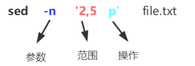
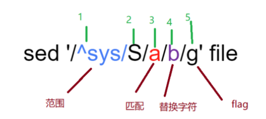
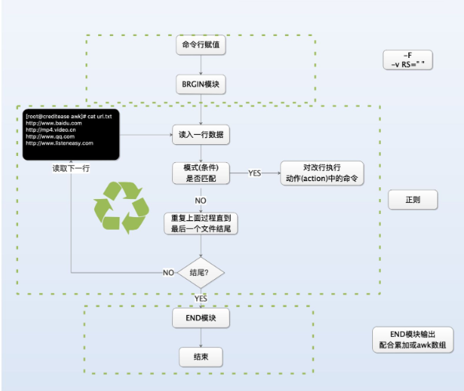
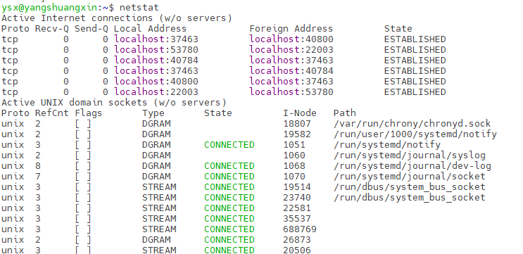
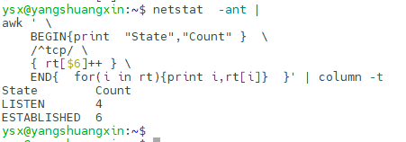

# Linux基础命令和文本处理三剑客（grep/sed/awk）

## 基础命令

### find 查找文件

​	find 通过文件名查找文件的所在位置，文件名查找支持模糊匹配。

> find  [指定查找目录]  [查找规则]  [查找完后执行的action]

```shell
find . -name FILE_NAME # 查找当前目录名字叫FILE_NAME 的文件
find . -i name FILE_NAME #忽略文件名称大小写查找
find /etc -maxdepth 1 -name passwd #查找/etc/下名称中带有passwd的文件，查找一层 
find /mnt -size 20K   #查找/mnt文件大小近似20k的文件 
find /mnt -size +20K  #查找/mnt文件大小大于20k的文件 
find /mnt -size -20K  #查找/mnt文件大小小于20k的文件
find /etc -maxdepth 2 -mindepth 2 -name .conf  ##查找/etc/下名称中带有.conf的文件，且只查找第二层
find /mnt -type d    #按type查找/mnt中目录 
find /mnt -type f    #按type查找/mnt中文件 
find /mnt -cmin 10   #查找/mnt中十分钟左右修改的 
find /mnt -cmin +10  #查找/mnt中十分钟以上修改的 
find /mnt -cmin -10  #查找/mnt中十分钟以内修改的 
find /mnt -ctime 10  #查找/mnt中十天左右修改的 
find /mnt -ctime +10  #查找/mnt中十天以上修改的 
find /mnt -ctime -10  #查找/mnt中十天以内修改的
```

### ls显示文件  

​	ls后面可以加参数，常用参数如下：

- -t 可以查看最新修改的时间
- -l 每行显示一个条目
- -h 可以结合显示文件的GB，MB等(human)
- -R 递归显示
- -n 显示组id和gid
- -lt  按最新修改的时间排序，新修改的在前面显示
- -ltR 按最新修改的时间排序，新修改的在前面显示，并显示子目录的文件信息
- -lh 以单位显示文件大小

### wc命令

​	wc命令用于计算字数。  利用wc指令我们可以计算文件的Byte数、字数、或是列数，若不指定文件名称、或是所给予的文件名为"-"，则wc指令会从标准输入设备读取数据。

> wc [-clw]\[--help\]\[--version\]\[文件...\]

​	常用参数如下：

- -c或--bytes或--chars 只显示Bytes数
- -l或--lines 只显示行数。
- -w或--words 只显示字数
- --help 在线帮助。
- --version 显示版本信息。

```shell
wc .profile
27 130 807 .profile
# .profile 文件行为27，单词数130，字节数807
```

### ulimit用户资源

​	Linux系统对每个登录的用户都限制其最大进程数和打开的最大文件句柄数。为了提高性能，可以根据硬件资源的具体情况设置各个用户的最大进程数和打开的最大文件句柄数。可以用ulimit -a来显示当前的各种系统对用户使用资源的限制:

```shell
ulimit -a
real-time non-blocking time  (microseconds, -R) unlimited
core file size              (blocks, -c) 0
data seg size               (kbytes, -d) unlimited
scheduling priority                 (-e) 0
file size                   (blocks, -f) unlimited
pending signals                     (-i) 123919
max locked memory           (kbytes, -l) 65536
max memory size             (kbytes, -m) unlimited
open files                          (-n) 1024
pipe size                (512 bytes, -p) 8
POSIX message queues         (bytes, -q) 819200
real-time priority                  (-r) 0
stack size                  (kbytes, -s) 8192
cpu time                   (seconds, -t) unlimited
max user processes                  (-u) 123919
virtual memory              (kbytes, -v) unlimited
file locks                          (-x) unlimited
```

- 设置用户的最大进程数：`ulimit -u 1024 `
- 设置用户可以打开的最大文件句柄数：`ulimit -n 65530`


### curl  发送 http 请求

​	由于当前的线上服务较多地使用了Restful风格的API，所以集成测试就需要进行HTTP调用，查看返回的结果是否符合预期，curl命令当然是首选的测试方法。

```shell
curl -i "http://www.baidu.com/" # 打印请求响应头信息 
curl -I "http://www.baidu.com/" # 仅返回http头 
curl -v "http://www.baidu.com/" # 打印更多的调试信息 
curl -verbose "http://www.baidu.com/" # 打印更多的调试信息 
curl -d 'abc=def' "http://www.baidu.com/ # 使用post方法提交http请求 
curl -sw '%{http_code}' "http://www.baidu.com/" # 打印http响应码
```

### scp远程拷贝

​	scp是linux系统下基于ssh登陆进行安全的远程文件拷贝命令，secure copy的缩写。可以实现从本地到远程，以及从远程到本地的双向文件传输。

```shell
scp root@192.168.0.120:/opt/log.zip  ./  #下载远程192.168.0.120的文件到本地

scp ./install.zip root@192.168.0.120:/home/install  # 上传文件到192.168.0.120

scp -r root@192.168.0.120:/opt/log ./  # 下载log整个目录到本地
 
scp -r ./tools root@192.168.0.120:/opt/tools #上传本地tools整个目录到192.168.0.120
```

### dos2unix和unix2dos

用于转换Windows和UNIX的换行符，通常在Windows系统h开发的脚本和配置，UNIX系统下都需要转换。

```shell
dos2unix test.txt
unix2dos test.txt

# 转换当前目录的所有文件
find ./ -type f -exec dos2unix {} \;
```

## 文本处理三剑客之grep   --查找关键词

​	grep 命令用于在文件中执行关键词搜索，并显示匹配的效果。部分常用选项：

| 参数 | 作用                                                  |
| ---- | ----------------------------------------------------- |
| -c   | 仅显示找到的行数                                      |
| -i   | 忽略大小写                                            |
| -n   | 显示行号                                              |
| -v   | 反向选择 – 仅列出没有关键词的行。(v 是 invert 的缩写) |
| -r   | 递归搜索文件目录                                      |
| -C n | 打印匹配行的前后n行                                   |
| -A n | 打印匹配行的后n行                                     |

- 在指定文件查找，查找login关键字打印行号 :`grep -n login  ImUser.cpp`
- 多个文件搜索的时候，可以使用通配符:` grep  login  *.cpp`
- 递归搜索目录下所有文件:`grep login -r code/`
- 反向查找，不包含 CImUser 的行:`grep -v CImUser ImUser.cpp`

## 文本处理三剑客之sed   --行处理

### sed 简单模式

​	一个简单的sed命令包含三个主要部分：参数、范围、操作。要操作的文件，可以直接挂在命令行的最后。



**参数**：

- -n  这个参数是--quiet 或者--silent 的意思。表明忽略执行过程的输出，只输出我们的结果即可。
- -i   使用此参数后，所有改动将在原文件上执行。你的输出将覆盖原文件。

**范围**：

​	2,5 表示找到文件中2,3,4,5行的内容。范围的选择还可以使用正则匹配。范围和操作之间是可以有空格的。

```shell
sed -n '5 p' test.cpp	#选择第5行.
sed -n '2,5 p' test.cpp	#选择2到5行.
sed -n '1~2 p' test.cpp	#选择奇数行.
sed -n '2~2 p' test.cpp	#选择偶数行.
sed -n '2,+3p' test.cpp	#选择第2行以及后面的三行.
sed -n '2,$ p' test.cpp	#选择第2行以及后面的全部.
sed -n '/^void/,/mem/p' test.cpp	#选择以void开头的行，和出现mem字样行之间的数据.
```

**操作**：

- p 打印内容，与cat类似 ，`cat file` 等于`sed -n 'p' file`。
- d 对匹配的内容删除。删除时需要去除-n 参数。


### sed替换模式

​	sed 替换模式，就是查找替换其中的某些值，并输出结果。使用替换模式很少使用-n 参数。

​	替换模式有五个部分，第一部分和第五部分都是可以省略的。替换后会将整个文本输出出来。前半部分用来匹配一些范围，而后半部分执行替换的动作。



**范围**：

​	与简单模式的范围一致。

**命令**：

​	就是s，是substitute的意思。

**查找匹配**：

​	查找部分会找到要被替换的字符串。这部分可以接受纯粹的字符串，也可以接受正则表达式。

**替换字符**：

​	将替换查找匹配部分找到的内容。这部分不能使用正则。常用的就是精确替换。比如把a替换成b：`sed 's/a/b/g' file` 。常用的替位符是&， 当用在替换字符串中的时候，& 代表的是原始的查找匹配数据。

​	`sed 's/.*/"&"/' file`：将会把文件中的每一行，使用引号包围起来。

**flag 参数**：

​	参数可以单个使用，也可以使用多个。

- g  全文替换（默认只匹配行中第一次出现的内容）。
- p  仅输出匹配行内容。
- w 和上面的p类似，但是它仅仅输出有变换的行。
- i 表示忽略大小写（重要）。

## 文本处理三剑客之awk  --列处理

​	awk会遍历一个文件中的每一行，然后分别对文件的每一行进行处理。

> awk [可选的命令行选项] 'BEGIN{命令 } pattern{ 命令 } END{ 命令 }'  文件名
>
> awk的主程序部分使用单引号‘包围，而不能是双引号。



#### 简单应用打印某几列

```shell
echo 'I love you' | awk '{print $3 $2 $1}'
youloveI
# 默认通过空格作为分隔符(不管列之间有多少个空格都将当作一个空格处理) I love you 就分割成三列了

#假如分割符号为. 可以指定分隔符
echo '192.168.0.120' | awk -F "." '{print $2}'
168
```

#### 条例过滤pattern

​	pattern部分是用来从文件中筛选出需要处理的行进行处理的，这部分是空的代表全部处理。

​	pattern部分可以是任何条件表达式的判断结果，例如>，<，==，>=，<=，!= 同时还可以使用+，-，*，/ 运算与条件表达式相结合的复合表达式，逻辑&&，||，! 同样也可以使用进来。另外pattern部分可以使用 /正则/ 选择需要处理的行。

```shell
cat score.txt
tom 60 60 60
kitty 90 95 87
jack 72 84 99

# $0 代表原始行
awk '$2>=90{print $0}' score.txt
kitty 90 95 87

# $2>=90 表示如果当前行的第2列的值大于90则处理当前行，否则不处理。

```

#### 判断语句

​	判断语句是写在pattern{ 命令 } 命令中的，他具备条件过滤一样的作用，同时他也可以让输出更丰富。

```shell
awk '{if($2>=90 )print $0}' score.txt
kitty 90 95 87

awk '{if($2>=90 )print $1,"优秀"; else print $1,"良好"}' score.txt
tom 良好
kitty 优秀
jack 良好

awk '{if($2>=90 )print $0,"优秀"; else print $1,"良好"}' score.txt
tom 良好
kitty 90 95 87 优秀
jack 良好

```

#### BEGIN 定义表头

> awk [可选的命令行选项] 'BEGIN{命令 } pattern{ 命令 } END{ 命令 }'  文件名

```shell
awk 'BEGIN{print "姓名 语文 数学 英语"}{printf "%-8s%-5d%-5d%-5d\n",$1,$2,$3,$4}'  score.txt
姓名 语文 数学 英语
tom 60 60 60
kitty 90 95 87
jack 72 84 99
# 打印做了左对齐的操作(%-8s左对齐，宽8位)，printf 用法和c++ 类似
```

初始化变量：

```shell
awk 'BEGIN{OFMT="%.2f";print 1.2567,12E-2}'
1.26 0.12

# OFMT是个内置变量，初始化数字输出格式，保留小数点后两位。
```

#### END 添加结尾符

​	与BEGIN用法类似。

```shell
echo ok | awk '{print $1}END{print "end"}'
ok
end
```

数据计算

```shell
awk 'BEGIN{print "姓名 语文 数学 英语 总成绩"; \
sum1=0;sum2=0;sum3=0;sumall=0} \
{printf "%5s%5d%5d%5d%5d\n",$1,$2,$3,$4,$2+$3+$4;\
sum1+=$2;sum2+=$3;sum3+=$4;sumall+=$2+$3+$4}\
END{printf "%5s%5d%5d%5d%5d\n","总成绩",sum1,sum2,sum3,sumall}'\
 score.txt
姓名 语文 数学 英语 总成绩
  tom 60 60 60 180
kitty 90 95 87 272
 jack 72 84 99 255
总成绩 222 239 246 707

# BEGIN体里输出表头，并给四个变量初始化0
# pattern体里输出每一行，并累加运算
# END体里输出总统计结果
# 可以使用对齐命令column -t
```


#### awk网络统计

​	采用awk统计netstat命令的一些网络状态。第6列，标明了网络连接所处于的网络状态。



```shell
netstat  -ant | 
awk ' \
    BEGIN{print  "State","Count" }  \
    /^tcp/ \
    { rt[$6]++ } \
    END{  for(i in rt){print i,rt[i]}  }' | column -t
    
```

​	执行结果如下：



