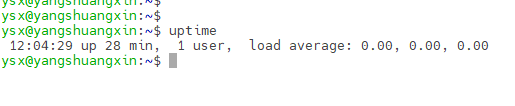
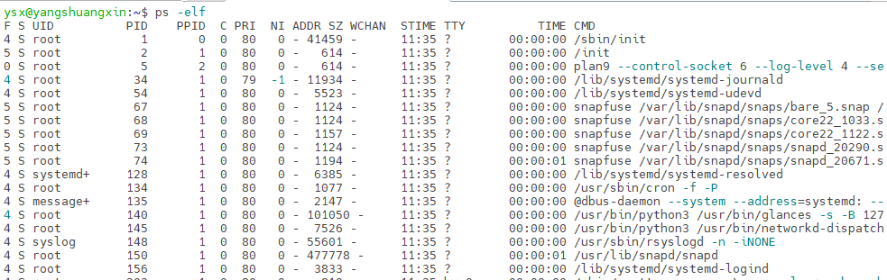
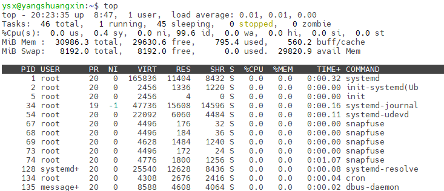
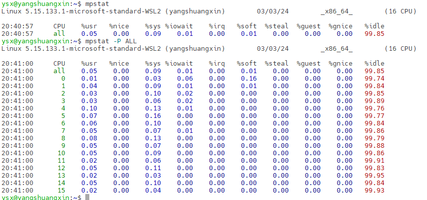
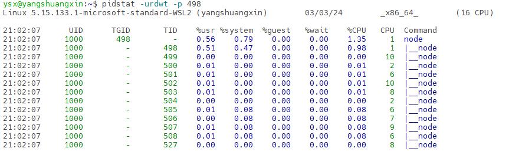
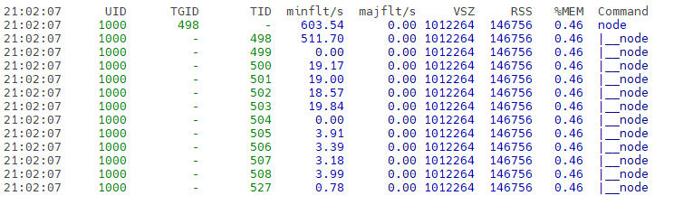
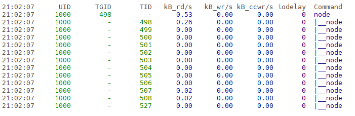
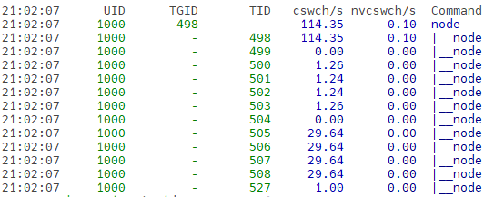

# **Linux性能监控之CPU平均负载、使用率监控、进程监控**

## 平均负载

​	平均负载是指单位时间内，系统处于可**运行状态**和**不可中断状态**的平均进程数，也就是平均活跃进程数，它和 CPU 使用率并没有直接关系。

- 可运行状态的进程，是指正在使用 CPU 或者正在等待 CPU 的进程，就是 ps 命令看到的，处于 R 状态（Running 或 Runnable）的进程。
- 不可中断状态的进程则是正处于**内核态关键流程中**的进程，并且这些流程是不可打断的，比如最常见的是等待硬件设备的 I/O 响应，就是在 ps 命令中看到的 D 状态（Uninterruptible Sleep，也称为 Disk Sleep）的进程。

​	平均负载其实就是平均活跃进程数。平均活跃进程数，直观上的理解就是单位时间内的活跃进程数。

## 分析平均负载命令uptime

​	uptime可以查看机器的启动时间、登录用户、**平均负载**等情况，通常用于在线上应急或者技术攻关中，确定操作系统的**重启时间**。



- 当前时间：12:04:29
- 系统已经以运行时间：28 min
- 当前在线用户：1 user（总连接数量，开一个终端连接就算一个用户）
- 系统平均负载：0.00, 0.00, 0.00（1分钟、5分钟、15分钟的系统负载情况）

> 查看cpu信息：cat /proc/cpuinfo
>
> 直接获取cpu核数：grep 'model name' /proc/cpuinfo | wc -l

​	假如当前平均负载为 2 时的含义：

- 在只有 2 个 CPU 的系统上，意味着所有的 CPU 都刚好被完全占用。
- 在 4 个 CPU 的系统上，意味着 CPU 有 50% 的空闲。
- 只有 1 个 CPU 的系统中，则意味着有一半的进程竞争不到 CPU。

​	假设在一个单 CPU 系统上看到平均负载为 1.73（1分钟），0.60（5分钟），7.98（15分钟），那么说明在过去 1 分钟内，系统有 73% 的超载，而在 15 分钟内，有 698% 的超载，从整体趋势来看，系统的负载在降低。

## 平均负载与CPU使用率

​	平均负载是指单位时间内，处于可运行状态和不可中断状态的进程数。所以，它不仅包括了正在使用 CPU 的进程，还包括等待 CPU 调度和等待 I/O 的进程。

​	CPU 使用率，是单位时间内 CPU 繁忙情况的统计，跟平均负载并不一定完全对应。

- CPU 密集型进程，使用大量 CPU 会导致平均负载升高，此时这两者是一致的。
- I/O 密集型进程，等待 I/O 也会导致平均负载升高，但 CPU 使用率不一定很高。
- 大量等待 CPU 的进程调度也会导致平均负载升高，此时的 CPU 使用率也会比较高。

## CPU使用率检测

- 系统自带检测命令：`ps`、`top`。
- 第三方检测命令：`mpstat`、`pidstat`。
  1. `mpstat` 是一个常用的多核 CPU 性能分析工具，用来实时查看每个 CPU 的性能指标，以及所有 CPU 的平均指标。
  2. `pidstat `是一个常用的进程性能分析工具，用来实时查看进程的 CPU、内存、I/O 以及上下文切换等性能指标。
  3. `stress ` 是一个 Linux 系统压力测试工具，可以用作模拟进程平均负载升高的场景。

> 三方安装对应的命令：`apt install stress sysstat ` ，其中`sysstat` 包括了`mpstat` 和`pidstat` 。

### `ps` 显示进程信息

​	`ps`用一般用于显示系统内的所有进程。常用方式为`ps -elf` 、`ps -ef`、`ps -aux`、`ps -lax`。通常后面使用`grep`命令进行过滤。



> 查看帮助：`ps --help all`

```shell
ps 常用参数

-a    显示一个终端的所有进程。
-x    显示没有控制终端的进程，同时显示各个命令的具体路径。
-u    uid or username 选择有效的用户id或者是用户名

-l    长格式(有F,wchan,C 等字段)
-e    显示所有进程,环境变量
-f    全格式

-p    pid 进程使用cpu的时间
-m    显示所有的线程
```

### `top` 查询进程cpu和内存信息

​	top命令用于查看活动进程的CPU和内存信息，能够实时显示整体的CPU占用率、CPU负载，以及进程占用CPU和内存等资源情况，可以按照CPU、内存的使用情况和执行时间对进程进行排序。



​	可以用以下所示的top命令的快捷键对输出的显示信息进行转换：

- t：切换报示进程和CPU状态信息。
- n：切换显内容的行数
- r：重新设置一个进程的优先级。系统提示用户输人需要改变的进程PID及需要设置的进程优先级，然后输入个正数值使优先级降低，反之则可以使该进程拥有更高的优先级，即是在原有基础上进行相加，默认优先级的值是100。
- k：终止一个进程，系统将提示用户输入需要终止的进程PID o
- s：改变刷新的时间间隔。
- u：查看指定用户的进程
- M：按照使用内存大小进行排序
- P：按照cpu使用率进行排序

> `top -Hp pid` ，查看具体进程下的线程的cpu 占有率

### `mpstat`实时监控系统CPU

​	`mpstat`用于实时监控系统CPU的一些统计信息，这些信息存放在/proc/stat文件中，在多核CPU系统里，不但能查看所有CPU的平均使用信息，还能查看某个特定CPU的信息。

> 使用方式：mpstat [-P {cpu|ALL}] [internal [count]]



​	可以看到每个CPU核心的占用率、I/O等待、软中断、硬中断等。

| 参数           | 含义                                       |
| -------------- | ------------------------------------------ |
| -P {cpu l ALL} | 表示监控哪个CPU， cpu在[0,cpu个数-1]中取值 |
| internal       | 相邻的两次采样的间隔时间                   |
| count          | 采样的次数，count只能和internal一起使用    |

> mpstat -P ALL 5 2命令，表示每5秒产生一个报告，总共产生2个。

​	当没有参数时，mpstat则显示系统启动以后所有信息的平均值。有interval时，第一行的信息自系统启动以来的平均信息。从第二行开始，输出为前一个interval时间段的平均信息。 输出各参数含义：

| 参数    | 含义                                                         | 从/proc/stat 获取数据 |
| ------- | ------------------------------------------------------------ | --------------------- |
| CPU     | 处理器ID                                                     |                       |
| %usr    | 在internal时间段里，用户态的CPU时间（%）                     | usr/total*100         |
| %nice   | 在internal时间段里，nice值为负进程的CPU时间（%）             | nice/total*100        |
| %sys    | 在internal时间段里，系统内核时间（%）                        | system/total*100      |
| %iowait | 在internal时间段里，硬盘IO等待时间（%）                      | iowait/total*100      |
| %irq    | 在internal时间段里，硬中断时间（%）                          | irq/total*100         |
| %soft   | 在internal时间段里，软中断时间（%）                          | softirq/total*100     |
| %steal  | 显示虚拟机管理器在服务另一个虚拟处理器时虚拟CPU处在非自愿等待下花费时间的百分比 | steal/total*100       |
| %guest  | 显示运行虚拟处理器时CPU花费时间的百分比                      | guest/total*100       |
| %idle   | 在internal时间段里，CPU除去等待磁盘IO操作外的因为任何原因而空闲的时间闲置时间（%） | idle/total*100        |


### `pidstat`实时监控进程

​	`pidstat`用于监控全部或指定的进程占用系统资源的情况，包括CPU、内存、磁盘I/O、程切换、线程数等数据。

> 使用方式：pidstat [option] interval [count]

- -u：表示查看cpu相关的性能指标
- -w：表示查看上下文切换情况
- t：查看线程相关的信息，默认是进程的。常与-w结合使用(cpu的上下文切换包括进程的切换、线程的切换、中断的切换)
- -d：展示磁盘 I/O 统计数据
- -r：展示内存信息
- -p：指明进程号，不指定为监控所有的进程。

执行`pidstat -urdwt -p 498`：

1. 输出进程CPU的使用信息 -u

   

   - %usr ：用户层任务正在使用的CPU百分比
   - %system：系统层正在执行的任务的CPU使用百分比
   - %guest：运行虚拟机的CPU占用百分比
   - %wait：cpu进行IO wait的百分比
   - %CPU：所有的使用的CPU的时间百分比
   - CPU：处理器核心ID
   - Command ：命令

2. 输出内存的使用信息 -r

   

   - ID：进程号
   - minflt/s ：每秒次缺页错误次数(minor page faults)，次缺页错误次数意即虚拟内存地址映射成物理内存地址产生的page fault次数。
   - majflt/s ：每秒主缺页错误次数(major page faults)，当虚拟内存地址映射成物理内存地址时，相应的page在swap中，这样的page fault为major page fault，一般在内存使用紧张时产
     生。
   - VSZ：该进程使用的虚拟内存(以kB为单位)
   - RSS：该进程使用的物理内存(以kB为单位）
   - %MEM ：当前任务使用的有效内存的百分比。
   - Command  ：任务的命令名

3. 输出磁盘I/O的使用信息 -d

   

   - PID：进程号
   - kB_rd/s ：每秒此进程从磁盘读取的千字节数
   - kB_wr/s ：此进程已经或者将要写入磁盘的每秒千字节数
   - kB_ccwr/s ：由任务取消的写入磁盘的千字节数
   - Command ：命令的名字

4. 输出上下文切换 -wt

   

   - PID：PID号
   - cswch/s ：每秒自动上下文切换
   - nvcswch/s ：每秒非自愿的上下文切换
   - Command ：命令


### stress进行模拟压力测试

1. 模拟CPU使用率100%的场景

   `stress --cpu 1 --timeout 600`

2. 模拟I/O密集型的场景

   `stress -i 1 --timeout 600`

3. 模拟8个进程的场景

   `stress -c 8 --timeout 600`

## CPU性能排查思路

1. 运行` uptime `查看平均负载的变化情况。
2. 运行 `mpstat -P ALL 5 1`查看 CPU 使用率的变化情况。
3. 运行`pidstat -urdwt 5 1` 查看 进程吧变化情况。