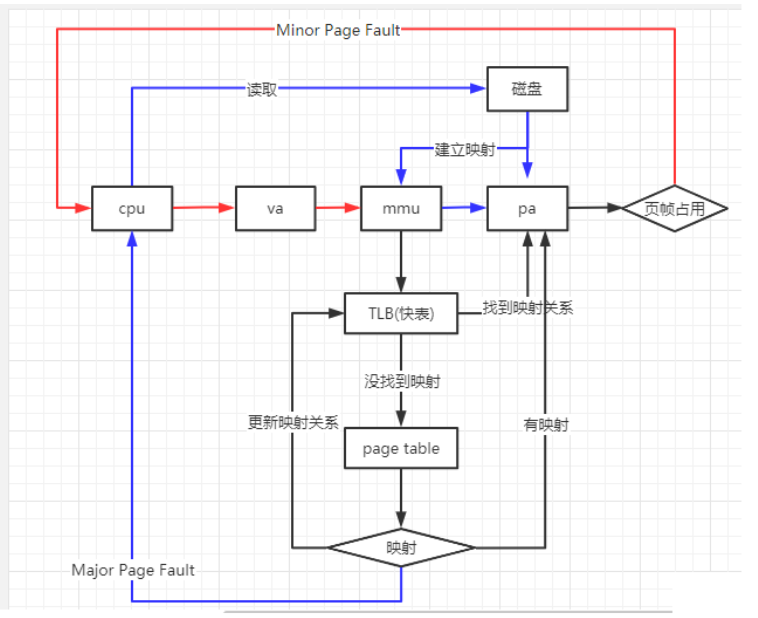
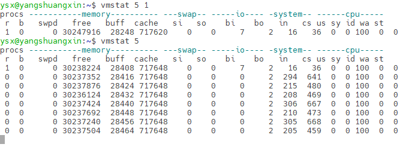
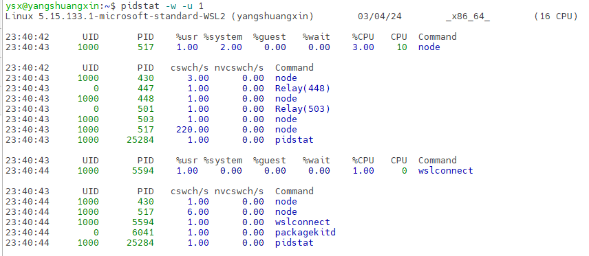
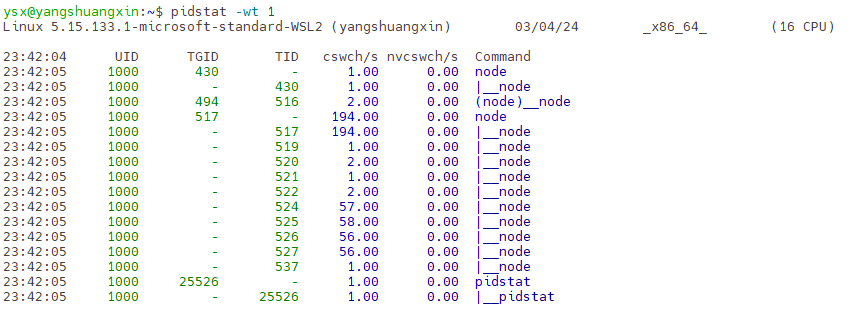

# Linux上下文切换和虚拟内存

## 上下文切换

​	Linux的上下文切换，就是把上一个任务的寄存器和计数器保存起来，然后加载新任务的寄存器和计数器，最后跳转到新任务的位置开始执行新任务。

​	根据任务的不同，CPU 的上下文切换就可以分为几个不同的场景----**系统调用上下文切换**、**进程上下文切换**、**线程上下文切换**以及**中断上下文切换**。

### 系统调用上下文切换

​	Linux 进程既可以在用户空间运行，又可以在内核空间中运行。当它在用户空间运行时，被称为进程的**用户态**；当它进入内核空间的时候，被称为进程的**内核态**。从用户态到内核态的转变过程，需要通过系统调用来完成。

​	CPU 寄存器里原来的指令位置是在用户态。但是为了执行内核态代码，需要先把用户态的位置保存起来，然后寄存器更新为内核态指令的新位置。最后跳转到内核态运行内核任务。

​	当系统调用结束后，CPU 寄存器需要恢复原来保存的用户态位置，然后再切换到用户空间，继续运行进程。一次系统调用发生了两次 CPU 上下文切换！

​	系统调用过程中对用户态的资源没有任何影响，也不会切换进程，所以也称为特权模式切换。

​	常见的系统调用为网络编程收发数据，用户层调用send、write、recv都会进行系统调用。


### 进程上下文切换

​	进程是由内核来管理和调度的，所以进程的切换只发生在内核态。进程的上下文不仅包括了虚拟内存、栈、全局变量等用户空间的资源，还包括了内核堆栈、寄存器等内核空间的状态。

​	进程的上下文切换，在保存当前进程的内核状态和 CPU 寄存器之前，需要先把该进程的虚拟内存、栈等保存下来。然后加载下一进程的内核态之后，再刷新进程的虚拟内存映射关系和用户栈。刷新虚拟内存映射就涉及到 TLB 快表 (虚拟地址缓存)，因此会影响内存的访问速度。



​	单次进程上下文切换的 CPU 时间在几十纳秒到数微秒之间。如果是在进程上下文切换次数较多的情况下，很容易导致 CPU 将大量时间耗费在寄存器、内核栈以及虚拟内存等资源的保存和恢复上，进而影响 cpu 的实际使用率。

#### 进程上下文切换的原因

1. 为了保证所有进程可以得到公平调度，CPU 时间被划分为一段段的时间片，这些时间片再被轮流分配给各个进程。这样，当某个进程的时间片耗尽了，就会被系统挂起，切换到其它正在等待 CPU 的进程运行。（被动切换）
2. 进程在系统资源不足，这个时候进程也会被挂起，并由系统调度其他进程运行。（主动切换）
3. 当进程通过睡眠函数 sleep 这样的方法将自己主动挂起时，自然也会重新调度。
4. 当有优先级更高的进程运行时，为了保证高优先级进程的运行，当前进程会被挂起，由高优先级进程来运行。
5. 发生硬件中断时，CPU 上的进程会被中断挂起，转而执行内核中的中断服务程序。


### 线程上下文切换

​	线程与进程的区别在于：线程是调度的基本单位，而进程是资源分配基本单位。内核中的任务调度，实际调度的是线程。而进程只是给线程提供了虚拟内存、全局变量等资源。

- 当进程只有一个线程时，可以认为进程就等于线程。
- 当进程拥有多个线程时，共享虚拟内存和全局变量等资源。这些资源在上下文切换时不需要修改。
- 线程也有自己的私有数据，比如栈和寄存器等，这些在上下文切换时需要保存。

​	线程上下文的切换分为两种：

1. 前后两个线程属于不同进程。此时，因为资源不共享，所以切换过程就跟**进程上下文切换**是一样。
2. 前后两个线程属于同一个进程。此时，因为虚拟内存是共享的，所以在切换时，虚拟内存这些资源就保持不动，只需要切换线程的私有数据、寄存器等不共享的数据。

### 中断上下文切换

​	为了快速响应硬件的事件（键盘输入、网卡收到数据等），中断处理会打断进程的正常调度和执行，转而调用中断处理程序，响应设备事件。而在打断其他进程时，就需要将进程当前的状态保存下来，这样在中断结束后，进程仍然可以从原来的状态恢复运行。

​	跟进程上下文不同，中断上下文切换并不涉及到进程的用户态。中断上下文只包括内核态中断服务程序执行所必需的状态，包括 CPU 寄存器、内核堆栈、硬件中断参数等。

### `vmstat` 查看上下文切换

​	过多的上下文切换，会把 CPU 时间消耗在寄存器、内核栈以及虚拟内存等数据的保存和恢复上，缩短进程真正运行的时间，成了系统性能大幅下降的一个元凶。

​	使用`vmstat `这个工具，来查询系统的上下文切换情况。此命令显示关于内核线程、虚拟内存、磁盘I/O 、陷阱和CPU占用率的统计信息。

> `vmstat [options] [delay [count]]`



- r（Running or Runnable）：是就绪队列的长度，也就是正在运行和等待 CPU 的进程数。如果超过系统 CPU 的个数 ，就会有 CPU 竞争。
- b（Blocked）：是处于不可中断睡眠状态的进程数。
- buff：是I/O系统存储的磁盘块文件的元数据的统计信息。
- cache：是操作系统用来缓存磁盘数据的缓冲区，操作系统会自动一调节这个参数，在内存紧张时操作系统会减少cache的占用空间来保证其他进程可用。
- si和so较大时，说明**系统频繁使用交换区**，应该查看操作系统的内存是否够用。
- bi和bo代表I/O活动，根据其大小可以知道**磁盘I/O的负载情况**。
- in（interrupt）则是**每秒中断的次数**。
- cs：参数表示线程环境的切换次数，此数据太大时表明**线程的同步机制**有问题。
- us（user）和 sy（system）列： 用户层CPU使用率和系统内核 CPU使用率。

```shell
#可以使用sysbench 来模拟系统多线程调度切换的情况
#安装sysbench ：
`apt install sysbench `

#以10个线程运行5分钟的基准测试，模拟多线程切换的问题：
sysbench --num-threads=10 --max-time=300 --max-requests=10000000 --test=threads run
# 执行后cs列上下文切换次数会骤然上升，r列就绪队列的长度会超过系统 CPU 的个数，导致大量的进程 CPU 竞争。
# us（user）和 sy（system）列中系统CPU使用 sy 列会特别高，说明 CPU 主要是被内核占用了。
# in列 中断次数也上升到了非常多。
```

​	如果系统的就绪队列（r）过长，也就是正在运行和等待 CPU 的进程数过多，会导致了大量的上下文切换，而上下文切换又导致了系统 CPU 的占用率升高。

### 排查切换上下文性能问题

​	可以使用`pidstat`进程查看进程、线程的中断上下文。

1. 排查进程，找到CPU使用率高的进程，查看进程上下文切换的次数。也可以找到非自愿上下文切换频率最高的进程、自愿上下文切换频率最高的线程。

   ```shell
   # 每隔1秒输出1组数据，pidstat 默认显示进程的指标数据。
   # -w 参数表示输出进程切换指标，-u 参数则表示输出CPU使用指标
   pidstat -w -u 1
   ```

   

2. 排查线程，是否有进程上下文切换次数看起来并不多，但它的**子线程的上下文切换次数却有很多**。说明该进程线程太多导致了太多的上下文切换。对于线程池而言，并不是开启的线程越多越好。

   ```shell
   # pidstat加上 -t 参数后输出线程的指标
   # -wt 参数表示输出线程的上下文切换指标
   pidstat -wt 1
   ```

   

Q：每秒上下文切换多少次才算正常？

​	A：这个数值其实取决于系统本身的 CPU 性能。 如果系统的上下文切换次数比较稳定，那么从数百到一万以内，都应该算是正常的。但当上下文切换次数超过一万次，或者切换次数出现数量级的增长时，就很可能已经出现了性能问题。

- 自愿上下文切换变多了，说明进程都在等待资源，有可能发生了 I/O 等其他问题。
- 非自愿上下文切换变多了，说明进程都在被强制调度，也就是都在争抢 CPU，说明 CPU 的确成了瓶颈。
- 中断次数变多了，说明 CPU 被中断处理程序占用，还需要通过查看 /proc/interrupts 文件来分析具体的中断类型。

Q：如果内核态占用CPU较高的原因？

> 监控cpu 状态命令：`mpstat` 

- %iowait 高，这时要重点关注磁盘IO的相关操作、不合理的写日志操作、不合理的数据库操作等。
- %soft或%cs 高，观察CPU负载是否较高、网卡流量是否较大，代码在是否在多线程操作上存在不合适的中断操作等。
- %steal 高，这种情况一般发生在虚拟机上，这时要查看宿主机是否资源超限。

