# Linux 虚拟地址和磁盘IO

## 虚拟地址

### 物理内存

​	操作系统有虚拟内存与物理内存的概念。在很久以前，还没有虚拟内存概念的时候，程序寻址用的都是物理地址。但是程序能寻址的范围是有限的，这取决于CPU的地址线条数。比如在32位平台下，寻址的范围是2^32也就是4G。并且这是固定的，如果没有虚拟内存，且每次开启一个进程都给4G的物理内存，就有很多问题：

1. 物理内存时有限的，当有多个进程要执行的时候，都要给4G内存。非常浪费内存。没有得到分配资源的进程就只能等待一个进程执行完了以后，再将等待的进程装入内存，效率非常低下。
2. 由于指令都是直接访问物理内存的，进程就可以修改其他进程的数据，甚至会修改内核地址空间的数据。
3. 因为内存时随机分配的，所以程序运行的地址也是不正确的。

### 虚拟内存

​	每一个进程运行时都会得到4G的虚拟内存。每个进程都认为自己拥有4G的空间，但是实际上，在虚拟内存对应的物理内存上，可能只对应的一点点的物理内存，实际用了多少内存，就会对应多少物理内存。

​	进程得到的这4G虚拟内存是一个连续的地址空间，而实际上，它通常是被分隔成多个物理内存碎片，还有一部分存储在外部磁盘存储器上，在需要时进行数据交换。


### 虚拟地址映射真实地址

​	进程开始要访问一个地址，都会经历下面的过程：

1. 访问地址空间上的某一个地址，都需要把地址翻译为实际物理内存地址。
2. 所有进程共享这整一块物理内存，每个进程只把自己目前需要的虚拟地址空间映射到物理内存上。
3. 进程需要知道哪些地址空间上的数据在物理内存上，哪些不在（可能这部分存储在磁盘上），还有在物理内存上的哪里，这就需要通过页表来记录。
4. 页表的每一个表项分两部分，第一部分记录此页是否在物理内存上，第二部分记录物理内存页的地址（如果在的话）。
5. 当进程访问某个虚拟地址的时候，就会先去看页表，如果发现对应的数据不在物理内存上，就会发生缺页异常。
6. 缺页异常的处理过程，操作系统立即阻塞该进程，并将硬盘里对应的页换入内存，然后使该进程就绪状态。如果内存已经满了，没有空地方了，那就找一个页覆盖，至于具体覆盖的哪个页，就需要看操作系统的页面置换算法。

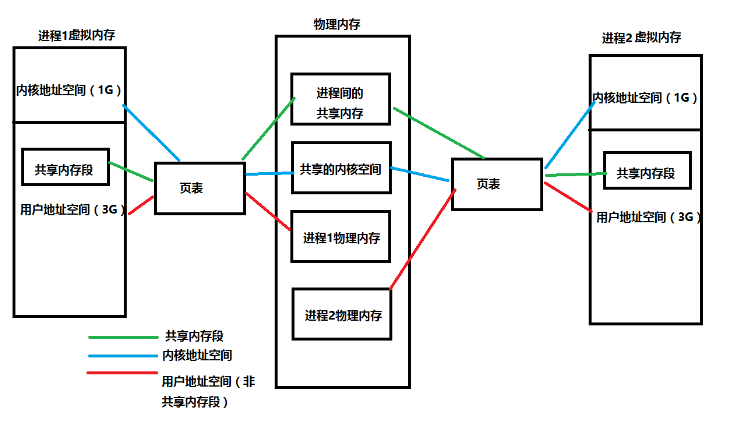

### 页表工作原理

​	进程通过页表进行虚拟地址访问时，步骤如下：

1. cpu想访问虚拟地址所在的虚拟页(VP2)，根据页表，找出页表中第三条的值，然后判断有效位。如果有效位为1，DRMA缓存命中，根据物理页号，找到物理页当中的内容，返回。

2. 若有效位为0（VP3），参数缺页异常，调用内核缺页异常处理程序。内核通过页面置换算法选择一个页面作为被覆盖的页面，将该页的内容刷新到磁盘空间当中。然后把VP3映射的磁盘文件缓存到该物理页上面。然后页表中第四条，有效位变成1，第二部分存储上了可以对应物理内存页的地址的内容。

3. 缺页异常处理完毕后，返回中断前的指令，重新执行，此时缓存命中，执行1。

4. 将找到的内容映射到告诉缓存当中，CPU从告诉缓存中获取该值，结束。

   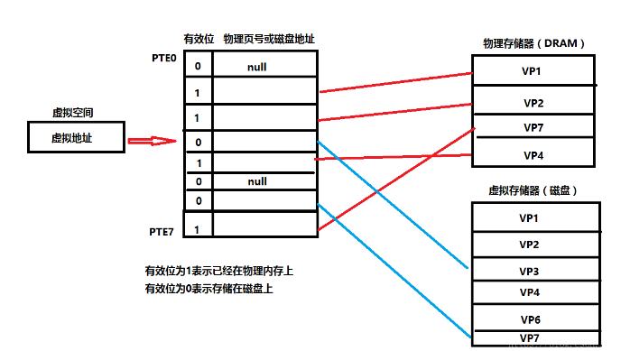

   

### 进程的创建启动

1. 当每个进程创建的时候，内核会为进程分配4G的虚拟内存，当进程还没有开始运行时，这只是一个内存布局。实际上并不立即就把虚拟内存对应位置的程序数据和代码（比如.text .data段）拷贝到物理内存中，只是建立好虚拟内存和磁盘文件之间的映射就好（叫做存储器映射）。
2. 启动的时候这个时候数据和代码还是在磁盘上的。当运行到对应的代码时，进程去寻找页表，发现页表中地址没有存放在物理内存上，而是在磁盘上，于是发生缺页异常，于是将磁盘上的数据拷贝到物理内存中。
3. 在进程运行过程中，要通过malloc来动态分配内存时，也只是分配了虚拟内存，即为这块虚拟内存对应的页表项做相应设置，当进程真正访问到此数据时，才引发缺页异常。
4. 虚拟空间按需要映射被映射到了磁盘空间中，通过`mmap`用来建立虚拟空间和磁盘空间的映射关系。

### 缓存buffer和cache

​	使用`free -h` 可以看物理内存 Mem 和交换分区 Swap 的具体使用情况。缓存是 Buffer 和 Cache 两部分的总和。

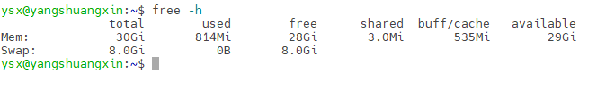

1. Mem 行是内存的使用情况。
2.  Swap 行是交换空间的使用情况。
   - total 列显示系统总的可用物理内存和交换空间大小。
   - used 列显示已经被使用的物理内存和交换空间。
   - free 列显示还有多少物理内存和交换空间可用使用。
   - shared 列显示被共享使用的物理内存大小。
   - buff/cache 列显示被 buffer 和 cache 使用的物理内存大小。
   - available 列显示还可以被应用程序使用的物理内存大小。

**buff和cache 的区别**：

1.  Buffer是对**原始磁盘块的临时存储**，也就是用来**缓存磁盘的数据**，通常不会特别大（20MB 左右）。这样，内核就可以把分散的写集中起来，统一优化磁盘的写入，比如可以把多次小的写合并成单次大的写等等。
2. Cache是从**磁盘读取文件的页缓存**，也就是用来**缓存从文件读取的数据**。这样，下次访问这些文件数据时，就可以直接从内存中快速获取，而不需要再次访问缓慢的磁盘。

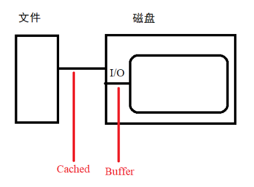

​	Buffer 是对磁盘数据的缓存，而 Cache 是文件数据的缓存，它们既会用在读请求中，也会用在写请求中。

1. Buffer 既可以用作“将要写入磁盘数据的缓存”，也可以用作“从磁盘读取数据的缓存”。
2. Cache 既可以用作“从文件读取数据的页缓存”，也可以用作“写文件的页缓存”。

​	在读写普通文件时，会经过文件系统，由文件系统负责与磁盘交互，所使用的缓存是Cache ；而读写磁盘或者分区时，就会跳过文件系统，也就是所谓的"裸I/O"所使用的缓存是Buffer 。

## 磁盘IO

​	使用命令`iostat` 可以查看磁盘IO的统计信息。该命令用于监控CPU占用率、平均负载值及I/O读写速度等。

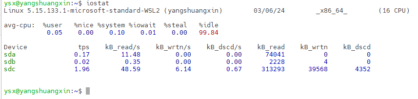

- tps：该设备每秒的传输次数，一次传输的意思是一次I/O请求。多个逻辑请求可能会被合并为一次I/O请求。一次传输请求的大小是未知的。
- kB_read/s：每秒从设备（drive expressed）读取的数据量。
- kB_wrtn/s：每秒向设备（drive expressed）写入的数据量。
- kB_read：读取的总数据量。（单位都为KB）
- kB_wrtn：写入的总数量数据量。（单位都为KB）

​	Linux 内核在用户进程和文件系统的中间，又引入了一个抽象层，也就是虚拟文件系统 VFS（Virtual File System）。I/O 指的是相对内存而言的 input 和 output。从文件、数据库、网络向内存中写入数据叫做 input；从内存向文件、数据库、网络中输出数据叫做 output。Linux 系统 I/O 分为内核准备数据和将数据从内核拷贝到用户空间两个阶段。

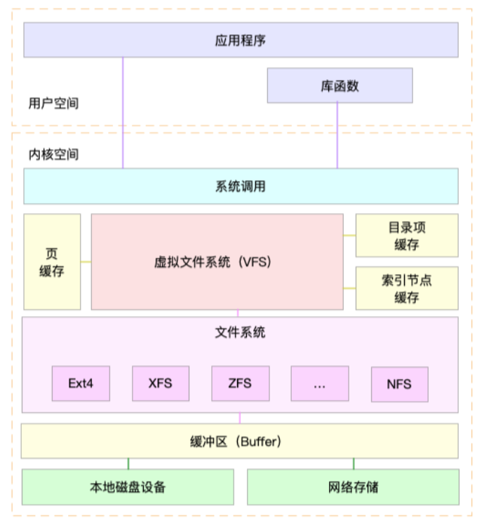


### 缓存IO

​	缓存 I/O 又被称作标准 I/O，大多数文件系统的默认 I/O 操作都是缓存 I/O。在 Linux 的缓存 I/O 机制中，数据先从磁盘复制到内核空间的缓冲区，然后从内核空间缓冲区复制到应用程序的地址空间(用户空间)。

1. 读操作：操作系统检查内核空间的缓冲区有没有需要的数据，如果已经缓存了，那么就直接从缓存中返回，也就是将数据复制到应用程序的用户空间；否则从磁盘中读取数据至内核空间的缓冲区再将内核空间缓冲区的数据返回。
2. 写操作：将数据从用户空间复制到内核空间的缓冲区，这时对用户程序来说写操作就已经完成。至于什么时候将数据从内核空间写到磁盘中，这步由操作系统决定，除非显示地调用了 **sync 同步命令**。

**缓存IO的优点**：

1. 一定程度上分离了内核空间和用户空间，保护系统本身的运行安全。
2. 可以减少读盘的次数，从而提高性能。

**缓存IO的缺点**：

​	DMA 方式可以将数据直接从磁盘读到内核空间的页缓存中，或者将数据从内核空间的页缓存中直接写回到磁盘上，而不能直接在应用程序地址空间(用户空间)和磁盘之间进行数据传输。

​	数据在传输过程中需要在应用程序地址空间(用户空间)和页缓存(内核空间)之间进行多次**数据拷贝操作**，这些数据拷贝操作所带来的 CPU 以及内存开销是比较大的。

### 直接IO

​	直接 IO 就是应用程序直接访问磁盘，而不经过内核缓冲区，这样做的目的是减少一次从内核缓冲区到用户程序地址空间的数据复制操作。

> ​	数据库管理系统这类应用，它们更倾向于选择自己的**缓存机制**，因为数据库管理系统往往比操作系统更了解数据库中存放的数据。数据库管理系统可以提供一种**更加高效的缓存机制**来提高数据库中存取数据的性能。

### 查看磁盘IO状态命令`iostat`

> `iostat [ -c ] [ -d ] [ -h ] [ -N ] [ -k | -m ] [ -t ] [ -V ] [ -x ] [ -z ] [ device [...] | ALL ] [ -p [ device [,...] | ALL ] ] [ interval [ count ] ]`

- -c: 输出cpu统计信息。
- -d: 输出磁盘统计信息。
-  -k|-m: 以kb/s|mb/s代替原来的块/s。
-  -t: 输出时打印收集信息时刻的时间 。（时间的打印格式和系统变量`S_TIME_FORMAT`相关）
- -x: 输出详细的拓展统计数据，比如各种等待时间，队列，利用率等信息。
- interval [count] :interval是统计的时间间隔单位是s，count则是统计次数。

​	执行`iostat -x`结果如下：

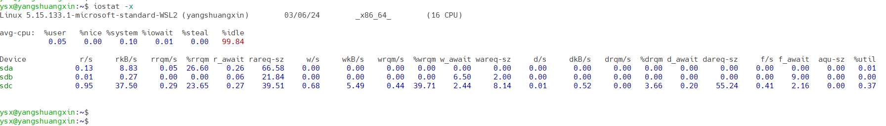

- rrqm/s: 每秒对该设备的读请求被合并次数，文件系统会对读取同块(block)的请求进行合并。（%rrqm/s表示合并读请求的百分比）
- wrqm/s: 每秒对该设备的写请求被合并次数。（%wrqm/s表示合并写请求的百分比）
- r/s: 每秒发送给磁盘的读次数（合并后的请求数）。
- w/s: 每秒发送给磁盘的写次数（合并后的请求数）。
- rkB/s: 每秒从磁盘读数据量。(kB为单位)
- wkB/s: 每秒写磁盘数据量。(kB为单位)
- rareq-sz:平均读请求大小。（KB）
- wareq-sz: 平均写请求大小。（KB）
- await: 平均每次IO请求处理完成**等待时间**(包括队列中的等待时间和实际处理时间，毫秒为单位)。
- aqu-sz（avgqu-sz）: 平均等待处理的IO请求队列长度。
- svctm：每次IO请求的处理平均时间。（不包括等待时间）
- %util: 采用周期内用于IO操作的时间比率。表示该设备的繁忙程度。（可能存在并行IO，100%不能代表磁盘饱和）

> await为IO请求的响应时间，包括队列等待时间和服务时间。
>
> 如果await大于svctm，await-svctm差值越小，则说明队列时间越短, 反之差值越大。队列时间越长，说明**磁盘io有性能问题**。

cpu统计信息（如果是多cpu系统，显示的所有cpu的平均统计信息）：

- %user：用户进程消耗cpu的比例。
- %nice：用户进程优先级调整消耗的cpu比例。
- %sys：系统内核消耗的cpu比例。
- %iowait：等待磁盘io所消耗的cpu比例。
- %idle：闲置cpu的比例（不包括等待磁盘I/O）

```shell
iostat -d -k 2 #kb/s显示磁盘信息，每2s刷新一次
iostat -dkx 1 10 #kb/s显示磁盘统计信息及扩展信息，每1s刷新 ，刷新10次结束

#sysbench模拟数据读写，测试磁盘性能
# sysbench的性能测试都需要做prepare,run,cleanup这三步，准备数据，跑测试，删除数据。在准备阶段创建测试所需数据，在清理阶段删除这些数据。

# 线程数=4 每隔4s输出一次结果 测试时间=60s
# 文件数=10 文件总大小=10G 文件操作模式=随机读写
# 先cd 到测试的磁盘下
cd disk1
sysbench --num-threads=4  --max-time=60 --test=fileio --file-num=10 --file-total-size=10G --file-test-mode=rndrw prepare

sysbench --num-threads=4  --max-time=60 --test=fileio --file-num=10 --file-total-size=10G --file-test-mode=rndrw run

sysbench --num-threads=4  --max-time=60 --test=fileio --file-num=10 --file-total-size=10G --file-test-mode=rndrw cleanup

```

### 其他磁盘命令（swapon/df/du）

> swap 分区通常被称为交换分区，这是一块特殊的硬盘空间，即当实际内存不够用的时候，操作系统会从内存中取出一部分暂时不用的数据，放在交换分区中，从而为当前运行的程序腾出足够的内存空间。

- 查看交换分区的使用情况`swapon -s`

  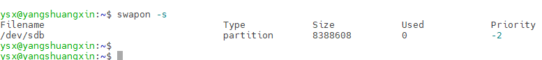

- 查看文件系统的硬盘挂载点和空间使用情况`df -h`

  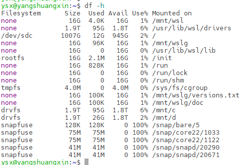

- 目录文件大小`du -sh *`、`du -lh --max-depth=1`

  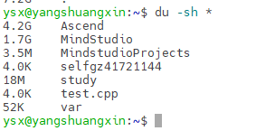

  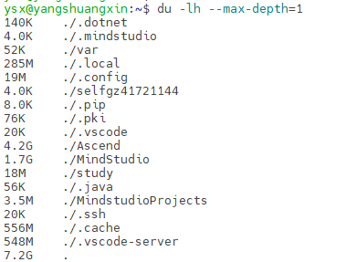

  du 常用选项：

  1. -h：以人类可读的方式显示，显示M或K。
  2. -a：显示目录占用的磁盘空间大小，还要显示其下**子目录和文件**占用磁盘空间的大小。
  3. -s：显示目录占用的磁盘空间大小，**不显示**其下子目录和文件占用的磁盘空间大小。
  4. -c：显示**当前目录和子目录**的磁盘空间大小，还要统计它们的总和。

  


