# Linux 性能监控之网络IO

## 性能指标

- **带宽**：表示链路的最大传输速率，单位通常为 b/s （比特 / 秒）。
-  **吞吐量**：表示单位时间内成功传输的数据量，单位通常为 b/s（比特 / 秒）或者 B/s（字节 / 秒）。吞吐量受带宽限制，而吞吐量 / 带宽，也就是该网络的使用率。
- **延时**：表示从网络请求发出后，一直到收到远端响应，所需要的时间延迟。不同场景中，这一指标可能会有不同含义。比如，它可以表示，建立连接需要的时间（比如 TCP 握手延时），或一个数据包往返所需的时间（比如 RTT）。
-  PPS：是 Packet Per Second（包 / 秒）的缩写，表示以网络包为单位的传输速率。PPS 通常用来评估网络的转发能力，比如硬件交换机，通常可以达到线性转发（即 PPS 可以达到或者接近理论最大值）。而基于 Linux 服务器的转发，则容易受网络包大小的影响。
- **网络的可用性**：网络能否正常通信。
- **并发连接数**：TCP 连接数量。
- **丢包率**：丢包百分比
- **重传率**：重新传输的网络包比例。

## 网络配置查看

​	使用` ifconfig `或者` ip `命令，来查看网络的配置。

> `ifconfig `和 `ip `分别属于软件包 net-tools 和 iproute2，iproute2 是 net-tools 的下一代。

- 使用`ifconfig` 查看网卡`eth0`: `ifconfig eth0`

  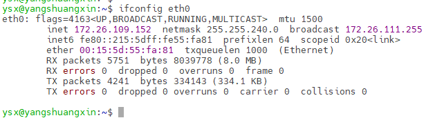

- 使用`ip`查看网卡`eth0`:`ip -s addr show dev eth0`

  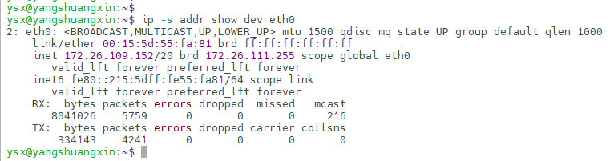

网络性能密切相关的指标有：

1. 网络接口的状态标志。`ifconfig` 输出中的 **RUNNING** ，或 `ip `输出中的 **LOWER_UP** ，都表示物理网络是连通的，即网卡已经连接到了交换机或者路由器中。如果你看不到它们，通常表示网线被拔掉了。
2. MTU 的大小。MTU 默认大小是 1500，根据网络架构的不同（比如是否使用了 VXLAN 等叠加网络），你可能需要调大或者调小 MTU 的数值。
3. 网络接口的 IP 地址、子网以及 MAC 地址。这些都是保障网络功能正常工作所必需的。
4. 网络收发的字节数、包数、错误数以及丢包情况，特别是 TX 和 RX 部分的 errors、dropped、overruns、carrier 以及 collisions 等指标不为 0 时，通常表示出现了网络 I/O 问题。
   - errors 表示发生错误的数据包数，比如校验错误、帧同步错误等。
   - dropped 表示丢弃的数据包数，即数据包已经收到了 Ring Buffer，但因为内存不足等原因丢包。
   - overruns 表示超限数据包数，即网络 I/O 速度过快，导致 Ring Buffer 中的数据包来不及处理（队列满）而导致的丢包。
   - carrier 表示发生 carrirer 错误的数据包数，比如双工模式不匹配、物理电缆出现问题等。
   - collisions 表示碰撞数据包数。

## 网络套接字查看

使用`netstat` 或者 `ss` ，来查看套接字、网络栈、网络接口以及路由表的信息。

> 查询网络的连接信息ss比netstat查询速度更快。

```shell
# netstat 常用的参数
-a (all)显示所有连线中的Socket。
-t (tcp)仅显示tcp相关选项
-u (udp)仅显示udp相关选项
-n 拒绝显示别名，能显示数字的全部转化成数字。
-l 仅列出有在 Listen (监听) 的服务状态。
-o 显示计时器。
-p 显示建立相关链接的程序名
-r 显示路由信息，路由表
-e 显示扩展信息，例如uid等
-s 按各个协议进行统计
-c 每隔一个固定时间，执行该netstat命令。
# 常用 netstat -anop
```

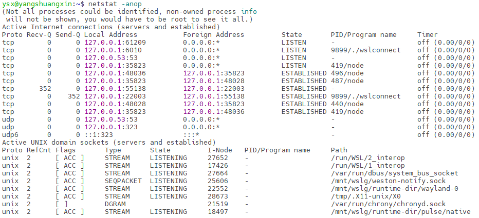

```shell
# ss 常用的参数
-l 表示只显示监听套接字
-t 表示只显示 TCP 套接字
-n 表示显示数字地址和端口(而不是名字)
-p 表示显示进程信息
# 常用 ss -ntpl
```

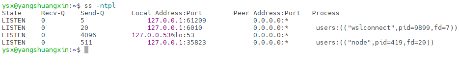

​	netstat 和 ss 的输出也是类似的，都展示了套接字的状态、接收队列、发送队列、本地地址、远端地址、进程 PID 和进程名称等。其中，接收队列（Recv-Q）和发送队列（Send-Q）需要特别关注，它们通常应该是 0。当你发现它们**不是 0 时**，说明有**网络包的堆积**发生。在不同套接字状态下，它们的含义不同:

- 当套接字处于连接状态（Established）时：
  1. Recv-Q 表示套接字缓冲还没有被应用程序取走的字节数（即接收队列长度）。
  2. Send-Q 表示还没有被远端主机确认的字节数（即发送队列长度）。
- 当套接字处于监听状态（Listening）时：
  1. Recv-Q 表示全连接队列的长度。
  2. Send-Q 表示全连接队列的最大长度。

> ​	所谓全连接，是指服务器收到了客户端的 ACK，完成了 TCP 三次握手，然后就会把这个连接挪到全连接队列中。这些全连接中的套接字，还需要被 accept() 系统调用取走，服务器才可以开始真正处理客户端的请求。
>
> ​	所谓半连接是指还没有完成 TCP 三次握手的连接，连接只进行了一半。服务器收到了客户端的 SYN 包后，就会把这个连接放到半连接队列中，然后再向客户端发送 SYN+ACK 包。


## 协议栈统计信息

​	使用 netstat 或 ss 查看协议栈的信息，参数都是`-s`。

`netstat -s`:netstat 提供的是更详细的网络协议栈信息。如下图所示，展示了 TCP 协议的主动连接、被动连接、失败重试、发送和接收的分段数量等各种信息。

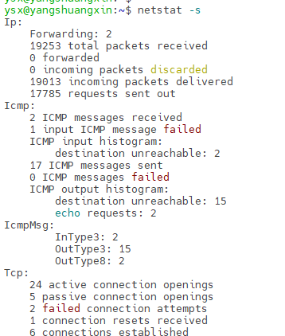

`ss -s`: 显示已经连接、关闭、孤儿套接字等简要统计。

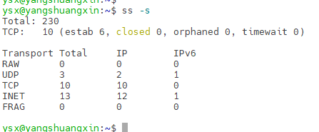


## 网络吞吐量sar命令

​	给 sar 增加 -n 参数就可以查看网络的统计信息，比如网络接口（DEV）、网络接口错误（EDEV）TCP、UDP、ICMP 等等。

`sar -n DEV 1 1`：输出中可以看到网卡的读写速度和流量，在应急过程中可以用来判断服务器是否上量。

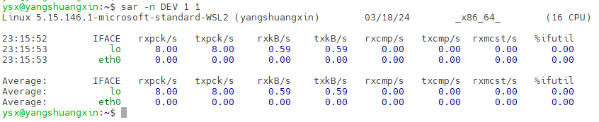

- rxpck/s 和 txpck/s 分别是接收和发送的 PPS，单位为包 / 秒。
- rxkB/s 和 txkB/s 分别是接收和发送的吞吐量，单位是 KB/ 秒。
- rxcmp/s 和 txcmp/s 分别是接收和发送的压缩数据包数，单位是包 / 秒.
- %ifutil 是网络接口的使用率，即半双工模式下为(rxkB/s+txkB/s)/Bandwidth，而全双工模式下为max(rxkB/s, txkB/s)/Bandwidth。

```shell
# sar 的其他常用命令
-A：所有报告的总和。
-u：CPU利用率。
-v：进程、I节点、文件和锁表状态。
-d：硬盘的使用报告。
-r：没有使用的内存页面和硬盘快。
-g：串口I/O的情况。
-b：缓冲区的使用情况。
-a：文件的读写情况。
-c：系统的调用情况。
-R：进程的活动情况。
-y：终端设备的活动情况。
-w：系统的交换活动。
```

## 网络联通性和延迟

​	通常使用 ping ，来测试远程主机的连通性和延时。ping命令是用于检测网络故障的常用命令，可以用来测试一台主机到另外一台主机的网络是否连通。

> `ping [-dfnqrRv][-c<完成次数>][-i<间隔秒数>][-I<网络界面>][-l<前置载入>][-p<范本样式>][-s<数据包大小>][-t<存活数值>][主机名称或IP地址]`

`ping -c 3 qq.com`: 检测和主机是否连通

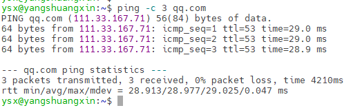

- icmp_seq：ping序列，从1开始。如果数字不是按顺序递增也就意味着丢包了.
- ttl：剩余的ttl。TTL（Time to Live) ，即生存时间，指的是数据包被路由器丢弃之前允许通过的路由器的跳数。为了防止数据包在路由器之间无限转发，必须设置一个TTL值，每经过一个‘路由点‘，就把预先设定的这个TTL数值减1，直到最后TTL=1时报文就被扔掉，不向下转发。ping显示的TTL是指：被ping主机那里返回的报文，到了你这里，从它自己预设的TTL减小到还剩下多少。
- time: 响应时间,数值越小，连通速度越快。
- mdev 往返时延。mdev是 Mean Deviation 的缩写， 表示 ICMP包的RTT(Round-Trip Time,往返时延)偏离平均值的程度， 主要用来衡量网速的稳定性。 mdev 的值越大说明 网速越不稳定。（在mac下它叫作 stddev）。

> 默认ping命令的数据包大小是64Bytes,通过-s选项可以制定数据包的大小,范围：1Byte-65507Byte。
>
> 指定TTL 生成时间通过-t 选项。


## 其他常用的网络命令

### telnet 远程连接

telnet是TCP/IP协议族的一员，是网络远程登录服务的标准协议，帮助用户在本地计算机上连接远程主机。

> 使用方式：telnet IP PORT

和ssh 的区别：

1. 端口区别：telnet是23 ssh是22
2. telnet是明码传输，ssh是加密传输

### nc 验证端口

​	nc验证服务器端口有没有开放。nc是NetCat的简称，在网络调试工具中享有“瑞士军刀”的美誉，此命令功能丰富、短小精悍、简单实用，被设计成一款易用的网络工具，可通过TCP/UDP传输数据。

```shell
# nc 的常用参数
-l  用于指定nc将处于侦听模式。指定该参数，则意味着nc被当作server，侦听并接受连接，而非向其它地址发起连接。
-p  老版本的nc可能需要在端口号前加-p参数
-s  指定发送数据的源IP地址，适用于多网卡机
-u  指定nc使用UDP协议，默认为TCP
-v  输出交互或出错信息
-w  超时秒数，后面跟数字

# 开启一个本地9999的TCP协议端口，由客户端主动发起连接，一旦连接必须由服务端发起关闭
nc -l 9999

## 通过nc去访问172.26.109.152主机的11111端口，确认是否存活；
nc -vw 2 172.26.109.152  11111

# 开启一个本地9999的UDP协议端口，客户端不需要由服务端主动发起关闭
nc -ul 9999

# 通过172.26.109.152的9999TCP端口发送数据文件
nc 172.26.109.152 9999 < test

# 开启一个本地9999的TCP端口，用来接收文件内容
nc -l 9999 > test.file
```

测试网速的例子：

```shell
# A机器操作开启端口如下：
nc -l 9999 > /dev/null
# B机器开启数据传输
nc 172.26.109.152 9999 </dev/zero
# A机器进行网络监控
sar -n DEV 2
```


### mtr 连通性测试

​	mtr命令是Linux系统中的网络连通性测试工具，也可以用来检测丢包率。

`mtr qq.com` : 第2列为丢包率，可以用来判断网络中两台机器的连通质量。

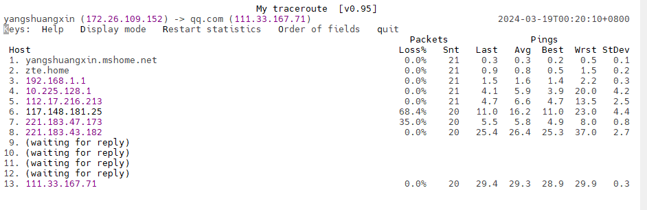


### nslookup 检测网络中DNS服务器能否正确解析域名

`nslookup qq.com` :

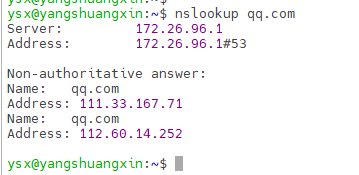


### traceroute 提供从用户的主机到互联网另一端的主机的路径

`traceroute qq.com`:在输出中记录按序列号从1开始，每个记录代表网络一跳，每跳一次表示经过一个网关或者路由.

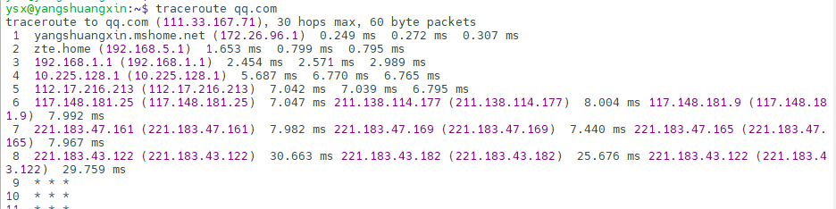

### `iptraf`强大的网络监控

​	`ptraf`是一个实时监控网络流量的交互式的**彩色文本屏幕界面**。它监控的数据比较全面，可以输出TCP连接、网络接口、协议、端口、网络包大小等信息，但是耗费的系统资源比较多。

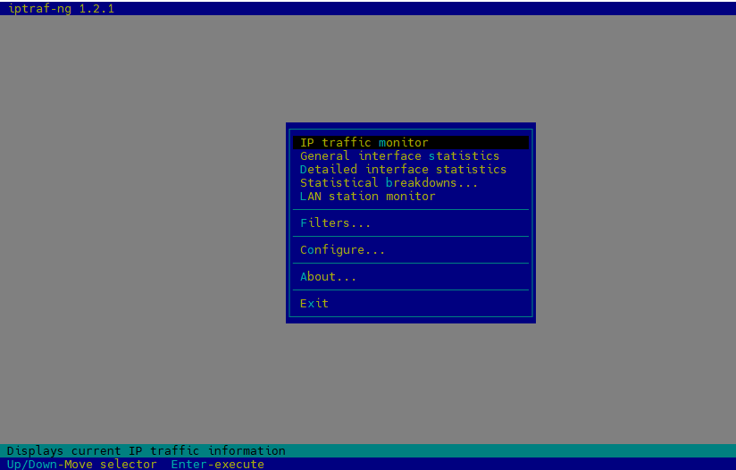


### tcpdump 网络抓包

​	tcpdump是网络状况分析和跟踪工具，是可以用来抓包的实用命令。

```shell
# tcpdump 常用参数
-D 列举所有网卡设备
-i 选择网卡设备
-c 抓取多少条报文
--time-stamp-precision 指定捕获时的时间精度，默认微妙micro，可指定纳秒nano，` --time-stamp-precision=nano `
-s 指定每条报文的最大字节数，默认262144字节

# 限定词
Type：设置数字或者名称所指示类型（host、port），例如 `host 172.26.109.152 port 8080`
Dir：设置网络出入方向，例如`dst port 80`。常用`src、dst、src or dst、src and dst`
Proto: 指定协议类型，例如`udp`。常用`ip、ip6、arp、tcp、udp`
portrange: 设置端口范围，例如`portrange 6000-8000`

# 原语运算：
与：&&或者and
或：||或者or
非：!或者not

# 文件操作
-w 输出结果至文件
-C 限制输入文件的大小，超出以后缀1等数字的方式递增。注意单位是1,000,000字节。
-W 指定输出文件的最大数量，到达后重新复写第一个文件。
-G 指定每个N秒就重新输出至新文件，注意-w 参数应基于strftime参数指定文件名。
-r 读取一个抓包文件。
-V 将待读取的多个文件名写入一个文件中，通过读取该文件同时读取多个文件。
tcpdump -r a    #读取a文件显示

# 分析信息详情
-e 显示数据链路层头部
-q 不显示传输层信息
-v 显示网络层头部更多的信息，如TTL、id等
-n 显示IP地址、数字端口代替hostname等
-S TCP信息以绝对序列号代替相对序列号
-A 以ASCII方式显示报文内容，适用HTTP分析
-x 以16进制方式显示报文内容，不显示数据链路层
-xx 以16进制方式显示报文内容，显示数据链路层
-X 同时以16进制及ASCII方式显示报文内容，不显示数据链路层
-XX 同时以16进制及ASCII方式显示报文内容，显示数据链路层
sudo tcpdump -r a -XX
# 输出时间格式
-t 不显示时间戳
-tt 自1970年1月1日0点至今的秒数
-ttt 显示邻近两行报文间经过的秒数
-tttt 带日期的完整时间
-ttttt 自第一个抓取的报文起经历的秒数
sudo tcpdump -c 5 -ttttt

```

常用的使用例子：

```shell
# 显示来源IP或者目的IP为192.168.1.102的网络通信：
tcpdump -i eth0 host 192.168.1.102

# 显示去往102.168.1.102的所有会话信息
tcpdump -i eth1 'dst 192.168.1.102 and (port 21 or 20)'

# 显示去往102.168.1.102的tcp 8080信息
tcpdump -i eth0 'dst 192.168.1.102 and tcp and port 8080'
```

### nmap扫描端口

​	nmap扫描某一主机打开的端口及端口提供的服务信息，通常用于查看本机有哪些端口对外提供服务，或者服务器有哪些端口对外开放。

```shell
nmap localhost  #查看主机当前开放的端口
nmap -p 1024-65535 localhost  #查看主机端口（1024-65535）中开放的端口
nmap -PS 192.168.56.101  #探测目标主机开放的端口
nmap -PS 22,80,3306 192.168.56.101  #探测所列出的目标主机端口
nmap -O 192.168.56.101  #探测目标主机操作系统类型
nmap -A 192.168.56.101  #探测目标主机操作系统类型
```


### lsof列出文件

​	lsof是系统管理/安全的尤伯工具。它是指"列出打开文件(lists openfiles)"。在Unix中一切（包括网络套接口）都是文件。

​	默认没有选项，lsof列出活跃进程的所有打开文件。常用选项：

- -i : 指定端口
- -p:  指定进程
- -h: 获得帮助
- t : 仅获取进程ID
- -U : 获取UNIX套接口地址

```shell
lsof -i:8080 # 显示端口8080被某个程序占用
sof -p 12   #看进程号为12的进程打开了哪些文件
lsof -c abc #显示abc进程现在打开的文件，可以使用less进行分页，b 向后翻一页，d 向后翻半页
```


### ethtool 网卡配置

​	ethtool用于查看网卡的配置情况。

> 命令使用格式：`ethtool [option] interface`

```shell
ethtool eth1 #查看网络接口eth1的信息
ethtool -s eth1 autoneg off # 关闭网卡eth1的自动协商
ethtool -s eth1 speed 100 # 修改网卡速率为 100Mb/s
ethtool -i eth0 #查看网卡驱动信息
ethtool –S eth0 #查看网卡的一些工作统计信息


```

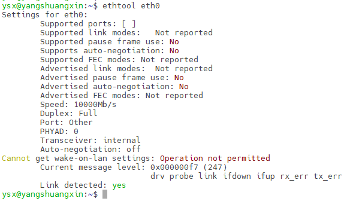

> 可以使用`ps -elf | grep 进程` 根据进程名查找进程ID。根据进程ID查找进程开启的端口`netstat -nap | grep 进程id`。 反之也是如此。


### w 执行了哪些程序

​	w显示谁登录了系统并执行了哪些程序。参数 -h 。

`w -h`：


	## 其他性能监控工具

- nmon性能监控。nmon命令 生成的nmon文件可以通过工具进行可视化展示，一般可以使用nmonchart、nmon_analyser。
- glances系统监控。Glances 对于大多用户而言是个在系统资源上提供过多信息的工具。

