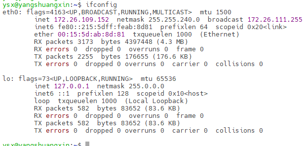
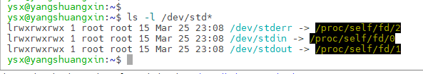

# Linux网络编程之服务器多线程处理

​	Linux通过网卡进行网络通信。每一个网卡都有IP地址，通过IP地址选择网卡进行通信。



​	首先需要绑定通信的网卡，网卡`eth0`的IP为172.26.109.152，`lo`是本地回环地址127.0.0.1，还可以选择所有网卡的`any`，设置的ip为`0.0.0.0`。

简单TCP绑定：

```c++
#include<sys/socket.h>
#include<error.h>
#include<netinet/in.h>
#include<stdio.h>
#include<string.h>

int main()
{
    int sockfd = socket(AF_INET, SOCK_STREAM, 0);
    struct sockaddr_in serveraddr;
    memset(&serveraddr, 0, sizeof(struct sockaddr_in));
    
    serveraddr.sin_family = AF_INET;
    serveraddr.sin_addr.s_addr = honl(INADDR_ANY);
    serveraddr.sin_port = htons(1024);
    
    if (-1 == bind(sockfd, (struct sockaddr*)&serveraddr, sizeof(struct sockaddr))) {
        perror("bind error");
        return -1;
    }
    
    listrn(socket, 10);
    
    struct sockaddr_in clientaddr;
    socklen_t len = sizeof(clientaddr);
    int clientfd = accept(sockfd, (struct sockaddr*)&clientaddr, &len);
    printf("sockfd: %d, clientfd: %d\n", sockfd, clientfd);
    return 0;
}
```

​		打印出sockfd：3， clientfd：4，因为fd的0、1、2被系统所用，stdin:0，

stdout:1，stderr:2。



接受数据和发送数据：

```c++

 	char buffer[128] = {0};
    int count = recv(clientfd, 128, 0);
    send(clientfd, buffer, count, 0);
    close(clientfd);

```

​	如果使用`netstat -anop`服务出现 TCP状态为`TIME_WAIT`，服务器主动断开连接。如果客户端主动断开连接，服务没有调用`close(fd)`，会出现`CLOSE_WAIT`状态。

​	循环接受数据和发送数据，如果recv返回0，说明客户端调用了`close`

```c++
while(1) {
    char buffer[128] = {0};
    int count = recv(clientfd, 128, 0);
    if (count == 0) {
        break;
    }
    send(clientfd, buffer, count, 0);
}	
close(clientfd);
```

可以使用多线程的方式，对多个客户进行同时接受数据和发送数据。

```c++
#include<sys/socket.h>
#include<error.h>
#include<netinet/in.h>
#include<stdio.h>
#include<string.h>
#include<pthread.h>
void client_thread(void *arg)
{
    int clientfd = *(int*)arg;
    while(1) {
        char buff[128] = {0};
        int count = recv(clientfd, buffer, 128, 0);
        if (count == 0) {
            break;
        }
        send(clientfd, buffer, count, 0);
        printf(" clientfd: %d, count: %d, buffer:%s\n", clientfd, count, buffer);
    }
    close(clientfd);
}
int main()
{
    int sockfd = socket(AF_INET, SOCK_STREAM, 0);
    struct sockaddr_in serveraddr;
    memset(&serveraddr, 0, sizeof(struct sockaddr_in));
    
    serveraddr.sin_family = AF_INET;
    serveraddr.sin_addr.s_addr = honl(INADDR_ANY);
    serveraddr.sin_port = htons(1024);
    
    if (-1 == bind(sockfd, (struct sockaddr*)&serveraddr, sizeof(struct sockaddr))) {
        perror("bind error");
        return -1;
    }
    
    listrn(socket, 10);
    while (1) {
        struct sockaddr_in clientaddr;
    	socklen_t len = sizeof(clientaddr);
    	int clientfd = accept(sockfd, (struct sockaddr*)&clientaddr, &len);
        
        // 创建线程处理
        pthread_t thid;
        pthread_create(&thid, NULL, client_thread, &clientfd);
    }
    
    printf("sockfd: %d, clientfd: %d\n", sockfd, clientfd);
    return 0;
}
```

​		**需要链接pthread库才能使用多线程**

​	多线程来一个连接，建立一个线程。如果100个连接，需要100个线程。早期的apache就是使用多线程进行客户端的处理。