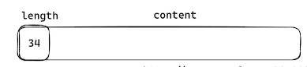

# Linux网络编程之多路复用(select/poll/epoll)和Reactor

​	使用多线程进行网络数据的接收和发送，代码简单易懂。但是每一个客户端的socket句柄fd都需要创建一个线程，非常浪费系统资源。Linux默认一个线程会使用8M的内存，如果1024个客户端进行连接通信，就会消耗8GB的内存，这对于内存的浪费也是极大的。

​	为了节约系统内存的使用，尽量复用资源进行网络数据的接收、发送，就需要一个线程处理多个客户端的socket。一个线程进行多个客户端的交互就是多路复用，多路复用常用的编程接口为select、poll、epoll。其中性能最好的是epoll，一般有大量客户端连接的场景都使用epoll。

## select

​	select的用法为`select(maxfd, rset, wset, eset, timeout)`。 有五个参数：

1. maxfd：最大的fd，用于内核循环检测fd的最大值，一般使用最新客户端fd+1
2. rset：检测可读的fd的集合。
3. wset：检测可写的fd的集合。
4. eset：出错的fd的集合。
5. timeout：每一次检测的超时时间。

​	`fd_set` 使用位（bit）检测socket句柄，在内核定义中可以检测的最大fd为1024，超出1024的句柄会发生数组越界，所以select可以检测的句柄为1024。也可以修改内核源码的1024宏定义，对socket最大值进行扩展。

```c++
fd_set rfds, rset;	// 定义句柄合集
FD_ZERO(&rfds);		// 初始化为0
FD_SET(sockfd, &rfds);	// 设置句柄的位

int maxfd = sockfd;
// 开始循环，一个线程处理多个客户端的数据
while(true) {
    rset = rfds;
    int nready = select(maxfd+1, &rset, nullptr, nullptr, nullptr);
    if	(FD_ISSET(sockfd, &rset)) { //检测是否为监听fd,进行客户端的连接
        sturct sockaddr_in clientaddr;
        socklen_t len = sizeof(clientaddr);
        int clinetfd = accept(sockfd, (struct sockaddr*)&clientaddr, &len);
        FD_SET(clinetfd, rfds);	// 客户端句柄加入读检测fd集合
        maxfd = clientfd;		// 更新fd最大值
    }
    
    // 循环处理客户端的数据
    int i = socket + 1;	//客户端的fd最小为监听fd + 1
    for (;i <= maxfd; i++) {
        if (FD_ISSET(i, &rset)) {
            char buffer[300] = {0};
            int count = recv(i, buffer, 300, 0);
            if (count == 0) {	//recv返回0，说明客户端调用了close
                close(i);
                FD_CLR(i, &rfds);
            }
            send(i, buffer, count, 0);
            std::cout << i << " " << " " << count << " " << buffer << std::endl;
        }
    }
}
```

​	select 检测的缺点有：

1. 参数较多，有5个参数。
2. 每一次循环都需要把所有的检测网络IO的集合拷贝进内核，无效拷贝多消耗性能。
3. 对网络IO检测有限制，默认最大值为1024，除非修改内核宏定义。

## poll

​	为了解决select参数多，使用不方便的问题，于是poll出现了。poll 参数较少，可以检测句柄fd大于1024，比select更容易使用，但本质没有改变。

```c++
struct pollfd fds[1024] = {0};
fds[sockfd].fd = sockfd;
fds[sockfd].enents = POLLIN;
int maxfd = sockfd;

// 多路复用，循环处理多个客户端
while(true) {
    int nready = poll(fds, maxfd+1, -1);
    if (fds[sockfd].revents & POLLIN) {	// 接受客户端的连接请求
        struct sockaddr_in clientaddr;
        socklen_t len = sizeof(clientaddr);
        int clientfd = accept(sockfd, (struct sockaddr*)&clientaddr, &len);
        std::cout << "clientfd : " << clientfd;
        fds[clientfd].fd = clientfd;
        fds[clientfd].enents = POLLIN;
        maxfd = clientfd;
    }
    
    // 处理客户端的数据
    for (int i = sockfd + 1; i <= maxfd; i++) {
        if (fds[i].revents & POLLIN) {
            char buffer[300] = {0};
            int count = recv(i, buffer, 300, 0);
            if (count == 0) {
                cout<< "说明客户端调用了close" << endl;
                fds[i].fd = -1;
                fds[i].events = 0;
                close(i);
                continue;
            }
            
            send(i, buffer, count, 0);
        }
    }
}
```

## epoll

​	使用select和poll，都有频繁的把需要检测的fd集合拷贝到内核，都需要循环遍历所有的fd进行检测是否是该句柄有数据可以读写，性能较低。为了解决这些问题，高性能的epoll可以做到大量的客户端检测。

​	epoll不是一个函数，是三个函数组成：epoll_creat()、epoll_ctl()、epoll_wait()。三个函数公共组成高性能的网络多路复用IO检测。

```c++
int epfd = epoll_cleate(1);	// 初始化大小，为了兼容老版本，大于0即可。
struct epoll_event ev;
ev.enents = EPOLLIN;
ev.data.fd = sockfd;

// 加入检测
epoll_ctl(epfd, EPOLL_CTL_ADD, sockfd, &ev);

struct epoll_event events[1024] = {0}; // 每一次处理的最大句柄数量
// 多路复用，循环处理客户端的请求
while(true) {
    int nready = epoll_wait(epfd, events, 1024, -1);
    for (int i = 0; i < nready; i++) {
        int connfd = events[i].data.fd;
        if (sockfd == connfd) {
            struct sockaddr_in clientaddr;
            socklen_t len = sizeof(clientaddr);
            int clientfd = accept(sockfd, (struct sockaddr*)&clientaddr, &len);
            // 客户端fd加入epoll检测
            ev.events = EPOLLIN;
            ev.data.fd = clientfd;
            epoll_ctl(epfd, EPOLL_CTL_ADD, clientfd, &ev);
            
        } else if (events[i].events & EPOLLIN) {
            char buffer[300] = {0};
            int count = recv(connfd, buffer, 300, 0);
            if (count == 0) {
                cout<< "说明客户端调用了close" << endl;
                epoll_ctl(epfd, EPOLL_CTL_DEL, connfd, nullptr);
                close(connfd);
                continue;
            }
            send(connfd, buffer, count, 0);
        }
    }
}
```

​	epoll的事件触发有两种，**水平触发LT** 和 **边缘触发ET**， 默认为水平触发。

- 水平触发：如果缓存区有数据，并且没有读取完，会一直触发读事件。
- 边缘触发：缓冲区有数据，并且没有读取完，只有**第一次**会触发读事件。（常用大文件传输）

边缘触发的配置为：

```c++
// 客户端fd加入epoll检测
ev.events = EPOLLIN | EPOLLET;	// 边缘触发
ev.data.fd = clientfd;
epoll_ctl(epfd, EPOLL_CTL_ADD, clientfd, &ev);
```

使用TCP协议等应用层的协议，常常出现粘包的现象（比如客户端两次send的数据，服务端一次recv全部获取到）。解决方法一般有两种：

1. 消息内容前面加长度。
2. 使用分隔符进行分割消息。

如何在消息前面长度，则消息为：



```c++
short length = 0;
recv(fd, &length, 2, 0); // 接受长度

// 水平触发只会触发一次事件，需要使用while循环，一直接受缓冲区的数据，直到没有数据
length = ntohs(length);
recv(fd, buffer, lenth, 0);	// 接受事件的消息内容
```

## 事件驱动Reactor

​	上面的代码都是基于IO进行处理，判断区分不同的句柄进行分别处理。而事件驱动Reactor为按照不同的事件进行划分，发生事件后，使用处理该事件的回调函数进行处理。

```c++
// 面向IO处理
if (listenfd) {
    accept();
} else { // 客户端的fd
    recv();
    send();
}

// 面向事件
// 事件可以划分为读事件（EPOLLIN）和写事件（EPOLLOUT）
if (events & EPOLLIN) {
    callbackRead();
} else if (events & EPOLLOUT) {
    callbackWrite(); 
}
```

面向事件处理，就是事件驱动Reactor。事件驱动当接收到不同的事件时，会自动调用不同的回调函数进行处理，所以一般使用结构体对客户端的连接进行封装，比如：

```c++
struct conn_inte {
	int fd;
    // 读buffer和读指针
    char rbuffer[1024];
    int rIdx;
    // 写buffer和写指针
    char wbuffer[1024];
    int wIdx;
    
    // 事件回调函数
    accept_callback();
    recv_callback();
    send_callback();
};
```

