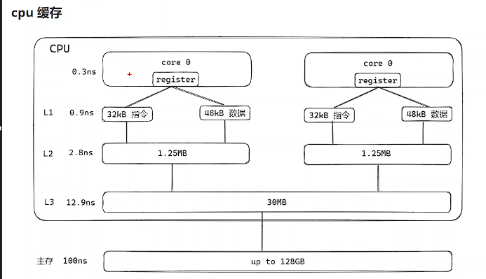
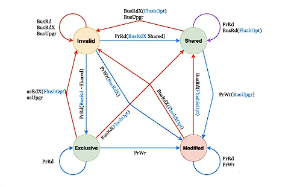
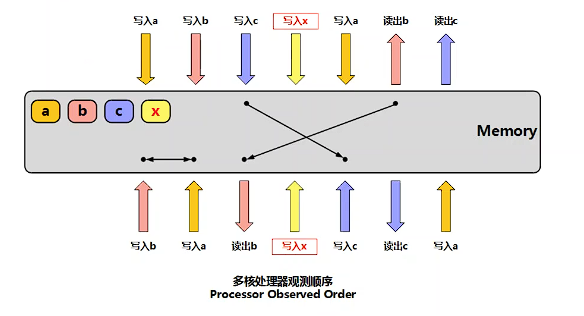
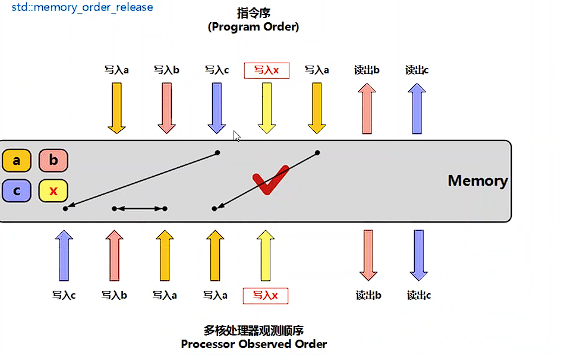
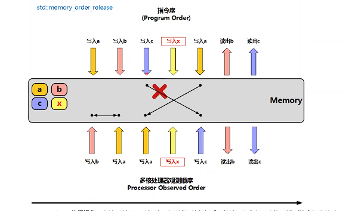
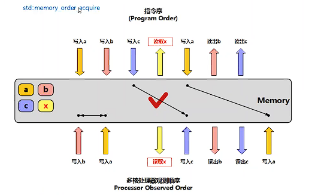

# 原子变量和锁

在多线程的编程开发中，常常需要考虑锁竞争的问题，即多线程访问同一个全局变量时，如果不进行保护，会导致该变量的计算结果不符合预期，导致程序出现奇怪的问题。锁竞争使用操作通常有：互斥锁、条件变量、原子变量、信号量、读写锁、自旋锁等。

## 原子变量

原子操作是什么？在多线程环境下，确保对**共享变量**的操作在执行时不被干扰，从而避免被打断，就是原子操作。

原子变量是什么？原子变量是多线程编程中常用的同步机制，它可以确保对共享变量在执行时不会被其他线程干扰，对原子变量的操作满足原子性，也就是要么全部完成，要么全部未完成。

> 原子操作的实现与平台相关。

C/C++标准库中提供了原子类型std::atomin<T>， 常用的函数有：

- store  用于将指定的值存入原子对象中
- load   获取当前原子变量的值
- exchange  访问和修改包含的值，将包含的值替换，如果替换成功返回它原来的值
- compare_exchange_weak/compare_exchange_strong  比较一个值和一个期望值是否相等，如果相等替换成新值，返回true；否则不做任何操作返回false。weak是弱化版本的原子操作，可能会失败并重试，strong可以保证严格的原子性。
- fetch_add
- fetch_sub
- fetch_and
- fetch_or
- fetch_xor

### 原子变量的原子性

原子性的操作就是一个操作要么全部完成，要么全部未完成，不会让其他核心看到一个中间的状态。

在单处理器单核的条件下，原子性的操作的实现是比较容易简单的，只需要保证操作指令不被打断，实现的方式是在内核层使用自旋锁，并且屏蔽中断即可。（中断会争夺CPU使用权，例如发生网卡中断时，CPU会去执行从DMA中读取DMA中的网卡数据到应用层）

在多处理器和多核的条件下，由于每一个核心/处理器都是并行计算的，除了使用单核的不被打断的方式，还需要避免其他核心/处理器操作相关的内存空间。方式是锁指令，以前的x86的lock锁指令的实现是锁总线，避免所有内存的访问；现在的lock锁指令，只需要阻止其他核心对相关内存空间的访问。

#### CPU缓存

为了解决CPU运算速度与内存访问速度不匹配的问题，引入了cpu cache，CPU缓存 的出现，对多核CPU保证原子性操作带来了较大的麻烦。

> 为了提高磁盘读写速度，通常使用page cache技术。

如上图所示，在多核CPU中，CPU进行操作最快的是寄存器，其次L1、L2、L3缓存，相对最慢的主存就是DDR内存。L1和L2是缓存是每一个核心独占的，L3缓存和主存是所有核心共享的内存。

CPU读取的缓存数据是按照cache line进行读取的，如下图所示：

flag是一个状态机，标记了当前缓存的状态，tag是内存的索引，标记了该内存的位置，data是实际的数据。所以即使CPU只读取一个字节数据进行处理，其实都会一次读取64个字节(uint8_t arr[64])。

在CPU cache基础上，CPU读写数据策略有**写直达和写回策略**。**写直达策略**是每一次写操作都即会写道缓存中，也会写到内存中，所以其写性能会很低；使用最多的方式是**写回策略**，其思路是只有非常必要的时候才进行会写数据到内存中。

CPU写回策略在写数据时，先检测是否命中缓存，如果命中时，直接写数据，并且把该数据标记为脏数据，如果未命中，定位一个缓冲块（如果有空闲的就直接使用，如果没有空闲，会使用LRU找到最近最少使用的缓存），该缓存块是脏数据，则把该数据刷入主存中，不是脏数据就从主存中读取，写入缓存中，CPU进行写数据，写完后标记为脏数据。

CPU写回策略在读数据时，与写数据类似，如果命中时，直接读数据返回，如果未命中，则定位一个缓冲块，查看该缓冲块的内容，如果缓冲块是脏数据则刷主存，不是脏数据就从内存读取写入缓存。

#### CPU缓存一致性问题

由于CPU是多核的，并且基于写回策略进行数据处理，就会导致缓存不一致的问题。即当前CPU处理数据都对L1、L2缓存里的数据进行处理，该缓存的数据不会及时的同步到主存里，如果有其他核心需要访问该变量，就会获取到错误的历史数据，而访问不到最新的值，导致程序出错，这就需要解决缓存一致性问题。

为了解决缓存一致性的问题，使用的方案是写传播和事务的串行化。

写传播是使用监听发布的方式，如果一个核心修改了一个内存变量，通过总线发布消息给其他监听的核心，通知变量有修改。

事务的串行化，其方式就是锁lock指令，当多个核心需要写同一个内存时，进行串行处理，一个核心写完数据并且写传播完成后，再处理另一个核心的写数据请求，这样来保证其他核心读取到正确的内存数据。

当一个核心进行操作一块内存时，其他核心不一定关心该内存的数据，如果所有的操作都进行写传播，会对总线带来非常大的带宽压力，为了解决该问题，减少总线的带宽，使用MESI一致性协议进行解决。

#### 缓存一致性协议MESI协议

MESI协议是基于失效的缓存一致性协议，支持write-back 写回缓存的常用协议。

**MESI一致性协议**主要原理是基于**总线嗅探（bus snooping）机制**，将读写请求通过总线广播给所有的核心，核心根据本地的状态进行相应。并且通过**锁指令**实现了事务的串行化，通过状态机减低总线的带宽压力。MESI就是4个状态的缩写，该**状态**保存在cache line的flag中：

- Modified 某个数据已修改，但是没有同步到内存中。
- Exclusive 该内存数据块是独占的，只在某个核心当中，缓存和内存的数据是一致的。
- Shared 该数据在多个核心中加载，缓存和内存中的数据是一致的。
- Invalidated 该数据已失效，不是最新的数据。

每一个常态都由**事件**触发状态机进行转换，事件有：

- PrRd:   核心请求从缓冲块中取出数据
- PrWr：核心请求向缓冲块写入数据
- BusRd: 总线嗅探器收到来自其他核心的读出缓存请求
- BusRdX:  总线嗅探器收到另一个核心写一个其不拥有缓冲块的请求
- BusUpgr:  总线嗅探器收到另一个核心写一个其拥有缓冲块的请求
- Flush:  总线嗅探器收到另一个核心把一个缓冲块写回主存的请求
- FlashOpt:  总线嗅探器收到一个缓冲块被放置在总线以提供给另一个核心的请求，和Flash类似，不过是从缓存到缓存的传输请求

MISI实现事务串行化使用的锁指令，其实现方式就是**写后锁住ME状态**，避免相关内存的访问。

### 原子变量的内存序

原子变量除了原子操作保证共享变量再执行时不会被干扰，还存在内存序的问题。内存序解决的是原子变量的**同步性**和**顺序性**，即原子变量什么时候可以被其他核心看到。

为什么会出现内存序的问题？由于C / C++在编译期间会被编译器进行优化重排，并且CPU在执行指令期间也会进行CPU指令的优化重排，在进行原子操作时会锁总线/锁指令，CPU就可以重排指令来进行操作其他的内存，达到更好的性能。

内存序规定了多个线程访问同一个内存地址时的语义，即某一个线程对内存地址的更新何时被其他线程看见、某一个线程对内存地址访问附近可以进行什么样的优化。

##### 内存模型和不同的内存序

在缓存一致性的模型中，会对同一时间的读写操作进行排序。不同的CPU架构其实现方式不同，但是C++11屏蔽了内部的细节，不用考虑内存屏障，只需要符合C++11规定的使用规则，就可以得到想要的效果。

C++11规定了不同的内存序，其可以确定原子变量的同步性和指导编译器和CPU如何进行指令的优化：

- memory_order_relaxed：松散的内存序，只保证原子变量的操作是原子的，没有同步性、也不指导指令优化，其他线程读到的值可能不是最新的，在不需要保证顺序的时候使用，速度最快。

    

- memory_order_release: 具备同步性，会指导指令优化，语义是释放操作，在写入某个原子变量时，当前线程任何前面的读写操作不允许重排到这个操作后面去；并且当前线程的所有内存写入都会对同一个原子对象进行获取的其他线程可见。

    

    

    

- memory_order_acquire: 具备同步性，会指导指令优化，语义是获取操作，在读取这个变量时，当前线程的任何读写操作都不允许指令重排到这个操作前面去，并且其他线程对同一个原子对象释放前的所有的内存写入在当前线程可见。

  

  

-  memory_order_consume:  同memory_order_acquire 类似，区别在于只影响依赖该原子变量操作设计的对象，大多数平台上会影响编译器的优化，**不建议使用**。

-  memory_order_acq_rel: 获得释放操作，一个**读-修改-写**操作同时具有获取语义和释放语义，即前后的任何读写操作都不允许重排，

-  memory_order_seq_cst: 顺序一致性语义，是所有的原子操作的**默认的内存序**，读操作都相当于获得，写操作相当于释放，并且会对所有使用该模型的原子操作建立一个**全局顺序**，保证了**多个变量变量的操作**在所有线程里观察到的操作顺序相同，是**最慢的同步模型**。

## 互斥锁
互斥锁在编程中是最常用的一种锁。互斥锁的实现基于原子操作，其实现原理是：

1. 进行内存标记线程的ID，如果发生线程切换时可以再次找到该线程。
2. 该线程进入阻塞队列，等待被唤醒。
3. 硬件对互斥锁进行原子操作，屏蔽中断。

互斥锁在使用过程中的表现形式为：

1. 在用户态自旋一会儿，等待其他线程释放锁。
2. 一直获取失败，任务会挂起。
3. 休眠一段时间后再次尝试获取锁。
