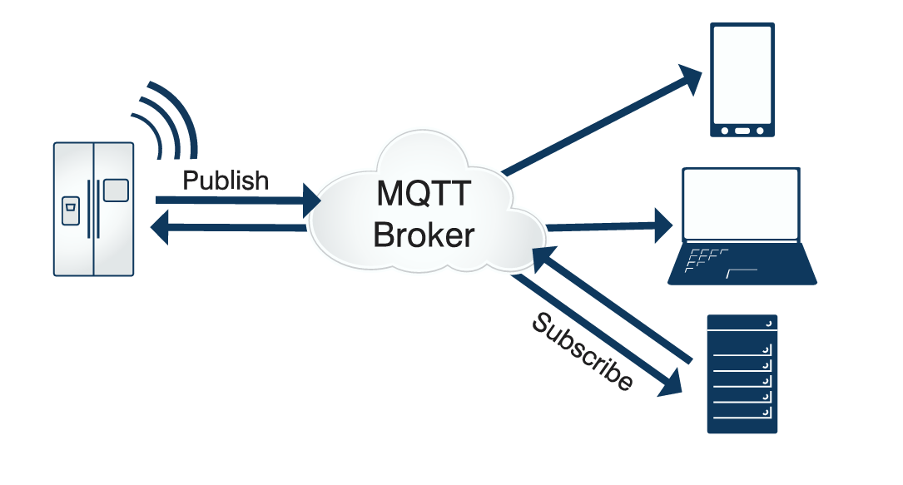

# MQTT的介绍和安装使用

MQTT（Message Queuing Telemetry Transport，消息队列遥测传输协议），是一种基于发布/订阅 （publish/subscribe）模式的"轻量级"通讯协议，该协议构建于TCP/IP协议上，由IBM在1999年发布。

MQTT最大优点在于，可以以极少的代码和有限的带宽，为连接远程设备提供实时可靠的消息服务。作为一 种低开销、低带宽占用的即时通讯协议，使其在物联网、小型设备、移动应用等方面有较广泛的应用。

 MQTT协议是轻量、简单、开放和易于实现的， 这些特点使它适用范围非常广泛。在很多情况下，包括受限的环境中，如：机器与机器（M2M）通信和物联网（IoT）。其在通过卫星链路通信、传感器、偶尔拨号的医疗设备、智能家居、及一些小型化设备中已广泛使用。



> 目前最成熟的mqtt方案供应商： https://www.emqx.com/

## MQTT设计原则

由于物联网的环境是非常特别的，所以MQTT遵循以下设计原则：

- 精简，不添加可有可无的功能；
- 发布/订阅（Pub/Sub）模式，方便消息在传感器之间传递；
- 允许用户动态创建主题，零运维成本；
-  把传输量降到最低以提高传输效率；
- 把低带宽、高延迟、不稳定的网络等因素考虑在内；
- 支持连续的会话控制;
-  理解客户端计算能力可能很低;
-  提供服务质量管理；
- 假设数据不可知，不强求传输数据的类型与格式，保持灵活性。

## MQTT的主要特性

MQTT协议工作在低带宽、不可靠的网络的远程传感器和控制设备通讯而设计的协议，它具有以下主要的几 项特性：

1. 使用发布/订阅消息模式，提供一对多的消息发布，解除应用程序耦合。这一点很类似于XMPP，但是 MQTT的信息冗余远小于XMPP，因为XMPP使用XML格式文本来传递数据。
2. 对负载内容屏蔽的消息传输。
3. 使用TCP/IP提供网络连接。主流的MQTT是基于TCP连接进行数据推送的，但是同样有基于UDP的版 本，叫做MQTT-SN。这两种版本由于基于不同的连接方式，优缺点自然也各有不同。
4. 有三种消息发布服务质量：
    -  "至多一次"，消息发布完全依赖底层TCP/IP网络。会发生消息丢失或重复。这一级别可用于如下情况：环境传感器数据，丢失一次读记录无所谓，因为不久后还会有第二次发送。这一种方式主要普通APP的推送，倘若你的智能设备在消息推送时未联网，推送过去没收到，再次联网也就收不到了。
    -  "至少一次"，确保消息到达，但消息重复可能会发生。
    -  "只有一次"，确保消息到达一次。在一些要求比较严格的计费系统中，可以使用此级别。在计费系统中，消息重复或丢失会导致不正确的结果。这种最高质量的消息发布服务还可以用于即时通讯类的APP的推送，确保用户收到且只会收到一次。
5. 小型传输，开销很小（固定长度的头部是2字节），协议交换最小化，以降低网络流量。这就是为什么 在介绍里说它非常适合"在物联网领域，传感器与服务器的通信，信息的收集"，要知道嵌入式设备的运算能力和带宽都相对薄弱，使用这种协议来传递消息再适合不过了。
6. 使用Last Will和Testament特性通知有关各方客户端异常中断的机制。Last Will：即遗言机制，用于通知同一主题下的其他设备发送遗言的设备已经断开了连接。Testament：遗嘱机制，功能类似于Last  Will。

## MTQQ的安装

目前MQTT代理的主流平台有这三个：Mosquitto、VerneMQ、EMQTT，这里使用mosquitto开源项目。

```shell
sudo apt-get install uuid-dev
sudo apt-get install libc-ares-dev

wget https://mosquitto.org/files/source/mosquitto-2.0.15.tar.gz
tar -zxvf mosquitto-2.0.15.tar.gz
cd mosquitto-2.0.15
make -j
sudo make install
```

编译安装时可能存在找不到openssl、cjson的符号表，需要安装openssl、cjson：

```shell
# openssl
git clone https://gitee.com/mirrors/openssl.git
cd openssl
git checkout OpenSSL_1_1_1a
./config
make
sudo make install
sudo ldconfig
# cJson
git clone https://github.com/DaveGamble/cJSON.git
cd cJSON
make
sudo make install
```

## MTQQ的基本使用

MTQQ使用时一般有三个步骤为：

1. 启动代理服务：mosquitto -v。-v 详细模式 打印调试信息 ，默认占用：1883端口。
2. 订阅主题：mosquitto_sub -v -t yangshuangxin。-t 指定订阅的主题，主题为：yangshuangxin，-v 详细模式 打印调试信息。
3. 发布内容：mosquitto_pub -t yangshuangxin -m HelloWorld。-t 指定订阅的主题，主题为：yangshuangxin，-m 指定发布的消息的内容。

上面使用的都是默认配置，如需修改服务器的配置信息需要修改mosquitto源码目录下的配置文件mosquitto.conf 或者/etc/mosquitto/mosquitto.conf文件。在启动服务器时使用命令：mosquitto -c mosquitto.conf -d(在mosquitto安装目录下) 这里-d是后台运行。

## MTQQ的认证配置

基于Mosquitto服务器已经搭建成功，默认的是允许匿名用户登录模式，正式上线的系统需 要进行用户认证。Mosquitto服务器的配置文件为/etc/mosquitto/mosquitto.conf，关于用户认证的方式和读取的配置都在这个文件中进行配置：

1. allow_anonymous 允许匿名
2. password_file密码文件
3. acl_file 访问控制列表

```shell
# 不允许匿名
allow_anonymous false
# 配置用户密码文件
password_file /etc/mosquitto/pwfile
# 配置topic和用户
acl_file /etc/mosquitto/aclfile
```

增加用户名yangshuangxin，密码xxxxxxx。

```shell
sudo mosquitto_passwd -c /etc/mosquitto/pwfile yangshuangxin
```

按提示输入 yangshuangxin对应的密码即可，自动生成密码文件：/etc/mosquitto/pwfile ， 对应mosquitto.conf配置的“password_file /etc/mosquitto/pwfile”路径。

指定该用户需要订阅的主题topic

```shell
# 先创建aclfile
sudo cp aclfile.example aclfile
#  在该文件末尾添加以下内容
vim aclfile
user yangshuangxin
 # write发布权限, mtpic/#代表ysx这个前缀的主题, 以/分割前缀
topic write ysx/#
# read订阅权限, mtpic/#代表mtopic这个前缀的主题, 以/分割前缀
user yangshuangxin
topic read ysx/#
```

### 认证测试

通过Ctrl+C关闭mosquitto，然后通过下面命令启动Mosquitto代理服务

```shell
mosquitto -v -c /etc/mosquitto/mosquitto.conf
```

客户端（订阅端）启动，可以订阅多个主题：

```shell
mosquitto_sub -h 127.0.0.1 -t ysx -u yangshuangxin -P xxxxxxx
mosquitto_sub -h 127.0.0.1 -t ysx/123 -u yangshuangxin -P xxxxxxx
```

发布者客户端启动，可以同时发送给多个主题：

```shell
mosquitto_pub -h  127.0.0.1 -t ysx -t ysx/123 -u yangshuangxin -P xxxxxxx -m "test, you can receive a message"
```

