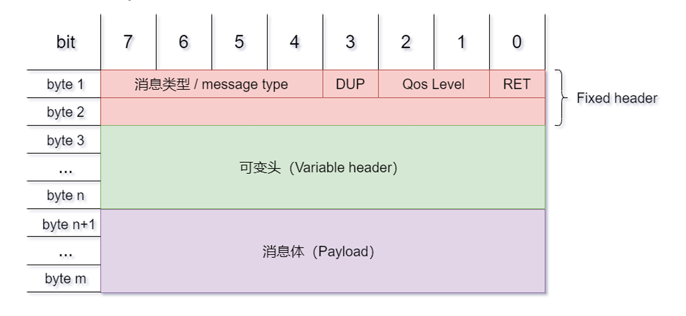
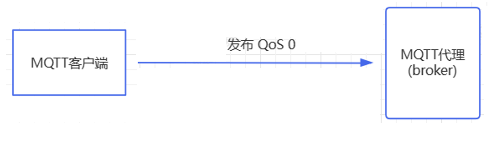
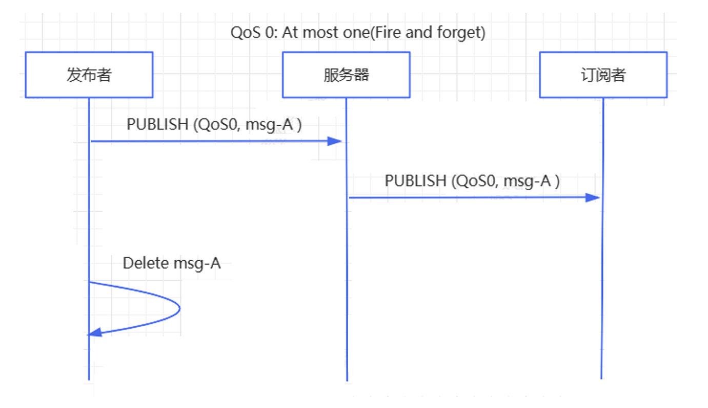
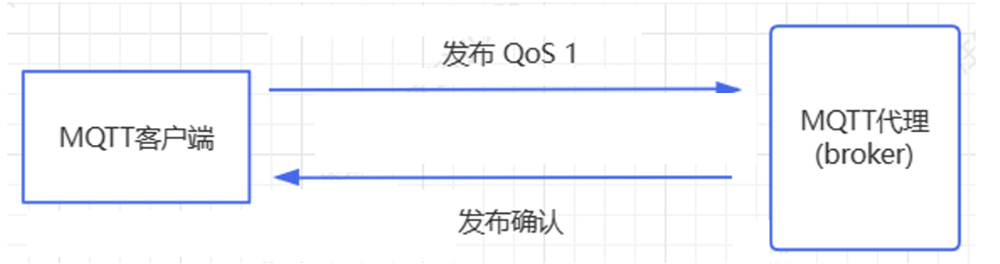
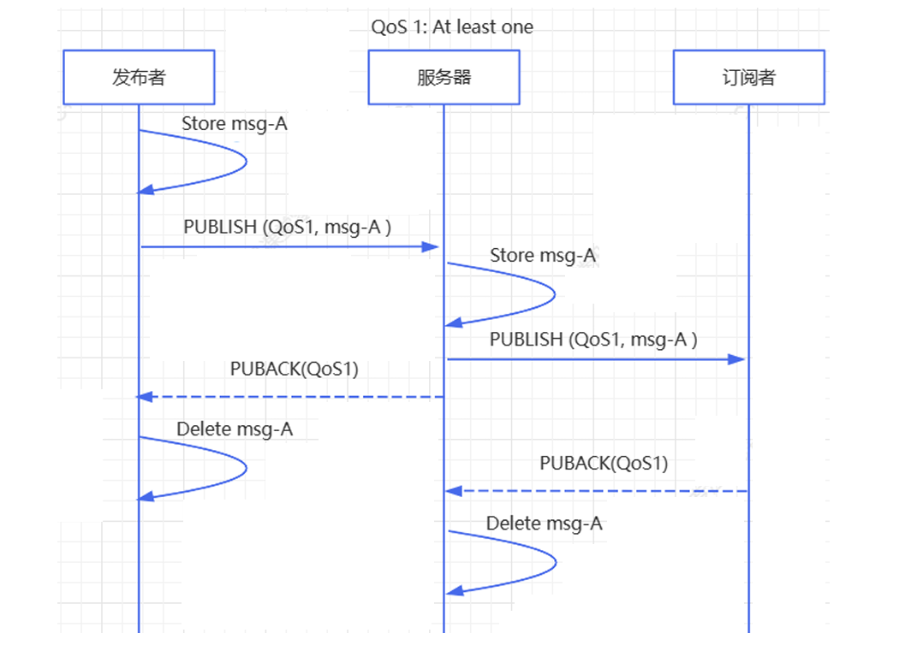
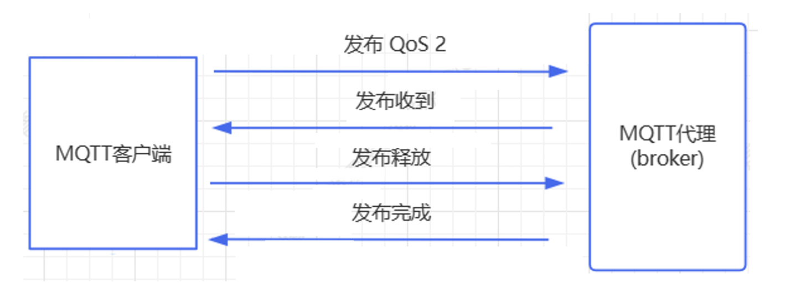
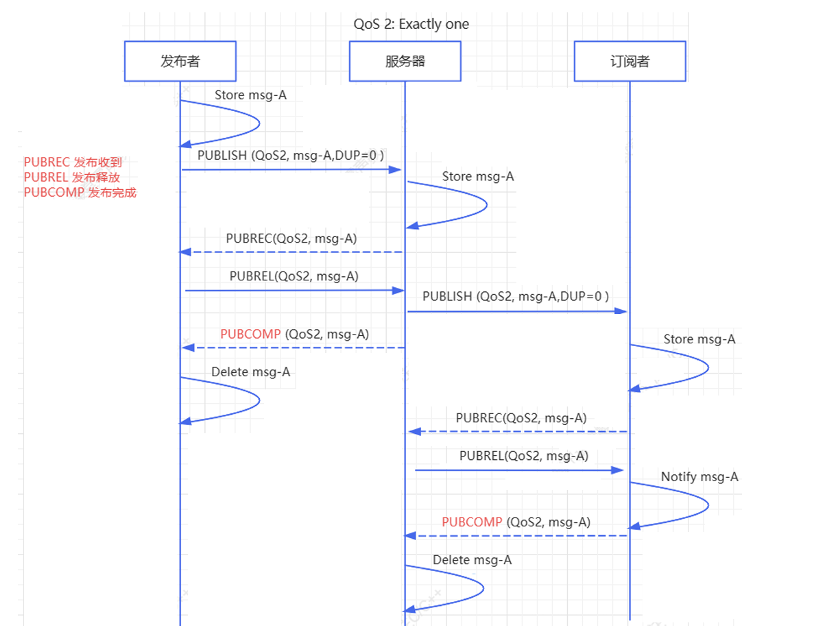

# MQTT的协议原理和设计

## MQTT协议原理

实现MQTT协议需要客户端和服务器端通讯完成，在通讯过程中，MQTT协议中有三种身份：发布者 （Publish）、代理（Broker）（服务器）、订阅者（Subscribe）。其中，消息的发布者和订阅者都是客户 端，消息代理是服务器，消息发布者可以同时是订阅者。

MQTT传输的消息分为：主题（Topic）和负载（payload）两部分：

1. Topic，可以理解为消息的类型，订阅者订阅（Subscribe）后，就会收到该主题的消息内容 （payload）；
2. payload，可以理解为消息的内容，是指订阅者具体要使用的内容。

MQTT会构建底层网络传输：它将建立客户端到服务器的连接，提供两者之间的一个有序的、无损的、基于 字节流的双向传输。当应用数据通过MQTT网络发送时，MQTT会把与之相关的服务质量（QoS）和主题名（Topic）相关连。

### MQTT客户端

一个使用MQTT协议的应用程序或者设备，它总是建立到服务器的网络连接。客户端可以：

1. 发布其他客户端可能会订阅的信息。
2. 订阅其它客户端发布的消息。
3. 退订或删除应用程序的消息。
4.  断开与服务器连接。

### MQTT服务器

MQTT服务器以称为"消息代理"（Broker），可以是一个应用程序或一台设备。它是位于消息发布者和订阅 者之间，它可以：

1. 接受来自客户的网络连接。
2. 接受客户发布的应用信息。
3.  处理来自客户端的订阅和退订请求。
4. 向订阅的客户转发应用程序消息。

### MQTT协议中的相关定义

1. 订阅（Subscription）：订阅包含主题筛选器（Topic Filter）和最大服务质量（QoS）。订阅会与一个会话（Session）关联。一个会话可以包含多个订阅。每一个会话中的每个订阅都有一个不同的主题筛选器。
2. 会话（Session） ：每个客户端与服务器建立连接后就是一个会话，客户端和服务器之间有状态交互。会话存在于一个网络之 间，也可能在客户端和服务器之间跨越多个连续的网络连接。
3. 主题名（Topic Name）：连接到一个应用程序消息的标签，该标签与服务器的订阅相匹配。服务器会将消息发送给订阅所匹配标签的 每个客户端。
4. 主题筛选器（Topic Filter）：一个对主题名通配符筛选器，在订阅表达式中使用，表示订阅所匹配到的多个主题。
5. 负载（Payload）：和body一个意思，消息订阅者所具体接收的内容。

### MQTT协议中的方法

MQTT协议中定义了一些方法（也被称为动作），来于表示对确定资源所进行操作。这个资源可以代表预先存在的数据或动态生成数据，这取决于服务器的实现。通常来说，资源指服务器上的文件或输出。主要方法有：

1. Connect。等待与服务器建立连接。
2.  Disconnect。等待MQTT客户端完成所做的工作，并与服务器断开TCP/IP会话。
3. Subscribe。等待完成订阅。
4. UnSubscribe。等待服务器取消客户端的一个或多个topics订阅。
5. Publish。MQTT客户端发送消息请求，发送完成后返回应用程序线程。

## MQTT的协议设计

 MQTT协议实现方式  header + body。在MQTT协议中，一个MQTT数据包由：固定头（Fixed header）、可变头（Variable header）、消息体 （payload）三部分构成。MQTT数据包结构如下：

- 固定头（Fixed header）。存在于所有MQTT数据包中，表示数据包类型及数据包的分组类标识。
- 可变头（Variable header）。存在于部分MQTT数据包中，数据包类型决定了可变头是否存在及其具体 内容。
- 消息体（Payload）。存在于部分MQTT数据包中，表示客户端收到的具体内容。

### 固定头

MQTT数据包类型在固定头的Byte 1中bits 7-4，相于一个4位的无符号值，类型、取值及描述如下：

| 名称        | 值   | 流方向         | 描述                        |
| ----------- | ---- | -------------- | --------------------------- |
| Reserved    | 0    | 不可用         | 保留位                      |
| CONNECT     | 1    | 客户端到服务器 | 客户端请求连接到服务器      |
| CONNACK     | 2    | 服务器到客户端 | 连接确认                    |
| PUBLISH     | 3    | 双向           | 发布消息                    |
| PUBACK      | 4    | 双向           | 发布确认                    |
| PUBREC      | 5    | 双向           | 发布收到（保证第1部分到达） |
| PUBREL      | 6    | 双向           | 发布释放（保证第2部分到达） |
| PUBCOMP     | 7    | 双向           | 发布完成（保证第3部分到达） |
| SUBSCRIBE   | 8    | 客户端到服务器 | 客户端请求订阅              |
| SUBACK      | 9    | 服务器到客户端 | 订阅确认                    |
| UNSUBSCRIBE | 10   | 客户端到服务器 | 请求取消订阅                |
| UNSUBACK    | 11   | 服务器到客户端 | 取消订阅确认                |
| PINGREQ     | 12   | 客户端到服务器 | PING请求                    |
| PINGRESP    | 13   | 服务器到客户端 | PING应答                    |
| DISCONNECT  | 14   | 客户端到服务器 | 中断连接                    |
| Reserved    | 15   | 不可用         | 保留位                      |

标识位在固定头的Byte 1中bits 3-0。在不使用标识位的消息类型中，标识位被作为保留位（只有PUBLISH使用到，其他消息都是保留位）。如果收到无效的标志时，接收端必须关闭网络连接：

| 数据包  | 标识位         | Bit3 | Bit2 | Bit1 | Bit0    |
| ------- | -------------- | ---- | ---- | ---- | ------- |
| PUBLISH | MQTT 3.1.1使用 | DUP1 | QoS  | QoS  | RETAIN3 |

- DUP：发布消息的副本。用来在保证消息的可靠传输，如果设置为1，则在下面的变长中增加 MessageId，并且需要回复确认，以保证消息传输完成，但不能用于检测消息重复发送。 
- QoS：发布消息的服务质量，即：保证消息传递的次数。"00：最多一次，即：<=1"； 01：至少一次，即：>=1；10：一次，即：=1；11：预留。
- RETAIN： 发布保留标识，表示服务器要保留这次推送的信息，如果有新的订阅者出现，就把这消息推 送给它，如果设有那么推送至当前订阅者后释放。

 剩余长度（Remaining Length）表示当前报文剩余部分的字节数，包括可变报头和负载的数据。位置在Byte 2，在固定报头中，从第2个字节开始。剩余长度等于可变报头的长度（10字节）加上有效载荷的长度。（剩余长度不包括用于编码剩余长度字段本身的字节数）

剩余长度字段的帧格式：

| 第一个字节 |            | 第2个字节  |            | ...  |
| ---------- | ---------- | ---------- | ---------- | ---- |
| Bit 7      | Bit 6:0    | Bit 7      | Bit 6:0    | ...  |
| 进位标志位 | 长度低字节 | 进位标志位 | 长度高字节 | ...  |

剩余长度字段 的字节长度：最少1个字节，最多4个字节。剩余长度字段 可以表示的长度：1个字节时，可以表示剩余 0~127 长度。4个字节时，最大表示长度为  2^(7*4) - 1 = 2^28 - 1 = 268435455 长。之所以1个字节不能表示 2^8 - 1 = 255长度，是因为：每个字节的最高位 Bit7，并不表示数据，是进位标志位。

### 可变头

MQTT数据包中包含一个可变头，它驻位于固定的头和负载之间。可变头的内容因数据包类型而不同，较常的应用是作为包的标识。很多类型数据包中都包括一个2字节的数据包标识字段，这些类型的包有：PUBLISH (QoS > 0)、PUBACK、 PUBREC、PUBREL、PUBCOMP、SUBSCRIBE、SUBACK、UNSUBSCRIBE、UNSUBACK。

| Bit     | 7-0             |
| ------- | --------------- |
| byte 1  | 包标签符（MSB） |
| byte 2… | 包标签符（LSB） |

### Payload消息体

Payload消息体位MQTT数据包的第三部分，包含CONNECT、SUBSCRIBE、SUBACK、UNSUBSCRIBE四种 类型的消息：

1. CONNECT，消息体内容主要是：客户端的ClientID、订阅的Topic、Message以及用户名和密码。
2. SUBSCRIBE，消息体内容是一系列的要订阅的主题以及QoS。
3. SUBACK，消息体内容是服务器对于SUBSCRIBE所申请的主题及QoS进行确认和回复。
4. UNSUBSCRIBE，消息体内容是要取消订阅的主题。

## MQTT的消息可靠性Qos

服务质量(QoS)级别是消息发送方和消息接收方之间的协议，它定义了特定消息的交付保证。MQTT中有3个 QoS级别:

- QoS 0 - 最多一次
- QoS 1 - 至少一次
- QoS 2 - 恰好一次

在MQTT中讨论QoS时，需要考虑消息传递的两个方面:

1. 消息从发布客户端传递到代理。
2. 从代理到订阅客户端的消息传递。

### QoS 0 - 最多一次

最小QoS级别为零0。这个服务级别保证了一次投递。没有交付成功的保证。接收方不确认收到消息，发送方也不存储和重新传输消息。只有两个阶段，是最省资源的方式。只依靠tcp保证数据传输，不保证业务。

在通信时序中，整个过程中的  Sender 不关心  Receiver 是否收到消息，它"尽力"发完消息，至于是否有人收到，它不在乎。

### QoS 1 - 至少一次

QoS级别1保证消息至少被接收者收到一次。**发送方存储消息**，直到从接收方获得确认收到消息的发布确认 (PUBACK)包为止。一条消息可能被多次发送或传递。

发送方使用每个包中的包标识符将发布(PUBLISH)包与相应的发布确认(PUBACK)包进行匹配。如果发送方在合理的时间内没有收到发布确认(PUBACK)包，则重新发送发布(PUBLISH)包。

当接收端收到QoS为1的消息时，可以立即处理。例如，如果接收方是一个代理，则代理将消息发送到所有订阅客户端，然后回答一个发布确认(PUBACK)包。

如果发布客户端再次发送消息，它将设置一个重复(DUP)标志。在QoS 1中，这个DUP标志只用于内部目的，不被代理或客户端处理。消息的接收者发送发布确认(PUBACK)，而不考虑DUP标志。

在通信时序中，Sender 发送的一条消息， Receiver 至少能收到一次，也就是说  Sender 向  Receiver 发送消息，如果发送失败，会继续重试，直到  Receiver 收到消息为止，但是因为重传的原因， Receiver 有可能会**收到重复的消息**。

时序流程如下：

1. Sender 向 Receiver 发送一个带有消息数据的 PUBLISH 包， 并在本地保存这个 PUBLISH 包。
2. Receiver 收到 PUBLISH 包以后，向 Sender 发送一个 PUBACK 数据包，PUBACK 数据包没有消息体 （Payload），在可变头中（Variable header）中有一个包标识（Packet Identifier），和它收到的  PUBLISH 包中的 Packet Identifier 一致。
3. Sender 收到 PUBACK 之后，根据 PUBACK 包中的 Packet Identifier 找到本地保存的 PUBLISH 包，然 后丢弃掉，一次消息的发送完成。
4. 如果 Sender 在一段时间内没有收到 PUBLISH 包对应的 PUBACK，它将该 PUBLISH 包的 DUP 标识设为  1（代表是重新发送的 PUBLISH 包），然后重新发送该 PUBLISH 包。重复这个流程，直到收到 PUBACK， 然后执行第 3 步。

### QoS 2 - 恰好一次

QoS 2是MQTT中最高级别的服务。此级别保证每个消息仅被预期的收件者**接收一次**。QoS 2是服务级别中**最安全、最慢的质量**。这种保证由发送方和接收方之间至少两个请求/响应流(四部分握手)提供。发送方和接收方使用原始发布(PUBLISH)消息的包标识符来协调消息的传递。

当接收端从发送端收到QoS 2 发布(PUBLISH)包时，将对发布(PUBLISH)消息进行相应的处理，并返回一个 承认该发布(PUBLISH)包的发布收到(PUBREC)包。如果发送方没有从接收方得到发布收到(PUBREC)包，它将 再次发送带有重复(DUP)标志的发布(PUBLISH)包，直到它收到确认。 

在通信时序中，Sender 发送的一条消息，Receiver 确保能收到而且只收到一次，也就是说 Sender 尽力向 Receiver 发送消 息，如果发送失败，会继续重试，直到 Receiver 收到消息为止，同时保证 Receiver 不会因为消息重传而收 到重复的消息。

在 QoS2 中，完成一次消息的传递，Sender 和 Reciever 之间至少要发送四个数据包，QoS2  是最安全也是最慢的一种 QoS 等级了。QoS 使用 2 套请求/应答流程（一个 4 段的握手）来确保 Receiver 收到来自 Sender 的消息，且不重复：

1. Sender 发送 QoS 为 2 的 PUBLISH 数据包，数据包 Packet Identifier 为 P，并在本地保存该 PUBLISH  包。
2. Receiver 收到 PUBLISH 数据包以后，在本地保存 PUBLISH 包的 Packet Identifier P，并回复 Sender 一 个 PUBREC 数据包，PUBREC 数据包可变头中的 Packet Identifier 为 P，没有消息体（Payload）。
3. 当 Sender 收到 PUBREC，它就可以安全地丢弃掉初始的 Packet Identifier 为 P 的 PUBLISH 数据包，同 时保存该 PUBREC 数据包，同时回复 Receiver 一个 PUBREL 数据包，PUBREL 数据包可变头中的 Packet  Identifier 为 P，没有消息体；如果 Sender 在一定时间内没有收到 PUBREC，它会把 PUBLISH 包的 DUP 标 识设为 1，重新发送该 PUBLISH 数据包（Payload）。
4. 当 Receiver 收到 PUBREL 数据包，它可以丢弃掉保存的 PUBLISH 包的 Packet Identifier P，并回复  Sender 一个 PUBCOMP 数据包，PUBCOMP 数据包可变头中的 Packet Identifier 为 P，没有消息体 （Payload）。
5. 当 Sender 收到 PUBCOMP 包，那么它认为数据包传输已完成，它会丢弃掉对应的 PUBREC 包。如果  Sender 在一定时间内没有收到 PUBCOMP 包，它会重新发送 PUBREL 数据包。

## Qos的选择

在以下情况下可以选择 QoS0：

1. Client 和 Broker 之间的网络连接非常稳定，例如一个通过有线网络连接到 Broker 的测试用 Client
2. 可以接受丢失部分消息，比如你有一个传感器以非常短的间隔发布状态数据，所以丢一些也可以接受
3. 不需要离线消息

在以下情况下应该选择 QoS1：

1. 你需要接收所有的消息，而且你的应用可以接受并处理重复的消息
2. 你无法接受 QoS2 带来的额外开销，QoS1 发送消息的速度比 QoS2 快很多

在以下情况下应该选择 QoS2：

1. 你的应用必须接收到所有的消息，而且你的应用在重复的消息下无法正常工作，同时你也能接受 QoS2  带来的额外开销

实际上，QoS1 是应用最广泛的 QoS 等级，QoS1 发送消息的速度很快，而且能够保证消息的可靠性。虽然 使用 QoS1 可能会收到重复的消息，但是在应用程序里面处理重复消息，通常并不是件难事。