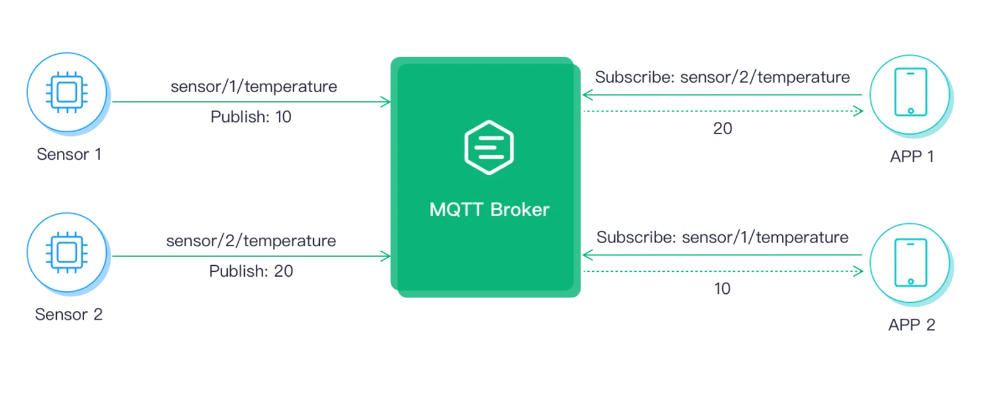

# MQTT的常用函数和主题设计

## mosquitto库中常见的函数

```c++
/*
功能：使用mosquitto库函数前，要先初始化，使用之后就要清除。
返回值：MOSQ_ERR_SUCCESS 总是
*/
int mosquitto_lib_init(void);

/*
功能：使用完mosquitto函数之后，要做清除工作。
返回值： MOSQ_ERR_SUCCESS 总是
*/
int mosquitto_lib_cleanup(void);

/*
功能：创建一个新的mosquitto客户端实例，新建客户端。
参数：
①id ：用作客户端ID的字符串。如果为NULL，将生成一个随机客户端ID。如果id为NULL，clean_session必须为true。
②clean_session：设置为true以指示代理在断开连接时清除所有消息和订阅，设置为false以指示其保留它们，客户端将永远不会在断开连接时丢弃自己的传出消息。调用mosquitto_connect或mosquitto_reconnect将导致重新发送消息。使mosquitto_reinitialise将客户端重置为其原始状态。如果id参数为NULL，则必须将其设置为true。
简言之：就是断开后是否保留订阅信息true/false
③obj： 用户指针，将作为参数传递给指定的任何回调，（回调参数）
返回：成功时返回结构mosquitto的指针，失败时返回NULL，询问errno以确定失败的原因：
ENOMEM内存不足。
EINVAL输入参数无效。
*/
struct mosquitto *mosquitto_new( const char * id, bool clean_session, void * obj );

/*
功能：释放客户端
参数：mosq： struct mosquitto指针
*/
void mosquitto_destroy( struct mosquitto * mosq );

/*
功能：连接确认回调函数，当代理发送CONNACK消息以响应连接时，将调用此方法。
参数：
obj：mosquitto_new中提供的用户数据
rc 连接响应的返回码，其中有：
0-成功
1-连接被拒绝（协议版本不可接受）
2-连接被拒绝（标识符被拒绝）
3-连接被拒绝（经纪人不可用）
4-255-保留供将来使用
*/
void mosquitto_connect_callback_set(struct mosquitto * mosq, void (*on_connect)(struct mosquitto *mosq, void *obj, int rc) );

/*
功能：断开连接回调函数，当代理收到DISCONNECT命令并断开与客户端的连接，将调用此方法。
参数：
rc：0表示客户端已经调用mosquitto_disconnect，任何其他值，表示断开连接时意外的。
*/
void mosquitto_disconnect_callback_set( struct mosquitto mosq,void (on_disconnect)( struct mosquitto *mosq,void *obj, int rc) );


/*
功能: 连接到MQTT代理/服务器（主题订阅要在连接服务器之后进行）
参数：
①mosq ： 有效的mosquitto实例，mosquitto_new（）返回的mosq.
 ②host : 服务器ip地址
③port：服务器的端口号
④keepalive：保持连接的时间间隔， 单位秒。如果在这段时间内没有其他消息交换，则代理应该将PING消
息发送到客户端的秒数。
返回：MOSQ_ERR_SUCCESS 成功。
MOSQ_ERR_INVAL 如果输入参数无效。
MOSQ_ERR_ERRNO 如果系统调用返回错误。变量errno包含错误代码
*/
int mosquitto_connect( struct mosquitto * mosq, const char * host, int port, int keepalive );


/*
功能：断开与代理/服务器的连接。
返回：
MOSQ_ERR_SUCCESS 成功。
MOSQ_ERR_INVAL 如果输入参数无效。
MOSQ_ERR_NO_CONN 如果客户端未连接到代理。
*/
int mosquitto_disconnect( struct mosquitto * mosq );

/*
功能：主题发布的函数
参数：①mosq：有效的mosquitto实例，客户端
②mid：指向int的指针。如果不为NULL，则函数会将其设置为该特定消息的消息ID。然后可以将其与发布回调一起使用，以确定何时发送消息。请注意，尽管MQTT协议不对QoS = 0的消息使用消息ID，但libmosquitto为其分配了消息ID，以便可以使用此参数对其进行跟踪。
③topic：要发布的主题，以null结尾的字符串
④payloadlen：有效负载的大小（字节），有效值在0到268，435，455之间；主题消息的内容长度
⑤payload： 主题消息的内容，指向要发送的数据的指针，如果payloadlen >0，则它必须时有效的存储位置。
⑥qos：整数值0、1、2指示要用于消息的服务质量。
⑦retain：设置为true以保留消息。
返回:
MOSQ_ERR_SUCCESS 成功。
MOSQ_ERR_INVAL 如果输入参数无效。
MOSQ_ERR_NOMEM 如果发生内存不足的情况。
MOSQ_ERR_NO_CONN 如果客户端未连接到代理。
MOSQ_ERR_PROTOCOL 与代理进行通信时是否存在协议错误。
MOSQ_ERR_PAYLOAD_SIZE 如果payloadlen太大。
MOSQ_ERR_MALFORMED_UTF8 如果主题无效，则为UTF-8
MOSQ_ERR_QOS_NOT_SUPPORTED 如果QoS大于代理支持的QoS。
MOSQ_ERR_OVERSIZE_PACKET 如果结果包大于代理支持的包。
*/
int mosquitto_publish( struct mosquitto * mosq, int * mid, const char * topic, int payloadlen, const void * payload, int qos, bool retain );

/*
功能：消息回调函数，收到订阅的消息后调用。
参数：①mosq： 有效的mosquitto实例，客户端。
②on_message 回调函数，格式如下：void callback（struct mosquitto * mosq，void * obj，const struct mosquitto_message * message）
回调的参数：
①mosq：进行回调的mosquitto实例
②obj： mosquitto_new中提供的用户数据
③message: 消息数据，回调完成后，库将释放此变量和关联的内存，客户应复制其所需要的任何数据。
struct mosquitto_message{
int mid;//消息序号ID
char *topic; //主题
void *payload; //主题内容 ，MQTT 中有效载荷
int payloadlen; //消息的长度，单位是字节
int qos; //服务质量
bool retain; //是否保留消息
};
*/
void mosquitto_message_callback_set( struct mosquitto * mosq, void (*on_message)(struct mosquitto *, void *, const struct mosquitto_message *));

/*
功能描述：设置订阅回调。当代理响应订阅请求时，将调用此函数
参数解析：
①mosq：结构体mosquitto的指针
②on_subscribe：一个回调函数
void (*on_subscribe)(struct mosquitto *mosq, void *obj, int mid, int qos_count, const int *granted_qos)
①mosq：结构体mosquitto的指针
②obj：创建客户端的回调参数，是mosquitto_new中提供的用户数据
③mid：订阅消息的消息 id
 ④qos_count：授予的订阅数（granted_qos的大小）
⑤granted_qos：一个整数数组，指示为每个订阅授予的 QoS
*/
void mosquitto_subscribe_callback_set(struct mosquitto mosq, void (on_subscribe)(struct mosquitto *mosq, void *obj, int mid, int qos_count, const int *granted_qos));

/*
功能：此函数在无限阻塞循环中为你调用loop（），对于只想在程序中运行MQTT客户端循环的情况，这很有用，如果服务器连接丢失，它将处理重新连接，如果在回调中调用mosqitto_disconnect（）它将返回。
参数：
①mosq: 有效的mosquitto实例，客户端
②timeout： 超时之前，在select（）调用中等待网络活动的最大毫秒数，设置为0以立即返回，设置为负阻塞。默认值为1000ms。
③max_packets： 该参数当前未使用，应设为为1，以备来兼容
返回值：
MOSQ_ERR_SUCCESS 成功。
MOSQ_ERR_INVAL 如果输入参数无效。
MOSQ_ERR_NOMEM 如果发生内存不足的情况。
MOSQ_ERR_NO_CONN 如果客户端未连接到代理。
MOSQ_ERR_CONN_LOST 如果与代理的连接丢失。
MOSQ_ERR_PROTOCOL 与代理进行通信时是否存在协议错误。
MOSQ_ERR_ERRNO 如果系统调用返回错误。变量errno包含错误代码
*/
int mosquitto_loop_forever( struct mosquitto * mosq, int timeout, int max_packets );

/*
功能:网络事件阻塞回收结束处理函数，这是线程客户端接口的一部分。调用一次可停止先前使用mosquitto_loop_start创建的网络线程。该调用将一直阻塞，直到网络线程结束。为了使网络线程结束，您必须事先调用mosquitto_disconnect或将force参数设置为true。
参数：
①mosq :有效的mosquitto实例
②force：设置为true强制取消线程。如果为false，则必须已经调用mosquitto_disconnect。
返回：
MOSQ_ERR_SUCCESS 成功。
MOSQ_ERR_INVAL 如果输入参数无效。
MOSQ_ERR_NOT_SUPPORTED 如果没有线程支持。
*/
int mosquitto_loop_stop( struct mosquitto * mosq, bool force );

/*
功能：网络事件循环处理函数，通过创建新的线程不断调用mosquitto_loop() 函数处理网络事件，不阻塞
返回：
MOSQ_ERR_SUCCESS 成功。
MOSQ_ERR_INVAL 如果输入参数无效。
MOSQ_ERR_NOT_SUPPORTED 如果没有线程支持。
*/
int mosquitto_loop_start( struct mosquitto * mosq );
```

## MQTT 主题与通配符

MQTT 主题本质上是一个 UTF-8 编码的字符串，是 MQTT 协议进行消息路由的基础。MQTT 主题类似 URL  路径，使用斜杠 / 进行分层。为了避免歧义且易于理解，通常不建议主题以 / 开头或结尾，例如  /chat 或  chat/ 。

不同于消息队列中的主题（比如 Kafka 和 Pulsar），**MQTT 主题不需要提前创建**。 MQTT 客户端在订阅或发布时即自动的创建了主题，开发者无需再关心主题的创建，并且也不需要手动删除主题。

下图是一个简单的 MQTT 订阅与发布流程，  APP 1 订阅了 sensor/2/temperature 主题后，将能接收到  Sensor 2 发布到该主题的消息。



MQTT 主题通配符包含单层通配符 + 及多层通配符 #，主要用于客户端一次订阅多个主题。通配符**只能用于订阅**，不能用于发布。

- 单层通配符加号 (“+” U+002B) 是用于单个主题层级匹配的通配符。在使用单层通配符时，单层通配符必须占据整个层 级，例如：

```shell
sensor/+ 有效
sensor/+/temperature 有效
sensor+ 无效（没有占据整个层级）
# 如果客户端订阅了主题 sensor/+/temperature ，将会收到以下主题的消息：
sensor/1/temperature
sensor/2/temperature
...
sensor/n/temperature
```

- 多层通配符，井字符号（“#” U+0023）是用于匹配主题中任意层级的通配符。多层通配符表示它的父级和任意数量的子层 级，在使用多层通配符时，它必须占据整个层级并且必须是主题的最后一个字符，例如：

```shell
# 有效，匹配所有主题
sensor/# 有效
sensor/bedroom#  无效（没有占据整个层级）
sensor/#/temperature 无效（不是主题最后一个字符）

如果客户端订阅主题 senser/# ，它将会收到以下主题的消息：
sensor
sensor/temperature
sensor/1/temperature
```

- 以 $SYS/ 开头的主题为系统主题，系统主题主要用于获取  户端上下线事件等数据。
- 共享订阅是 MQTT 5.0 引入的新特性，用于在多个订阅者之间实现订阅的负载均衡，MQTT 5.0 规定的 共享订阅主题以  $share 开头。

## 不同场景中的主题设计

### 智能家居

比如我们用传感器监测卧室、客厅以及厨房的温度、湿度和空气质量，可以设计以下几个主题：

- myhome/bedroom/temperature
-  myhome/bedroom/humidity
-  myhome/bedroom/airquality
- myhome/livingroom/temperature
-  myhome/livingroom/humidity
- myhome/livingroom/airquality

接下来，可以通过订阅  myhome/bedroom/+ 主题获取卧室的温度、湿度及空气质量数据，订阅  myhome/+/temperature 主题获取两个房间的温度数据，订阅myhome/# 获取所有的数据。

### 充电桩

在充电桩的上行主题格式为  ocpp/cp/${cid}/notify/${action} ，下行主题格式为  ocpp/cp/${cid}/reply/${action}。

- ocpp/cp/cp001/notify/bootNotification  充电桩上线时向该主题发布上线请求。
- ocpp/cp/cp001/notify/startTransaction  向该主题发布充电请求。
- ocpp/cp/cp001/reply/bootNotification  充电桩上线前需订阅该主题接收上线应答。
- ocpp/cp/cp001/reply/startTransaction  充电桩发起充电请求前需订阅该主题接收充电请求应答。

### 即时消息

- chat/user/${user_id}/inbox  ： 一对一聊天：用户上线后订阅该收件箱主题 ，将能接收到好友发送给自己的消息。给好友回复消息 时，只需要将该主题的  user_id 换为好友的的 id 即可。
- chat/group/${group_id}/inbox ：  群聊：用户加群成功后，可订阅该主题获取对应群组的消息，回复群聊时直接给该主题发布消息即可。
- req/user/${user_id}/add   ： 添加好友：可向该主题发布添加好友的申请（ user_id 为对方的 id）。
- resp/user/${user_id}/add  ： 接收好友请求的回复：用户添加好友前，需订阅该主题接收请求结果（ user_id 为自己的 id）。
- user/${user_id}/state  ： 用户在线状态：用户可以订阅该主题获取好友的在线状态


