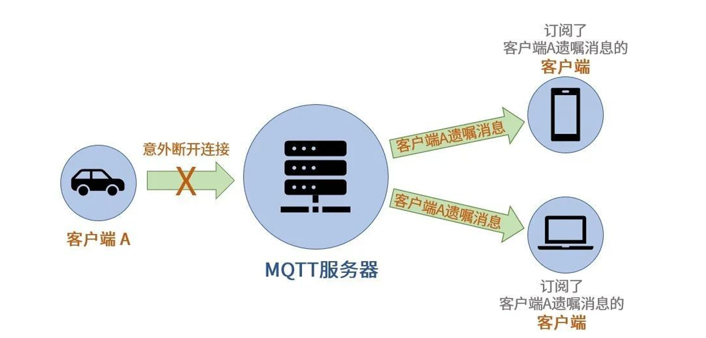
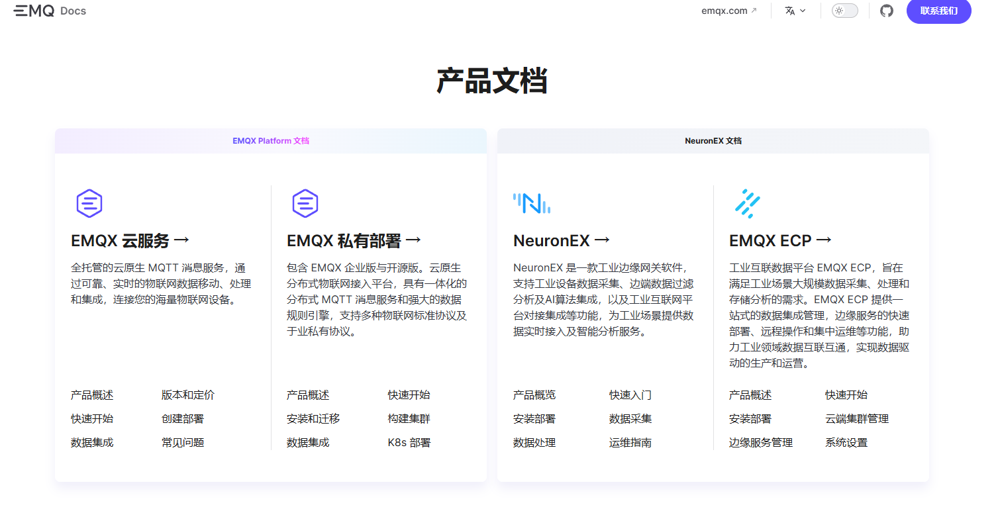
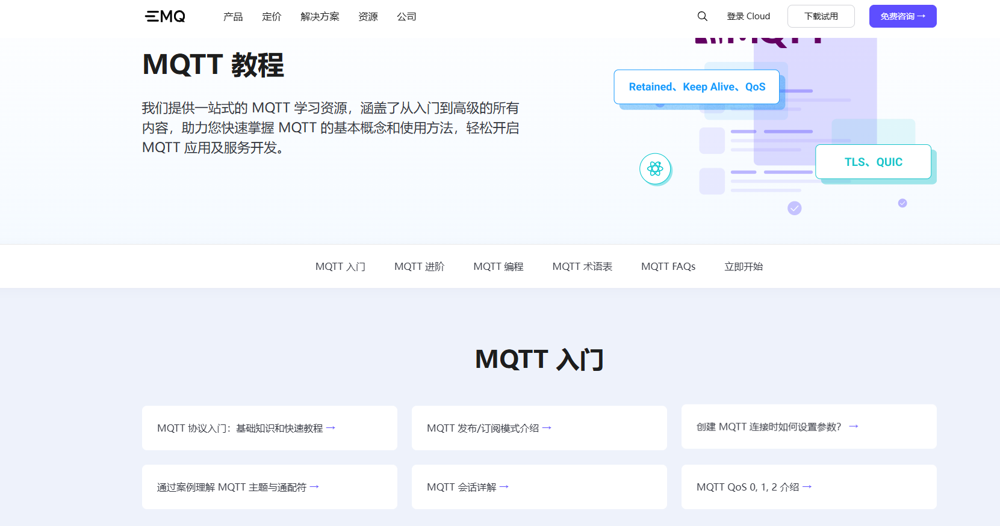

# MQTT的broker使用

## broker的retained消息

retained 消息是指在 PUBLISH 数据包中 Retain 标识设为 1 的消息，broker 收到这样的 PUBLISH 包以后， 将保存这个消息，当有一个新的订阅者订阅相应主题的时候，broker 会马上将这个消息发送给订阅者。

retained消息有以下的特点

1. 一个Topic只能有一条retained消息，发布新的retained 消息将覆盖老的 retained 消息（所以想删除一 个 retained 消息也很简单，只要向这个主题发布一个 payload 长度为 0 的 retained 消息就可以了，这样订阅端再登录就收不到消息了）
2. 如果订阅者使用通配符订阅主题，它会收到所有匹配的主题上的 retained 消息。
3. 只有新的订阅者才会收到 retained 消息，如果订阅者重复订阅一个主题，也会被当做新的订阅者，然 后收到 retained 消息。
4. broker 收到 retained 消息后，会单独保存一份，再向当前的订阅者发送一份普通的消息（retained 标 识为 0）。当有新订阅者的时候， broker 会把保存的这条消息发给新订阅者（retained 标识为 1）。

> 如果client_id不为空，clean_sesson为false，则在成功订阅一次后，对应的client_id再次登录的 时候可以不再调用mosquitto_subscribe。

```shell
# 启动代理服务：
mosquitto -v
# -v 详细模式 打印调试信息
# 默认占用：1883端口

# 发布retained消息内容：
mosquitto_pub -t ysx -m yangshuangxin -r 
# -t 指定订阅的主题，主题为：ysx
# -m 指定发布的消息的内容: yangshuangxin
# -r retain
# -q 默认为0，可以指定

# 订阅主题：
mosquitto_sub -v -t ysx -i id_123456 -c 
# -t 指定订阅的主题，主题为：ysx
# -v 详细模式 打印调试信息
# -i 对应client_id
```

## broker的session保存

cleansession这个配置是client端在初始化时传入的参数（主要针对sub订阅端）

```c++
bool clean_session = false;
mosq = mosquitto_new(CLIENT_ID, clean_session, NULL);
```

> 每个库的名字可能不一样

 broker端其实并不是靠clientId区别client端的，实际上还是靠session，broker端如果没有持久化到数 据库中，重新启动以后session会全部丢失。

clean_session这个配置如果改为true，client端每次重连都会重新申请session，broker端就不能够判断出此设 备是以前已经连接过的设备了。

clean_session如果配置为false，client端在上线并订阅主题后，broker会查找设备在离线时没有接收到的消息， 一股脑全发出去，而这些消息很可能早就没有价值了。

> 当刚启动client端就收到一堆消息,并且并没有pub消息时，很有可能就是此项配置的问题，所以sub 端需要根据需要设置正确的参数

retained消息和持久性会话的区别：

1. retained消息是broker为每一个Topic单独存储的
2. 持久性会话是broker为每一个Client单独存储的

## broker的遗嘱机制

MQTT的心跳机制可以让服务端随时掌握客户端连接情况。当客户端“心跳”正常时，服务端即知道客户端仍然 在线（活着）。当心跳一旦停止，服务端就会发现该客户端已经断线（死亡）。

为了让客户端可以更好的发挥作用，便于服务端管理，MQTT协议允许客户端在“活着”的时候就写好遗嘱，这 样一旦客户端意外断线，服务端就可以将客户端的遗嘱公之于众。

遗嘱消息可以看作是一个简化版的 PUBLISH 消息，它也包含 Topic, payload, QoS 等字段。遗嘱消息会在设备与服务端连接时，通过 CONNECT 报文指定，然后在设备意外断线时由broker服务端将该遗嘱消息发布到连接时指定的遗嘱主题（Will Topic）上。

> 这也意味着broker服务端必须在回复 CONNACK 之前完成遗嘱消息的存储，以 确保之后任一时刻发生意外断线的情况，服务端都能保证遗嘱消息被发布。



当客户端正常断开连接时，会向服务端发送DISCONNECT报文，服务端接收到该报文后，就 知道，客户端是正常断开连接，而并非意外断开连接。

而意外断线是当服务端在没有收到DISCONNECT报文的情况下，发现客户端“心跳”停止了，这时服务端就 知道客户端是意外断线了。一般有以下三种可能：

1. 因网络故障或网络波动，设备在保持连接周期内未能通讯，连接被服务端关闭
2. 设备意外掉电
3. 设备尝试进行不被允许的操作而被服务端关闭连接，例如订阅自身权限以外的主题等

遗嘱机制息在  MQTT 5.0 和 MQTT 3.1 & 3.1.1 的差异，只有MQTT 5.0支持`Will Properties`，其他的都支持。 Will Retain、Will QoS、Will Topic 和 Will payload 的用处与普通 PUBLISH 报文基本一致。

> 值得一提的是 Will Retain 的使用场景，它是 保留消息与遗嘱消息的结合。如果订阅该遗嘱主题（Will  Topic）的客户端不能保证遗嘱消息发布时在线，那么建议为遗嘱消息设置 Will Retain，避免订阅端错过遗嘱消息。

```c++
int qos = 1;
 bool retain = true;
 mosquitto_will_set(mosq, "topic/on/unexpected/disconnect", strlen("will message"), "will message", qos, retain); 
```

> Properties是MQTT 5.0新增的，目的是区分不同订阅主题的重复消息。例如订阅了 /home/+ 和/home/PM2_5主题，会受到两条一模一样的消息。

## MQTT的商业解决方案broker

[EMQX 文档](https://docs.emqx.com/zh/)

EMQX 是一款「无限连接，任意集成，随处运行」的大规模分布式物联网接入平台，同时作为一个高性能、可扩展的 MQTT 消息服务器，它可以为物联网（IoT）应用提供可靠的实时消息传输和设备连接解决方案。EMQX 累计拥有来自 50 多个国家的 20,000 多家企业用户，连接全球超过 1 亿台物联网设备，服务企业数字化、实时化、智能化转型。

EMQX有开源版本和商业化版本，可以满足不同的业务需求。



EMQX网站提供完整的MQTT学习教程[MQTT 最全教程：从入门到精通 | EMQ](https://www.emqx.com/zh/mqtt-guide)

