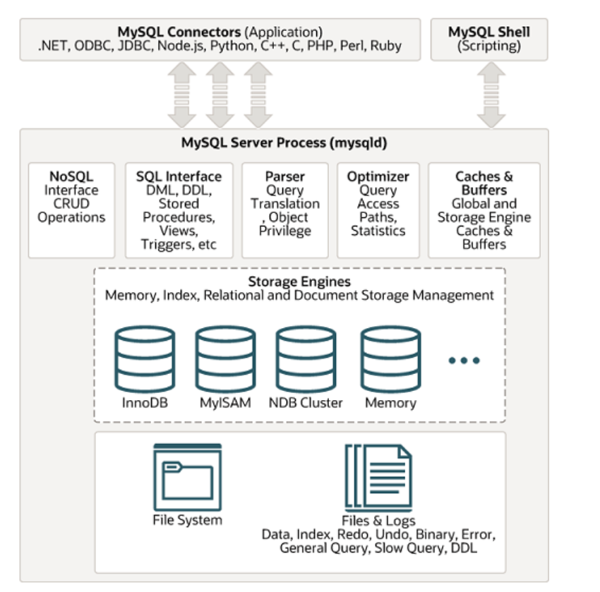
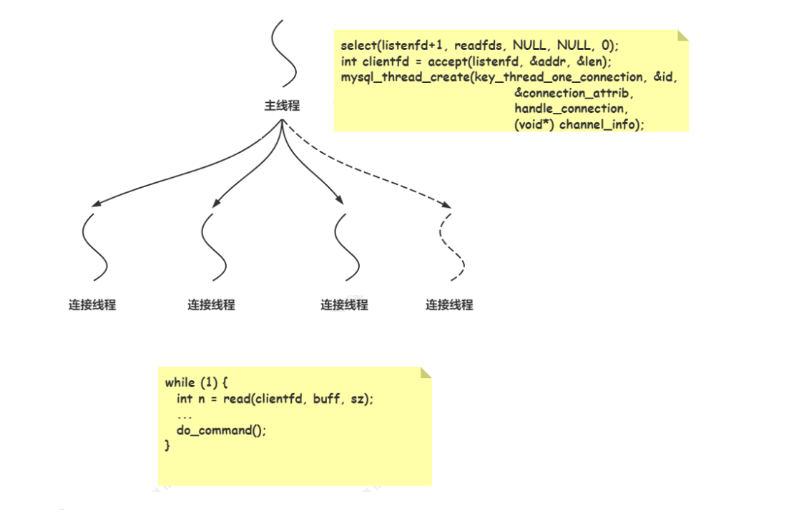
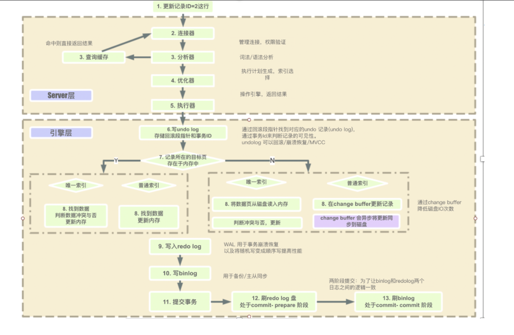

# Mysql 的基本概念和操作

## 基本概念

### 数据库

按照数据结构来组织、存储和管理数据的仓库。是一个长期存储在计算机内的、有组织的、可共享的、统一管理的大量数据的集合。

### OLTP 

OLTP（On-Line transaction processing）翻译为联机事务处理。主要对数据库增删改。OLTP 主要用来记录某类业务事件的发生，数据会以增删改的方式在数据库中进行数据的更新处理操作，要求实时性高、稳定性强、确保数据及时更新成功。

### OLAP

OLAP（On-Line Analytical Processing）翻译为联机分析处理。主要对数据库查询。当数据积累到一定的程度，我们需要对过去发生的事情做一个总结分析时，就需要把过去一段时间内产生的数据拿出来进行统计分析，从中获取我们想要的信息，为公司做决策提供支持，这时候就是在做 OLAP 了。

### SQL

结构化查询语言(Structured Query Language) 简称 SQL，是一种特殊目的的编程语言，是一种数据库查询和程序设计语言，用于存取数据以及查询、更新和管理关系数据库系统。SQL 是关系数据库系统的标准语言。

> 关系型数据库包括：MySQL, SQL Server, Oracle, Sybase,postgreSQL 以及 MS Access等

SQL 命令包括：DQL、DML、DDL、DCL以及TCL。

- DQL: Data Query Language - 数据查询语言。select：从一个或者多个表中检索特定的记录。
- DML: Data Manipulate Language - 数据操作语言。insert：插入记录；update：更新记录；delete：删除记录。
- DDL: Data Define Languge - 数据定义语言。create：创建一个新的表、表的视图、或者在数据库中的对象；alter：修改现有的数据库对象，例如修改表的属性或者字段；drop：删除表、数据库对象或者视图。
- DCL: Data Control Language - 数据控制语言。grant：授予用户权限；revoke：收回用户权限。
- TCL: Transaction Control Language - 事务控制语言。commit：事务提交；rollback：事务回滚。

### 数据库术语

- 数据库：数据库是一些关联表的集合。
- 数据表：表是数据的矩阵。
- 列：一列包含相同类型的数据。
- 行：或者称为记录是一组相关的数据。
- 主键：主键是唯一的，一个数据表只能包含一个主键。
- 外键：外键用来关联两个表，来保证参照完整性。（MyISAM 存储引擎本身并不支持外键，只起到注释作用；而 innoDB 完整支持外键）
- 复合键：或称组合键，将多个列作为一个索引键。
- 索引：用于快速访问数据表的数据。索引是对表中的一列或者多列的值进行排序的一种结构。

### `MySQL` 的基本架构

MySQL 由以下几部分组成：连接池组件、管理服务和工具组件、SQL 接口组件、查询分析器组件、优化器组件、缓冲组件、插件式存储引擎、物理文件。



#### 连接池组件 

不同语言的代码程序和 MySQL 的交互（SQL交互）。

MySQL 内部有一个连接池，管理缓冲用户连接、用户名、密码、权限校验、线程处理等需要缓存的需求。MySQL的网络处理流程为主线程接收连接，接收连接交由连接池处理。

处理方式为IO多路复用 select + 阻塞的 io，MySQL 命令处理是多线程并发处理的。主线程负责接收客户端连接，然后为每个客户端 fd 分配一个连接线程，负责处理该客户端的 sql 命令处理。



#### 管理服务和工具组件

系统管理和控制工具，例如备份恢复、MySQL 复制、集群等。

#### SQL接口

将 SQL 语句解析生成相应对象。DML，DDL，存储过程，视图，触发器等。

#### 查询解析器

将 SQL 对象交由解析器验证和解析，并生成语法树。

#### 查询优化器

SQL 语句执行前使用查询优化器进行优化。

#### 缓冲组件

一块内存区域，用来弥补磁盘速度较慢对数据库性能的影响。在数据库进行读取页操作，首先将从磁盘读到的页存放在缓冲池中，下一次再读相同的页时，首先判断该页是否在缓冲池中，若在缓冲池命中，直接读取；否则读取磁盘中的页，说明该页被 LRU 淘汰了。

缓冲池中 LRU 采用最近最少使用算法来进行管理，缓冲池缓存的数据类型有：索引页、数据页、以及与存储引擎缓存相关的数据。

> 缓冲组件 在MYSQL 5.0版本还存在，在8.0版本已经被淘汰删除。

## 基本操作

### 数据库设计三范式 及反范式

减少空间占用。为了建立冗余较小、结构合理的数据库，设计数据库时必须遵循一定的规则。在关系型数据库中这种规则就称为范式。范式是符合某一种设计要求的总结。要想设计一个结构合理的关系型数据库，必须满足一定的范式.

#### 范式一 

列不可分，确保每列保持原子性；数据库表中的所有字段都是不可分解的原子值。例如：某表中有一个地址字段，如果经常需要访问地址字段中的城市属性，则需要将该字段拆分为多个字段，省份、城市、详细地址等。

#### 范式二

依赖主键，确保表中的每列都和主键相关，而不能只与主键的某一部分相关（组合索引）。

#### 范式三 

直接依赖，确保每列都和主键直接相关，而不是间接相关，减少数据冗余。

下表的数据库不满足三范式：

| 订单编号 | 商品编号 | 商品名称 | 数量 | 单位 | 价格 | 客户   | 所属单位 | 联系方式 |
| -------- | -------- | -------- | ---- | ---- | ---- | ------ | -------- | -------- |
| 1        | 1        | 电脑     | 1    | 台   | 8000 | shuang | zhihu    | 13777777 |
| 1        | 2        | 手机     | 3    | 部   | 5000 | shuang | zhihu    | 13777777 |
| 2        | 3        | 平板     | 2    | 部   | 7000 | xin    | zhihu    | 13699999 |

订单编号 主键 与客户、所属单位 、联系方式相关，所以需要拆分表：

| 订单编号 | 客户   | 所属单位 | 联系方式 |
| -------- | ------ | -------- | -------- |
| 1        | shuang | zhihu    | 13777777 |
| 2        | xin    | zhihu    | 13699999 |

订单编号和商品编号作为联合主键，与数量相关，进行拆分表：

| 订单编号 | 商品编号 | 数量 |
| -------- | -------- | ---- |
| 1        | 1        | 1    |
| 1        | 2        | 3    |
| 2        | 3        | 2    |

商品编号作为主键，与商品名称、单位、商品价格相关，进行拆分表：

| 商品编号 | 商品名称 | 单位 | 商品价格 |
| -------- | -------- | ---- | -------- |
| 1        | 电脑     | 台   | 8000     |
| 2        | 手机     | 部   | 5000     |
| 3        | 平板     | 部   | 7000     |

#### 反范式

范式可以避免数据冗余，减少数据库的空间，减小维护数据完整性的麻烦；但是采用数据库范式化设计，可能导致数据库业务涉及的表变多，并且造成更多的联表查询，将导致整个系统的性能降低；因此基于性能考虑，可能需要进行反范式设计，允许冗余存储，提升查询效率。

### Mysql 的基本CRUD 

Mysql执行SQL步骤如下：

1. 连接器接收数据，管理连接，校验用户信息。
2. 查询缓存，如果命中KV缓存直接返回，否则继续执行。（8.0版本已经删除）
3. 分析器词法句法分析，生成语法树。
4. 优化器指定执行计划，选择执行成本最小的计划。
5. 执行器根据执行计划，从存储引擎获取、修改数据，并返回结果给客户端。



- 创建数据库

```sql
CREATE DATABASE `数据库名` DEFAULT CHARACTER SET utf8;
```

- 删除数据库

```sql
DROP DATABASE `数据库名`;
```

- 选择数据库

```sql
USE `数据库名`;
```

- 创建表 

```sql
CREATE TABLE `table_name` (column_name column_type);
CREATE TABLE IF NOT EXISTS `school` (
   `id` INT UNSIGNED AUTO_INCREMENT COMMENT '编号',
   `course` VARCHAR(100) NOT NULL COMMENT '课程',
   `teacher` VARCHAR(40) NOT NULL COMMENT '教师',
   `price` DECIMAL(8,2) NOT NULL COMMENT '价格',
   PRIMARY KEY ( `id` )
)ENGINE=innoDB DEFAULT CHARSET=utf8 COMMENT = '课程表';

```

创建表时，表中的字段有可以设置5大约束：

1. not null  非空约束
2. auto_increment 自增约束
3. unique 唯一约束
4. primary 主键约束（非空且唯一）
5. foreign 外键约束

- 删除表

```sql
DROP TABLE `table_name`;
```

使用drop （DDL）删除数据，速度快，会删除整张表结构和表数据，包括索引、约束、触发器等。

- 清空数据表

```sql
TRUNCATE TABLE `table_name`; -- 截断表 以页为单位（至少有两行数据），有自增索引的话，从初始值开始累加
DELETE TABLE `table_name`; -- 逐行删除，有自增索引的话，从之前值继续累加
```

使用truncate  （DDL）删除数据较快，会删除表数据，其他保留（auto_increment 重置为1），不能回滚数据，会释放存储空间，以页为单位进行数据删除。

使用delete （DML）删除数据，可以选择删除部分或全部数据，其它保留，是有条件的删除。支持回滚，逐行删除，内部实现只是打删除标记。

- 增加数据

```sql
INSERT INTO `table_name`(`field1`, `field2`, ..., `fieldn`) VALUES (value1, value2, ..., valuen);
INSERT INTO `school` (`course`, `teacher`, `price`) VALUES ('zhihu', 'yangshuangxin', 1000.0);
```

- 删除数据

```sql
DELETE FROM `table_name` [WHERE Clause];
DELETE FROM `school` WHERE id = 1;
```

- 修改数据

```sql
UPDATE table_name SET field1=new_value1, field2=new_value2 [, fieldn=new_valuen]
UPDATE `school` SET `teacher` = 'xin' WHERE id = 1;-- 累加
UPDATE `school` set `age` = `age` + 1 WHERE id = 1;
```

- 查询数据

```sql
SELECT field1, field2,...fieldN FROM table_name [WHERE Clause]
```

