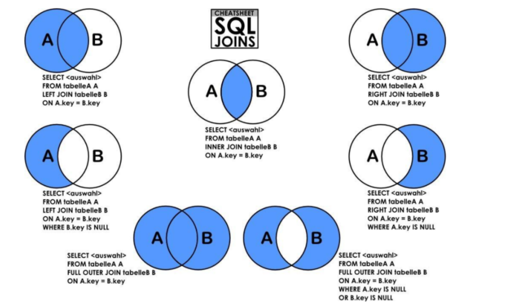

# Mysql 的进阶操作

mysql的进阶操作就是多个表进行互相关联的查询操作，首先准备多个数据表。

## 建多个表

```sql
DROP TABLE IF EXISTS `class`;
CREATE TABLE `class` (
  `cid` int(11) NOT NULL AUTO_INCREMENT,
  `caption` varchar(32) NOT NULL,
  PRIMARY KEY (`cid`)
) ENGINE=innoDB AUTO_INCREMENT=5 DEFAULT CHARSET=utf8;

# innoDB 有外键约束   myisam 注释的作用
DROP TABLE IF EXISTS `course`;
CREATE TABLE `course` (
  `cid` int(11) NOT NULL AUTO_INCREMENT,
  `cname` varchar(32) NOT NULL,
  `teacher_id` int(11) NOT NULL,
  PRIMARY KEY (`cid`),
  KEY `fk_course_teacher` (`teacher_id`),
  CONSTRAINT `fk_course_teacher` FOREIGN KEY (`teacher_id`) REFERENCES `teacher` (`tid`)
) ENGINE=innoDB AUTO_INCREMENT=5 DEFAULT CHARSET=utf8;

DROP TABLE IF EXISTS `score`;
CREATE TABLE `score` (
  `sid` int(11) NOT NULL AUTO_INCREMENT,
  `student_id` int(11) NOT NULL,
  `course_id` int(11) NOT NULL,
  `num` int(11) NOT NULL,
  PRIMARY KEY (`sid`),
  KEY `fk_score_student` (`student_id`),
  KEY `fk_score_course` (`course_id`),
  CONSTRAINT `fk_score_course` FOREIGN KEY (`course_id`) REFERENCES `course` (`cid`),
  CONSTRAINT `fk_score_student` FOREIGN KEY (`student_id`) REFERENCES `student` (`sid`)
) ENGINE=innoDB AUTO_INCREMENT=53 DEFAULT CHARSET=utf8;

DROP TABLE IF EXISTS `student`;
CREATE TABLE `student` (
  `sid` int(11) NOT NULL AUTO_INCREMENT,
  `gender` char(1) NOT NULL,
  `class_id` int(11) NOT NULL,
  `sname` varchar(32) NOT NULL,
  PRIMARY KEY (`sid`),
  KEY `fk_class` (`class_id`),
  CONSTRAINT `fk_class` FOREIGN KEY (`class_id`) REFERENCES `class` (`cid`)
) ENGINE=innoDB AUTO_INCREMENT=17 DEFAULT CHARSET=utf8;

DROP TABLE IF EXISTS `teacher`;
CREATE TABLE `teacher` (
  `tid` int(11) NOT NULL AUTO_INCREMENT,
  `tname` varchar(32) NOT NULL,
  PRIMARY KEY (`tid`)
) ENGINE=innoDB AUTO_INCREMENT=6 DEFAULT CHARSET=utf8;
```

## 高级查询操作

- 基础查询

```sql
-- 全部查询
SELECT * FROM student;
-- 只查询部分字段
SELECT `sname`, `class_id` FROM student;
-- 别名  列明  不要用关键字
SELECT `sname` AS '姓名' , `class_id` AS '班级ID' FROM student;
-- 把查询出来的结果的重复记录去掉
SELECT distinct `class_id` FROM student;
```

- 条件查询

```sql
-- 查询姓名为 yangshuangxin 的学生信息
SELECT * FROM `student` WHERE `name` = 'yangshuangxin';
-- 查询性别为 男，并且班级为 2 的学生信息
SELECT * FROM `student` WHERE `gender`="男" AND `class_id`=2;
```

- 范围查询

```sql
-- 查询班级id 1 到 3 的学生的信息
SELECT * FROM `student` WHERE `class_id` BETWEEN 1 AND 3;
```

- 判空查询

```sql
# is null 判断造成索引失效
# 索引 B+ 树
SELECT * FROM `student` WHERE `class_id` IS NOT NULL; #判断不为空
SELECT * FROM `student` WHERE `class_id` IS NULL;  #判断为空
SELECT * FROM `student` WHERE `gender` <> '';    #判断不为空字符串  
SELECT * FROM `student` WHERE `gender` = '';   #判断为空字符串   
```

- 模糊查询

```sql
-- 使用 like关键字，"%"代表任意数量的字符，”_”代表占位符
-- 查询名字为 yang 开头的学生的信息
SELECT * FROM `teacher` WHERE `tname` LIKE 'yang%';
-- 查询姓名里第二个字为 shuang 的学生的信息
SELECT * FROM `teacher` WHERE `tname` LIKE '_shuang%';
```

- 分页查询

```sql
-- 分页查询主要用于查看第N条 到 第M条的信息，通常和排序查询一起使用
-- 使用limit关键字，第一个参数表示从条记录开始显示，第二个参数表示要显示的数目。表中默认第一条记录的参数为0。
-- 查询第二条到第三条内容
SELECT * FROM `student` LIMIT 1,2;
```

- 查询后排序

```sql
-- 关键字：order by field,  asc:升序, desc:降序
SELECT * FROM `score` ORDER BY `num` ASC;
-- 按照多个字段排序
SELECT * FROM `score` ORDER BY `course_id` DESC, `num` DESC;
```

- 聚合查询

| 聚合函数 | 描述             |
| -------- | ---------------- |
| sum()    | 计算某列的总和   |
| avg()    | 计算某列的平均值 |
| max()    | 计算某列的最大值 |
| min()    | 计算某列的最小值 |
| count()  | 计算某列的行数   |

```sql
SELECT sum(`num`) FROM `score`;
SELECT avg(`num`) FROM `score`;
SELECT max(`num`) FROM `score`;
SELECT min(`num`) FROM `score`;
SELECT count(`num`) FROM `score`;
```

- 分组查询

```sql
-- 分组 加 group_concat
SELECT `gender`, group_concat(`age`) as ages FROM `student` GROUP BY `gender`;
-- 可以把查询出来的结果根据某个条件来分组显示
SELECT `gender` FROM `student` GROUP BY `gender`;
-- 分组加聚合
SELECT `gender`, count(*) as num FROM `student` GROUP BY `gender`;
-- 分组加条件
SELECT `gender`, count(*) as num FROM `student` GROUP BY `gender` HAVING num > 6;
```

## 联表查询

联表查询是查询多个表公共组成查询结构，联表查询的操作如下：



- INNER JOIN 只取两张表有对应关系的记录

```sql
SELECT
  cid
FROM
  `course`
INNER JOIN `teacher` ON course.teacher_id = teacher.tid;
```

- LEFT JOIN 在内连接的基础上保留左表没有对应关系的记录

```sql
SELECT
  course.cid
FROM
  `course`
LEFT JOIN `teacher` ON course.teacher_id = teacher.tid;
```

- RIGHT JOIN 在内连接的基础上保留右表没有对应关系的记录

```sql
SELECT
  course.cid
FROM
  `course`
RIGHT JOIN `teacher` ON course.teacher_id = teacher.tid;
```

## 子查询

- 单行子查询

```sql
select * from course where teacher_id = (select tid from teacher where tname = 'yangshuangxin')
```

- 多行子查询，返回多行记录的子查询。

1. **IN 关键字**：运算符可以检测结果集中是否存在某个特定的值，如果检测成功就执行外部的查询。
2. **EXISTS 关键字**：内层查询语句不返回查询的记录，而是返回一个真假值。如果内层查询语句查询到满足条件的记录，就返回一个真值（true），否则，将返回一个假值（false）。当返回的值为 true 时，外层查询语句将进行查询；当返回的为false 时，外层查询语句不进行查询或者查询不出任何记录。
3. **ALL 关键字**：表示满足所有条件。使用 ALL 关键字时，只有满足内层查询语句返回的所有结果，才可以执行外层查询语句。
4. ANY 关键字：允许创建一个表达式，对子查询的返回值列表进行比较，只要满足内层子查询中的任意一个比较条件，就返回一个结果作为外层查询条件。
5. **在 FROM 子句中使用子查询**：子查询出现在 from 子句中，这种情况下将子查询当做一个临时表使用。

```sql
select * from student where class_id in (select cid from course where teacher_id = 2);

select * from student where exists(select cid from course where cid = 5);

SELECT
    student_id,
    sname
FROM
    (SELECT * FROM score WHERE course_id = 1 OR 
course_id = 2) AS A
LEFT JOIN student ON A.student_id = student.sid;
```

## 正则表达式

| 选项        | 匹配说明                     | 例子                                   | 匹配值                    |
| ----------- | ---------------------------- | -------------------------------------- | ------------------------- |
| ^           | 文本开始字符                 | '^b'匹配以字母b开头的字符串            | book, big,banana,bike     |
| .           | 任何单个字符                 | 'b.t'匹配任何b和t之间有一个字符        | bit, bat,but, bite        |
| *           | 0个或多个在它前面的字符      | 'f*n'匹配字符n前面有任意n个字符f       | fn, fan,faan, abcn        |
| +           | 前面的字符一次或多次         | 'ba+'匹配以b开头后面紧跟至少一个a      | ba, bay,bare, battle      |
| 字符串      | 包含指定字符串的文本         | 'fa'                                   | fan, afa,faad             |
| [字符集合]  | 字符集合中的任一个字符       | '[xz]'匹配x或者z                       | dizzy,zebra, x-ray, extra |
| [^]         | 不在括号中的任何字符         | '\[^abc]'匹配任何不包含a、b或c的字符串 | desk, fox,f8ke            |
| 字符串{n}   | 前面的字符串至少n次          | b{2}匹配2个或更多的b                   | bbb, bbbb,bbbbbb          |
| 字符串{n,m} | 前面的字符串至少n次，至多m次 | b{2,4}匹配最少2个，最多4个b            | bb, bbb,bbbb              |

```sql
SELECT * FROM `teacher` WHERE `tname` REGEXP '^yang';
```

## 视图

视图（view）是一种虚拟存在的表，是一个逻辑表，本身并不包含数据。其内容由查询定义。用来创建视图的表叫基表，通过视图，可以展现基表的部分数据。视图数据来自定义视图的查询中使用的表，使用视图动态生成。

### 视图的优点

1. 简单。使用视图的用户完全不需要关心后面对应的表的结构、关联条件和筛选条件，对用户来说已经是过滤好的复合条件的结果集。
2. 安全。使用视图的用户只能访问他们被允许查询的结果集，对表的权限管理并不能限制到某个行某个列，但是通过视图就可以简单的实现。
3. 数据独立。一旦视图的结构确定了，可以屏蔽表结构变化对用户的影响，源表增加列对视图没有影响；源表修改列名，则可以通过修改视图来解决，不会造成对访问者的影响。

### 视图的作用

1. 可复用，减少重复语句书写，类似程序中函数的作用。
2. 重构代码，分表。假如因为某种需求，需要将 user 拆成表 `usera` 和`表userb`，如果应用程序使用 sql 语句：`select * from user `那就会提示该表不存在；若此时创建视图 `create view user as select a.name,a.age,b.sex from usera as a, userb as b where a.name=b.name;`，则只需要更改数据库结构，而不需要更改应用程序。
3. 逻辑更清晰，屏蔽查询细节，关注数据返回。
4. 权限控制，某些表对用户屏蔽，但是可以给该用户通过视图来对该表操作。

```sql
CREATE VIEW <视图名> AS <SELECT语句>
-- 创建视图
-- 查询 1 课程比 2 课程成绩高的所有学生的学
号；
CREATE VIEW view_test1 AS SELECT
A.student_id
FROM
  (
    SELECT
      student_id,
      num
    FROM
      score
    WHERE
      course_id = 1
  ) AS A -- 12
LEFT JOIN (
  SELECT
    student_id,
    num
  FROM
    score
  WHERE
    course_id = 2
) AS B -- 11
ON A.student_id = B.student_id
WHERE
  A.num >
IF (isnull(B.num), 0, B.num);
```

## 流程控制

- IF 语句

```sql
IF condition THEN
  ...
ELSEIF condition THEN
  ...
ELSE
  ...
END IF
```

- CASE 语句

```sql
-- 相当于switch语句
CASE value
  WHEN value THEN ...
  WHEN value THEN ...
  ELSE ...
END CASE
```

- WHILE 语句

```sql
WHILE condition DO
...
END WHILE;
```

- LEAVE 语句

```sql
-- 相当于break
LEAVE label;
```

使用例子如下：

```sql
-- LEAVE语句退出循环或程序块，只能和BEGIN ... END，LOOP，REPEAT，WHILE语句配合使用
-- 创建存储过程
DELIMITER //
CREATE PROCEDURE example_leave(OUT sum INT)
BEGIN
  DECLARE i INT DEFAULT 1;
  DECLARE s INT DEFAULT 0;
 
  while_label:WHILE i<=100 DO
    SET s = s+i;
    SET i = i+1;
    IF i=50 THEN
      -- 退出WHILE循环
      LEAVE while_label;
       END IF;
  END WHILE;
 
  SET sum = s;
END
//
DELIMITER ;
-- 调用存储过程
CALL example_leave(@sum);
SELECT @sum;
```

- ITERATE语句

```sql
-- 相当于 continue
ITERATE label
```

- LOOP 语句

```sql
-- 相当于 while(true) {...}
LOOP
  ...
END LOOP
-- 可以通过LEAVE语句退出循环
```

使用例子如下：

```sql
-- 创建存储过程
DELIMITER
CREATE PROCEDURE example_loop(OUT sum INT)
BEGIN
  DECLARE i INT DEFAULT 1;
  DECLARE s INT DEFAULT 0;
  
  loop_label:LOOP
    SET s = s+i;
    SET i = i+1;
  
    IF i>100 THEN
      -- 退出LOOP循环
      LEAVE loop_label;  
    END IF;
  END LOOP;
 
  SET sum = s;
END

DELIMITER ;
-- 调用存储过程
CALL example_loop(@sum);
SELECT @sum;
```

- REPEAT 语句

```sql
-- 相当于 do .. while(condition)
REPEAT
  ...
  UNTIL condition
END REPEAT
```

使用例子如下：

```sql
DELIMITER
CREATE PROCEDURE example_repeat(OUT sum INT)
BEGIN
  DECLARE i INT DEFAULT 1;
  DECLARE s INT DEFAULT 0;
 
  REPEAT
    SET s = s+i;
    SET i = i+1;
    UNTIL i > 100
  END REPEAT;
  
  SET sum = s;
END

DELIMITER ;
-- 调用存储过程
CALL example_repeat(@sum);
SELECT @sum;
```

## 触发器

触发器（trigger）是 MySQL 提供给程序员和数据分析员来保证数据完整性的一种方法，它是与表事件相关的特殊的存储过程。它的执行不是由程序调用，也不是手工启动，而是由事件来触发，比如当对一个表进行 DML 操作（insert，delete，update）时就会激活它执行。

构成触发器的4要素如下：

1. 监视对象：table
2. 监视事件：insert、update、delete
3. 触发时间：before ，after
4. 触发事件：insert、update、delete

```sql
CREATE TRIGGER trigger_name
trigger_time trigger_event
ON tbl_name FOR EACH ROW
  [trigger_order]
trigger_body -- 此处写执行语句

-- trigger_body: 可以一个语句，也可以是多个语句；多个语句写在 BEGIN ... END 间
-- trigger_time: { BEFORE | AFTER }
-- trigger_event: { INSERT | UPDATE | DELETE }
-- trigger_order: { FOLLOWS | PRECEDES } other_trigger_name
```

使用例子如下：

```sql
CREATE TABLE `work` (
  `id` INT PRIMARY KEY auto_increment,
  `address` VARCHAR (32)
) DEFAULT charset = utf8 ENGINE = innoDB;
CREATE TABLE `time` (
  `id` INT PRIMARY KEY auto_increment,
  `time` DATETIME
) DEFAULT charset = utf8 ENGINE = innoDB;
-- 创建触发器
CREATE TRIGGER trig_test1 AFTER INSERT
ON `work` FOR EACH ROW
INSERT INTO `time` VALUES(NULL,NOW());
```

### 触发器的NEW 和 OLD

在 INSERT 型触发器中，NEW 用来表示将要（BEFORE）或已经（AFTER）插入的新数据。

在 DELETE 型触发器中，OLD 用来表示将要或已经被删除的原数据。

在 UPDATE 型触发器中，OLD 用来表示将要或已经被修改的原数据，NEW 用来表示将要或已经修改为的新数据。

```sql
NEW.columnName （columnName为相应数据表某一列名）
OLD.columnName （columnName为相应数据表某一列名）
```

### 触发器的使用案例

```sql
CREATE TABLE `goods` (
  `id` INT PRIMARY KEY auto_increment,
  `name` VARCHAR (32),
  `num` SMALLINT DEFAULT 0
);
CREATE TABLE `order` (
  `id` INT PRIMARY KEY auto_increment,
  `goods_id` INT,
  `quantity` SMALLINT COMMENT '下单数量'
);
INSERT INTO goods VALUES (NULL, '手机', 40);
INSERT INTO goods VALUES (NULL, '电脑', 63);
INSERT INTO goodS VALUES (NULL, '平板', 87);
INSERT INTO `order` VALUES (NULL, 1, 3);
INSERT INTO `order` VALUES (NULL, 2, 4);
```

需求1：客户修改订单购买的数量，在原来购买数量的基础上减少2个

```sql
-- delimiter
-- delimiter是mysql分隔符，在mysql客户端中分隔符默认是分号 ;。如果一次输入的语句较多，并且语句中间有分号，这时需要重新指定一个特殊的分隔符。
delimiter
CREATE TRIGGER trig_order_1 AFTER INSERT
ON `order` FOR EACH ROW
BEGIN
  UPDATE goods SET num = num - 2 WHERE id = 1;
END
delimiter ;
INSERT
```

需求2：客户修改订单购买的数量，商品表的库存数量自动改变

```sql
delimiter
CREATE TRIGGER trig_order_2 BEFORE UPDATE
ON `order` FOR EACH ROW
BEGIN
  UPDATE goods SET num=num+old.quantity - new.quantity WHERE id = new.goods_id;
END

delimiter ;
-- 测试
UPDATE `order` SET quantity = quantity+2 WHERE id = 1;
```

## 存储过程

SQL 语句需要先编译然后执行，而存储过程（Stored Procedure）是一组为了完成特定功能的 SQL 语句集，经编译后存储在数据库中，用户通过指定存储过程的名字并给定参数（如果该存储过程带有参数）来调用执行它。

存储过程是可编程的函数，在数据库中创建并保存，可以由SQL 语句和控制结构组成。当想要在不同的应用程序或平台上执行相同的函数，或者封装特定功能时，存储过程是非常有用的。数据库中的存储过程可以看做是对编程中面向对象方法的模拟，它允许控制数据的访问方式。

存储过程的优点如下：

1. 能完成较复杂的判断和运算进行有限的编程。
2. 可编程行强，灵活。
3. SQL 编程的代码可重复使用。
4. 执行的速度相对快一些。
5. 减少网络之间的数据传输，节省开销。

### 存储过程的语法

```sql
CREATE PROCEDURE  过程名([[IN|OUT|INOUT] 参数名 数据 类型[,[IN|OUT|INOUT] 参数名 数据类型...]]) [特性 ...] 过程体
```

存储过程根据需要可能会有输入、输出、输入输出参数，如果有多个参数用 "," 分割开。MySQL 存储过程的参数用在存储过程的定义，共有三种参数类型 IN, OUT, INOUT。

- IN：参数的值必须在调用存储过程时指定，在存储过程中修改该参数的值不能被返回，可以设置默认值。
- OUT：该值可在存储过程内部被改变，并可返回。
- INOUT：调用时指定，并且可被改变和返回。

过程体的开始与结束使用 BEGIN 与 END 进行标识。

使用例子如下：

```sql
-- 无参数使用例子
DELIMITER
      CREATE PROCEDURE proc_test1()
BEGIN
      SELECT current_time();
      SELECT current_date();
END
DELIMITER ;
call proc_test1();

-- IN 使用例子
DELIMITER //
CREATE PROCEDURE proc_in_param (IN p_in INT)
BEGIN
  SELECT p_in;
  SET p_in = 2; 
  SELECT p_in;
  END ;//
DELIMITER ;
-- 调用
SET @p_in = 1;
CALL proc_in_param (@p_in);
-- p_in虽然在存储过程中被修改，但并不影响@p_id的值
SELECT @p_in; --  p_in= 1

-- out使用例子
DELIMITER
  CREATE PROCEDURE proc_out_param(OUT p_out int)
    BEGIN
      SELECT p_out;
      SET p_out=2;
      SELECT p_out;
    END;
DELIMITER ;
-- 调用
SET @p_out=1;
CALL proc_out_param(@p_out);
SELECT @p_out; -- 2

-- INOUT 使用例子
DELIMITER //
  CREATE PROCEDURE proc_inout_param(INOUT p_inout int)
    BEGIN
      SELECT p_inout;
      SET p_inout=2;
      SELECT p_inout;
    END;
DELIMITER ;
#调用
SET @p_inout=1;
CALL proc_inout_param(@p_inout) ;
SELECT @p_inout; -- 2
```

## 数据库游标

游标是针对行操作的，对从数据库中 select 查询得到的结果集的每一行可以进行分开的、独立的、相同或者不相同的操作。对于取出多行数据集，需要针对每行操作，可以使用游标。

游标常用于存储过程、函数、触发器、事件，游标相当于迭代器。

- 定义游标

```sql
DECLARE cursor_name CURSOR FOR select_statement;
```

- 打开游标 

```sql
OPEN cursor_name;
```

- 取游标数据

```sql
FETCH cursor_name INTO var_name[,var_name,......]
```

- 取游标数据

```sql
FETCH cursor_name INTO var_name[,var_name,......]
```

- 关闭游标

```sql
CLOSE curso_name;
```

- 释放

```sql
DEALLOCATE cursor_name;
```

- 设置游标结束标志

```sql
DECLARE done INT DEFAULT 0;
DECLARE CONTINUE HANDLER FOR NOT FOUND
SET done = 1; -- done 为标记为
```

使用例子如下：

```sql
CREATE PROCEDURE proc_while (IN age_in INT, OUT total_out INT)
BEGIN
-- 创建 用于接收游标值的变量
DECLARE p_id,p_age,p_total INT ;
DECLARE p_sex TINYINT ; 
-- 注意:接收游标值为中文时,需要给变量 指定字符集utf8
DECLARE p_name VARCHAR (32) CHARACTER SET utf8 ; 
-- 游标结束的标志
DECLARE done INT DEFAULT 0 ;
-- 声明游标
DECLARE cur_teacher CURSOR FOR SELECT
  teacher_id,
  teacher_name,
  teacher_sex,
  teacher_age
FROM
  teacher
WHERE
  teacher_age > age_in ; -- 指定游标循环结束时的返回值 
DECLARE CONTINUE HANDLER FOR NOT found
SET done = 1 ;
 -- 打开游标
OPEN cur_teacher ;
 -- 初始化 变量
SET p_total = 0 ; 
-- while 循环
WHILE done != 1 DO
  FETCH cur_teacher INTO p_id,
  p_name,
  p_sex,
  p_age ;
    IF done != 1 THEN
        SET p_total = p_total + 1 ;
    END IF;
END WHILE ; 
-- 关闭游标
CLOSE cur_teacher ;
-- 将累计的结果复制给输出参数
SET total_out = p_total ;
END//
delimiter ;
-- 调用
SET @p_age =20;
CALL proc_while(@p_age, @total);
SELECT @total;
```

## 数据库权限管理

- 创建用户 

```sql
CREATE USER username@host IDENTIFIED BY password;
-- host 指定该用户在哪个主机上可以登陆，如果是本地用户可用localhost，如果想让该用户可以从任意远程主机登陆，可以使用通配符 %
```

- 用户授权

```sql
GRANT privileges ON databasename.tablename TO 'username'@'host' WITH GRANT OPTION;
-- privileges：用户的操作权限，如SELECT，INSERT，UPDATE等，如果要授予所的权限则使用ALL
-- databasename.tablename 如果是 *.* 表示任意数据库以及任意表
-- WITH GRANT OPTION 这个选项表示该用户可以将自己拥有的权限授权给别人。
-- 在创建操作用户的时候不指定WITH GRANT OPTION 选项导致,该用户就不能使用 GRANT 命令创建用户或者给其它用户授权.
-- 如果不想这个用户有这个 grant 的权限，则不要加该 WITH GRANT OPTION 选项
```

- 对视图授权

```sql
GRANT select, SHOW VIEW ON `databasename`.`tablename`  to 'username'@'host';
```

- 刷新权限

```sql
-- 修改权限后需要刷新权限
FLUSH PRIVILEGES;
```

## Mysql的远程连接

远程连接需要修改配置,  修改mysqld.cnf  中 bind-address 设置IP:

```shell
# mysqld.cnf
# vi /etc/mysql/mysql.conf.d/mysqld.cnf
bind-address=127.0.0.1
```

修改 mysql.user 表，可以修改用户配置.

```sql
-- 修改user表
select `user`, `host` from `mysql`.`user`;
update user set host='%' where user='root';
```

