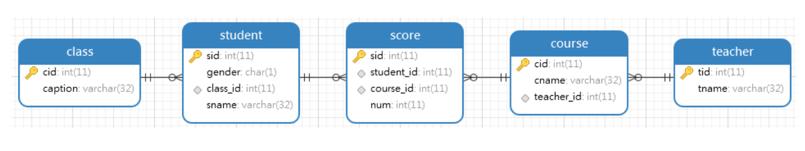

# Mysql 查询使用案例

存在5张表，班级、学生、分数、课程、教师表，表名称和字段如下所示：



- 查询平均成绩大于60分的同学的学号和平均成绩

```sql
SELECT student_id, AVG(num) AS avg_num
FROM score
GROUP BY student_id
HAVING avg_num > 60;
```

- 查询 '语文' 课程比 '英语' 课程成绩高的所有学生的学号；

```sql
SELECT A.student_id
FROM (
	SELECT student_id, num
	FROM score
	WHERE course_id = (
		SELECT cid
		FROM course
		WHERE cname = '语文'
	)
) A
	INNER JOIN (
		SELECT student_id, num
		FROM score
		WHERE course_id = (
			SELECT cid
			FROM course
			WHERE cname = '英语'
		)
	) B
	ON A.student_id = B.student_id
WHERE A.num > B.num;
```

- 查询 '语文' 课程比 '英语' 课程成绩高的所有学生的学号, 包括只有语文成绩的学生

```sql
SELECT A.student_id
FROM (
	SELECT student_id, num
	FROM score
	WHERE course_id = (
		SELECT cid
		FROM course
		WHERE cname = '语文'
	)
) A
	LEFT JOIN (
		SELECT student_id, num
		FROM score
		WHERE course_id = (
			SELECT cid
			FROM course
			WHERE cname = '英语'
		)
	) B
	ON A.student_id = B.student_id
WHERE A.num > IFNULL(B.num, 0);
```

- 查询所有同学的学号、姓名、选课数、总成绩

```sql
SELECT sid, sname, A.cnt, A.sum_sco
FROM student
	LEFT JOIN (
		SELECT student_id, count(course_id) AS cnt, sum(num) AS sum_sco
		FROM score
		GROUP BY student_id
	) A
	ON a.student_id = sid;
```

- 查询没学过 `yangshuangxin'`老师课的同学的学号、姓名；

```sql
SELECT sid, sname
FROM student
WHERE sid NOT IN (
	SELECT DISTINCT student_id
	FROM score
	WHERE course_id IN (
		SELECT cid
		FROM course
			LEFT JOIN teacher ON course.teacher_id = teacher.tid
		WHERE teacher.tname = 'yangshuangxin'
	)
);
```

- 可以将 in 和 not in 优化为 联表查询，查询没学过 `yangshuangxin`老师课的同学的学号、姓名

```sql
SELECT sid, sname
FROM student
	LEFT JOIN (
		SELECT DISTINCT A.student_id
		FROM (
			SELECT student_id, course_id
			FROM score
		) A
			LEFT JOIN (
				SELECT cid
				FROM course
				WHERE teacher_id = (
					SELECT tid
					FROM teacher
					WHERE tname = '谢小二老师'
				)
			) B
			ON A.course_id = B.cid
		WHERE B.cid IS NULL
	) c
	ON student.sid = c.student_id;
```

- 查询学过课程编号为 '1' 并且也学过课程编号为 '2' 的同学的学号、姓名

```sql
SELECT sid, sname
FROM student
	RIGHT JOIN (
		SELECT student_id
		FROM score
		WHERE course_id = 1
			OR course_id = 2
		GROUP BY student_id
		HAVING count(course_id) = 2
	) A
	ON A.student_id = sid;
```

- 查询学过 `yangshuangxin`老师所教的所有课的同学的学号、姓名

```sql
SELECT sid, sname
FROM student
	RIGHT JOIN (
		SELECT DISTINCT student_id
		FROM score
		WHERE course_id IN (
			SELECT cid
			FROM course
				LEFT JOIN teacher ON course.teacher_id = teacher.tid
			WHERE teacher.tname = 'yangshuangxin'
		)
	) A
	ON student.sid = A.student_id;
```

- 查询有课程成绩小于 60 分的同学的学号、姓名

```sql
SELECT sid, sname
FROM student
	RIGHT JOIN (
		SELECT DISTINCT student_id
		FROM score
		WHERE num < 60
	) A
	ON A.student_id = sid;
```

- 查询没有学全所有课的同学的学号、姓名

```sql
SELECT sid, sname
FROM student
	RIGHT JOIN (
		SELECT student_id
		FROM score
		GROUP BY student_id
		HAVING count(course_id) < (
			SELECT count(1)
			FROM course
		)
	) A
	ON sid = A.student_id;
```

- 查询至少有一门课与学号为 '1' 的同学所学相同的同学的学号和姓名

```sql
SELECT sid, sname
FROM student
	RIGHT JOIN (
		SELECT DISTINCT student_id
		FROM score
		WHERE student_id != 1
			AND course_id IN (
				SELECT course_id
				FROM score
				WHERE student_id = 1
			)
	) A
	ON A.student_id = student.sid;
```

- 查询至少学过学号为 '1' 同学所有课的其他同学学号和姓名

```sql
SELECT sid, sname
FROM student
	RIGHT JOIN (
		SELECT student_id, COUNT(1) AS cnt
		FROM score
		WHERE student_id != 1
			AND course_id IN (
				SELECT course_id
				FROM score
				WHERE student_id = 1
			)
		GROUP BY student_id
		HAVING cnt >= (
			SELECT count(1)
			FROM score
			WHERE student_id = 1
		)
	) A
	ON A.student_id = student.sid;
```

