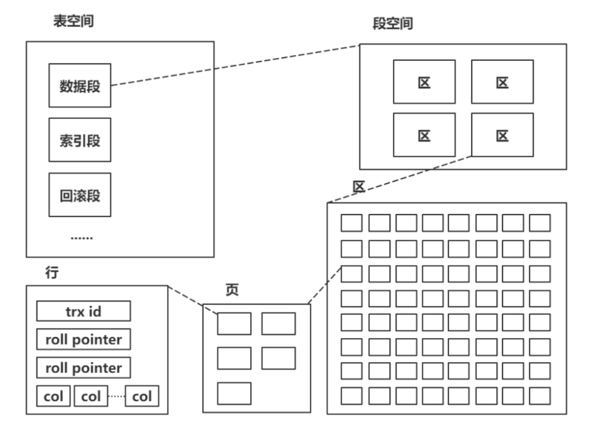
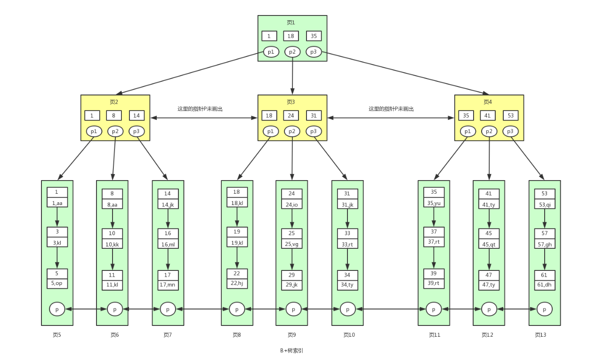
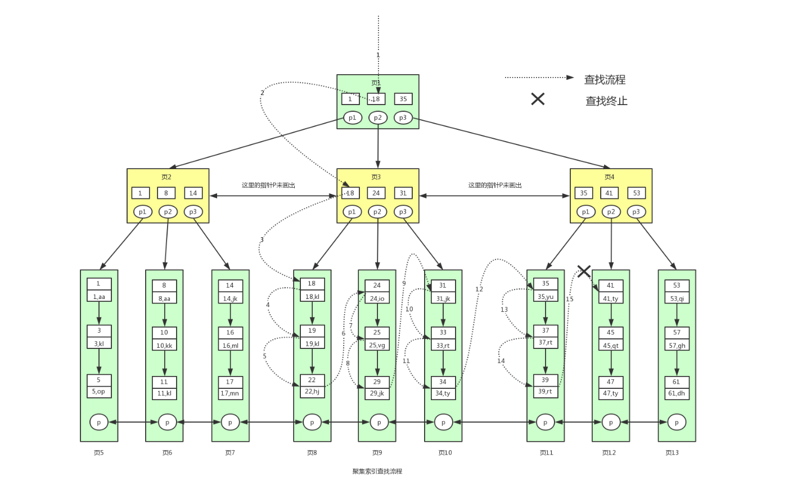
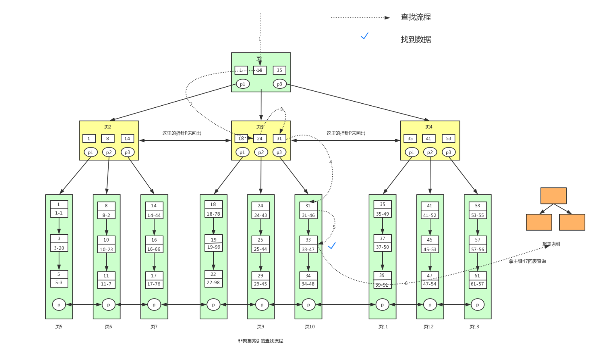
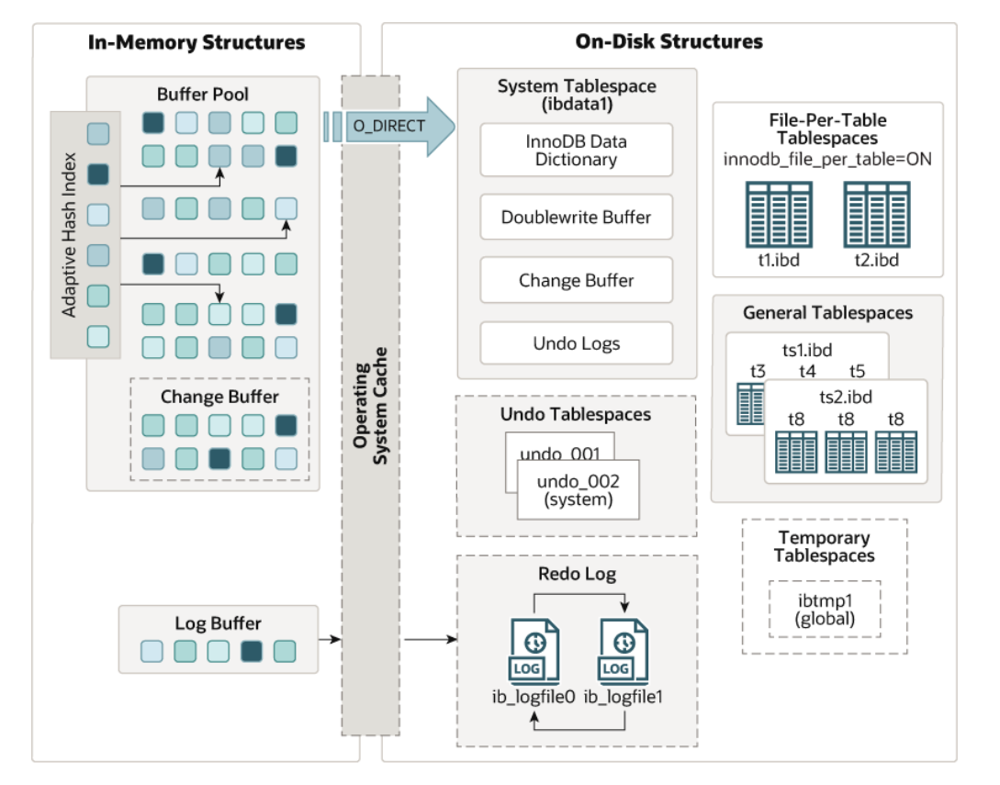
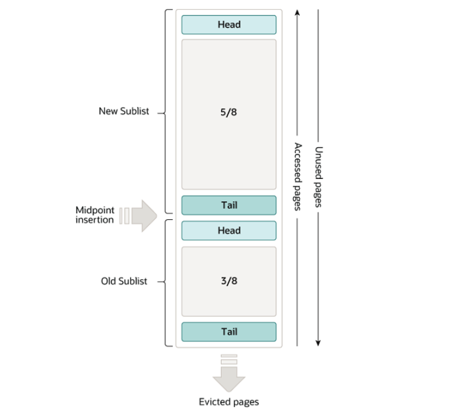
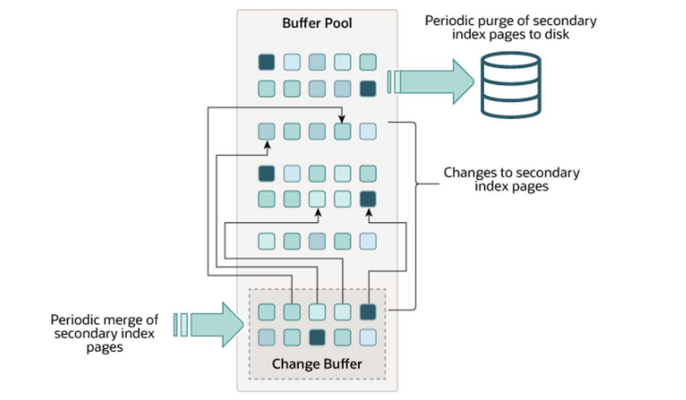
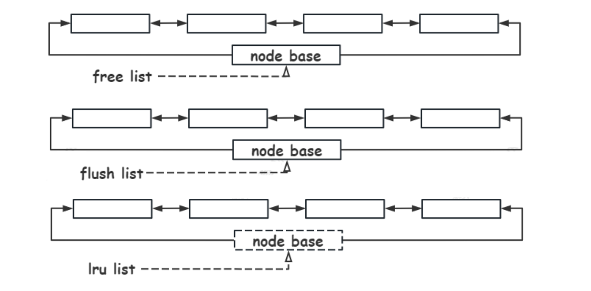

# Mysql的索引

## 索引的基本概念

数据库的索引是一种有序的存储结构，一般使用B+树按照单个或多个列进行排序。其目的是提升数据库搜索的效率。索引分类：主键索引、唯一索引、普通索引、组合索引、以及全文索引（elasticsearch）。

- 主键索引。非空唯一索引，一个表只有一个主键索引；在 innodb 中，主键索引的 B+ 树包含表数据信息。`PRIMARY KEY(key1, key2)`
- 唯一索引。不可以出现相同的值，可以有 NULL 值。`UNIQUE(key)`
- 普通索引。许出现相同的索引内容。`INDEX(key) `  或者`KEY(key[,...])`
- 组合索引。对表上的多个列进行索引。

```sql
INDEX idx(key1,key2[,...]);
UNIQUE(key1,key2[,...]);
PRIMARY KEY(key1,key2[,...]);
```

- 全文索引。将存储在数据库当中的整本书和整篇文章中的任意内容信息查找出来的技术。关键词 FULLTEXT，在短字符串中用` LIKE %`，在全文索引中用 `match `和`against`。

建立数据表时，最重要的是指定主键。`innodb `中表是索引组织表，每张表有且仅有一个主键主键，主键选择方式如下：

1. 如果显示设置 `PRIMARY KEY`，则该设置的 key 为该表的主键。
2. 如果没有显示设置，则从非空唯一索引中选择。只有一个非空唯一索引，则选择该索引为主键；有多个非空唯一索引，则选择声明的第一个为主键。
3. 没有非空唯一索引，则自动生成一个 6 字节的` _rowid` 作为主键。

### 约束和索引

为了实现数据的完整性，对于 innodb，提供了以下几种约束primary key，unique key，foreign key，default，not null。

创建主键索引或者唯一索引的时候同时创建了相应的约束，但是约束是逻辑上的概念，而索引是一个数据结构既包含逻辑的概念也包含物理的存储方式。

其中外键约束在不同的存储引擎有不同的支持。外键用来关联两个表，来保证参照完整性。MyISAM 存储引擎本身并不支持外键，只起到注释作用；而 innodb 完整支持外键，并具备事务性。

```sql
-- 外键约束的使用
create table parent (
    id int not null,
    primary key(id)
) engine=innodb;
create table child (
    id int,
    parent_id int,
    foreign key(parent_id) references parent(id) ON DELETE CASCADE ON UPDATE CASCADE
) engine=innodb;

-- 被引用的表为父表，引用的表称为子表
-- 外键定义时，可以设置行为 ON DELETE 和 ON UPDATE，行为发生时的操作可选择
-- CASCADE   子表做同样的行为
-- SET NULL  更新子表相应字段为 NULL
-- NO ACTION 父类做相应行为报错
-- RESTRICT  同 NO ACTION
-- 测试外键
INSERT INTO parent VALUES (1);
INSERT INTO parent VALUES (2);
INSERT INTO child VALUES (10, 1);
INSERT INTO child VALUES (20, 2);
DELETE FROM parent WHERE id = 1;
```

## 索引存储的实现

在Mysql的innodb存储引擎中，数据库里的数据是由段、区、页组成。

- 段分为数据段、索引段、回滚段等。
- 区大小为 1 MB（一个区由 64 个连续页构成）。
- 页为逻辑页，磁盘物理页大小一般为 4K 或者 8K。（为了保证区中的页的连续，存储引擎一般一次从磁盘中申请4~5 个区）



页是 innodb 磁盘管理的最小单位，默认16K，可通过` innodb_page_size` 参数来修改。

B+树全称是多路平衡搜索树，特征为

1. 非叶子节点只存储索引信息。
2. 叶子节点存储具体数据信息。
3. 叶子节点之间互相连接，方便范围查询。
4. 节点大小16k， 映射的是连续的磁盘页。

使用B+树组织数据的目的是保证查找速度的情况下，减少磁盘访问次数。多路的数据结构就是一个节点多个链路，相比较于平衡二叉树是一个更加矮胖的结构，B+树的高度较低，较少的磁盘IO来索引数据。

B+树用来组织磁盘数据，以页为单位，一个B+树节点是一个页，物理磁盘页一般为 4K，innodb 默认页大小为16K，一次映射4个磁盘页，对页的访问就是一次磁盘 IO，此外缓存中也会缓存常访问的页。

B+树的非叶子节点只存储索引数据，因为B+树节点映射固定大小的磁盘数据，只存储索引就可以保护更多的索引信息，能快速锁定数据所在的叶子节点。

B+树的叶子节点依次相连，其目的是便于范围查询，避免中序遍历回溯去查找下一个节点。



B+ 树的一个节点对应一个数据页，如果B+ 树的层越高，那么要读取到内存的数据页越多，IO 次数越多，而innodb 一个节点 16KB。如果key 为 10 byte 且指针大小 6 byte，假设一行记录的大小为1KB，那么一个非叶子节点可存下 16 KB / 16 byte=1024 个（key+point），每个叶子节点可存储 1024 行数据，计算结果如下：

- 2 层 B+ 树叶子节点 1024 个，可容纳最大记录数为： 1024 * 16= 16384；

- 3 层 B+ 树叶子节点 1024 * 1024，可容纳最大记录数为：1024\* 1024  * 16 = 16777216；
- 4 层 B+ 数叶子节点 1024 * 1024 * 1024，可容纳最大记录数为：1024 * 1024 * 1024  * 16 = 17179869184。

> 自增 id超过类型最大值会报错，一般使用类型 bigint 范围 2^64，1 秒插入 1 亿条数据，大概需要 5849 年才会用完索引。

由上面计算可知，索引信息和数据信息分层管理，便于高效地组织磁盘数据，快速实现单点和范围查询。

索引物理存储上分为**聚集索引（聚簇索引）**和**辅助索引（二级索引）**。

- 聚集索引：按照主键构造的 B+ 树，叶子节点中存放数据页，数据也是索引的一部分。

```sql
# 聚集索引 查询数据，id是主键
select * from user where id >= 18 and id < 40;
```



- 辅助索引：叶子节点不包含行记录的全部数据，辅助索引的叶子节点中，除了用来排序的 key 还包含一个 bookmark，该书签存储了聚集索引的 key。在查询数据时，需要回表查询。

```sql
-- 辅助索引查询数据，id是主键，lockyNum辅助索引
select * from user where lockyNum = 33;
```



在innodb 体系结构中，主要组成结构是Buffer pool和Change buffer。buffer pool缓存数据页，降低磁盘IO次数，Change buffer 缓存辅助索引的DML数据，减少磁盘随机IO。如下所示：



- Buffer pool 缓存表和索引数据，采用 LRU 算法（原理如下图）让 Buffer pool 只缓存比较热的数据。



- Change buffer 缓存辅助（二级）索引的数据变更（DML 操作）这些数据并不在 buffer pool 中。当下次从磁盘当中读取非唯一索引的数据的时候，Change buffer 中的数据将会异步 merge 到 buffer pool 中。同时也会定期合并到索引页中。



使用多个链表进行页节点的组织，free list 组织 buffer pool 中未使用的缓存页；flush list 组织buffer pool 中脏页，也就是待刷盘的页；lru list 组织 buffer pool 中冷热数据，当 buffer pool 没有空闲页，将从 lru list 中最久未使用的数据进行淘汰。



## 索引原则和索引失效

索引生效的原则有以下几条：

1. 最左匹配原则。针对的是组合索引，从左到右依次匹配，遇到` > < between like ` 就停止匹配。所以尽量扩展索引。

2. 覆盖索引。一种数据查询的方式，针对的是辅助索引。直接从辅助索引中就能找到数据，而不需通过聚集索引查找（回表查询），利用辅助索引树高度一般低于聚集索引树，可以较少磁盘 IO。所以在select中尽量写所需要的字段。

3. 索引下推。目的是为了减少回表次数，减少server层和引擎层的交互次数，从而提升查询效率。针对的是辅助索引，在普通索引和联合索引的场景下，有索引下推机制之后，将部分索引条件判断下推到存储引擎中过滤数据，最终由存储引擎将数据汇总返回给 server 层。

    >  索引下推在 MySQL 5.6 的版本开始推出。MySQL 架构分为 server 层和存储引擎层，没有索引下推机制之前，server 层向存储引擎层请求数据，在server 层根据索引条件判断进行数据过滤。

索引失效的场景如下：

- `select ... where A and B`若 A 和 B 中有一个不包含索引，或者存在in 子查询，则索引失效。
- 索引字段参与运算（使用函数、进行表达式运算），则索引失效。例如：`from_unixtime(idx)= '2024-10-29'`索引失效可以转换为`idx = unix_timestamp("2021-04-30")`使索引生效。
- 索引字段发生隐式转换，则索引失效。例如：将列隐式转换为某个类型，实际等价于在索引列上作用了隐式转换函数。（通常是数字转字符串的隐式转换）
- LIKE 模糊查询（左模糊）。通配符 % 开头，则索引失效；例如：`select \* from user where name like '%xin'`;
- 在索引字段上使用 NOT <>  != 索引失效。如果判断 id <> 0 索引失效可以修改为则修改为idx > 0 or idx < 0保证索引生效。
- 组合索引中，没使用第一列索引，索引失效。

为了查找数据更快，在使用索引时需要的几个原则如下：

1. 查询频次较高且数据量大的表建立索引；索引选择使用频次较高，过滤效果好的列或者组合。
2. 使用短索引；节点包含的信息多，较少磁盘 IO 操作；比如：smallint，tinyint。
3. 对于很长的动态字符串，考虑使用前缀索引。
4. 对于组合索引，考虑最左侧匹配原则和覆盖索引。
5. 尽量选择区分度高的列作为索引，该列的值相同的越少越好。
6. 尽量扩展索引，在现有索引的基础上，添加复合索引，最多 6 个索引。
7. 不要 select *； 尽量只列出需要的列字段，方便使用覆盖索引。
8. 索引列，列尽量设置为非空。
9. 开启自适应 hash 索引或者调整 change buffer。（可选）

> 前缀索引：有时候需要索引很长的字符串，这会让索引变的大且慢，通常情况下可以使用某个列开始的部分字符串，这样大大的节约索引空间，从而提高索引效率，但这会降低索引的区分度。
>
> 索引的区分度：指不重复的索引值和数据表记录总数的比值。索引的区分度越高则查询效率越高，因为区分度更高的索引可以让 MySQL 在查找的时候过滤掉更多的行。
>
> 对于BLOB, TEXT, VARCHAR 类型的列，必要时使用前缀索引。因为 MySQL 不允许索引这些列的完整长度，使用该方法的关键在于要选择足够长的前缀以保证较高的区分度。

```sql
-- 计算前缀区分度
SELECT count(DISTINCT LEFT(name, 3)) / count(*) AS sel3
	, count(DISTINCT LEFT(name, 4)) / count(*) AS sel4
	, count(DISTINCT LEFT(name, 5)) / count(*) AS sel5
	, count(DISTINCT LEFT(name, 6)) / count(*) AS sel6
FROM user;
-- 建立前缀索引
ALTER TABLE user
ADD KEY (name(4));

-- 计算区分度
SELECT count(DISTINCT idx) / count(*)
FROM table_name;
-- 或者
SHOW INDEX FROM table_name;
-- Cardinality 这个值代表了区分度，该值决定了优化器的执行计划的选择
-- 立马更新 Cardinality 值
analyze table student;
-- 在非高峰时间段，对数据库中几张核心表做 analyzetable 操作，这能使优化器和索引更好的为你工作

-- 开启自适应 hash
SELECT @@innodb_adaptive_hash_index;
SET @@global.innodb_adaptive_hash_index = 1;

-- 调整 change buffer
SELECT @@innodb_change_buffer_max_size;
-- 默认值为25 表示最多使用1/4的缓冲池内存空间 最大值为50
SET @@global.innodb_change_buffer_max_size = 30；
```

## 总结

使用索引可以快速从数据库中查找数据，但是使用索引是有代价的。太多的索引会占用非常多的内存空间，并且有维护的代价，在进行DML操作时会变慢。

使用索引的场景有`where`、`group by` 、`order by` 的查询语句进行优化提供速度。

不需要使用索引的场景有

1. 没有`where`、`group by` 、`order by` 语句。
2. 区分度不高的列。
3. 经常修改的列。
4. 表的数据量少。

索引使用B+树进行存储，有效降低层高，从而降低磁盘IO，在范围查询时直接使用叶子节点的链表顺序查询，也减少磁盘IO。
