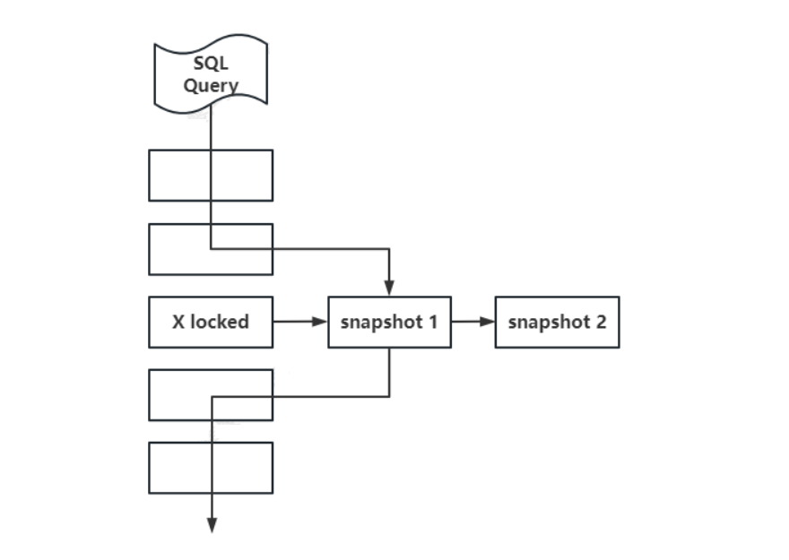
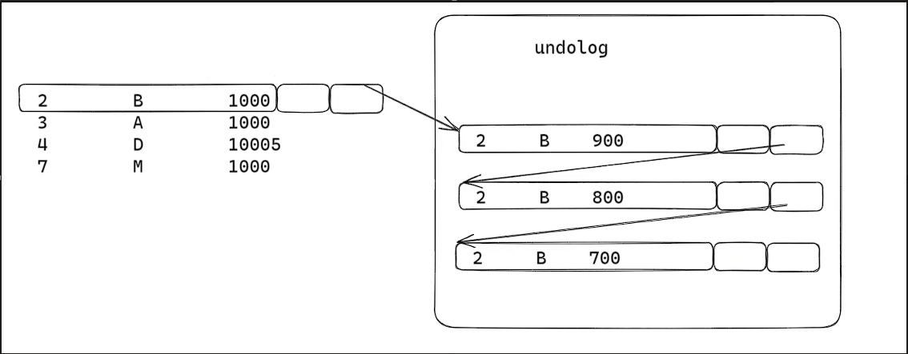

# Mysql 的事务

## 事务的基本概念

**事务的前提**是由多个客户端对Mysql服务器的并发连接访问，**事务的本质**是并发控制的单元，是用户定义的一个操作序列。用户定义了一系列的操作，这些操作要么都作，要不都不做，是一个不可分割的单位，这就是一个事务。

**事务的目的**为将数据库从一种一致性状态转换为另一种一致性状态，保证系统始终处于一个完整且正确的状态。

**事务的组成**为事务可由一条非常简单的 SQL 语句组成，也可以由一组复杂的 SQL 语句组成。

**事务的特征**为在数据库提交事务时，可以确保要么所有修改都已经保存，要么所有修改都不保存，事务是访问并更新数据库各种数据项的一个程序执行单元。

> 在 MySQL innodb 下，单条语句都具备事务，可以通过 set autocommit = 0; 设置当前会话手动提交。

```sql
-- 事务控制语句
-- 显示开启事务
START TRANSACTION | BEGIN
-- 提交事务，并使得已对数据库做的所有修改持久化
COMMIT

-- 回滚事务，结束用户的事务，并撤销正在进行的所有未提交的修改
ROLLBACK

-- 创建一个保存点，一个事务可以有多个保存点
SAVEPOINT identifier

-- 删除一个保存点
RELEASE SAVEPOINT identifier

-- 事务回滚到保存点
ROLLBACK TO [SAVEPOINT] identifier
```

## Mysql 事务的ACID特性

### 原子性（A）

原子性是事务操作要么都做（提交），要么都不做（回滚）。事务是访问并更新数据库各种数据项的一个程序执行单元，是不可分割的工作单位。

事务通过undolog 来实现回滚操作，undolog 记录的是事务每步具体操作，当回滚时，回放事务具体操作的逆运算。

事务包含的全部操作是一个不可分割的整体，要么全部执行，要么全部不执行。

### 隔离性（I）

隔离性是各个事务之间互相影响的程度。隔离性目的是防止多个并发事务交叉执行导致数据不一致。事务的隔离性要求每个读写事务的对象对其他事务的操作对象能相互分离，并发事务之间不会相互影响。但是为了达到更大的并发性能，设定了不同程度的隔离级别。

不同的隔离级别主要规定多个事务访问同一数据资源，各个事务对该数据资源访问的行为，不同的隔离级别是应对不同的现象，例如脏读、不可重复读、幻读。

不同的隔离级别会**适度破环一致性**，得以提高性能。其实现通过 **MVCC**和**锁**。MVCC 时多版本并发控制，主要解决一致性非锁定读，通过记录和获取行版本，而不是使用锁来限制读操作，从而实现高效并发读性能。

锁用来处理并发 DML 操作。数据库中提供粒度锁的策略，针对表（聚集索引 B+ 树）、页（聚集索引 B+ 树叶子节点）、行（叶子节点当中某一段记录行）三种粒度加锁。

### 持久性（D）

持久性是事务一旦完成，要将数据所做的变更记录下来，包括数据存储和多副本的网络备份。

事务提交后，事务 DML 操作将会持久化。写入 redo log 磁盘文件，具体到哪一个页、页偏移值、具体数据。即使发生宕机等故障，数据库也能将数据恢复。redo log 记录的是物理日志。

### 一致性（C）

事务的前后，所有的数据都保持一个一致的状态，不能违反数据的一致性检测（完整性约束检查）。一致性指事务将数据库从一种一致性状态转变为下一种一致性的状态，在事务执行前后，数据库完整性约束没有被破坏。

一个事务单元需要提交之后才会被其他事务可见，例如一个表的姓名是唯一键，如果一个事务对姓名进行修改，如果在事务提交或事务回滚后，表中的姓名变得不唯一了，这样就破坏了一致性。

一致性包含了数据库完整约束和逻辑上的一致性，数据库完整约束是数据库做的保证，不会有问题，而不同的隔离级别会破坏逻辑上的一致性。一致性由原子性、隔离性以及持久性共同来维护的。

## 事务的隔离级别

为了提高Mysql并发处理sql语句的性能，破坏了逻辑上的一致性，设置了不同的隔离级别。ISO 和 ANIS SQL 标准制定了四种事务隔离级别的标准，各数据库厂商在正确性和性能之间做了妥协，并没有严格遵循这些标准。MySQL innodb默认支持的隔离级别是 REPEATABLE READ（RR）。

1. READ UNCOMMITTED （RU）。读未提交，该级别下读不加锁，写加排他锁，写锁在事务提交或回滚后释放锁。读不做任何处理，写自动加X锁。
2. READ COMMITTED （RC）。读已提交，从该级别后支持 MVCC (多版本并发控制)，也就是提供一致性非锁定读。此时读取操作读取历史快照数据，该隔离级别下读取历史版本的最新数据，所以读取的是已提交的数据。读通过MVCC读取最新版本的数据，写自动加X锁。
3. REPEATABLE READ（RR）。可重复读，该级别下也支持 MVCC，此时读取操作读取事务开始时的版本数据，写自动加X锁。
4. SERIALIZABLE。可串行化，该级别下给读加了共享锁，所以事务都是串行化的执行，此时隔离级别最严苛。读自动加S锁，写自动加X锁。

```sql
-- 设置隔离级别
SET [GLOBAL | SESSION] TRANSACTION ISOLATION LEVEL REPEATABLE READ;
-- 或者采用下面的方式设置隔离级别
SET @@tx_isolation = 'REPEATABLE READ';
SET @@global.tx_isolation = 'REPEATABLE READ';

-- 查看全局隔离级别
SELECT @@global.tx_isolation;
-- 查看当前会话隔离级别
SELECT @@session.tx_isolation;
SELECT @@tx_isolation;

-- 手动给读加 S 锁
SELECT ... LOCK IN SHARE MODE;
-- 手动给读加 X 锁
SELECT ... FOR UPDATE;
-- 查看当前锁信息
SELECT * FROM information_schema.innodb_locks;
```

## 并发读写异常

### 脏读

事务（A）可以读到另外一个事务（B）中未提交的数据，也就是事务A读到脏数据。在读写分离的场景下，如果将 slave 节点设置为 READ UNCOMMITTED，就会出现脏读。在 slave 上查询并不需要特别精准的返回值，脏读不影响业务，就可以使用该模式。

| seq  | session A                                                  | session B                                     |
| ---- | ---------------------------------------------------------- | --------------------------------------------- |
| 1    | SET @@tx_isolation='READ UNCOMMITTED';                     | SET @@tx_isolation='READ UNCOMMITTED';        |
| 2    | BEGIN;                                                     |                                               |
| 3    | UPDATE account_t SET money = money - 100 WHERE name = 'A'; |                                               |
| 4    |                                                            | BEGIN;                                        |
| 5    |                                                            | SELECT money FROM account_t WHERE name = 'A'; |
| 6    |                                                            | SELECT money FROM account_t WHERE name = 'B'; |
| 7    | UPDATE account_t SET money = money - 100 WHERE name = 'B'; |                                               |
| 8    | COMMIT                                                     | COMMIT                                        |

此时session B出现脏读，读取到session  A还没有提交的数据修改。

### 不可重复读

事务（A) 可以读到另外一个事务（B）中提交的数据。通常发生在一个事务中两次读到的数据是不一样的情况，造成逻辑不一致，不可重复读在隔离级别 READ COMMITTED 存在。

一般而言，不可重复读的问题是可以接受的，因为读到已经提交的数据，一般不会带来很大的问题，所以很多厂商（如Oracle、SQL Server）默认隔离级别就是 READ COMMITTED。

| seq  | session A                                                  | session B                                     |
| ---- | ---------------------------------------------------------- | --------------------------------------------- |
| 1    | SET @@tx_isolation='READ COMMITTED';                       | SET @@tx_isolation='READ COMMITTED';          |
| 2    | BEGIN;                                                     | BEGIN;                                        |
| 3    |                                                            | SELECT money FROM account_t WHERE name = 'A'; |
| 4    | UPDATE account_t SET money = money - 100 WHERE name = 'A'; |                                               |
| 5    | COMMIT;                                                    | SELECT money FROM account_t WHERE name = 'A'; |
| 6    |                                                            | COMMIT;                                       |

session B在一个事务中，两次读取到是数据不一样，造成逻辑上的不一致，出现了不可重复读。

### 幻读

两次读取同一行虽然是一样的，但是**同一个范围内的记录**得到的结果集不是一样的，但是快照读和当前读不一致。例如：以 name 为唯一键的表，一个事务中查询` select * from t where name = 'yangshuangxin'; `不存在，接下来 `insert into t(name) values ('yangshuangxin'); `出现错误，这是因为另外一个事务也执行了insert 操作。

幻读在隔离级别REPEATABLE READ 及以下存在，但是可以在 REPEATABLE READ级别下通过读加锁（使用 next-key locking）解决。

| seq  | session A                                                 | session B                                                 |
| ---- | --------------------------------------------------------- | --------------------------------------------------------- |
| 1    | SET @@tx_isolation='REPEATABLE READ';                     | SET @@tx_isolation='REPEATABLE READ';                     |
| 2    | BEGIN;                                                    | BEGIN;                                                    |
| 3    |                                                           | SELECT * FROM account_t WHERE id >= 2;                    |
| 4    | INSERT INTO account_t(id,name,money) VALUES (4,'D',1000); |                                                           |
| 5    | COMMIT;                                                   |                                                           |
| 6    |                                                           | INSERT INTO account_t(id,name,money) VALUES (4,'D',1000); |
| 7    |                                                           | COMMIT;                                                   |


session B先查了数据，发现没有id为4的数据，就插入数据，但是无法插入会报错，就好像刚刚查询的数据是幻觉一样。

### 丢失更新

脏读、不可重复读、幻读都是一个事务写，一个事务读，由于一个事务的写导致另一个事务读到了不该读的数据。

丢失更新是两个事务都是写，丢失更新分为提交覆盖和回滚覆盖。回滚覆盖数据库拒绝不可能产生，重点关注提交覆盖。

| seq  | session A                                               | session B                                               |
| ---- | ------------------------------------------------------- | ------------------------------------------------------- |
| 1    | SET @@tx_isolation='REPEATABLE READ';                   | SET @@tx_isolation='REPEATABLE READ';                   |
| 2    | BEGIN;                                                  | BEGIN;                                                  |
| 3    | SELECT money FROM account_t WHERE name = 'A' ;          |                                                         |
| 4    |                                                         | SELECT money FROM account_t WHERE name = 'A';           |
| 5    |                                                         | UPDATE account_t SET money = 1000+100 WHERE name = 'A'; |
| 6    |                                                         | COMMIT;                                                 |
| 7    | UPDATE account_t SET money = 1000-100 WHERE name = 'A'; |                                                         |
| 8    | COMMIT;                                                 |                                                         |

session B查询数据后执行更新数据的sql成功，然后session A也更新执行sql成功，但是只有A真正的成功更新数据库中的数据，session B的更新数据被覆盖丢失了，实际没有生效。

### 异常的对比及解决方法

脏读和不可重复读的区别在于，脏读是读取了另一个事务未提交的数据，而不可重复读是读取了另一个事务提交之后的修改，本质上都是其他事务的修改影响了本事务的读取。

不可重复读和幻读比较类似；不可重复读是两次读取**同一条记录**，得到不一样的结果，而幻读是两次读取同一条记录是一样的，但是两次读取同一个范围内的记录得到的结果集不一样，不可重复读是因为其他事务进行了 update 操作，幻读是因为其他事务进行了 insert或者 delete 操作。

| 隔离级别         | 回滚覆盖 | 脏读 | 不可重复读 | 幻读                | 提交覆盖            |
| ---------------- | -------- | ---- | ---------- | ------------------- | ------------------- |
| READ UNCOMMITTED | no       | yes  | yes        | yes                 | yes                 |
| READ COMMITTED   | no       | no   | yes        | yes                 | yes                 |
| REPEATABLE READ  | no       | no   | no         | yes(手动加锁可解决) | yes(手动加锁可解决) |
| SERIALIZABLE     | no       | no   | no         | no                  | no                  |

在REPEATABLE READ（RR）可重复读的隔离级别下，可以进行加锁next-key locking（行锁和范围锁结合）解决。解决方式如下

| seq  | session A                                                 | session B                                                 |
| ---- | --------------------------------------------------------- | --------------------------------------------------------- |
| 1    | SET @@tx_isolation='REPEATABLE READ';                     | SET @@tx_isolation='REPEATABLE READ';                     |
| 2    | BEGIN;                                                    | BEGIN;                                                    |
| 3    |                                                           | SELECT * FROM account_t WHERE id >= 2 lock in share mode; |
| 4    | INSERT INTO account_t(id,name,money) VALUES (4,'D',1000); |                                                           |
| 5    | COMMIT;                                                   | SELECT * FROM account_t WHERE id >= 2                     |
| 6    |                                                           | COMMIT;                                                   |

session B在查询时进行了加锁，session A进行插入数据时就会阻塞，直到session B提交数据后才能真正插入数据，解决了幻读和提交覆盖的问题。

## 多版本并发控制MVCC

MVCC就是多版本并发控制，用来实现一致性的非锁定读。非锁定读是指不需要等待访问的行上X锁的释放。

在 read committed 和 repeatable read 隔离级别下，innodb 使用的就是MVCC。两个隔离级别下对于快照数据的定义不同。在 read committed 隔离级别下，对于快照数据总是读取被锁定行的最新一份快照数据；而在 repeatable read 隔离级别下，对于快照数据总是读取事务开始时的行数据版本。

读取快照数据是不需要上锁的，因为没有事务需要对历史的数据进行修改操作，从而达到提高数据库执行的效率。



### MVCC的构成及实现

在 read committed 和 read repeatable 隔离级别下，MVCC 采用read view 来实现的，它们的区别在于创建 read view 时机不同：

1. read committed 隔离级别会在事务中每个 select 读取数据时都会生成一个新的 read view。这也意味着在同一个事务多次读取同一条数据可能出现数据不一致，因为在多次读取期间可能有其他事务修改了该条记录，并提交了。
2. read repeatable 隔离级别是启动事务时生成一个 read view。在整个事务读取数据都使用这个 read view，一直使用到数据提交，这样保证了在事务期间读到的数据都是事务启动前的记录。

 read view 由4个字段构成：m_ids、min_trx_id、max_trx_id、creator_trx_id：

- m_ids：创建 read view 时，当前数据库活跃事务（开启未提交的事务）的事务 id 列表。
- min_trx_id：创建 read view 时，m_ids 中的最小事务 id。
- max_trx_id：创建 read view 时，当前数据库将为下一个事务分配的事务 id，并不一定是 m_ids 中的最大事务 id。
- creator_trx_id：创建 read view 所在事务的 id。

事务可以看到事务本身的修改，对于其他事务的修改，按照以下操作流程进行判断读取：

1. trx_id < min_trx_id；说明该记录在创建 read_view 之前已经提交，所以对当前事务可见。
2. trx_id >= max_trx_id；说明该记录是在创建 read_view 之后启动事务生成的，所以对当前事务不可见。
3. min_trx_id <= trx_id < max_trx_id；此时需要判断是否在 m_ids 列表中：
    - 在列表中；生成该版本记录的事务仍处于活跃状态，该版本记录对当前事务不可见。
    - 不在列表中；生成该版本记录的事务已经提交，该版本记录对当前事务可见。

在聚集索引中由两个隐藏列，用来查找MVCC的数据历史记录：

- trx_id：当某个事务对某条聚集索引记录进行修改时，将会把当前事务的 id 赋值给 trx_id。（DML操作是加锁的，无论什么级别）
- roll_pointer：当某个事务对某条聚集索引记录进行修改时，会将上一个版本的记录写到 undo log，然后通过roll_pointer 指向旧版本记录，通过它可以找到修改前的记录。



在事务的生命流程中，分为三个阶段：还没开始的事务、已启动未提交的事务、已提交的事务，三个阶段的操作都会记录在redo和undo日志中。

#### redo日志

redo 日志用来实现事务的持久性。内存中包含 redo log buffer，磁盘中包含 redo log file。

当事务提交时，必须先将该事务的所有日志写入到redo日志文件进行持久化，待事务的commit 操作完成才完成了事务的提交.

redo log 顺序写，记录的是对每个页的修改（页、页偏移量、以及修改的内容）,在数据库运行时不需要对 redo log 的文件进行读取操作，只有发生宕机的时候，才会拿redo log 进行恢复。

#### undo日志

undo 日志用来帮助事务回滚以及 MVCC 的功能，存储在共享表空间中。mvcc记录事务DML操作提交后产生的行数据版本信息，undolog记录DML操作步骤，用于回滚。

undo log 是逻辑日志，回滚时将数据库逻辑地恢复到原来的样子，根据 undo log 的记录，做之前的逆运算。比如事务中有 insert 操作，那么执行 delete 操作；对于 update 操作执行相反的 update 操作。同时 undo 日志记录行的版本信息，用于处理 MVCC 功能。

