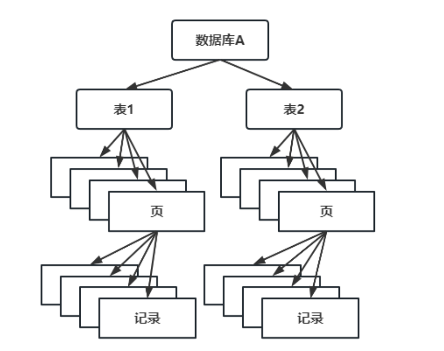
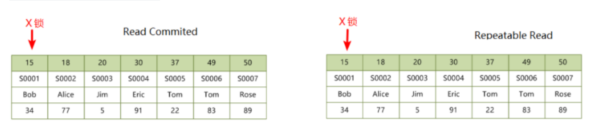
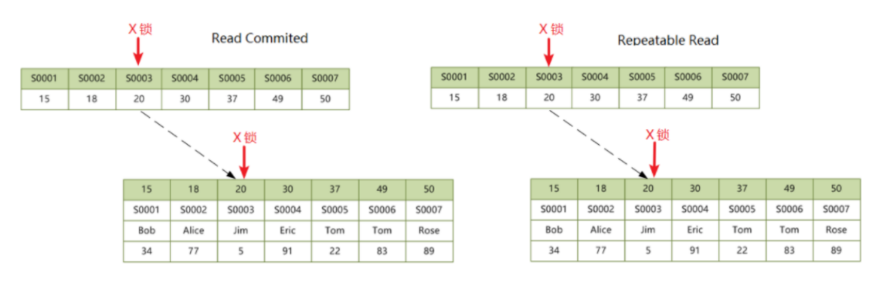
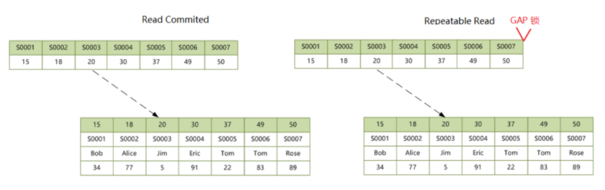
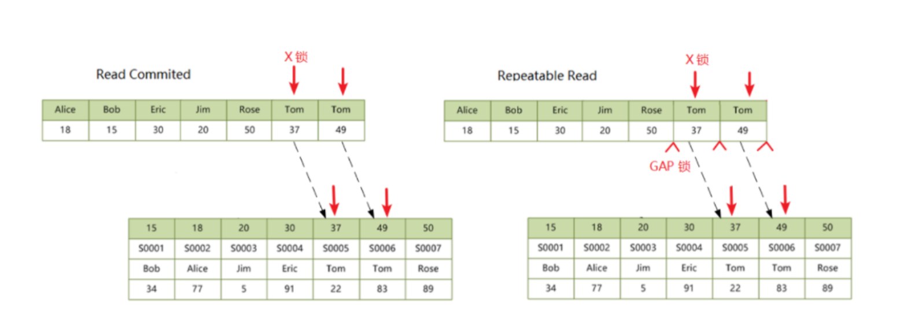
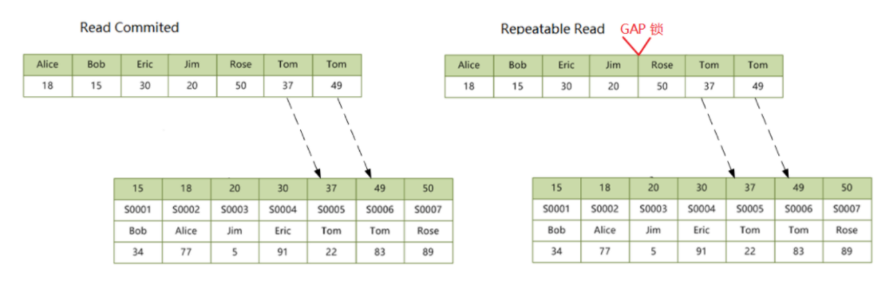
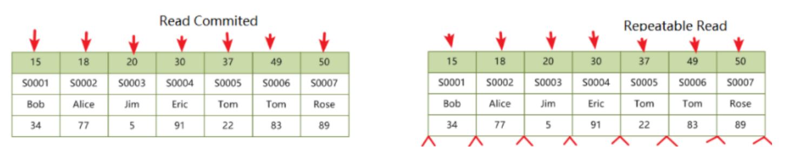
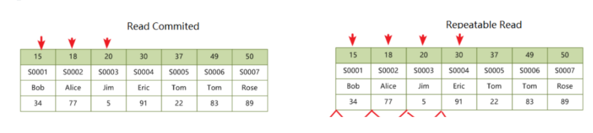
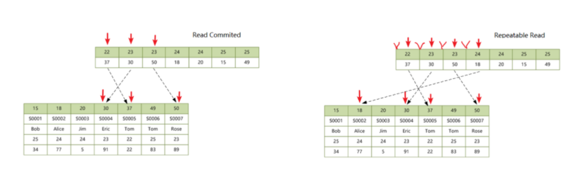
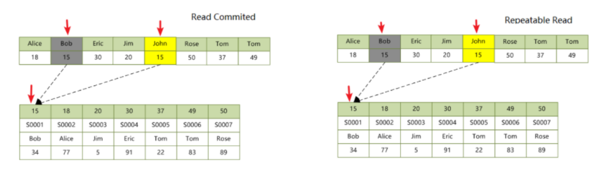

# Mysql的锁和死锁

锁机制用于管理对共享资源的并发访问，在Mysql中锁用来实现事务的隔离级别。MySQL当中事务采用的是粒度锁，针对表（B+树）、页（B+树叶子节点）、行（B+树叶子节点当中某一段记录行）三种粒度加锁。所以Mysql的锁可以分为全局锁、表级锁、行级锁。



全局锁可以使整个数据库处于只读状态，用于全库备份。`flush tables with read lock` 进行加锁，`unlock tables`进行解锁。

表级锁分为以下4类：

1. 表锁`lock tables table [read/write]` /`unlock tales`。
1. 元数据锁，表的crud。
1. 意向锁，快速判断表里是否有记录加锁，意向共享锁和意向排他锁都是表级别的锁。
1. auto-inc锁，特殊的表锁，实现自增约束，语句结束后释放锁。

行级锁分为以下三类：

1. 记录锁（record lock）。S共享锁/X排他锁。
2. 间隙锁（gap lock）。在RR、RC事务中，防止其他事务在记录中插入新的记录。
3. 临键锁（next-key lock）。在RR事务中使用。

## Mysql的读写锁

### 共享锁（S）

共享锁事务读操作加的锁，对具体的某一行加锁，不同隔离级别的区别如下：

1. 在 SERIALIZABLE 隔离级别下，默认帮读操作加共享锁。
1. 在 REPEATABLE READ 隔离级别下，需手动加共享锁，可解决幻读问题。
1. 在 READ COMMITTED 隔离级别下，没必要加共享锁，采用的是MVCC。
1. 在 READ UNCOMMITTED 隔离级别下，既没有加锁也没有使用MVCC。

在查询的时候使用`lock in share mode`手动加S锁。

> MVCC的 undo log实现历史版本的记录。

### 排他锁（X）

事务删除或更新加的锁，在4种隔离级别下，对某一行写操作(插入、更新)时都添加了排他锁，事务提交或事务回滚后释放锁。在查询的时候使用`for update`手动加X锁。

### 意向共享锁（IS）

对一张表中某几行加的共享锁。

### 意向排他锁（IX）

对一张表中某几行加的排他锁，目的是告诉其他事务，此时这条表被一个事务在访问，作用为排除表级别读写锁。

### 读写锁的兼容性

当事务试图读或写某一条记录时，会先在表上加上意向锁，然后才在要操作的记录上加上读锁或写锁。这样判断表中是否有记录加锁就很简单了，只要看下表上是否有意向锁就行了。意向锁之间是不会产生冲突的，也不和 AUTO_INC 表锁冲突，它只会**阻塞表级读锁或表级写锁**，另外，**意向锁也不会和行锁冲突**，**行锁只会和行锁冲突**，具体规格如下：

1. 由于 innodb 支持的是行级别的锁，意向锁并不会阻塞除了全表扫描以外的任何请求。
2. 意向锁之间是互相兼容的。
3. 当想为某一行添加 S 锁，先自动为所在的页和表添加意向锁IS，再为该行添加 S 锁。
4. 当想为某一行添加 X 锁，先自动为所在的页和表添加意向锁IX，再为该行添加 X 锁。

## Mysql的行锁

### Record Lock

记录锁，单个行记录上的锁。

### Gap Lock

间隙锁，锁定一个范围，但不包含记录本身，全开区间，REPEATABLE READ 级别及以上支持间隙锁。

> 如果 REPEATABLE READ 修改`innodb_locks_unsafe_for_binlog = 1`，会禁用GLK，那么隔离级别相当于退化为 READ COMMITTED。

```sql
-- 查看是否支持间隙锁，默认支持，也就是innodb_locks_unsafe_for_binlog = 0;
SELECT @@innodb_locks_unsafe_for_binlog;
```

### Next-Key Lock

记录锁+间隙锁，锁定一个范围，并且锁住记录本身。左开右闭区间。RR隔离级别默认使用该锁。

### Insert Intention Lock

插入意向锁，insert 操作的时候产生，在多事务同时写入不同数据至同一索引间隙的时候，并不需要等待其他事务完成，不会发生锁等待。

假设有一个记录索引包含键值 4 和 7，两个不同的事务分别插入5 和 6，每个事务都会产生一个加在 4-7 之间的插入意向锁，然后获取在插入行上的排它锁，但是不会被互相锁住，因为数据行并不冲突。

### 行锁的兼容性

一个事务已经获取了插入意向锁，对其他事务是没有任何影响的。但是一个事务想要获取插入意向锁，如果有其他事务已经加了 gap lock 或 Next-key lock 则会阻塞，这是**Mysql的死锁之源**。锁的兼容性如下所示：

| 锁                     | GAP(持有) | Insert Intention(持有) | Record(持有) | Next-Key Lock(持有) |
| ---------------------- | --------- | ---------------------- | ------------ | ------------------- |
| GAP(请求)              | 兼容      | 兼容                   | 兼容         | 兼容                |
| Insert Intention(请求) | 冲突      | 兼容                   | 兼容         | 兼容                |
| Record(请求)           | 兼容      | 兼容                   | 冲突         | 冲突                |
| Next-Key Lock(请求)    | 兼容      | 兼容                   | 冲突         | 冲突                |

## 表锁AUTO-INC Lock（AI锁）

自增锁，是一种特殊的表级锁，发生在 AUTO_INCREMENT 约束下的插入操作。

自增锁采用的一种特殊的表锁机制（较低概率造成 B+树分裂），完成对自增长值插入的 SQL 语句后立即释放。但是在大数据量的插入会影响插入性能，因为另一个事务中的插入会被阻塞。

> 从MySQL 5.1.22 开始提供一种轻量级互斥量的自增长实现机制，该机制提高了自增长值插入的性能.

## Mysql 加解锁的例子

行级锁是针对表的索引加锁，索引包括聚集索引和辅助索引。表级锁是针对页或表进行加锁。加解锁重点考虑在于 InnoDB 在 read committed 和 repeatable read 级别下锁的情况，以下表 students 表作为实例，其中 id 为主键，no（学号）为辅助唯一索引，name（姓名）和 age（年龄）为辅助普通索引，score（学分）无索引。

| id   | no   | name | age  | score |
| ---- | ---- | ---- | ---- | ----- |
|15|S0001|Bob|25|34|
|18|S0002|Alice|24|77|
|20|S0003|Jim|24|5|
|30|S0004|Eric|23|91|
|37|S0005|Tom|22|22|
|49|S0006|Tom|25|83|
|50|S0007|Rose|23|89|

- 聚集索引，查询命中：`UPDATE students SET score = 100 WHERE id = 15;`



- 聚集索引，查询未命中：`UPDATE students SET score = 100 WHERE id = 16;`


- 辅助唯一索引，查询命中：`UPDATE students SET score = 100 WHERE no = 'S0003';`



- 辅助唯一索引，查询未命中：`UPDATE students SET score = 100 WHERE no = 'S0008';`



- 辅助非唯一索引，查询命中：`UPDATE students SET score = 100 WHERE name = 'Tom';`



- 辅助非唯一索引，查询未命中：`UPDATE students SET score = 100 WHERE name = 'John';`



- 无索引：`UPDATE students SET score = 100 WHERE score = 22;`



- 聚集索引，范围查询：`UPDATE students SET score = 100 WHERE id <= 20;`



- 辅助索引，范围查询：`UPDATE students SET score = 100 WHERE age <= 23;`



- 修改索引值：`UPDATE students SET name = 'John' WHERE id = 15;`



## Mysql 的死锁及解决

死锁是两个或两个以上的事务在执行过程中，因争夺锁资源而造成的一种互相等待的现象。在RR和RC级别中，并发事务在执行过程中就会因争抢锁资源而造成互相等待，于是就产生了死锁。

MySQL 中采用 wait-for graph 等待图-采用非递归深度优先的图算法实现）的方式来进行死锁检测。死锁时会异常报错：`deadlock found when trying to get lock;`在Mysql中常见的死锁有两种，具体为相反加锁顺序死锁、锁冲突死锁。

### 相反加锁顺序死锁

不同表的加锁顺序相反或者相同表不同行加锁顺序相反造成死锁。其中相同表不同行加锁顺序相反造成死锁有很多变种，其中容易忽略的情况有：

1. 给辅助索引行加锁的时候，同时会给聚集索引行加锁。
2. 在外键索引时，给父表加锁，同时隐含给子表加锁。
3. 触发器执行时加锁。

这些都需要视情况分析调整加锁顺序。

```sql
DROP TABLE IF EXISTS `dl_account_t`;
CREATE TABLE `dl_account_t` (
	`id` INT(11) NOT NULL AUTO_INCREMENT,
	`name` VARCHAR(255) DEFAULT NULL,
	`money` INT(11) DEFAULT 0,
	`account_id` INT(11) DEFAULT 0,
	PRIMARY KEY (`id`),
	UNIQUE `uk_account_id` (`account_id`)
)ENGINE = INNODB AUTO_INCREMENT=0 DEFAULT CHARSET = utf8;

-- select * from dl_account_t
INSERT INTO `dl_account_t`(`name`,`money`,`account_id`) VALUES ('C', 1000, 10001),('B', 1000, 10002),('A', 1000, 10003),('ZZ', 1000, 10005)

-- 相反加锁顺序死锁1
SET TRANSACTION ISOLATION LEVEL REPEATABLE READ;
BEGIN
-- 死锁事务1:
UPDATE `dl_account_t` SET `money` = `money` - 100 WHERE `id` = 1;
-- 死锁事务2:
UPDATE `dl_account_t` SET `money` = `money` - 100 WHERE `id` = 2;
-- 死锁事务1:
UPDATE `dl_account_t` SET `money` = `money` + 100 WHERE `id` = 2;
-- 死锁事务2:
UPDATE `dl_account_t` SET `money` = `money` - 100 WHERE `id` = 1;
rollback
```


### 锁冲突死锁

innodb 在 RR 隔离级别下，最常见的是插入意向锁与 gap 锁冲突造成死锁。主要原理为：一个事务想要获取插入意向锁，如果有其他事务已经加了 gap lock 或 Next-key lock 则会阻塞。

```sql
DROP TABLE IF EXISTS `dl_test_t`;
CREATE TABLE `dl_test_t` (
  `a` INT(11) NOT NULL DEFAULT '0',
  `b` INT(11) DEFAULT NULL,
  PRIMARY KEY (`a`),
  UNIQUE KEY `uk_b` (`b`)
) ENGINE=InnoDB DEFAULT CHARSET=utf8;

INSERT INTO `dl_test_t` VALUES (1,1),(5,4),(20,20),(25,12);
-- 死锁情况 1
/*
  事务一在插入时由于跟事务二插入的记录唯一键冲突，所以对 b=10 这个唯一索引加 S 锁（Next-key）并处于锁等待，事务二再插入 b=9 这条记录，需要获取插入意向锁（lock_mode X locks gap before rec insert intention）和事务一持有的 Next-key 锁冲突，从而导致死锁。
*/
BEGIN
-- 死锁事务 2
insert into `dl_test_t` values(26,10);
-- 死锁事务 1
insert into `dl_test_t` values(30,10);
-- 死锁事务 2
insert into `dl_test_t` values(40,9);


-- 死锁情况 2
/*
1. 三个事务依次执行 insert 语句，由于 b是唯一索引，所以后两个事务会出现唯一键冲突。但此时要注意的是事务一还没有提交，所以并不会立即报错。事务二和事务三为了判断是否出现唯一键冲突，必须进行一次当前读，加的锁是 Next-Key 锁，所以进入锁等待。要注意的是，就算在 RC 隔离级别下，一样会加 Next-Key 锁，所以说出现 GAP 锁不一定就是 RR 隔离级别;
2. 事务一回滚，此时事务二和事务三成功获取记录上的 S 锁；
3. 事务二和事务三继续执行插入操作，需要依次请求记录上的插入意向锁（插入意向锁和 GAP 锁冲突，所以事务二等待事务三，事务三等待事务二，形成死锁。
*/
BEGIN
-- 死锁事务 1
insert into `dl_test_t` values(27, 29);
-- 死锁事务 2
insert into `dl_test_t` values(28, 29);
-- 死锁事务 3
insert into `dl_test_t` values(29, 29);
-- 死锁事务 1
ROLLBACK;

```


### 死锁的解决方式

#### 排查死锁

使用系统表排查死锁

```sql
-- 开启标准监控
REATE TABLE innodb_monitor (a INT) ENGINE=INNODB;
-- 关闭标准监控
DROP TABLE innodb_monitor;
-- 开启锁监控
CREATE TABLE innodb_lock_monitor (a INT) ENGINE=INNODB;
-- 关闭锁监控
DROP TABLE innodb_lock_monitor
```

使用系统参数排查死锁

```sql
-- 开启标准监控
set GLOBAL innodb_status_output=ON;
-- 关闭标准监控
set GLOBAL innodb_status_output=OFF;
-- 开启锁监控
set GLOBAL innodb_status_output_locks=ON;
-- 关闭锁监控
set GLOBAL innodb_status_output_locks=OFF;
-- 将死锁信息记录在错误日志中
set GLOBAL innodb_print_all_deadlocks=ON;
```

使用SQL命令排查死锁

```sql
-- 查看事务
select * from information_schema.INNODB_TRX;
-- 查看锁
select * from information_schema.INNODB_LOCKS;
-- 查看锁等待
select * from information_schema.INNODB_LOCK_WAITS;
```

#### 死锁的排查和避免

对于顺序相反型，调整执行顺序；对于锁冲突型，更换语句或者降低隔离级别。

避免死锁的方式有以下几种：

1. 尽可能以相同顺序来访问索引记录和表。
2. 如果能确定幻读和不可重复读对应用影响不大，考虑将隔离级别降低为 RC。
3. 添加合理的索引，不走索引将会为每一行记录加锁，死锁概率非常大。
4. 尽量在一个事务中只锁定所需要的资源，减小死锁概率。
5. 避免大事务，将大事务分拆成多个小事务；大事务占用资源多，耗时长，冲突概率变高。
6. 避免同一时间点运行多个对同一表进行读写的概率。

