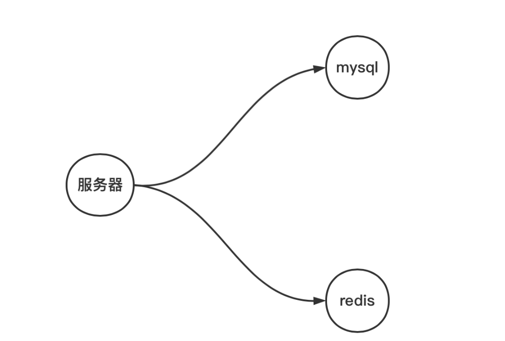
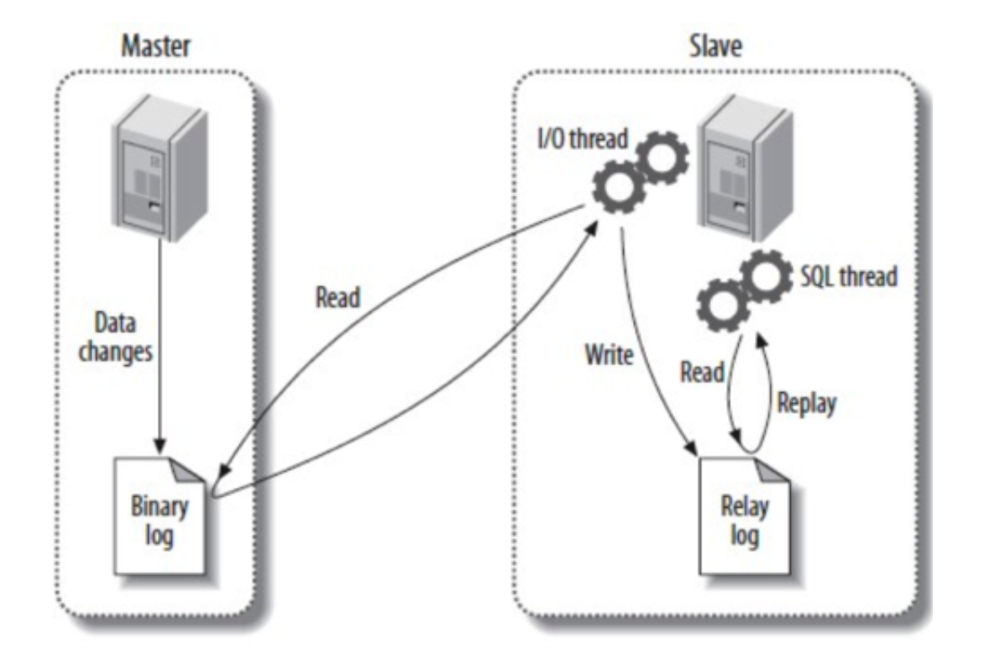
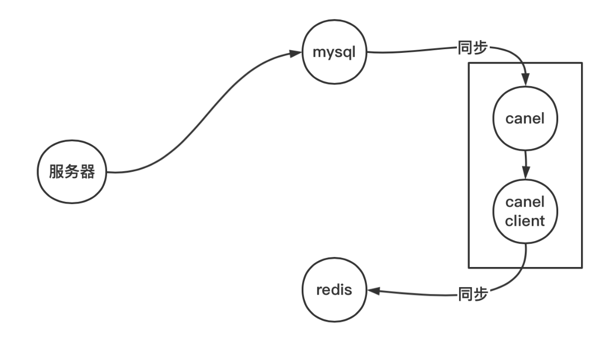
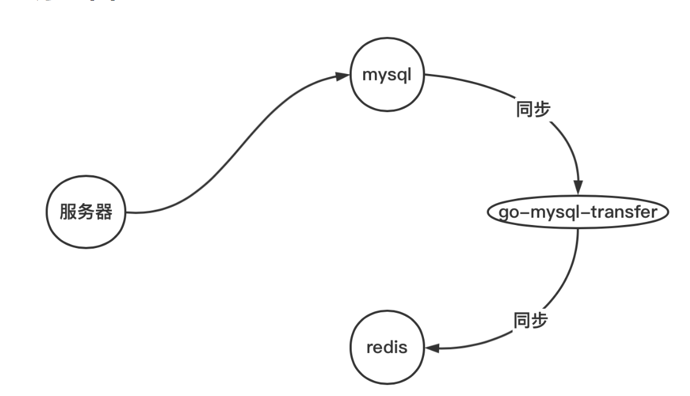
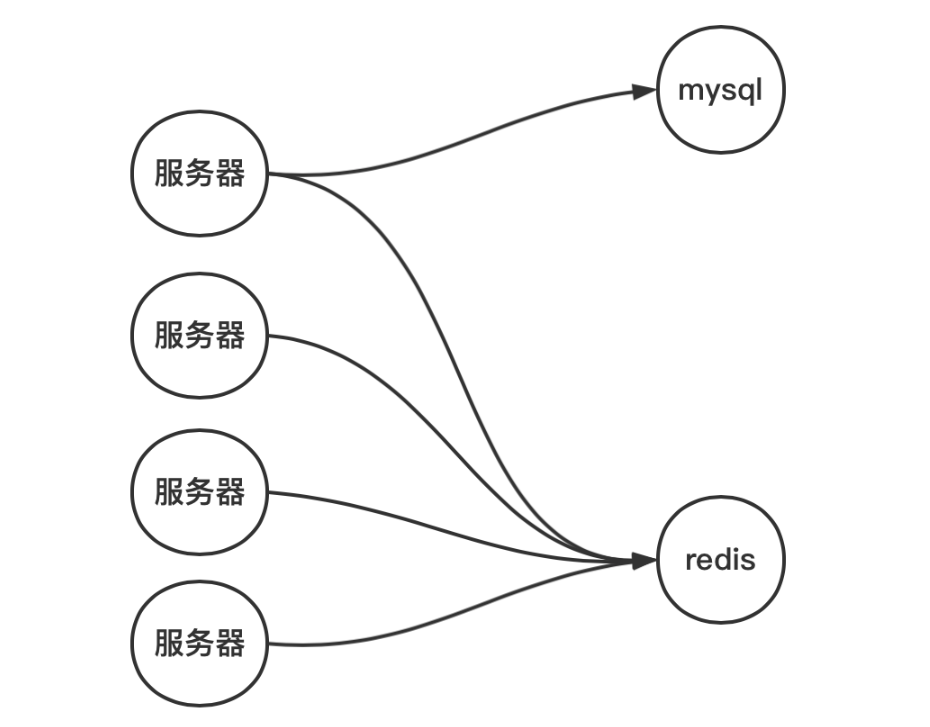
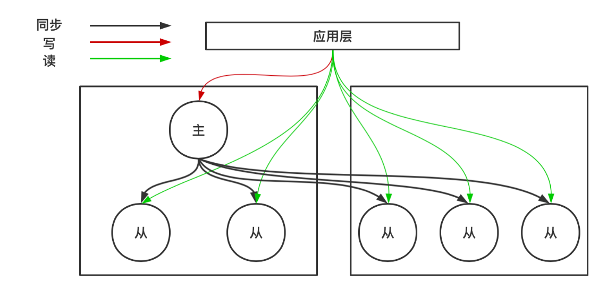

# Mysql的缓冲层Redis

## Mysql需要缓冲层的原因

在读多写少，单个主节点能支撑项目数据量的前提下，业务场景中关系型数据库（Mysql）一般作为主要数据库。mysql 数据主要存储在磁盘当中，适合大量重要数据的存储，磁盘当中的数据一般是远大于内存当中的数据。为了提高并发访问的速度，需要为Mysql设置一个缓冲层。

mysql 有缓冲层，它的作用也是用来缓存热点数据，这些数据包括索引、记录等。mysql 缓冲层是从自身出发，跟具体的业务无关，并且Mysql自身的缓冲策略主要是 lru。

由于 mysql 的缓冲层（buffer pool）不由用户来控制，也就是不能由用户来控制缓存具体数据，Mysql自身的缓冲层与业务无关。并且访问磁盘的速度比较慢，内存访问的速度是磁盘访问速度的10万倍数量级。

在读的需求远远大于写的需求，为了解决读的性能，需要尽量获取数据从内存中获取。缓存数据库可以选用 redis，它所有数据都存储在内存当中。

项目中需要存储的数据应该远大于内存的容量，同时需要进行数据统计分析，所以Mysql是主数据库，Redis缓冲的数据获取的依据是关系型数据库Mysql。缓存数据库Reids作为辅助数据库，可以存储用户自定义的热点数据。

> 一般来说因为写没必要优化，必须让数据正确的落盘。如果写性能出现问题，那么需要使用横向扩展集群方式来解决。



## Redis同步Mysql

### Redis同步存在的问题

没有缓冲层之前，我们对数据的读写都是基于 mysql，不考虑mysql自身的读写分离存在的数据一致性问题，是不存在同步问题。引入缓冲层后，我们对数据的获取需要分别操作缓存数据库Reids和mysql，就存在数据同步问题，数据的状态有以下5种：

1. mysql 有，缓存无
2. mysql 无，缓存有
3. 都有，但数据不一致
4. 都有，数据一致
5. 都没有

4 和 5显然是没问题的，重点现在需要考虑1、2以及3。首先明确一点：获取数据的主要依据是 mysql，只需要将 mysql 的数据正确同步到缓存数据库就可以了。所以1是合法的状态。

第2种状态，缓存有，mysql 没有，这比较危险，此时就可以认为该数据为脏数据，需要在同步策略中避免该情况发生。

第3种状态mysql 和缓存都有数据，但是数据不一致，这种也需要在同步策略中避免。

> 缓存不可用，整个系统依然要保持正常工作，mysql 不可用的话，系统停摆，停止对外提供服务。

### 同步策略

#### 安全的同步策略

读流程：先读缓存，若缓存有，直接返回。若缓存没有，读mysql，若 mysql 有，同步到缓存，并返回。若 mysql 没有，则返回没有。

写流程：先删除缓存，再写 mysql，后面数据同步交由中间件处理。（将问题 3 转化成 1）。

先删除缓存，为了避免其他服务读取旧的数据，也是告知系统这个数据已经不是最新，建议从 mysql 获取数据。虽然是安全的，同时也会造成大量连接访问Mysql数据库，造成mysql性能降低。

#### 高效率的同步策略

读流程：先读缓存，若缓存有，直接返回。若缓存没有，读mysql，若 mysql 有，同步到缓存，并返回。若 mysql 没有，则返回没有。

写流程：先写缓存，并设置过期时间（如 200ms），再写mysql，后面数据同步交由其他中间件处理。

这里设置的过期时间是预估时间，大致上是 mysql 到缓存同步的时间，在写的过程中如果 mysql 停止服务，或数据没写入 mysql，则200 ms 内提供了脏数据服务，但仅仅只有 200ms 的数据错乱。

### Mysql 的主从复制

Redis和Mysql的同步方案利用的是Mysql的主从复制方案，Mysql主从复制的的流程为：

1. 主库更新事件 DML 操作(update、insert、delete) 通过io-thread 写到 binlog。
2. 从库请求读取 binlog，通过 io-thread  写入从库本地 relay-log（中继日志）。
3. 从库通过 sql-thread 读取 relay-log，并把更新事件在从库中重放（replay）一遍。

从库进行复制的具体流程如下：

1. Slave 上面的 IO 线程连接上 Master，并请求从指定日志文件的指定位置（或者从最开始的日志）之后的日志内容。
2. Master 接收到来自 Slave 的 IO 线程的请求后，负责复制的IO 线程会根据请求信息读取日志指定位置之后的日志信息，返回给 Slave 的 IO 线程。返回信息中除了日志所包含的信息之外，还包括本次返回的信息已经到 Master 端的 binlog 文件的名称以及 binlog 的位置。
3. Slave 的 IO 线程接收到信息后，将接收到的日志内容依次添加到 Slave 端的 relay-log 文件的最末端，并将读取到的Master 端的 binlog 的文件名和位置记录到 master-info 文件中，以便在下一次读取的时候能够清楚的告诉 Master 从何处开始读取日志。
4. Slave 的 Sql 进程检测到  relay-log 中新增加了内容后，会马上解析 relay-log 的内容成为在 Master 端真实执行时候的那些可执行的内容，并在自身执行。



### 同步方案

同步可以使用Mysql自身的触发器+UDF(用户自定义函数)来实现，但是触发器具备事务性，而UDF不具备事务性，不支持回滚，可能造成数据错乱，且效率较低，每一次改动，都需要建立连接，用完后释放。

所以Mysql和Redis通常使用中间件进行同步。中间件伪装成Mysql的从数据库，利用了Mysql的主从同步机制，读取binlog 解析后把数据同步到Redis中。同步中间件可以选择cannel或者go-mysql-transfer。

cannel+canal客户端比go-mysql-transfer多了一个流程，但是高可用的。



go-mysql-transfer使用简单，需要其他中间件zk、etcd等实现高可用。



以go-mysql-transfer为例，进行Redis和Mysql的数据同步。下载地址为：

```shell
git clone https://gitee.com/mirrors/go-mysql-transfer.git
# 安装golang的环境后，设置
go env -w GO111MODULE=on
go env -w GOPROXY=https://goproxy.cn,direct
go build

# 修改 app.yml，执行 go-mysql-transfer 启动
```

在Mysql中进行主从同步配置

```sql
/* 
mysql 配置文件 my.cnf
log-bin=mysql-bin # 开启 binlog
binlog-format=ROW # 选择 ROW 模式
server_id=1 # 配置 MySQL replaction 需要定义，不要和 go-mysql-transfer 的 slave_id 重复
*/
-- 创建需要同步的数据表
DROP TABLE IF EXISTS `user`;
CREATE TABLE `user` (
  `id` BIGINT,
  `nick` VARCHAR (100),
  `height` INT8,
  `sex` VARCHAR (1),
  `age` INT8,
  PRIMARY KEY (`id`)
)ENGINE=InnoDB DEFAULT CHARSET=utf8;
```

在 app.yml 中修改指定Mysql的ip、密码、数据库、表名称等，还需要指定同步数据逻辑的lua脚本：

```lua
local ops = require("redisOps") --加载redis操作模块

local row = ops.rawRow()  --当前数据库的一行数据,table类型，key为列名称
local action = ops.rawAction()  --当前数据库事件,包括：insert、update、delete

if action == "insert" or action == "update" then -- 只监听insert事件
    local id = row["id"] --获取ID列的值
    local key = "user:" .. id
    local name = row["nick"] --获取USER_NAME列的值
    local sex = row["sex"]
    local height = row["height"] --获取PASSWORD列的值
    local age = row["age"]
    ops.HSET(key, "id", id) -- 对应Redis的HSET命令
    ops.HSET(key, "nick", name) -- 对应Redis的HSET命令
    ops.HSET(key, "sex", sex) -- 对应Redis的HSET命令
    ops.HSET(key, "height", height) -- 对应Redis的HSET命令
    ops.HSET(key, "age", age) -- 对应Redis的HSET命令
	-- ops.EXPIRE(key, 1800)
elseif action == "delete" then
    local id = row['id']
    local key = "user:" .. id
    ops.DEL(key)
end
```

进行Redis和Mysql的数据同步

```shell
# 查询 master 状态，获取 日志名和偏移量
mysql> show master status;
# 重置同步位置 （假设通过上面命令获取到日志名和偏移量为 mysql-bin.000025 993779648）
./go-mysql-transfer -config app.yml -position 
mysql-bin.000025 993779648
# 全量数据同步  第一次
./go-mysql-transfer -stock
```

## 合法状态下的缓存问题

### 缓存穿透

假设某个数据 redis 不存在，mysql 也不存在，而且一直尝试读怎么办？**一直读取不存在的数据**，于是产生缓存穿透，数据最终压力依然堆积在 mysql，可能造成mysql 不堪重负而崩溃。

解放方案为：

1. 发现 mysql 不存在，将 redis 设置为 <key, nil> 设置过期时间 下次访问 key 的时候，不再访问 mysql 。但是也容易造成 redis 缓存很多无效数据。
2. 布隆过滤器，将 mysql 当中已经存在的 key，写入布隆过滤器，不存在的直接 pass 掉。存在只能增加不能删除的问题。

### 缓存击穿

缓存击穿是某些数据 redis 没有，但是 mysql 有，此时当大量这类数据的**并发连接**请求，同样造成 mysql 压力过大的问题。



解放方案为：

1. 使用分布式锁。请求数据的时候获取锁，若获取成功，则操作后释放锁；若获取失败，则休眠一段时间（200ms）再去获取，当获取成功，操作后释放锁。该方案使并行变为串行。
2. 将很热的 key，设置不过期。

### 缓存雪崩

mysql 主要的数据的依据，redis 是可有可无的状态。在一段时间内，**大量缓存集中失效**（redis 无， mysql 有），导致请求全部走 mysql，有可能搞垮数据库，使整个服务失效。

由于缓存数据库在整个系统不是必须的，也就是缓存宕机不会影响整个系统提供服务，不同的原因解决方案不同：

1. 如果因为缓存数据库宕机，造成所有数据涌向 mysql。可以采用高可用的集群方案，如哨兵模式、cluster 模式。
2. 如果因为设置了相同的过期时间，造成缓存集中失效。可以设置随机过期值或者其他机制错开失效时间。
3. 如果因为系统重启的时候，造成缓存数据消失。如果重启时间短，可以redis 开启持久化；如果重启时间长就需要提前将热数据导入 redis 当中（预热）。

## 缓存方案的弊端

1. 使用缓冲不能处理多语句的事务。
2. Redis不支持回滚。
3. 效率优先会造成Redis和Mysql数据不一致，安全优先会降低缓冲的作用。

## 其他Mysql 性能优化方案

除了使用Redis进行优化Mysql的读性能，还有3种常用的方法进行Mysql性能优化。

### 读写分离

读写分离会设置多个从数据库，从数据库可能存在多个机器当中，写操作依然在主数据库，主数据库提供数据的主要依据。

读写分离主要是使用从数据库解决读压力，原理是主从复制，异步复制，主从之间的数据会有差异，但是会最终一致性。如果读操作有强一致性的要求，就需要读主数据库。



### 数据库连接池

在客户端种创建多个与数据库的连接，可用并发提高数据库的访问性能，同时复用连接，避免连接建立或断开、安全验证等开销。

其原理是利用了Mysql的网络模型，Mysql使用select处理客户端的请求，并且使用阻塞IO模型，所以可用通过连接池提高并发。（如果发送一个事务，必须在一个连接中执行）

### 异步连接

在服务器端建立一个连接，针对这个连接采用非阻塞式IO，可用节省网络传输的时间。如Windows上IOCP，Linux上的io_uring。