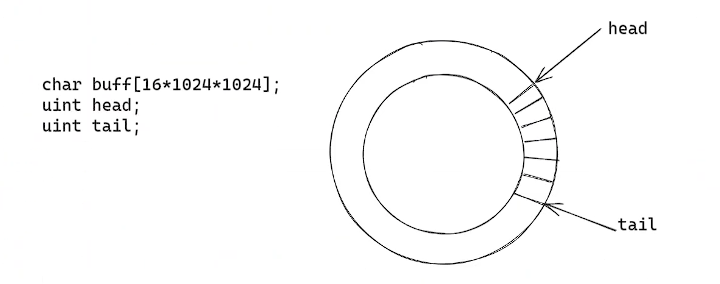
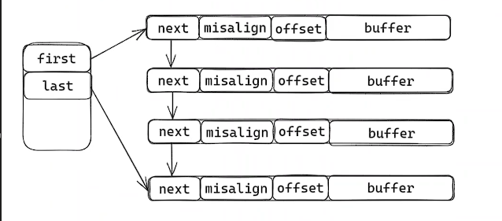

# Reactor多路复用与网络缓冲区组合

Reactor是一种事件驱动模型，常常用来处理网络IO的多路复用。网络IO需要使用网络缓冲区进行数据的处理和发送，这连个组件常常需要结合在一起使用，下面介绍一个示例演示。

## Reactor多路复用

- 主函数建立监听网络连接端口，启动事件循环

```c++
// 主函数
int main() {
    // 创建一个Reactor
    Reactor* R = CreateReactor();
    // 设置一个服务器监听
    if (CreateServer(R, 7777, AcceptCb) != 0) {
        ReleaseReactor(R);
        return 1;
    }
    // 进行事件循环
    eventloop(R);
    ReleaseReactor(R);
    return 0;
}
// 读取客户端数据的回调函数
void ReadCb(int fd, int events, void* privdata) {
    ClientNode* e = (ClientNode*)privdata;
    int n = EventBufferRead(e); // 将网络中读缓冲区的数据拷贝到用户态缓冲区
    if (n > 0) {
        // BufferSearch 检测是否是一个完整的数据包
        int len = BufferSearch(GetNodebufIn(e), "\n", 1);
        // 完整数据包从读缓冲区移除，然后进行处理（发送数据）
        if (len > 0) {
            char buf[len] = { 0 };
            BufferRemove(GetNodebufIn(e), buf, len);
            EventBufferWrite(e, buf, len);
        }
    }
}
// 接受客户端连接的回调函数
void AcceptCb(int fd, int events, void* privdata) {
    ClientNode* e = (ClientNode*)privdata;

    struct sockaddr_in addr;
    memset(&addr, 0, sizeof(struct sockaddr_in));
    socklen_t len = sizeof(addr);
    // 获取客户端fd
    int clientfd = accept(fd, (struct sockaddr*)&addr, &len);
    if (clientfd <= 0) {
        printf("accept failed\n");
        return;
    }

    char str[INET_ADDRSTRLEN] = { 0 };
    printf("recv from %s at port %d\n", inet_ntop(AF_INET, &addr.sin_addr, str, sizeof(str)),
        ntohs(addr.sin_port));
    // 新建客户端节点，每一个客户端设置读回调函数
    ClientNode* newNode = NewEvent(GetNodeRactor(e), clientfd, ReadCb, nullptr, nullptr);
    AddEpollEvent(GetNodeRactor(e), EPOLLIN, newNode);
    SetNonblock(clientfd);
}
```

- Reactor 事件循环

```c++
#include <sys/epoll.h>
#include <stdio.h>
#include <unistd.h> // read write
#include <fcntl.h> // fcntl
#include <sys/types.h> // listen
#include <sys/socket.h> // socket
#include <errno.h> // errno
#include <arpa/inet.h> // inet_addr htons
#include <assert.h> // assert
#include <stdlib.h> // malloc
#include <string.h> // memcpy memmove
// 最大epoll event事件和最大连接（65535）
static const int32_t MAX_EVENT_NUM = 512;
static const int32_t MAX_CONN = ((1 << 16) - 1);
// 定义读写回调函数
typedef void (*EventCallback)(int32_t fd, int32_t events, void* privdata);
typedef void (*ErrorCallback)(int32_t fd, char* err);
// 连接节点，每一个连接都有自己的读写buffer和回调函数
struct ClientNode {
    int32_t fd;
    Reactor* r;
    buffer_t* in;
    buffer_t* out;
    EventCallback readCallback;
    EventCallback writeCallback;
    ErrorCallback errorCallback;
};

// 定义reactor 结构体，包含epoll fd、linten fd、连接节点数组、epoll事件数组
struct Reactor {
    int32_t epfd;
    int32_t listenfd;
    int32_t stop;
    ClientNode* clientNodes; // 客户端连接节点数组
    int32_t iter;
    struct epoll_event epollEvents[MAX_EVENT_NUM]; // epoll 事件数组
};

// 创建reactor
Reactor* CreateReactor() {
    Reactor* reactor = (Reactor*)malloc(sizeof(Reactor));
    reactor->epfd = epoll_create(1);
    reactor->listenfd = 0;
    reactor->stop = 0;
    reactor->iter = 0;
    // 分配最大连接数65535
    reactor->clientNodes = (ClientNode*)malloc(sizeof(ClientNode) * MAX_CONN);
    memset(reactor->clientNodes, 0, sizeof(ClientNode) * MAX_CONN);
    // 最大epoll事件处理数量
    memset(reactor->epollEvents, 0, sizeof(struct epoll_event) * MAX_EVENT_NUM);
    return reactor;
}

void ReleaseReactor(Reactor* reactor) {
    free(reactor->clientNodes);
    close(reactor->epfd);
    free(reactor);
}
// 找到未分配的客户端节点
static ClientNode* GetClientNode(Reactor* reactor) {
    reactor->iter++;
    while (reactor->clientNodes[reactor->iter & MAX_CONN].fd > 0) {
        reactor->iter++;
    }
    return &reactor->clientNodes[reactor->iter];
}

// 为每一个节点分配读写缓冲区
ClientNode* NewEvent(Reactor* R, int32_t fd, EventCallback rd, EventCallback wt, ErrorCallback err) {
    assert(rd != 0 || wt != 0 || err != 0);
    ClientNode* clientNode = GetClientNode(R);
    clientNode->r = R;
    clientNode->fd = fd;
    clientNode->in = BufferNew(16 * 1024);
    clientNode->out = BufferNew(16 * 1024);
    clientNode->readCallback = rd;
    clientNode->writeCallback = wt;
    clientNode->errorCallback = err;
    return clientNode;
}
// 获取节点的接收缓冲区
buffer_t* GetNodebufIn(ClientNode* node) {
    return node->in;
}

// 获取节点的发送缓冲区
buffer_t* GetNodebufOut(ClientNode* node) {
    return node->out;
}
// 获取节点对应的Reactor
Reactor* GetNodeRactor(ClientNode* node) {
    return node->r;
}
// 释放对应的缓冲区
void FreeBuffer(ClientNode* node) {
    BufferFree(node->in);
    BufferFree(node->out);
}
// 设置为非阻塞FD
int32_t SetNonblock(int32_t fd) {
    int32_t flag = fcntl(fd, F_GETFL, 0);
    return fcntl(fd, F_SETFL, flag | O_NONBLOCK);
}
// 增加客户端连接fd到epoll监听列表
int32_t AddEpollEvent(Reactor* R, int32_t events, ClientNode* e) {
    struct epoll_event ev;
    ev.events = events;
    ev.data.ptr = e;
    if (epoll_ctl(R->epfd, EPOLL_CTL_ADD, e->fd, &ev) == -1) {
        printf("add event err fd = %d\n", e->fd);
        return 1;
    }
    return 0;
}
// 从epoll监听列表中删除客户端fd
int32_t DelEpollEvent(Reactor* R, ClientNode* e) {
    epoll_ctl(R->epfd, EPOLL_CTL_DEL, e->fd, NULL);
    FreeBuffer(e);
    return 0;
}
// 修改需要监听的读写事件
int32_t EnableEpollEvent(Reactor* R, ClientNode* e, int32_t readable, int32_t writeable) {
    struct epoll_event ev;
    ev.events = (readable ? EPOLLIN : 0) | (writeable ? EPOLLOUT : 0);
    ev.data.ptr = e;
    if (epoll_ctl(R->epfd, EPOLL_CTL_MOD, e->fd, &ev) == -1) {
        return 1;
    }
    return 0;
}
// Reactor 的一次事件循环
void EventloopOnce(Reactor* r, int32_t timeout) {
    int32_t n = epoll_wait(r->epfd, r->epollEvents, MAX_EVENT_NUM, timeout);
    for (int32_t i = 0; i < n; i++) {
        // 取出事件
        struct epoll_event* e = &r->epollEvents[i];
        int32_t mask = e->events;
        if (e->events & EPOLLERR) { // 表示对应的文件描述符发生错误
            mask |= EPOLLIN | EPOLLOUT;
        }
        if (e->events & EPOLLHUP) { // 表示对应的文件描述符被挂断
            mask |= EPOLLIN | EPOLLOUT;
        }
        ClientNode* et = (ClientNode*)e->data.ptr;
        // 处理读事件
        if (mask & EPOLLIN) {
            if (et->readCallback) {
                et->readCallback(et->fd, EPOLLIN, et);
            }
        }
        // 处理写事件, 有自定义的回调函数直接调用，没有则直接发送数据
        if (mask & EPOLLOUT) {
            if (et->writeCallback) {
                et->writeCallback(et->fd, EPOLLOUT, et);
            } else {
                uint8_t* buf = BufferWriteAtmost(GetNodebufOut(et)); // 获取最大需要发送的数据
                EventBufferWrite(et, buf, BufferLen(GetNodebufOut(et))); // 默认进行发送数据
            }
        }
    }
}

// 停止事件循环
void StopEventloop(Reactor* r) {
    r->stop = 1;
}

// 进行事件循环
void eventloop(Reactor* r) {
    while (!r->stop) {
        EventloopOnce(r, -1);
    }
}
// 创建一个监听Reactor服务器
int32_t CreateServer(Reactor* R, short port, EventCallback func) {
    // 创建监听fd
    int32_t listenfd = socket(AF_INET, SOCK_STREAM, 0);
    if (listenfd < 0) {
        printf("create listenfd error!\n");
        return -1;
    }
    struct sockaddr_in addr;
    memset(&addr, 0, sizeof(struct sockaddr_in));
    addr.sin_family = AF_INET;
    addr.sin_port = htons(port);
    addr.sin_addr.s_addr = INADDR_ANY;
    // 设置可以端口复用（多个socket进行bind同一个端口不报错）
    int32_t reuse = 1;
    if (setsockopt(listenfd, SOL_SOCKET, SO_REUSEADDR, (void*)&reuse, sizeof(int32_t)) == -1) {
        printf("reuse address error: %s\n", strerror(errno));
        return -1;
    }
    // 绑定设置监听的端口和IP
    if (bind(listenfd, (struct sockaddr*)&addr, sizeof(struct sockaddr_in)) < 0) {
        printf("bind error %s\n", strerror(errno));
        return -1;
    }
    // 开始监听
    if (listen(listenfd, 256) < 0) {
        printf("listen error %s\n", strerror(errno));
        return -1;
    }
    // 设置非阻塞
    if (SetNonblock(listenfd) < 0) {
        printf("SetNonblock error %s\n", strerror(errno));
        return -1;
    }

    R->listenfd = listenfd;
    // 只需要设置读回调函数和监听读事件
    ClientNode* e = NewEvent(R, listenfd, func, nullptr, nullptr);
    AddEpollEvent(R, EPOLLIN, e);

    printf("listen port : %d\n", port);
    return 0;
}
// 处理读事件， 从客户端接收数据
int32_t EventBufferRead(ClientNode* e) {
    int32_t fd = e->fd;
    int32_t num = 0;
    while (1) {
        char buf[1024] = { 0 };
        int32_t n = read(fd, buf, 1024);
        if (n == 0) {  // 客户端关闭连接，从epoll监听中删除，关闭fd
            printf("close connection fd = %d\n", fd);
            if (e->errorCallback)
                e->errorCallback(fd, "close socket");
            DelEpollEvent(e->r, e);
            close(fd);
            return 0;
        } else if (n < 0) {
            // 资源还没有准备好，需要重新执行
            if (errno == EINTR) {
                continue;
            }
            // 读取结束
            if (errno == EWOULDBLOCK) {
                break;
            }
            printf("read error fd = %d err = %s\n", fd, strerror(errno));
            // 错误回调函数进行处理错误
            if (e->errorCallback) {
                e->errorCallback(fd, strerror(errno));
            }
            // 从epoll删除，关闭fd
            DelEpollEvent(e->r, e);
            close(fd);
            return 0;
        } else {
            // 读取客户端发送的数据到读缓冲区
            printf("recv data from client:%s", buf);
            BufferAdd(GetNodebufIn(e), buf, n);
        }
        num += n;
    }
    return num;
}
// 处理写事件，发送数据给客户端
static int32_t WriteSocket(ClientNode* e, void* buf, int32_t sz) {
    int32_t fd = e->fd;
    while (1) {
        int32_t n = write(fd, buf, sz);
        if (n < 0) {
            if (errno == EINTR) { // 资源还没有准备好，需要重新执行
                continue;
            }
            if (errno == EWOULDBLOCK) { // 发送结束
                break;
            }
            // 发生错误，需要进行错误处理，移除epoll监听，关闭句柄
            if (e->errorCallback) {
                e->errorCallback(fd, strerror(errno));
            }
            DelEpollEvent(e->r, e);
            close(e->fd);
        }
        return n;
    }
    return 0;
}

int32_t EventBufferWrite(ClientNode* e, void* buf, int32_t sz) {
    // 写缓冲区没有数据，直接发送buf
    buffer_t* out = GetNodebufOut(e);
    if (BufferLen(out) == 0) {
        int32_t n = WriteSocket(e, buf, sz);
        if (n == 0 || n < sz) {
            // 发送失败或者部分成功，除了将没有发送出去的数据写入缓冲区，还要注册写事件
            BufferAdd(out, (char*)buf + n, sz - n);
            EnableEpollEvent(e->r, e, 1, 1);
            return 0;
        } else if (n < 0) {
            return 0;
        }
        return 1;
    }
    // 放入写缓冲区
    BufferAdd(out, (char*)buf, sz);
    return 1;
}
```

## RingBuffer 网络缓冲区

ringbuffer网络缓冲区的设计如下所示：



```c++
struct ringbuffer_s {
    uint32_t size;
    uint32_t tail;
    uint32_t head;
    uint8_t* buf;
};

using buffer_t = ringbuffer_s;

// 判断是否是2的冥次方
static inline int32_t PowerOfTwo(uint32_t num) {
    if (num < 2) {
        return 0;
    }
    return (num & (num - 1)) == 0;
}
// 找到大于num的并且是2的冥的内存大小
static inline uint32_t RoundupPowerOfTwo(uint32_t num) {
    if (num == 0) {
        return 2;
    }
    int32_t i = 0;
    for (; num != 0; i++) {
        num >>= 1;
    }
    return 1U << i;
}
// 分配内ringbuffer的存大小
buffer_t* BufferNew(uint32_t sz) {
    // 分配2的冥次方大小的内存
    if (!PowerOfTwo(sz)) {
        sz = RoundupPowerOfTwo(sz);
    }
    buffer_t* buf = (buffer_t*)malloc(sizeof(buffer_t) + sz);
    if (!buf) {
        return nullptr;
    }
    buf->size = sz;
    buf->head = buf->tail = 0;
    buf->buf = (uint8_t*)(buf + 1);
    return buf;
}

// 释放ringbuffer内存
void BufferFree(buffer_t* r) {
    free(r);
    r = nullptr;
}

// 判断ringbuffer是否为空
static uint32_t RbEmpty(buffer_t* r) {
    return r->head == r->tail;
}

// 判断是否写满数据
static uint32_t RbFull(buffer_t* r) {
    return r->size == (r->tail - r->head);
}

// 计算当前已经写的长度
static uint32_t RbLen(buffer_t* r) {
    return r->tail - r->head;
}
// 计算ringbuff 还可以写的长度
static uint32_t RbRemain(buffer_t* r) {
    return r->size - r->tail + r->head;
}
// 向ringbuff增加数据
int32_t BufferAdd(buffer_t* r, const void* data, uint32_t sz) {
    // 无法存放
    if (sz > RbRemain(r)) {
        return -1;
    }
    // 判断是否被分割，如果不是连续的地址，分别拷贝到实际内存的两个部分
    uint32_t i;
    i = std::min(sz, r->size - (r->tail & (r->size - 1)));
    // 拷贝实际的高地址空间
    memcpy(r->buf + (r->tail & (r->size - 1)), data, i);
    // 拷贝到实际的低地址空间
    memcpy(r->buf, data + i, sz - i);
    // 移动写指针
    r->tail += sz;
    return 0;
}

// 向ringbbuff读取数据
int32_t BufferRemove(buffer_t* r, void* data, uint32_t sz) {
    assert(!RbEmpty(r));
    uint32_t i;
    // 实际可读的空间
    sz = std::min(sz, r->tail - r->head);
    // 如果不是连续的地址，需要从两块内存中分别进行拷贝
    i = std::min(sz, r->size - (r->head & (r->size - 1)));
    // 拷贝实际的高地址空间
    memcpy(data, r->buf + (r->head & (r->size - 1)), i);
    // 拷贝实际的低地址空间
    memcpy(data + i, r->buf, sz - i);
    // 移动读指针
    r->head += sz;
    return sz;
}
// 丢弃数据，读指针移动sz的大小
int32_t BufferDrain(buffer_t* r, uint32_t sz) {
    // 实际的内存大小
    if (sz > RbLen(r)) {
        sz = RbLen(r);
    }
    r->head += sz;
    return sz;
}

// 找 buffer 中 是否包含特殊字符串（界定数据包的），界定成功返回需要读取数据的长度
int32_t BufferSearch(buffer_t* r, const char* sep, const int32_t seplen) {
    int32_t i;
    for (i = 0; i <= RbLen(r) - seplen; i++) {
        // 计算当前需要比较的位置
        int32_t pos = (r->head + i) & (r->size - 1);
        // 分隔符长度大于不连续空间的剩余空间
        if (pos + seplen > r->size) {
            // 比较高地址空间
            if (memcmp(r->buf + pos, sep, r->size - pos)) {
                continue;
            }
            // 比较低地址空间剩余的分隔符字节
            if (memcmp(r->buf, sep + (r->size - pos), pos + (seplen - r->size)) == 0) {
                return i + seplen;
            }
        }
        // 比较连续的地址空间
        if (memcmp(r->buf + pos, sep, seplen) == 0) {
            return i + seplen;
        }
    }
    return 0;
}
// 获取当前已经存入ringbuff的数据长度
uint32_t BufferLen(buffer_t* r) {
    return RbLen(r);
}

// 一次性获取所有ringbuff的数据
uint8_t* BufferWriteAtmost(buffer_t* r) {
    uint32_t rpos = r->head & (r->size - 1);
    uint32_t wpos = r->tail & (r->size - 1);
    // 地址不连续，需要分别拷贝两块内存进行数据合并
    if (wpos < rpos) {
        uint8_t* temp = (uint8_t*)malloc(r->size * sizeof(uint8_t));
        memcpy(temp, r->buf + rpos, r->size - rpos);
        memcpy(temp + r->size - rpos, r->buf, wpos);
        free(r->buf);
        r->buf = temp;
        return r->buf;
    }
    // 连续地址直接返回
    return r->buf + rpos;
}
```

## 链式缓冲区

链式缓冲区的设计如下所示：



```c++
// 链式存储的节点buffer
struct buf_chain_s {
    struct buf_chain_s* next; // 下一个buff链
    uint32_t bufferLen;// 当前buff的总长度
    uint32_t misalign; // 当前buff已读空间大小
    uint32_t off;   // 当前buff可写空间大小
    uint8_t* buffer; // 实际申请的buff内存 
};

using buf_chain_t = buf_chain_s;
// 链式buffer结构
struct buffer_s {
    buf_chain_t* first; // 队列头指针
    buf_chain_t* last;  // 队列尾指针
    buf_chain_t** lastWithDatap;    // 
    uint32_t totalLen;  // 总写入未读的长度（全部buff链）
    uint32_t lastReadPos;// 记录上一次读的位置，加快下一次找分割符的速度
};

using buffer_t = buffer_s;

#define CHAIN_SPACE_LEN(ch) ((ch)->bufferLen - ((ch)->misalign + (ch)->off))
#define  BUFFER_CHAIN_EXTRA(t, c) (t *)((buf_chain_t *)(c) + 1)
#define  BUFFER_CHAIN_SIZE sizeof(buf_chain_t)

static constexpr uint32_t MIN_BUFFER_SIZE = 1024;
static constexpr uint32_t  MAX_TO_COPY_IN_EXPAND = 4096;
static constexpr uint32_t  BUFFER_CHAIN_MAX_AUTO_SIZE = 4096;
static constexpr uint32_t  MAX_TO_REALIGN_IN_EXPAND = 2048;
static constexpr uint32_t  BUFFER_CHAIN_MAX = 16 * 1024 * 1024; // 16M

// buf的总长度
uint32_t BufferLen(buffer_t* buf) {
    return buf->totalLen;
}

// 新建一个chain buff
buffer_t* BufferNew(uint32_t sz) {
    (void)sz;
    buffer_t* buf = (buffer_t*)malloc(sizeof(buffer_t));
    if (!buf) {
        return nullptr;
    }
    memset(buf, 0, sizeof(*buf));
    buf->lastWithDatap = &buf->first;
    return buf;
}

static buf_chain_t* bufChainNew(uint32_t size) {
    buf_chain_t* chain;
    uint32_t toAlloc;
    // 大于最大值（16M），无法申请
    if (size > BUFFER_CHAIN_MAX - BUFFER_CHAIN_SIZE) {
        return (nullptr);
    }
    size += BUFFER_CHAIN_SIZE;
    // 找到比size大的2的冥内存大小
    if (size < BUFFER_CHAIN_MAX / 2) {
        toAlloc = MIN_BUFFER_SIZE;
        while (toAlloc < size) {
            toAlloc <<= 1;
        }
    } else {
        toAlloc = size;
    }
    // 申请一个buffer链
    if ((chain = (buf_chain_t*)malloc(toAlloc)) == nullptr) {
        return nullptr;
    }
    memset(chain, 0, BUFFER_CHAIN_SIZE);
    chain->bufferLen = toAlloc - BUFFER_CHAIN_SIZE;
    chain->buffer = BUFFER_CHAIN_EXTRA(uint8_t, chain);
    return chain;
}

// 释放所有的链buffer
static void BufChainFreeAll(buf_chain_t* chain) {
    buf_chain_t* next;
    for (; chain; chain = next) {
        next = chain->next;
        free(chain);
    }
}

// 释放所有的链buffer
void BufferFree(buffer_t* buf) {
    BufChainFreeAll(buf->first);
}

// 释放所有的空链
static buf_chain_t** FreeEmptyChains(buffer_t* buf) {
    buf_chain_t** ch = buf->lastWithDatap;
    while ((*ch) && (*ch)->off != 0) {
        ch = &(*ch)->next;
    }
    if (*ch) {
        BufChainFreeAll(*ch);
        *ch = nullptr;
    }
    return ch;
}
// 插入一个新buff链
static void BufChainInsert(buffer_t* buf, buf_chain_t* chain) {
    if (*buf->lastWithDatap == nullptr) {
        buf->first = buf->last = chain;
    } else {
        buf_chain_t** chp;
        chp = FreeEmptyChains(buf);
        *chp = chain;
        if (chain->off) {
            buf->lastWithDatap = chp;
        }
        buf->last = chain;
    }
    buf->totalLen += chain->off;
}
// 申请一个新buff链并插入
static inline buf_chain_t* BufChainInsertNew(buffer_t* buf, uint32_t datlen) {
    buf_chain_t* chain;
    if ((chain = bufChainNew(datlen)) == nullptr) {
        return nullptr;
    }
    BufChainInsert(buf, chain);
    return chain;
}
// 判断buf是否需要对齐
static int BufChainShouldRealign(buf_chain_t* chain, uint32_t datlen) {
    return chain->bufferLen - chain->off >= datlen &&
        (chain->off < chain->bufferLen / 2) &&
        (chain->off <= MAX_TO_REALIGN_IN_EXPAND);
}
// 进行buff内存对齐
static void BufChainAlign(buf_chain_t* chain) {
    memmove(chain->buffer, chain->buffer + chain->misalign, chain->off);
    chain->misalign = 0;
}
// 向缓冲区存入数据
int BufferAdd(buffer_t* buf, const void* data_in, uint32_t datlen) {
    buf_chain_t* chain, * tmp;
    const uint8_t* data = (uint8_t*)data_in;
    uint32_t remain, toAlloc;
    int result = -1;
    // 大于最大值
    if (datlen > BUFFER_CHAIN_MAX - buf->totalLen) {
        goto done;
    }

    if (*buf->lastWithDatap == nullptr) {
        chain = buf->last;
    } else {
        chain = *buf->lastWithDatap;
    }

    if (chain == nullptr) {
        chain = BufChainInsertNew(buf, datlen);
        if (!chain) {
            goto done;
        }
    }

    remain = chain->bufferLen - chain->misalign - chain->off; // 计算剩余空间
    if (remain >= datlen) { // 空间足够
        memcpy(chain->buffer + chain->misalign + chain->off, data, datlen);
        chain->off += datlen;
        buf->totalLen += datlen;
        goto out;
    } else if (BufChainShouldRealign(chain, datlen)) { // 对其后的空间足够
        BufChainAlign(chain);

        memcpy(chain->buffer + chain->off, data, datlen);
        chain->off += datlen;
        buf->totalLen += datlen; // 总长度增加

        goto out;
    }
    // 新buff链比原来的扩大一倍
    toAlloc = chain->bufferLen;
    if (toAlloc <= BUFFER_CHAIN_MAX_AUTO_SIZE / 2) {
        toAlloc <<= 1;
    }
    if (datlen > toAlloc) {
        toAlloc = datlen;
    }
    // 创建一个新链
    tmp = bufChainNew(toAlloc);
    if (tmp == nullptr) {
        goto done;
    }
    // 拷贝原来的链
    if (remain) {
        memcpy(chain->buffer + chain->misalign + chain->off, data, remain);
        chain->off += remain;
        buf->totalLen += remain;
    }
    // 拷贝到新链中
    data += remain;
    datlen -= remain;

    memcpy(tmp->buffer, data, datlen);
    tmp->off = datlen;
    BufChainInsert(buf, tmp);
out:
    result = 0;
done:
    return result;
}
// 数据出链
static uint32_t BufCopyout(buffer_t* buf, void* data_out, uint32_t datlen) {
    buf_chain_t* chain;
    char* data = (char*)data_out;
    uint32_t nread;
    chain = buf->first;
    // 当前缓冲区的最大长度
    if (datlen > buf->totalLen) {
        datlen = buf->totalLen;
    }
    if (datlen == 0) {
        return 0;
    }
    nread = datlen;

    while (datlen && datlen >= chain->off) {
        uint32_t copylen = chain->off;
        memcpy(data, chain->buffer + chain->misalign, copylen);
        data += copylen;
        datlen -= copylen;

        chain = chain->next;
    }
    if (datlen) {
        memcpy(data, chain->buffer + chain->misalign, datlen);
    }

    return nread;
}
// 初始化空链
static inline void ZeroChain(buffer_t* dst) {
    dst->first = nullptr;
    dst->last = nullptr;
    dst->lastWithDatap = &(dst)->first;
    dst->totalLen = 0;
}
// 删除已经读取过的buff链
int BufferDrain(buffer_t* buf, uint32_t len) {
    buf_chain_t* chain, * next;
    uint32_t remaining, oldLen;
    oldLen = buf->totalLen;
    if (oldLen == 0) {
        return 0;
    }
    if (len >= oldLen) { // 全部读取完成，释放全部的buff链
        len = oldLen;
        for (chain = buf->first; chain != nullptr; chain = next) {
            next = chain->next;
            free(chain);
        }
        ZeroChain(buf);
    } else {
        buf->totalLen -= len;
        remaining = len;
        for (chain = buf->first; remaining >= chain->off; chain = next) {
            next = chain->next;
            remaining -= chain->off;

            if (chain == *buf->lastWithDatap) {
                buf->lastWithDatap = &buf->first;
            }
            if (&chain->next == buf->lastWithDatap)
                buf->lastWithDatap = &buf->first;

            free(chain);
        }

        buf->first = chain;
        chain->misalign += remaining; // 同一个buffer中已读数量增加
        chain->off -= remaining;    // 同一个buffer中未读数量减少
    }

    return len;
}

// 从缓冲区取数据
int BufferRemove(buffer_t* buf, void* data_out, uint32_t datlen) {
    uint32_t n = BufCopyout(buf, data_out, datlen); // 出缓冲区
    if (n > 0) {
        if (BufferDrain(buf, n) < 0) { // 删除已经读取完成的buff链
            n = -1;
        }
    }
    return (int)n;
}
// 从from 检测是否存在分隔符
static bool CheckSep(buf_chain_t* chain, int from, const char* sep, int seplen) {
    for (;;) {
        int sz = chain->off - from;
        if (sz >= seplen) {
            return memcmp(chain->buffer + chain->misalign + from, sep, seplen) == 0;
        }
        // 检查当前链的所有和下一个buff链
        if (sz > 0) {
            if (memcmp(chain->buffer + chain->misalign + from, sep, sz)) {
                return false;
            }
        }
        chain = chain->next;
        sep += sz;
        seplen -= sz;
        from = 0;
    }
}
// 搜索分隔符
int BufferSearch(buffer_t* buf, const char* sep, const int seplen) {
    buf_chain_t* chain;
    int i;
    chain = buf->first;
    if (chain == nullptr) {
        return 0;
    }
    int bytes = chain->off;
    // 上一次查找过，每找到，快速移动到上次的位置
    while (bytes <= buf->lastReadPos) {
        chain = chain->next;
        if (chain == nullptr) {
            return 0;
        }
        bytes += chain->off;
    }
    bytes -= buf->lastReadPos;
    int from = chain->off - bytes; // 找到上次的位置
    for (i = buf->lastReadPos; i <= buf->totalLen - seplen; i++) {
        if (CheckSep(chain, from, sep, seplen)) {
            // 找到了，记录的位置清零
            buf->lastReadPos = 0;
            return i + seplen;
        }
        ++from;
        --bytes;
        if (bytes == 0) {
            chain = chain->next;
            from = 0;
            if (chain == nullptr) {
                break;
            }
            bytes = chain->off;
        }
    }
    // 没找到，记录位置，下次查找从这个位置开始找
    buf->lastReadPos = i;
    return 0;
}
// 一次性拷贝所有缓存的数据
uint8_t* BufferWriteAtmost(buffer_t* p) {
    buf_chain_t* chain, * next, * tmp, * lastWithData;
    uint8_t* buffer;
    uint32_t remaining;
    int removedLastWithData = 0;
    int removedLastWithDatap = 0;

    chain = p->first;
    uint32_t size = p->totalLen;
    // 只有一个buff链
    if (chain->off >= size) {
        return chain->buffer + chain->misalign;
    }
    // tmp指向最后一个buff链
    remaining = size - chain->off;
    for (tmp = chain->next; tmp; tmp = tmp->next) {
        if (tmp->off >= (size_t)remaining) {
            break;
        }
        remaining -= tmp->off;
    }
    // 第一个链有足够的空间存放所有的数据
    if (chain->bufferLen - chain->misalign >= (size_t)size) {
        size_t oldOff = chain->off;
        buffer = chain->buffer + chain->misalign + chain->off;
        tmp = chain;
        tmp->off = size;
        size -= oldOff;
        chain = chain->next;
    } else {
        // 申请一个新链
        if ((tmp = bufChainNew(size)) == nullptr) {
            return nullptr;
        }
        buffer = tmp->buffer;
        tmp->off = size;
        p->first = tmp;
    }

    lastWithData = *p->lastWithDatap;
    for (; chain != nullptr && (size_t)size >= chain->off; chain = next) {
        next = chain->next;

        if (chain->buffer) {
            memcpy(buffer, chain->buffer + chain->misalign, chain->off);
            size -= chain->off;
            buffer += chain->off;
        }
        if (chain == lastWithData) {
            removedLastWithData = 1;
        }
        if (&chain->next == p->lastWithDatap) {
            removedLastWithDatap = 1;
        }

        free(chain);
    }

    if (chain != nullptr) {
        memcpy(buffer, chain->buffer + chain->misalign, size);
        chain->misalign += size;
        chain->off -= size;
    } else {
        p->last = tmp;
    }

    tmp->next = chain;

    if (removedLastWithData) {
        p->lastWithDatap = &p->first;
    } else if (removedLastWithDatap) {
        if (p->first->next && p->first->next->off) {
            p->lastWithDatap = &p->first->next;
        } else {
            p->lastWithDatap = &p->first;
        }
    }
    return tmp->buffer + tmp->misalign;
}
```

