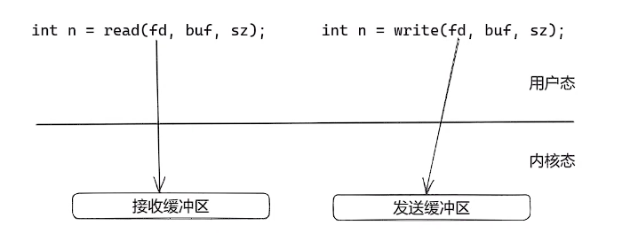
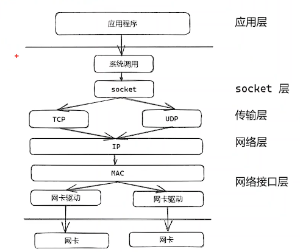
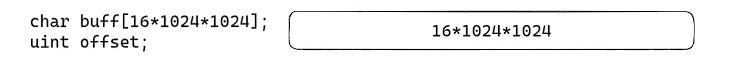
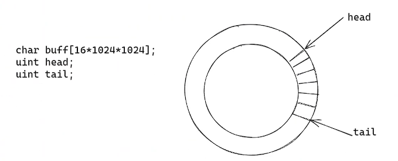
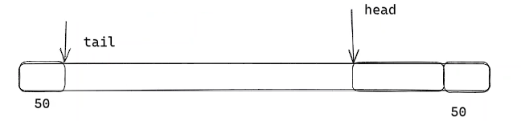
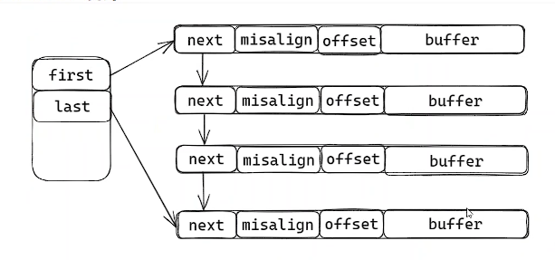

# 网络缓冲区

在网络编程中，在应用层需要做的其实就是四件事：

1. 连接的建立
2. 连接的断开
3. 数据的接收
4. 数据的发送

其中最重要的就是数据的接收和发送，在应用层网络缓冲区设计就非常关键。

## Linux 网络数据的接收和发送

在linux上接收和发送数据，是使用通用的系统调用read/write、sendto/recvfrom 进行。（windows上还有异步IO方式WSASend/WSARecv）

系统调用根据句柄 fd 找到对应的网络socket，每一个socket在内核都有一个接收缓冲区和一个发送缓冲区，系统调用write/sendto把用户态的数据拷贝到内核层就会返回，read/recvfrom也是仅仅把内核态缓冲区的数据拷贝到用户态。

Linux系统是如何把用户态的数据发送出去的？如下图所示：

网络数据的发送流程是：

1. 应用程序通过系统调用将用户态的数据拷贝到sk_buff并放到对应的socket 内核发送缓冲区。（socket是5元组为源IP、源端口、目标IP、目标端口、传输协议组成）
2. 网络协议栈从socker的发送缓冲区取出sk_buff，并克隆一个新的sk_buff。
3. 新的sk_buff向下传递，通过这5元组进行TCP/IP的传输协议头、IP协议头、以太网MAC协议头、帧尾的组装。（该步骤会进行TCP的分段和IP分片）
4. 组装完成的数据放入发送队列，触发软中断通知网卡驱动程序，有新的网络数据包要发送。
5. 网卡驱动程序从发送队列依次取出sk_buff放入内存DMA区域的ringbuffer中，才能让网卡读取。
6. 触发网卡发送数据，发送成功后触发硬件中断，是否sk_buff 和 ringbuffer内存。
7. 当收到TCP报文的ACK应答时，释放发送缓冲区里的原始sk_buff。

> TCP发送缓冲区为了支持丢失重传，所以需要克隆。
>
> UDP没有发送缓冲区，不需要克隆sk_buff，直接发送原始的sk_buff。

网络数据的接收流程是：

1. 网卡收到数据包，通过DMA将数据包写入内存（ringbuffer 环形缓冲区结构），无需CPU参与。
2. 网卡向CPU发起硬件中断，CPU收到中断请求，按照中断表查找中断处理函数，调用中断处理函数。
3. 中断处理函数将屏蔽中断，发起软件中断，避免CPU频繁被网卡中断。（如果软中断处理耗时操作，时间过长会导致CPU没法响应其他硬件中断）
4. 内核ksoftirqd 线程负责中断处理，该线程从ringbuffer中逐个取出数据到sk_buff中。
5. 从帧头取出IP协议，判断IPV4还是IPV6，并且去除帧头和帧尾。
6. 从IP头看出是TCP还是UDP，按照五元组找到socket，取出数据放到socket接收缓冲区。（软中断处理结束，开启硬件中断）
7. 应用程序通过系统调用read/recv将socket的接收缓冲区的数据拷贝到应用层缓冲区。

> 用户态的原始数据 称为data；增加TCP/UDP头后叫segment，增加IP头后叫数据包packet；增加mac以太网头后叫数据帧frame。

>  磁盘IO如果需要读写大文件，通常使用DIRECT IO。如果不使用DIRECT IO，数据仅仅写入高速缓冲区，只有fsync命令后才能写入磁盘，使用DIRECT IO可以不经过高速缓冲区直接写入磁盘，这是因为大文件数据写入常常会把高速缓冲区写满，频繁失效数据写入磁盘，造成性能降低。

由于send/write都是同步IO，就需要多路复用的IO检测技术，常用的是select、poll、epoll三种方式，其中select和poll只支持水平触发，只有epoll支持水平触发和边缘触发。

> 水平触发通常在业务逻辑处理慢时使用，需要多次提醒内核层还有数据未读取处理。
>
> 边缘触发通常在转发、代理服务器使用，处理速度块，不需要多次提醒处理。

同步IO的数据处理，调用完成后就知道数据是否读取到，如果是非阻塞式fd读取，接收缓冲区内如果无数据read就会返回-1（errno EWOULDBLOCK）, 如果read返回0就是连接的端口，对方close关闭了fd句柄。对端关闭TCP连接时发送FIN数据包进行四次挥手，内核层收到FIN数据包后向接收缓冲区写入一个EOF的数据包，触发读事件，但是应用层使用read读取到的数据返回值就是0。

异步IO，Linux上的IO_URING或者Windows上的WSASend/WSARecv，调用了该函数后无法得知是否有数据发送/接收，仅仅是向内核抛出读写请求，应用层还需要另外调用查询函数不断查询结果，只有内核完成从接收/发送缓冲区的数据拷贝后，向应用层抛出事件，应用层才知道完成数据的发送/接收。

## 用户态的网络缓冲区

### 网络缓冲区的原因

用户层应该为每一个连接准备一个发送和接收缓冲区，原因如下：

1. 从应用层的生产者消费者模型需要，生产者速度大于消费者速度。

    - 用户层使用read从内核读取数据时，读出来的数据是**生产者**，对数据进行对应的业务处理，处理的业务逻辑是**消费者**，业务逻辑处理数据较慢时，就需要网络缓冲区来保存未处理的数据。
    - 用户层使用write发送数据时，业务逻辑产生的数据是**生产者**，协议栈从缓冲区取出数据并且发送是**消费者**，协议栈不能及时的发送数据时，就需要网络缓冲区保存未发送的数据。

2. 从posix api接口读写数据的需要，不能一次性接收数据，一次性的发送数据。

    - 使用`int n = read(fd, buf, sz);` 读取数据时，读取的实际n不一定就是用户定义的数据包长度sz，需要多次读取数据才是一个完整的数据包，需要缓冲区进行保存直到一个完整的数据包。
    - 使用`int n = write(fd, buf, sz);`发送数据时，由于发送缓冲区的限制，实际发送的n不一定就是用户预期的发送sz大小，就需要网络缓冲区进行保存未发送的数据，多次发送。

    

> 完整的数据包的都是由用户自定义的，在读取数据包时，获取的不一定是一个完整的数据包，可能是多个数据包，就需要进行粘包处理，用户程序是一个数据包一个数据包进行处理的。通常用来界定完整数据包的方式有两种：
>
> 1. 特殊字符来界定数据包。如使用telnet发送数据时，会使用\r\n来界定一个完整的数据包。
> 2. 使用固定长度来界定数据包。如前面两个字节规定了该数据包的长度，必要读取到前两个字节规定的长度才是一个完整的数据包。

网络缓冲区的设计与TCP和UDP协议无关，无论使用什么协议，都会面临生产者速度大于消费者速度，不能一次性发送和接收数据。

网络缓冲区的设计也与不同的网络模型无关，网络IO模型仅仅只是处理IO的方式不一样。

> 网络IO模型通常有：阻塞IO网络编程模型、reactor网络编程模型、proactor网络编程模型。
>
> - 阻塞IO：直接调用read/write函数，如果fd句柄是阻塞的 ，就会阻塞线程的方式直到等待的IO就绪。
> - reactor网络模型：就是IO多路复用，把检测IO是否就绪和操作IO数据拷贝分开，通过使用select/poll/epoll注册读写事件，内核层持续检测 `fd `是否就绪，触发事件后通知应用层，然后应用层通过事件循环，使用系统调用read/write依次操作，对IO进行内核态和用户态之间的数据拷贝。
> - proactor网络模型：是异步IO模型，windows上的`iocp`和Linux上的`io_uring`，该模型向内核态下发一个读写的请求到内核态的队列中，内核态自己完成检测IO是否就绪和操作IO数据拷贝，然后通过事件通知应用层，应用层直接可以获取到数据，少了多次的内核态到用户态 的切换和内存拷贝，理论上性能和效率最高。

### 网络缓冲区的设计

网络缓冲区的设计需要按照一个基本的数据结构--队列。其实现为一个类似队列的结构，生产者不断的push数据，消费者不断的pop数据，顺序进行数据的处理。具体的实现方案一般有三种：定长buffer、ringbuffer和chainbuffer。

#### 网络缓冲区定长buffer

定长bufferj就是预先申请一块内存，使用一个offset记录当前数据处理的长度，每一次业务处理王buffer的offset长度数据后，buffer如果后面有数据，就向前移动offset的。

生产者不断在buffer追加数据，消费者不断界定数据包，如果界定成功，取出数据包，offset记录了当前取走后的位置，后面的数据向前移动offset。

该方式结构简单，易于实现，适用于客户端和服务端发送数据少，并且发送频率低的场景，如Redis的数据接收缓冲区就是使用该设计。

其缺点是需要频繁的腾挪数据，并且如果不够用需要动态扩容，扩容消耗大且不容易实现缩容。

#### 网络缓冲区ringbuffer

ring buffer 的设计与定长buffer类似，通用申请一块固定大小的内存，但是在**逻辑上**看作一个环形，使用两个指针--头指针和尾指针记录了当前生产者和消费者在环上的位置。

该环仅仅是逻辑上，实际上仍然是一块首尾不相连的内存，所以需要使用 head % size 和 tail % size 进行读写操作。

其优点不需要频繁的腾挪数据，但是需要扩容和缩容时，仍然会引起数据腾挪，导致性能下降。由于环仅仅是逻辑概念，在不连续空间的末尾的数据处理时，可能引发多次的系统调用。

> 在Linux上可以使用`readv`和`writev`读取数据到不连续的内存空间中，减少系统调用，提高性能。

#### 网络缓冲区chainbuffer

chainbuffer使用链表把多个内存连接起来，每一块内存都是一块固定长度的buffer，buffer的头记录了下一个节点next的地址、当前可以写数据的位置misalign和当前读数据的位置offset。如果当一个buffer不够写，就跳到下一个buffer中写；如果当前buffer的数据全部处理完成，可以释放该内存，或者循环利用，尾指针执行该内存。

该缓冲区不需要腾挪数据，并且也非常容易实现动态的扩容和缩容。
