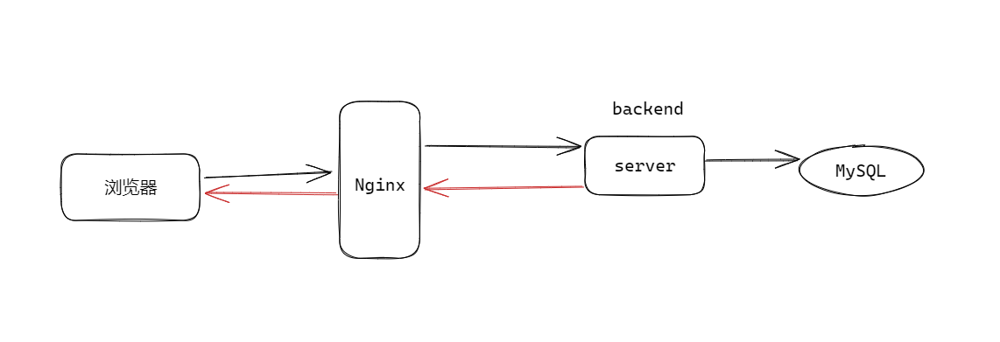

# Nginx的模块开发基础

Nginx通常作为HTTP协议的代理，当使用浏览器访问网站、获取网络资源时，通常都是先到达Nginx上，Nginx把请求转发到处理的服务器上，最后由服务器查询数据，例如数据库的数据后返回，如下所示：



假如有恶意攻击访问时，为了避免服务器被恶意访问冲击导致无法处理正常的业务，Nginx常用的功能就是黑白名单的控制。例如可以限制某些IP、限制某些资源的访问、限制某些用户。

限制某些IP时，Nginx在收到请求时就直接拒绝；限制某些资源访问时，Nginx在资源请求头里读取后进行限制；限制用户需要从请求的Body里读取用户信息后才能进行限制。在不同的阶段可以进行不同的限制，Nginx做了9个不同状态(Phase音符)，不同的状态可以进行不同的处理

```c++
// nginx-main\nginx-1.22.1\nginx-1.22.1\src\http\ngx_http_core_module.h
typedef enum {
    NGX_HTTP_POST_READ_PHASE = 0,
    NGX_HTTP_SERVER_REWRITE_PHASE,
    NGX_HTTP_FIND_CONFIG_PHASE,
    NGX_HTTP_REWRITE_PHASE,
    NGX_HTTP_POST_REWRITE_PHASE,
    NGX_HTTP_PREACCESS_PHASE,
    NGX_HTTP_ACCESS_PHASE,
    NGX_HTTP_POST_ACCESS_PHASE,
    NGX_HTTP_PRECONTENT_PHASE,
    NGX_HTTP_CONTENT_PHASE,
    NGX_HTTP_LOG_PHASE
} ngx_http_phases;
```

在进行Nginx的模块开发时，首先需要掌握Nginx的基本数据结构，例如内存池、线程池、共享内存、红黑树ngx_rbtree_t、ngx_array_t、ngx_list_t、ngx_hash_t、ngx_queue_t、原子操作、ngx_str_t。下面以最简单的ngx_str_t和内存池为案例。

## Nginx模块开发的框架搭建

首先需要写编译的Makefile文件，进行代码的编译：

```makefile
CXX = gcc
CXXFLAGS += -g -Wall -Wextra

NGX_ROOT = /home/yangshuangxin/nginx/nginx-1.22.1
PCRE_ROOT = /home/yangshuangxin/nginx/pcre-8.45

TARGETS = ngx_code
TARGETS_C_FILE = $(TARGETS).c

CLEANUP = rm -f $(TARGETS) *.o

all: $(TARGETS)

clean:
	$(CLEANUP)

CORE_INCS = -I. \
	-I$(NGX_ROOT)/src/core \
	-I$(NGX_ROOT)/src/event \
	-I$(NGX_ROOT)/src/event/modules \
	-I$(NGX_ROOT)/src/os/unix \
	-I$(NGX_ROOT)/objs \
	-I$(PCRE_ROOT) \

NGX_PALLOC = $(NGX_ROOT)/objs/src/core/ngx_palloc.o
NGX_STRING = $(NGX_ROOT)/objs/src/core/ngx_string.o
NGX_ALLOC = $(NGX_ROOT)/objs/src/os/unix/ngx_alloc.o
NGX_ARRAY = $(NGX_ROOT)/objs/src/core/ngx_array.o
NGX_HASH = $(NGX_ROOT)/objs/src/core/ngx_hash.o

$(TARGETS): $(TARGETS_C_FILE)
	$(CXX) $(CXXFLAGS) $(CORE_INCS) $(NGX_PALLOC) $(NGX_STRING) $(NGX_ALLOC) $(NGX_ARRAY) $(NGX_HASH) $^ -o $@
```

编写简单的Nginx的string和内存池的使用例子：

```c++
#include "nginx.h"
#include "ngx_array.h"
#include "ngx_conf_file.h"
#include "ngx_config.h"
#include "ngx_core.h"
#include "ngx_hash.h"
#include "ngx_palloc.h"
#include "ngx_string.h"
// 解决的未使用的告警
#define unused(x) x = x
// 这连个需要用户自定义
volatile ngx_cycle_t *ngx_cycle;
void ngx_log_error_core(ngx_uint_t level, ngx_log_t *log, ngx_err_t err,
                        const char *fmt, ...) {

  unused(level);
  unused(log);
  unused(err);
  unused(fmt);
}
// 打印内存池的地址
void print_pool(ngx_pool_t *pool) {
  printf("\nlast: %p, end: %p\n", pool->d.last, pool->d.end);
}

// compile:

int main() {

  ngx_str_t name = ngx_string("yangshuangxin");

  printf("name --> len: %ld, data: %s\n", name.len, name.data);

  ngx_pool_t *pool = ngx_create_pool(4096, NULL);

  print_pool(pool);

  int *p1 = ngx_palloc(pool, sizeof(int));

  print_pool(pool);

  void *p2 = ngx_palloc(pool, 0x10);

  print_pool(pool); // 这个实际上增长了0x14字节，而不是0x10字节
	
  void *p3 = ngx_palloc(pool, 0x15);

  print_pool(pool);

  ngx_destroy_pool(pool);
}
```

