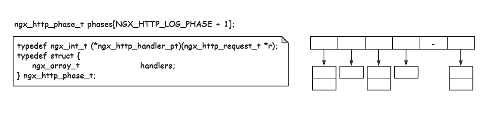
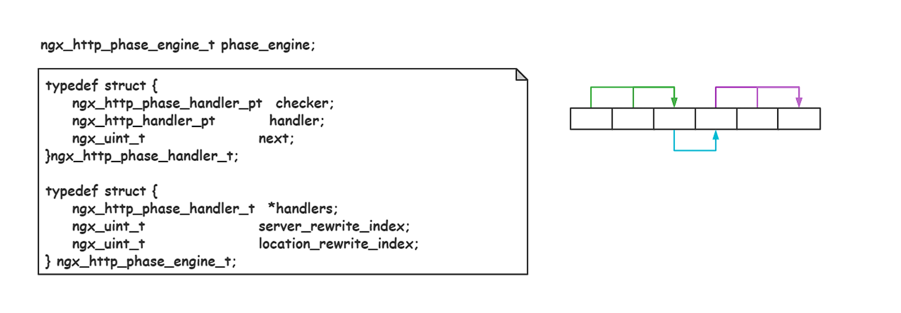
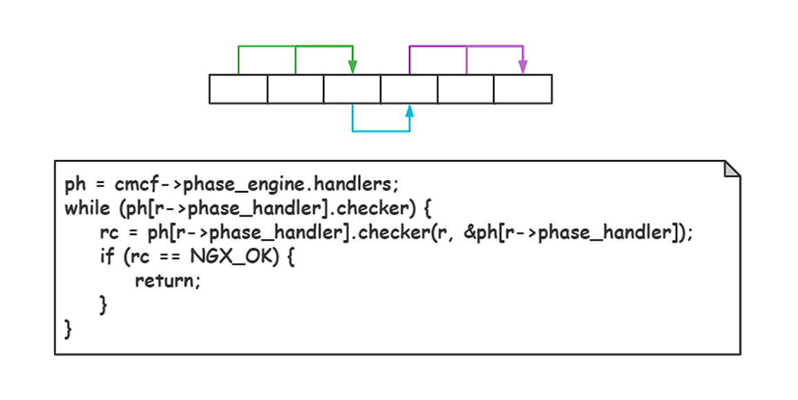
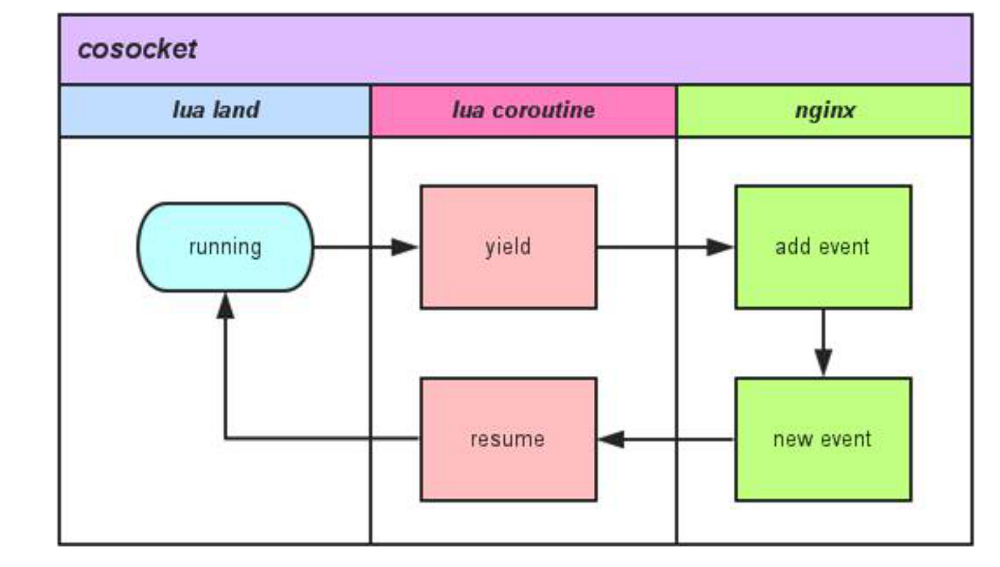
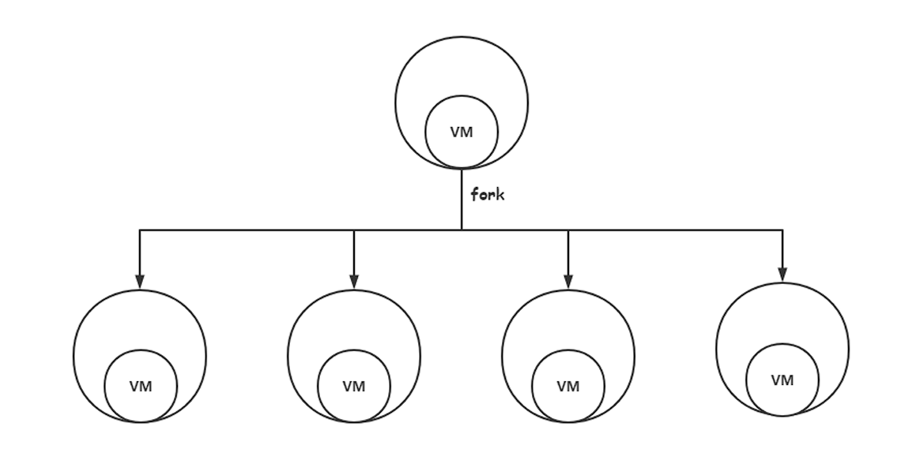
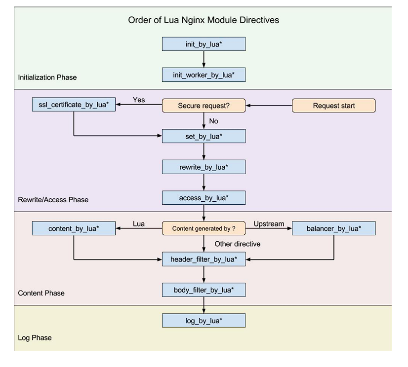

# Openresty的安装和使用

## Openresty的介绍

openresty 是一个基于 nginx 与 lua 的高性能 web 平台，其内部集成了大量精良的 lua 库、第三方模块以及大数的依赖项。方便搭建能够处理超高并发、扩展性极高的动态 web 应用、 web 服务和动态网关。

京东、百度、知乎等这些互联网公司都在使用openresty 。有用来写 WAF （web application firewall）、有做 CDN 调度、有做广告系统、消息推送系统，API server 的。还有用在非常关键的业务 上，比如京东商品详情页。

## Openresty的优势

openresty 通过汇聚各种设计精良的 nginx 模块，从而将 nginx  有效地变成一个强大的通用 Web 应用平台。这样，Web 开发人 员和系统工程师可以使用 Lua 脚本语言调动 Nginx 支持的各种  C 以及 Lua 模块，快速构造出足以胜任 10K 乃至 1000K 以上单机并发连接的高性能 Web 应用系统。

openresty 的目标是让你的 Web 服务**直接跑在 Nginx 服务内部**， 充分利用 Nginx 的非阻塞 I/O 模型（多reactor 模型），不仅仅 对 HTTP 客户端请求（stream），甚至于对远程后端诸如  MySQL、PostgreSQL、Memcached 以及 Redis、etcd、kafka、grpc  等都进行一致的高性能响应（upstream）。

使用 openresty 的技术优点有一下几种：

1. 在请求真正到达上游服务之前，Lua 可以随心所欲的做复杂的访问控制和安全检测。
2. 可以随心所欲的操控响应头里面的信息。
3. 可以从外部存储服务（比如 Redis，Memcached，MySQL， Postgres）中获取后端信息，并用这些信息来实时选择哪一个后端来完成业务访问。
4. 可以在内容 handler 中随意编写复杂的 Web 应用，使用同步但依然非阻塞的方式，访问后端数据库和其他存储。
5. 在 rewrite 阶段，通过 Lua 完成非常复杂的 URL dispatch。
6. 用 Lua 可以为 nginx 子请求和任意 location，实现高级缓存机制。

## Openresty的安装和启动

下载安装如下：

```shell
# 下载地址：http://openresty.org/cn/download.html
sudo apt-get install libpcre3-dev libssl-dev perl make build-essential curl
tar -xzvf openresty-VERSION.tar.gz
# 默认 --prefix=/usr/local/openresty , 程序会被安装到/usr/local/openresty 目录
./configure
make -j 
sudo make install
export PATH=/usr/local/openresty/bin:$PATH
```

启动和Nginx一样，Openresty本质是对Nginx的拓展，可以无缝替换Nginx：

```shell
# 指定配置启动 openresty
 openresty -p ./ -c conf/nginx.conf
 # 优雅退出
 openresty -p . -s quit
  # 重启 openresty
  openresty -p . -s reload
```

## Openresty的设计原理

### 责任链设计模式

在原来的Nginx中处理中，使用责任链的设计模式。Nginx使用责任链的设计模式，便于多个对象都有机会处理请求，从而避免请求的发送者和接收者之间的耦合关系。接收者是由多个处理对象构成，一个请求沿着整个由处理对象组成的链条依次传递，直到由一个对象处理它为止。Nginx把http请求的处理分为11个阶段，在每一个http的阶段都挂了可以自定义的多个处理模块进行依次处理请求：



每一个阶段的处理模块都是使用链表依次链接：



每一个处理模块都可以进行处理请求，处理完成可以打断当前的处理阶段，openresty 就是将lua嵌入到Nginx的各个处理阶段中：



### Cosocket

openresty 为 nginx 添加的最核心的功能就是 cosocket。自  cosocket 加入，可以在 http 请求处理中访问第三方服务。每一个虚拟主机对应一个lua虚拟机，每一个请求对应一个lua的协程。

cosocket 主要依据 nginx 中的事件机制和 lua 的协程结合后实现了**非阻塞网络 io**，在业务逻辑使用层面上可以通过**同步非阻塞** 的方式来写代码。引入 cosocket 后，nginx 中相当于有了多条并行同步逻辑线 （lua 协程），nginx 中单线程负责唤醒或让出其中 lua 协程。 唤醒或让出依据来源于协程运行的条件是否得到满足。

cosocket 通过lua的协程将socket的异步事件编程转化为同步处理，并且基于cosoket实现了很多精良的第三方库，例如resty.redis、resty.mysql等。



## lua-nginx-module

nginx 采用模块化设计，使得每一个 http 模块可以仅专注于完 成一个独立的、简单的功能，而一个请求的完整处理过程可以由无数个 http 模块共同合作完成。

nginx 为了灵活有效地指定下一个  http 处理模块是哪一个，http 框架依据常见的的处理流程将处 理阶段划分为 11 个阶段，其中每一个阶段都可以由任意多个  http 模块流水式地处理请求。

openresty 将 lua 脚本嵌入到 nginx 阶段处理的**末尾模块**下，这 样以来并不会影响 nginx 原有的功能，而是在 nginx 基础上丰富它的功能。嵌入 lua 的优点是使用 openresty 开发，不需要重新编译， 直接修改 lua 脚本，重新启动即可。

openresty 为每一个Nginx进程嵌入一个lua虚拟机，进行lua脚本的调用处理。



Nginx是主进程master进行端口监听，然后fork多个worker进程处理网络请求，各个worker进程通过共享内存通信，Nginx将请求沿着责任链进行处理。openresty 在Nginx的各个阶段的末尾嵌入了lua脚本，补充功能，这样原来Nginx的功能不受影响的情况下，可以直接在Nginx上做业务。

> Nginx多个worker进程进行客户端连接时，为了避免"惊群"的问题，Nginx使用accept锁进行解决，只有持有锁的worker进程才能使用accept和客户端建立连接，实现是使用原子变量，标记在共享内存里多个工作进程都可以读取。



1. init_by_lua* 。master初始化之后，fork进程之前调用。在 nginx 重新加载配置文件时，运行里面 lua 脚本，此阶段初始化数据，将被复制到多个worker进程中，其作用是加载一下耗时的模块、设置全局变量、初始化共享内存。例如 lua_shared_dict 共享内存的申请，只有当 nginx 重启后，共享内存数据才清空，这常用于统计。
2. init_worker_by_lua* 。master进程fork之后，在每个 Nginx 工作进程worker启动初始化时执行。此阶段初始化的数据，各个worker可以不同。例如开启不同的定时器。
3. ssl_certificate_by_lua*。  ssl 阶段，在“握手”时设置安全证书，实现安全通信，保证数据安全。可以使用ngx.var.ssl_client_raw_cert获取证书内容，从而可以验证证书的有效性。
4. set_by_lua*。设置一个变量，常用用于计算一个逻辑，然后返回结果，该阶段不能运行Output API、Control API、Subrequest API、 Cosocket API。
5. rewrite_by_lua*。在 access 阶段前运行，主要用于 rewrite url执行内部url重写或外部重定向。在这个阶段，无论是API还是消费者都没有被识别，因此这个处理器在插件被配置为全局插件时执行。
6. access_by_lua*。主要用于**访问控制**，这条指令运行于 nginx access 阶段的末尾，因此总是在 allow 和 deny 这样的指令之后运行，它们同属 access 阶段，可用来判断请求是否具备访问权限。为客户的每一个请求 而执行，并在它被代理到上游服务之前执行。应用场景包括访问权限控制，根据用户身份决定是否允许请求某个url、黑白名单、防火墙规则拦截或放行请求。
7. content_by_lua*。该阶段是所有请求处理阶段中最为重要的一个，运行在这个阶段的配置指令一般都肩负着**生成内容**（content）并**输出  HTTP 响应**。
8. balancer_by_lua*。上游服务器的负载均衡。当进行反向代理时，进行请求的负载均衡进行分发请求到upstream。引入`require "ngx.balancer"`后使用`balancer.set_current_peer(server,port)`设置代理目标地址和端口，使用`balancer.balance() `进行负载均衡。（其实里面只是设置ngx.var.proxy_pass变量）
9. header_filter_by_lua*。设置应答消息的头部消息，一般只用于设置 Cookie 和 Headers 等。从上游服务接收到所 有响应头字节时执行。可以通过ngx.header表访问、修改或删除http响应头部，通过设置nil来删除特定响应头，使用ngx.header["Custom-Header"]增加自定义响应头。
10. body_filter_by_lua*。用于修改应答body的内容，一般会在一次请求中被调用多次，因为这是实现基于 HTTP  1.1 chunked 编码的所谓“流式输出”的。从上游服务接收的响应体的每个块时执行。由于响应流回客户端，它可以超过缓冲区大小，因此，如果响应较大，该方法可以被多次调用。使用 ngx.arg 表获取和设置完整的响应体内容，将修改后的内容赋值给 ngx.arg[1] 返回给客户端。
11. log_by_lua*。用于log请求处理阶段，用lua处理日志。该阶段总是运行在请求结束的时候，用于请求的后续操作，如在共享内存中进行统计数据，如果要高精确的数据统计，应该使用 body_filter_by_lua。当最后一个响应字节已经发送到客户端时执行。可以使用ngx。var全局遍历获取请求相关的信息，例如请求方法、请求url。

## Openresty的使用例子

### 基本使用

Openresty是nginx的扩展，可以直接使用Nginx的配置文件，并且在nginx的配置文件中可以执行lua代码，进行业务逻辑的开发。基本使用如下：

```shell
worker_processes 8;
enents {
	worker_connections 1024;
}
http {
	error_log ./logs/error.log info;
	server {
		listen 8848;
		location / {
		# 重写/跳转
			rewrite_by_lua_block {
				local args = ngx.req.get_uri_args()
				if args["jump"] == "1" then
					return ngx.redirect("http://www.zhihu.com/people/yangshuangxin")
				elseif args["jump"] == "2" then
					return ngx.redirect("/jump_other")
				end
			}
			# 内容填充
			content_by_lua_block {
				ngx.say("yangshuangxin", "\t", ngx.var.remote_addr)
			}
		}
		
		location /jump_other {
			content_by_lua_block {
				ngx.say("jump_other", "\t", ngx.var.remote_addr)
			}
			
			body_filter_by_lua_block {
				local chunk = ngx.arg[1]
				ngx.arg[1] = string.gsub(chunk, "other", "yangshuangxin")
			}
			# 日志
			log_by_lua_block {
				local requset_methon = ngx.var.request_method
				local request_uri = ngx.var.request_uri
				local status = ngx.var.status
				local response_time = ngx.var.request_time
				
				local msg = string.format("[%s] %s - Status:%d, response time %.2fms", os.date("%Y-%M-%D %H:%M:%S"), request_uri, status, response_time)
			}
		}
	}
}
```

### 黑名单

使用cosocket可以调用第三方服务，并且通过让lua的协程阻塞，不阻塞Nginx的单线程，实现写同步代码，异步处理的逻辑。

```shell
worker_processes 8;
enents {
	worker_connections 1024;
}
http {
	error_log ./logs/error.log info;
	# 初始化共享内存
	lua_shared_dict bklist 1m;
    init_worker_by_lua_file ./app/init_worker.lua;
	server {
		listen 8848;
		location /black {
			access_by_lua_block {
				local black_list = {
					["192.168.0.120"] = true
				}
			}
			if black_list[ngx.var.remote_addr] then
				return ngx.exit(403)
			end
		}
		content_by_lua_block {
			ngx.say("black", "\t", ngx.var.remote_addr)
		}
	}
	# 黑名单lua版本1
	location /black_v1 {
            access_by_lua_file ./app/black_v1.lua;
            content_by_lua_block {
                ngx.say("black_v1", "\t", ngx.var.remote_addr)
            }
        }
		# 黑名单lua版本2
        location /black_v2 {
            access_by_lua_file ./app/black_v2.lua;
            content_by_lua_block {
                ngx.say("black_v2", "\t", ngx.var.remote_addr)
            }
        }
}
```


在./app/black_v1.lua中写使用cosocket调用中间件redis取出黑名单数据

```lua
local redis = require "resty.redis"
local red = redis:new()
local ok, err = red:connect("127.0.0.1", 6379)
if not ok then
    return ngx.exit(301)
end
local ip = ngx.var.remote_addr
-- redis  set
local exists, err = red:sismember("black_list", ip)

if exists == 1 then
    return ngx.exit(403)
end
```

由于每一个请求都需要链接Redis，消耗太大，进行v2版本的优化，初始化共享内存，从redis中定时取黑名单数据：

```lua
if ngx.worker.id() ~= 0 then
    return
end

local redis = require "resty.redis"
local bklist = ngx.shared.bklist

local function update_blacklist()
    local red = redis:new()
    local ok, err = red:connect("127.0.0.1", 6379)
    if not ok then
        return
    end
    local black_list,err = red:smembers("black_list")
    bklist:flush_all()
    for _, v in pairs(black_list) do
        bklist:set(v, true)
    end
    ngx.timer.at(5, update_blacklist)
end

ngx.timer.at(5, update_blacklist)
```

然后只需要判断共享内存中是否存在黑名单的IP地址

```lua
local bklist = ngx.shared.bklist
local ip = ngx.var.remote_addr

if bklist:get(ip) then
    return ngx.exit(403)
end
```

### TCP流

如果不使用tcp协议，可以直接代理tcp流，配置文件conf如下：

```shell
worker_processes 8;
events {
    worker_connections 10240;
}
stream {
    upstream ups {
        server 127.0.0.1:8888;
    }
    server {
        listen 9999;
        proxy_pass ups;
        proxy_protocol on;
    }

    server {
        listen 9000;
        content_by_lua_file ./app/proxy.lua;
    }
}
```

在lua脚本中进行反向代理tcp流：

```lua
local sock, err = ngx.req.socket()
if err then
    ngx.log(ngx.INFO, err)
end
local upsock, ok
upsock = ngx.socket.tcp()
ok, err = upsock:connect("127.0.0.1", 8989)
if not ok then
    ngx.log(ngx.INFO, "connect error:"..err)
end
upsock:send(ngx.var.remote_addr .. '\n')
local function handle_upstream()
    local data
    for i=1, 1000 do
        local reader = upsock:receiveuntil("\n", {inclusive = true})
        data, err, _ = reader()
        if err then
            sock:close()
            upsock:close()
            return
        end
        sock:send(data)
    end
end
ngx.thread.spawn(handle_upstream)
local data
while true do
    local reader = sock:receiveuntil("\n", {inclusive = true})
    data, err, _ = reader()
    if err then
        sock:close()
        upsock:close()
        return
    end
    upsock:send(data)
end
```

