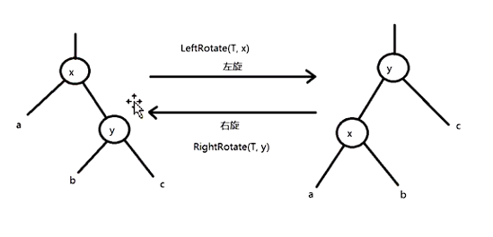

# RBTree 红黑树

1. 红黑树常常使用的地方是在key-value结构中，进行强查找的场景。如cpp中的map，底层就是红黑树。

   - hashmap
   - cfs
   - epoll
   - 定时器
   - Nginx 的timer事件管理

2. 强查找的方法一般有以下几种：

   -  rbtree
   - hash
   - b/b+ tree
   - 跳表

3. 红黑树的定义：

   1. 每一个节点是红的或者是黑的。
   2. 根节点是黑的。
   3. 每一个叶子节点都是黑的。
   4. 如果一个节点是红的，那么它的两个节点都是黑的。
   5. 对于每一个节点，从该节点到其子孙节点的所有的路径上都包含了相同数目的黑节点。

   ```c
   // 定义红黑树的节点
   typedef int KEY_TYPE;
   
   #define RED 0
   #define BLACK 1
   // 为了通用，对红黑树的特性进行抽象的宏定义
   #define RBTREE_ENTRY(name, type)    \
       struct name {                   \
           struct type *right;         \
           struct type *left;          \
           struct type *parent;        \
           unsigned char color;        \
       }
   
   typedef struct _rbtree_node {
       KEY_TYPE key;
       void *value;
   
   #if 1
       struct _rbtree_node *right;
       struct _rbtree_node *left;
       struct _rbtree_node *parent;
       unsigned char color;
   #else
       // 可以使用宏进行抽象定义
       RBTREE_ENTRY(, _rbtree_node) node;
   #endif
       
   } rbtree_node;
   
   // 定义红黑树
   typedef struct _rbtree {
       struct _rbtree_node *root;  // 红黑树的根节点
       struct _rbtree_node *nil;  // 全部叶子节点都指向这个节点（黑色）
   }rbtree;
   

4. 红黑树的左旋和右旋

   

```c
// 左旋，需要修改6个指针的指向
void rbtree_left_rotate(rbtree *T, rbtree_node *x) {
    rbtree_node *y = x->right;
    // 第一组指针
    x->right = y->left;
    if (y->left != T->nil) {
        y->left->parent = x;
    }
    
    // 第二组指针
    y->parent = x->parent;
    if (x->parent == T->nil) {
        T->root = y;
    } else if (x == x->parent->left) {
        x->parent->left = y;
    } else {
        x->parent->right = y;
    }

    // 第三组指针
    y->left = x;
    x->parent = y;
}

// 右旋，左旋的x和y交换，left和right交换
void rbtree_right_rotate(rbtree *T, rbtree_node *y) 
{
    rbtree_node *x = y->left;
    // 1
    y->left = x->right;
    if (x->right != T->nil) {
        x->right->parent = x;
    }
    
    // 2
    x->parent = y->parent;
    if (y->parent == T->nil) {
        T->root = x;
    } else if (y == y->left->parent->right) {
        y->parent->right = x;
    } else {
        y->parent->left = y;
    }

    // 3
    x->right = y;
    y->parent = x;
}
```

5. 红黑树的插入（父节点是祖父节点的左子树的情况下）

   1. 循环找到需要插入的节点的位置，插入的节点颜色为红色

   ```c
   void rbtree_insert(rbtree *T, rbtree_node *z) 
   {
       rbtree_node *x = T->root;
       rbtree_node *y = T->nil;
       // 循环找到需要插入的叶子节点
       while (x != T->nil) {
           y = x;
           if (z->key < x->key) {
               x = x->left;
           }else if (z->key > x->key) {
               x = x->right;
           } else { // exist，替换值
               x->value = z->value;
               return;
           }
       }
   
       if (y == T->nil) { // 只有一个节点
           T->root = z;
       }else {	// 插入节点
           if (y->key > z->key) {
               y->left = z;
           } else {
               y->right = z;
           }
       }
   	// 染色，插入的节点为红色
       z->parent = y;
       z->left = T->nil;
       z->right = T->nil;
       z->color = RED;
   }
   ```

   2. 叔节点是红色的节点

   

   ```c
   // 父、叔节点变为黑色，祖父节点变为红色
   rbtree_node *y = z->parent->parent->right; // y 叔父节点
   if (y->color == RED) {
       z->parent->color = BLACK;
       y->color = BLACK;
       z->parent->parent->color = RED;
   
       z = z->parent->parent;  // z->red
   }
   ```

   3. 叔节点是黑色的，并且当前节点是右孩子

      

      ```c
      // 对父节点进行左旋
      if (z == z->parent->right) {
          z = z->parent;
          rbtree_left_rotate(T, z);
      }
      ```

      

   4. 叔节点是黑色的，并且当前节点是做孩子

   

```c
// 对父节点进行右旋和修改颜色
if (z == z->parent->left) {
    z->parent->color = BLACK;
    z->parent->parent->color = RED;

    rbtree_right_rotate(T, z->parent->parent);
} 
```

6. 父节点是祖父节点的左子树的情况下，插入和恢复红黑树性质

   ```c
   void rbtree_insert_fixup(rbtree *T, rbtree_node *z)
   {
       while(z->parent->color == RED) {
           if (z->parent == z->parent->parent->left) {
               rbtree_node *y = z->parent->parent->right; // y 叔父节点
               if (y->color == RED) {
                   z->parent->color = BLACK;
                   y->color = BLACK;
                   z->parent->parent->color = RED;
   
                   z = z->parent->parent;  // z->red
               } else { // y == black
                   if (z == z->parent->right) {
                       z = z->parent;
                       rbtree_left_rotate(T, z);
                   }
   
                   if (z == z->parent->left) {
                       z->parent->color = BLACK;
                       z->parent->parent->color = RED;
   
                       rbtree_right_rotate(T, z->parent->parent);
                   } 
               }
           } 
       }
   }
   
   
   void rbtree_insert(rbtree *T, rbtree_node *z) 
   {
       rbtree_node *x = T->root;
       rbtree_node *y = T->nil;
       while (x != T->nil) {
           y = x;
           if (z->key < x->key) {
               x = x->left;
           }else if (z->key > x->key) {
               x = x->right;
           } else { // exist
               x->value = z->value;
               return;
           }
       }
   
       if (y == T->nil) {
           T->root = z;
       }else {
           if (y->key > z->key) {
               y->left = z;
           } else {
               y->right = z;
           }
       }
   
       z->parent = y;
       z->left = T->nil;
       z->right = T->nil;
       z->color = RED;
   
       rbtree_insert_fixup(T, z);
   }
   ```

   