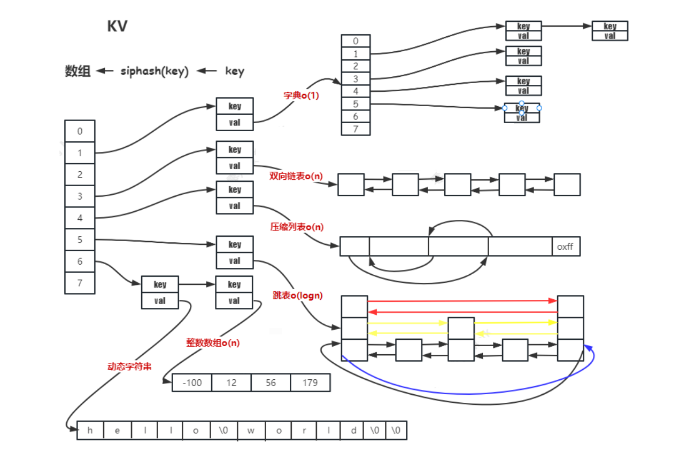

# Redis的常用数据结构和用法

Redis 是 Remote Dictionary Service 的简称，也是远程字典服务。Redis 是内存数据库、KV 数据库、数据结构数据库，应用十分广泛，如 Twitter、暴雪娱乐、Github、Stack Overflow、腾讯、阿里巴巴、京东、华为、新浪微博等。

Redis是基于请求回应模型，每一个客户端节点通过TCP与Redis服务器进行连接交互，通过字典的方式索引存储的数据。数据都存储在内存中，而不是磁盘上，所以速度非常快。

## Redis的安装使用

### 编译安装

```shell
git clone https://gitee.com/mirrors/redis.git
cd redis
make && make install
# 默认安装在 /usr/local/bin,
# redis-server 是服务端程序, redis-cli 是客户端程序
```

### 启动

```shell
mkdir redis-data
cd redis-data
# 把redis文件夹下 redis.conf 拷贝到 redis-data
# 修改 redis.conf 文件中的 requirepass可以设置用户登录password为 123456
# daemonize yes  开启守护进程
redis-server redis.conf # 启动服务进程
redis-cli -h 127.0.0.1 -a 123456 # 客户端连接
```

> 使用vscode查看源码，可以安装bear、clangd ，然后使用bear -- make 进行编译，编译后生成数据库，vscode安装clangd插件后读取编译数据库，可以进行精准的代码跳转。

## Redis 常用的5种数据结构

Redis是KV存储的键值对，key是字符串，value可以是多种数据结构，常用的数据结构是string、list、hash、set、zset。如下所示：


- string  是一个安全的二进制字符串；
- 双端队列 （链表）list：有序（插入有序）；
- 散列表 hash：对顺序不关注，field 是唯一的；
- 无序集合 set：对顺序不关注，里面的值都是唯一的；
- 有序集合 zset：对顺序是关注的，里面的值是唯一的；根据member 来确定唯一；根据 score 来确定有序；

### 底层数据结构

string、list、hash、set、zset等都是Redis抽象出来的数据结构，Redis底层是使用C语言实现的。同一个抽象的数据结构，内部可以是由不同的数据结构构成。

string 的内部实现在字符串长度小于等于20且能转换为整数时，使用int；不能转换为整数小于等于44字节时使用embstr，大于44字节使用row进行存储。

list 的内部实现可以是双向链表(quicklist)、压缩列表(ziplist)。

hash 的内部实现为当节点数量小于512且字符串长度小于等于64使用压缩列表(ziplist)；否则使用字典(dict)。

set 的内部实现为当元素都为整数且节点数量小于等于512时使用整数数组(intset)，否则使用字典(dict)。

zset 的内部实现当数量小于等于128并且一个字符串长度小于等于64时，使用压缩列表(ziplist)，否则使用跳表(skiplist)。



> Redis底层数据结构都是使用自定义的结构体，结构体最后一个元素是柔性数组（`char buf[];`），只需要一次malloc一次free。
>
> malloc和free都是libc中定义的函数，当分配的内存小于128k时使用brk分配堆内存，当大于128k时使用mmap文件映射区分配内存。分配的前16个字节标识了分配内存的长度，在free内存时会向前偏移16字节释放内存。

## 基本命令使用方法

Redis是KV存储的，其中Key是用户自定义的，在单个功能时，取有意义的key，如果是相同功能的多个key，一般以  **:**  进行分割。Redis没有创建数据结构的命令，在设置或添加的同时进行创建，有删除kv的命令，当Value中没有元素时会自动删除。

Value按照不同的应用场景，按照数据结构的特性进行设计。实际项目中如果需要执行多个指令，需要保证命令的原子性，一般需要用 lua 脚本 或者使用 pipeline 命令。

### string

字符数组，该字符串是动态字符串 raw，字符串长度小于1M 时，加倍扩容；超过 1M 每次只多扩 1M；字符串最大长度为512M。redis 字符串是二进制安全字符串；可以存储图片，二进制协议等二进制数据。

```shell
# string基本命令
SET key val # 设置 key 的 value 值
GET key # 获取 key 的 value
INCR key # 执行原子加一的操作
INCRBY key increment  # 执行原子加一个整数的操作
DECR key # 执行原子减一的操作
DECRBY key decrement # 执行原子减一个整数的操作
SETNX key value # set Not eXist 如果key不存在，这种情况下等同SET命令。 当key存在时，什么也不做,0,1 表示操作结果是不是成功
DEL key # 删除 key val 键值对

# bit操作
SETBIT key offset value # 设置或者清空key的value(字符串)在offset处的bit值。
GETBIT key offset # 返回key对应的string在offset处的bit值
BITCOUNT key # 统计字符串被设置为1的bit数.
```

实际使用例子如下：

```shell
SET role:10001 '{["name"]:"yangshuangxin",["sex"]:"male",["age"]:27}'
GET role:10001

# 累加器 
incr reads # 统计阅读数 累计加1
incrby reads 100 # 累计加100

# 分布式锁（非公平锁）
setnx lock uuid # 加锁 不存在才能设置,占用锁
set lock uuid nx ex 30 # expire 30 过期的锁
# 释放锁 需要使用脚本实现原子操作
if (get(lock) == uuid)
	del(lock);
	
# 位运算，月签到功能 10001--用户id，202409--2024年9月份的签到
setbit sign:10001:202409 1 1 # 第一天签到
bitcount sign:10001:202409 # 计算2024年9月份的签到情况
getbit sign:10001:202409 2 # 获取2024年9月份第二天的签到情况, 1 已签到 0 没有签到
```

### list

双向链表实现，列表首尾操作（删除和增加）时间复杂度O(1)；查找中间元素时间复杂度为O(n)。列表中数据是否压缩的依据为元素长度小于 48则不压缩、元素压缩前后长度差不超过 8则不压缩。

```shell
LPUSH key value [value ...] # 从队列的左侧入队一个或多个元素
LPOP key # 从队列的左侧弹出一个元素
RPUSH key value [value ...] # 从队列的右侧入队一个或多个元素
RPOP key # 从队列的右侧弹出一个元素
LRANGE key start end # 返回从队列的 start 和 end 之间的元素  0, 1 2 ,支持负索引，-1是最后一个元素
LREM key count value # 从存于 key 的列表里移除前 count 次出现的值为 value 的元素（list 没有去重功能）
LTRIM key start end # 裁剪最近 start 和 end 之间的元素 
BRPOP key timeout # 它是 RPOP 的阻塞版本，因为这个命令会在给定list无法弹出任何元素的时候阻塞连接，有超时时间，可以作为延时队列
```

实际使用例子如下：

```shell
# 栈（先进后出 FILO）
LPUSH + LPOP
# 或者
RPUSH + RPOP

# 队列（先进先出 FIFO）/ 异步消息队列
LPUSH + RPOP
# 或者
RPUSH + LPOP

# 阻塞队列（blocking queue）
LPUSH + BRPOP
# 或者
RPUSH + BLPOP
```

### hash

散列表，在很多高级语言当中包含这种数据结构，例如c++中unordered_map 通过 key 快速索引 value。在Redis中节点数量大于 512（hash-max-ziplist-entries） 或所有字符串长度大于 64（hash-max-ziplist-value），则使用 dict 实现；节点数量小于等于 512 且有一个字符串长度小于 64，则使用ziplist 实现。

```shell
HGET key field #  获取 key 对应 hash 中的 field 对应的值
HSET key field value # 设置 key 对应 hash 中的 field 对应的值
HMSET key field1 value1 field2 value2 ... fieldn valuen #  设置多个hash键值对
HMGET key field1 field2 ... fieldn # 获取多个field的值
HINCRBY key field increment # 给 key 对应 hash 中的 field 对应的值加一个整数值
HLEN key #  获取 key 对应的 hash 有多少个键值对
HDEL key field # 删除 key 对应的 hash 的键值对，该键为field
```

实际使用例子如下：

```shell
hmset hash:10001 name yangshuangxin age 27 sex male
hset hash:10001 age 18
# 购物车 hash + list
# 将用户id作为 key
# 商品id作为 field
# 商品数量作为 value
hmset MyCart:10001 40001 1 cost 5099 desc "华为手机"
lpush MyItem:10001 40001

hincrby MyCart:10001 40001 1 # 增加数量：
hincrby MyCart:10001 40001 -1 # 减少数量
hlen MyCart:10001 # 显示所有物品数量

# 删除商品
hdel MyCart:10001 40001
lrem MyItem:10001 1 40001

# 获取所有的物品
lrange MyItem:10001
hget MyCart:10001 40001
```

### set

集合；用来存储唯一性字段，不要求有序。虽然存储不需要有序，但是操作交、并、差集的时候会进行排序。元素都为整数且节点数量小于等于 512（set-max-intset-entries），则使用整数数组存储；元素当中有一个不是整数或者节点数量大于 512，则使用字典存储。

```shell
SADD key member [member ...] # 添加一个或多个指定的member元素到集合的 key中
SCARD key  # 计算集合元素个数
SMEMBERS key # 命令用于返回集合中的所有成员
SISMEMBER key member # 返回成员 member 是否是存储的集合 key的成员
SRANDMEMBER key [count] # 随机返回key集合中的一个或者多个元素，不删除这些元素
SPOP key [count] # 从存储在key的集合中移除并返回一个或多个随机元素
SDIFF key [key ...] # 返回一个集合与给定集合的差集的元素
SINTER key [key ...] # 返回指定所有的集合的成员的交集
SUNION key [key ...] # 返回给定的多个集合的并集中的所有成员
```

使用例子如下：

```shell
# 抽奖
sadd Award:1 10001 10002 10003 10004 10005 # 添加抽奖用户
smembers Award:1 # 查看所有抽奖用户
srandmember Award:1 10 # 抽取多名幸运用户

# 共同关注
sadd follow:A yang shuang xin
sadd follow:C shuang xin
sinter follow:A follow:C

# 推荐好友
sadd follow:A yang shuang xin
sadd follow:C shuang xin
sdiff follow:A follow:C
```

### zset

有序集合，可以用来实现排行榜，它是一个有序且唯一的数据结构。节点数量大于 128 或者有一个字符串长度大于 64，则使用跳表（skiplist）；节点数量小于等于 128（zset-max-ziplist-entries）且所有字符串长度小于等于 64（zset-max-ziplist-value），则使用ziplist 存储。数据少的时候，节省空间O(n)，数量多的时候，提高访问性能O(1)或者O(log2N)。

```shell
ZADD key [NX|XX] [CH] [INCR] score member [score member ...]# 添加到键为key有序集合（sorted set）里面
ZREM key member [member ...] # 从键为key有序集合中删除 member 的键值对
ZSCORE key member # 返回有序集key中，成员member的score值
ZINCRBY key increment member # 为有序集key的成员member的score值加上增量increment
ZCARD key # 返回key的有序集元素个数
ZRANK key member # 返回有序集key中成员member的排名
ZRANGE key start stop [WITHSCORES] # 返回存储在有序集合key中的指定范围的元素
ZREVRANGE key start stop [WITHSCORES] # 返回有序集key中，指定区间内的成员(逆序)
```

使用例子如下：

```shell
# 20240928的新闻点击
zincrby hot:20240928 1 10001
zincrby hot:20240928 1 10002
zincrby hot:20240928 1 10003
zincrby hot:20240928 1 10004
zincrby hot:20240928 1 10005
# 获取热搜排行榜
zrevrange hot:20240928 0 2 withscores

```

#### 延迟队列

将消息序列化成一个字符串作为 zset 的 member；这个消息的到期处理时间作为 score，然后用多个线程轮询 zset 获取到期的任务进行处理。

```python
def delay(msg):
    msg.id = str(uuid.uuid4()) #保证 member 唯一
    value = json.dumps(msg)
    retry_ts = time.time() + 5 # 5s后重试
    redis.zadd("delay-queue", retry_ts, value)
# 使用连接池
def loop():
    while True:
        values = redis.zrangebyscore("delay-queue", 0, time.time(), start=0, num=1)
        if not values:
            time.sleep(1)
            continue
        value = values[0]
        success = redis.zrem("delay-queue", value)
        if success:
            msg = json.loads(value)
            handle_msg(msg)
# loop 是多线程竞争，两个线程都从zrangebyscore获取到数据，但是zrem一个成功一个失败
# 优化：为了避免多余的操作，可以使用lua脚本原子执行这两个命令
```

#### 分布式定时器

生产者将定时任务 hash 到不同的 redis 实体中，为每一个redis 实体分配一个 dispatcher 进程，用来定时获取 redis 中超时事件并发布到不同的消费者中。


#### 时间窗口限流

系统限定用户的某个行为在指定的时间范围内（动态）只能发生 N 次。

```lua
-- 指定用户 user_id 的某个行为 action 在特定时间内period 只允许发生该行为做大次数 max_count
local function is_action_allowed(red, userid,action, period, max_count)
    local key = tab_concat({"hist", userid,action}, ":")
    local now = zv.time()
    red:init_pipeline()
    -- 记录行为
    red:zadd(key, now, now)
    -- 移除时间窗口之前的行为记录，剩下的都是时间窗口内的记录
    red:zremrangebyscore(key, 0, now - period*100)
    -- 获取时间窗口内的行为数量
    red:zcard(key)
    -- 设置过期时间，避免冷用户持续占用内存 时间窗口的长度+1秒
    red:expire(key, period + 1)
    local res = red:commit_pipeline()
    return res[3] <= max_count
end
```


## 总结

Redis的应用十分广泛，使用典型的场景的应用举例如下：

- 记录朋友圈点赞数、评论数和点击数（hash)
- 记录朋友圈说说列表（排序），便于快速显示朋友圈（list)
- 记录文章的标题、摘要、作者和封面，用于列表页展示（hash)
- 记录朋友圈的点赞用户ID列表（list），评论ID列表（list），用于显示和去重计数（zset）
- 缓存热点数据，减少数据库压力（hash）
- 如果朋友圈说说 ID 是整数 id，可使用 redis 来分配朋友圈说说id（计数器）（string）
- 通过集合（set）的交并差集运算来实现记录好友关系（set）
- 游戏业务中，每局战绩存储（list)

